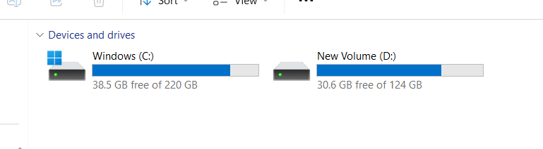
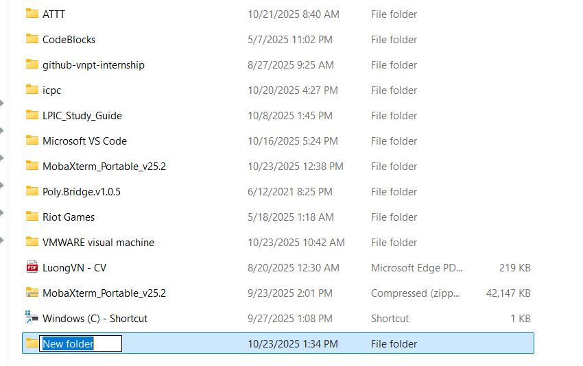
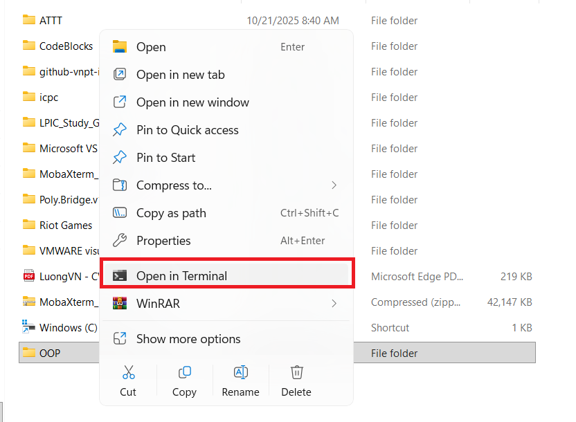
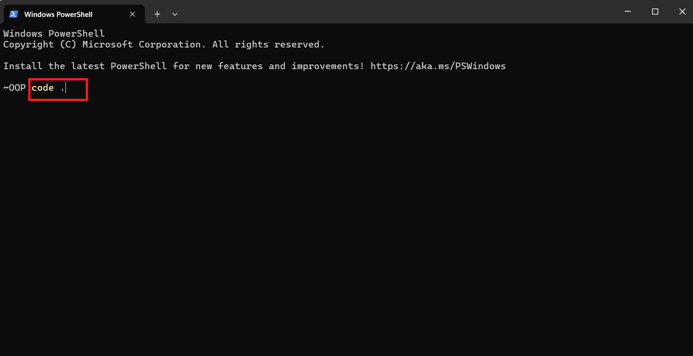
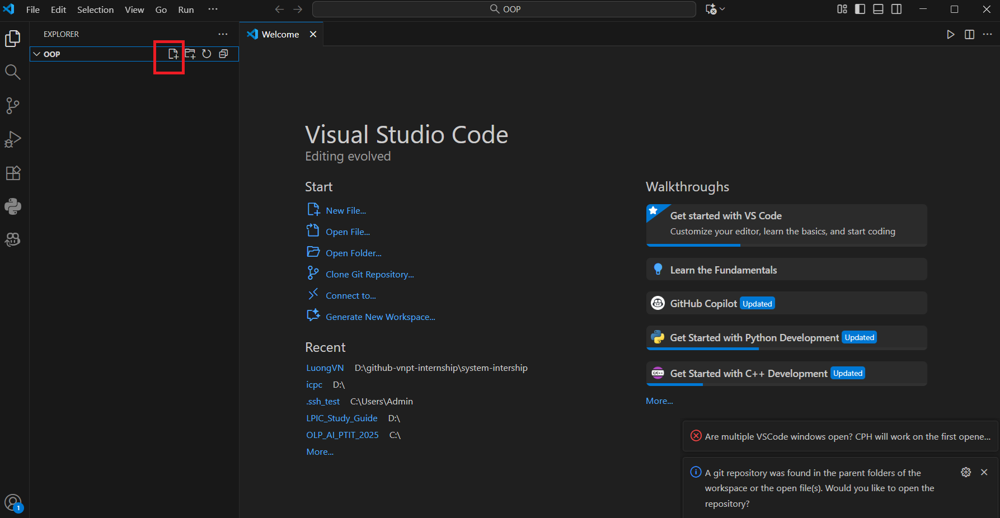

# Hướng dẫn note tài liệu bằng Markdown

- Chọn 1 ổ đĩa trên máy tính sau đó tạo thư mục

- Ở đây ta chọn ổ `D:`

  

- Đặt tên cho thư mục: Ví dụ: `OOP`

  

- Click chuột phải sau đó chọn `open in terminal`

  

- Nhập lệnh `code .` để mở folder trong `vscode`

  

- Click vào ô vuông bôi đỏ để tạo file mới và đặt tên

  

- Lưu ý đuôi của tên file phải là `.md` để định dạnh file markdown

- Sau đó note tài liệu và `Ctrl + S` để lưu lại tài liệu