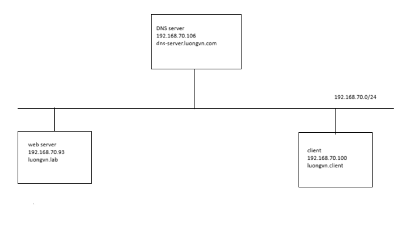
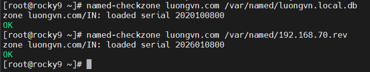

# Triển khai mô hình DNS server trên Rocky 9
## Mục tiêu 
- Triển khai một DNS server nội bộ với domain: `luongvn.local`
- Máy chủ DNS có IP: `192.168.70.106`
- Có thể phân giải tên miền thành `192.168.70.93`
- Hỗ trợ cả phân giải thuận (A record) và phân giải ngược (PTR record)
  
## Mô hình



## Thành phần chính của hệ thống

| Thành phần   | Vai trò                       |
| ------------ | ----------------------------- |
| BIND(named)  | Phần mềm DNS server           |
| `named.conf` | File cấu hình chính của BIND  |
| Zone file    | chứa bản ghi DNS cho tên miền |
| Reverse Zone | chứa bản ghi phân giải ngược  |

## Triển khai
### Bước 1: Cài đặt BIND
```bash
sudo yum install bind bind-utils -y
```

- `bind (Berkeley Internet Name Domain)`: Phần mềm DNS server.
- `bind-utils`: Công cụ hỗ trợ kiểm tra DNS như `dig`, `nslookup`.

### Bước 2: Cấu hình tệp chính `named.conf`
```bash
sudo vi /etc/named.conf
```

- `options { ... };`: Phần này chứa các cài đặt chung cho BIND
- `logging { ... };`: Cấu hình ghi log
- `zone "." IN { ... };`: Định nghĩa zone gốc (Root Zone). Không cần thay đổi phần này
- `include "/etc/named.rfc1912.zones";`: Tệp này chứa các định nghĩa zone mặc định cho mạng nội bộ (localhost, reverse localhost). Có thể giữ nguyên hoặc chỉnh sửa

**Tìm và sửa các dòng sau:**

```bash
listen-on port 53 { any; };          # Lắng nghe trên mọi địa chỉ IP
allow-query       { any; };          # Cho phép mọi máy truy vấn
recursion yes;                       # Bật chế độ truy vấn đệ quy
```

- Mặc định `named` chỉ cho phép truy cập từ localhost, cần chỉnh sửa để cho phép các client trong LAN.

**Thêm Zone mới vào `named.conf`, thêm các dòng sau vào cuối file:**

```bash
zone "luongvn.com" IN {
    type master;
    file "/var/named/luongvn.local.db";
    allow-update { none; };
};

zone "70.168.192.in-addr.arpa" IN {
    type master;
    file "/var/named/192.168.70.rev";
    allow-update { none; };
};
```

**Kiểm tra cú pháp cấu hình sau khi lưu tệp:**

```bash
sudo named-checkconf
```

- Nếu không trả về gì -> cú pháp ổn
- Nếu cú pháp sai -> hiển thị lỗi

### Bước 3: Tạo Zone file cho tên miền
```bash
sudo vi /var/named/luongvn.local.db
```

Nội dung file:

```bash
$TTL 86400
@   IN  SOA     dns-server.luongvn.com. root.luongvn.com. (
        2026010800  ;Serial
        3600        ;Refresh
        1800        ;Retry
        604800      ;Expire
        86400       ;Minimum TTL
)
@           IN  NS      dns-server.luongvn.com.
dns-server  IN  A       192.168.70.106
client      IN  A       192.168.70.100
```

### Bước 4: Tạo file phân giải ngược 

```bash
sudo vi /var/named/192.168.70.rev
```

Nội dung file:

```bash
$TTL 86400
@   IN  SOA    dns-server.luongvn.com. root.luongvn.com. (
        2026010800  ;Serial
        3600        ;Refresh
        1800        ;Retry
        604800      ;Expire
        86400       ;Minimum TTL
)
@       IN  NS      dns-server.luongvn.com.
106     IN  PTR     dns-server.luongvn.com.
100     IN  PTR     client.luongvn.com.
```

### Bước 5: Phân quyền cho các file zone

```bash
chgrp named /var/named/luongvn.local.db
chgrp named /var/named/192.168.70.rev
```

### Bước 6: Kiểm tra cấu hình và bật dịch vụ
- Kiểm tra các cấu hình:

```bash
named-checkconf
named-checkzone luongvn.com /var/named/luongvn.local.db
named-checkzone luongvn.com /var/named/192.168.70.rev
```



- Khởi động dịch vụ `named`:

```bash
systemctl enable named
systemctl start named
systemctl status named
```

### Bước 7: Cấu hình phía CLient
#### Trỏ đến DNS server:

Trong file cấu hình card mạng, thêm địa chỉ DNS đang dùng bằng địa chỉ DNS server vừa cấu hình:

```bash
sudo vi /etc/netplan/*.yaml
```

Nội dung:

```bash
network:
  version: 2
  ethernets:
    eth0:
      dhcp4: true
      dhcp4-overrides:
        use-dns: false
      nameservers:
        addresses:
          - 192.168.70.106
```

- `dhcp4-overrides`: bỏ DNS do DHCP cung cấp dùng DNS mà mình muốn


#### Kiểm tra hoạt động của DNS server
```bash
root@ubuntu2204-3:~# nslookup dns-server.luongvn.com
Server:         127.0.0.53
Address:        127.0.0.53#53

Non-authoritative answer:
Name:   dns-server.luongvn.com
Address: 192.168.70.106

root@ubuntu2204-3:~#
```
### Bước 8: Thêm 1 bản ghi A vào DNS server
Ta sẽ thêm 1 bản ghi A với tên miền là `luongvn.lab`, địa chỉ IP là: `192.168.70.93` cho web server. Để có thể truy cập được thông qua `luongvn.lab`

Tạo 1 zone file:

```bash
vi /var/named/luongvn.lab.zone
```

nội dung file:

```bash
$TTL 86400
@   IN  SOA     dns-server.luongvn.lab. root.luongvn.lab. (
        2026010800  ;Serial
        3600        ;Refresh
        1800        ;Retry
        604800      ;Expire
        86400       ;Minimum TTL
)
@          IN  NS          dns-server.luongvn.lab.
dns-server IN A            192.168.70.106
@          IN  A           192.168.70.93
```

Thêm zone trong `/etc/named.conf`:

```bash
zone "luongvn.lab" IN {
    type master;
    file "/var/named/luongvn.lab.zone";
    allow-update { none; };
};
```

Khởi động lại `named`:

```bash
systemctl restart named
systemctl status named
```

Truy cập client để kiểm tra:

```bash

root@ubuntu2204-3:~# nslookup luongvn.lab
Server:         127.0.0.53
Address:        127.0.0.53#53

Non-authoritative answer:
Name:   luongvn.lab
Address: 192.168.70.93

root@ubuntu2204-3:~#
```

Ta thử curl đến trang web để kiểm tra hoạt động của tên miền:

```bash
root@ubuntu2204-3:~# curl -I luongvn.lab
HTTP/1.1 200 OK
Server: nginx/1.24.0 (Ubuntu)
Date: Thu, 08 Jan 2026 10:02:44 GMT
Content-Type: text/html
Content-Length: 6
Last-Modified: Thu, 08 Jan 2026 09:59:30 GMT
Connection: keep-alive
ETag: "695f8002-6"
Accept-Ranges: bytes

root@ubuntu2204-3:~#
```

