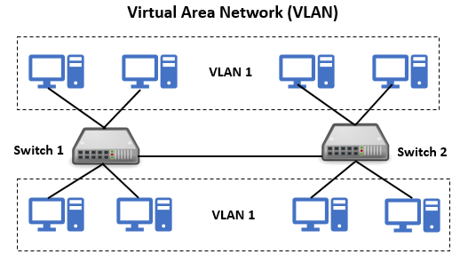
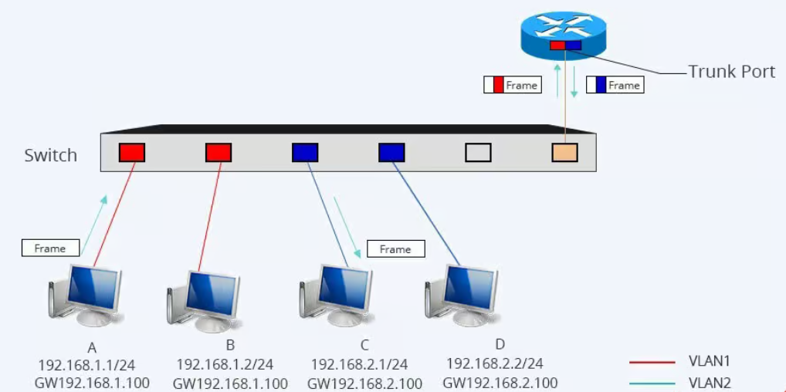

- [VLAN](#vlan)
  - [I. VLAN LÀ GÌ?](#i-vlan-là-gì)
  - [II. PHÂN LOẠI VLAN](#ii-phân-loại-vlan)
  - [III. CÁCH HOẠT ĐỘNG CỦA VLAN](#iii-cách-hoạt-động-của-vlan)

# VLAN
## I. VLAN LÀ GÌ?
VLAN (Virtual Local Area Network) hay còn gọi là mạng LAN ảo là một kỹ thuật phân chia mạng LAN vật lý thành các mạng logic riêng biệt, được gọi là các VLAN.

Mỗi VLAN hoạt động như một mạng LAN riêng biệt, với lưu lượng truy cập riêng biệt và được cách ly với các VLAN khác.

## II. PHÂN LOẠI VLAN
`Static VLAN(VLAN tĩnh)`
- Static VLAN là loại VLAN được tạo ra bằng cách gắn các cổng Switch vào một VLAN. 
- Quản trị viên tự tay cấu hình trên switch: mỗi cổng (port) của switch được gán cố định vào một VLAN.
- Khi bạn cắm thiết bị nào vào cổng đó → thiết bị sẽ tự động thuộc VLAN đó.

ví dụ:
- Port 1 - 10 của switch gắn vào VLAN 10
- Port 11 - 20 gắn vào VLAN 20

=> Cắm máy tính vào port 5 thì nó nằm trong VLAN 10, rút ra cắm máy khác vẫn VLAN 10.

`Dynamic VLAN(VLAN động)`
- Dynamic VLAN là kiểu VLAN mà switch tự động gán VLAN cho thiết bị dựa trên các thông tin nhận dạng của thiết bị đó (không dựa vào cổng vật lý).
- Thông tin nhận dạng thường dùng: địa chỉ MAC, IP, User ID.

Ví dụ: 
- Đăng ký trước trong cơ sở dữ liệu:
  - MAC A → VLAN 10
  - MAC B → VLAN 20
- Khi cắm máy có MAC A vào bất kỳ cổng nào, switch nhìn MAC này, tra cơ sở dữ liệu và tự gán cổng đó vào VLAN 10 cho máy đó.

- Cách hoạt động:
  - Switch sẽ kết hợp với một máy chủ quản lý VLAN (ví dụ: VMPS – VLAN Membership Policy Server).
  - Khi một thiết bị kết nối, switch gửi MAC/IP của thiết bị lên VMPS.
  - VMPS trả về VLAN ID cần gán cho cổng đó.
  - Switch tạm thời gán cổng đó vào VLAN tương ứng cho đến khi thiết bị rút ra.

`So sánh Static/Dynamic VLAN`
| Tiêu chí               | **Static VLAN**                | **Dynamic VLAN**              |
| ---------------------- | ------------------------------ | ----------------------------- |
| **Gán VLAN**           | Thủ công theo port             | Tự động theo MAC/IP/User      |
| **Thiết bị di chuyển** | Phải gán lại VLAN cho port mới | Vẫn vào đúng VLAN             |
| **Phức tạp**           | Đơn giản                       | Phức tạp hơn, cần VMPS/RADIUS |
| **Tính phổ biến**      | Phổ biến nhất                  | Ít dùng hơn, chủ yếu mạng lớn |

## III. CÁCH HOẠT ĐỘNG CỦA VLAN
Mạng VLAN hoạt động bằng cách chia một mạng vật lý thành các mạng con ảo độc lập giúp tăng cường quản lý và an ninh, cũng như cải thiện hiệu suất mạng.
- Mỗi VLAN trên switch được xác định bằng một VLAN ID(ví dụ VLAN 10, VLAN 20).
- Cổng switch(port) sẽ được gán VLAN ID. Thiết bị cắm vào port nào đó sẽ tự động thuộc VLAN có ID tương ứng.
- **Access Ports và Trunk Ports**: Trong mạng VLAN, có hai loại cổng quan trọng: access ports và trunk ports. Cổng Access ports được gán cho một VLAN cụ thể, trong khi cổng trunk được sử dụng để chuyển dữ liệu giữa các switch và giữa các mạng VLAN.

- **Tagging và Untagging**: Khi dữ liệu đi qua cổng trunk, thông tin về VLAN ID thường được thêm vào gói tin (tagging). Ngược lại, khi dữ liệu rời khỏi mạng VLAN, thông tin này có thể được loại bỏ (untagging).

- **Tạo Broadcast Domains**: Mỗi VLAN tạo ra một broadcast domain độc lập, giảm thiểu lưu lượng broadcast trên mạng và cải thiện hiệu suất.