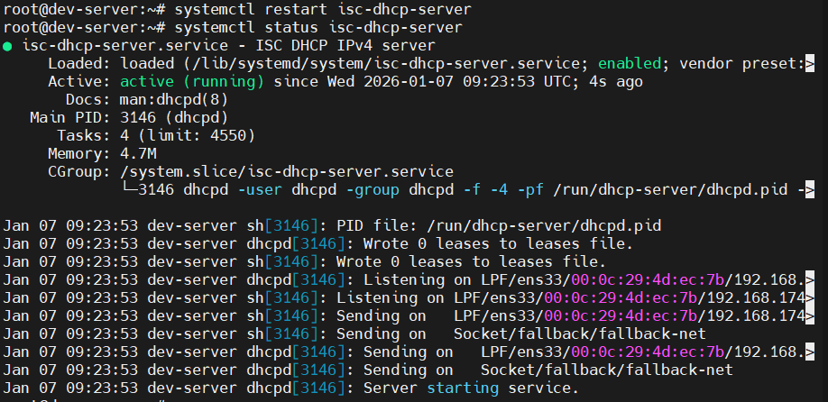
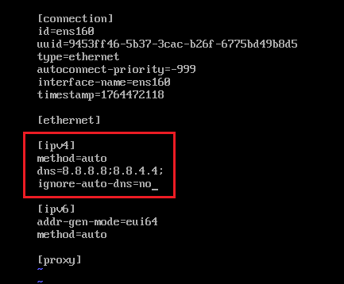
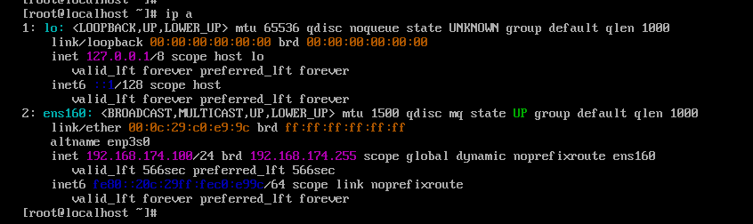
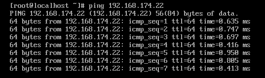

# Cấu hình DHCP server trên Ubuntu
## Mô hình
Ubuntu: DHCP server

Rocky9: DHCP client

## Thực hiện
### Bước 1: Cài đặt DHCP Server trên Ubuntu

```bash
sudo apt install isc-dhcp-server -y
```

Kiểm tra địa chỉ IP:

```bash
root@dev-server:~# ifconfig
ens33: flags=4163<UP,BROADCAST,RUNNING,MULTICAST>  mtu 1500
        inet 192.168.174.22  netmask 255.255.255.0  broadcast 192.168.174.255
        inet6 fe80::20c:29ff:fe4d:ec7b  prefixlen 64  scopeid 0x20<link>
        ether 00:0c:29:4d:ec:7b  txqueuelen 1000  (Ethernet)
        RX packets 1833  bytes 2016350 (2.0 MB)
        RX errors 0  dropped 0  overruns 0  frame 0
        TX packets 874  bytes 98864 (98.8 KB)
        TX errors 0  dropped 0 overruns 0  carrier 0  collisions 0

lo: flags=73<UP,LOOPBACK,RUNNING>  mtu 65536
        inet 127.0.0.1  netmask 255.0.0.0
        inet6 ::1  prefixlen 128  scopeid 0x10<host>
        loop  txqueuelen 1000  (Local Loopback)
        RX packets 122  bytes 10550 (10.5 KB)
        RX errors 0  dropped 0  overruns 0  frame 0
        TX packets 122  bytes 10550 (10.5 KB)
        TX errors 0  dropped 0 overruns 0  carrier 0  collisions 0

root@dev-server:~#
```

### Bước 2: Cấu hình DHCP Server

Sửa file cấu hình DHCP:

```bash
sudo vi /etc/dhcp/dhcpd.conf
```

Thêm các dòng sau vào file:

```
default-lease-time 600;
max-lease-time 7200;
authoritative;

subnet 192.168.174.0 netmask 255.255.255.0 {
range 192.168.174.100 192.168.174.120;
option routers 192.168.174.2;
option subnet-mask 255.255.255.0;
option domain-name-servers 8.8.8.8, 8.8.4.4;
}
```

- `default-lease-time 600`: Thiết lập thời gian thuê mặc định (default lease time) cho các địa chỉ IP được cấp phát bởi DHCP server là 600 giây (10 phút)
- `max-lease-time 7200`: Thiết lập thời gian thuê tối đa mà DHCP server sẽ cấp phát cho một client là 7200 giây (2 giờ). Khi client yêu cầu thời gian thuê dài hơn, server sẽ không cấp phát quá thời gian này
- `authoritative`: Khai báo rằng DHCP server này là có thẩm quyền (authoritative) cho các subnet được cấu hình trong file này. Server sẽ phản hồi các yêu cầu DHCP ngay cả khi nó không chắc chắn về cấu hình mạng
- `subnet 192.168.170.0 netmask 255.255.255.0 {...}`: 
  - `subnet 192.168.170.0`: Xác định địa chỉ mạng của subnet
  - `netmask 255.255.255.0`: Xác định subnet mask cho mạng
  - `range 192.168.174.100 192.168.174.120`: Dải địa chỉ DHCP có thể cấp phát
  - `option routers 192.168.174.2`: là địa chỉ IP của router (cổng mặc định - default gateway) mà các client sẽ sử dụng để truy cập mạng khác bên ngoài subnet này
  - `option domain-name-servers 8.8.8.8, 8.8.4.4`: thiết lập tùy chọn domain cho các client trong subnet. Các client sẽ sử dụng máy chủ DNS của google để phân giải tên miền thành địa chỉ IP

Chỉ định interface để DHCP lắng nghe:

```bash
sudo vi /etc/default/isc-dhcp-server
INTERFACESv4="ens33"
```

Khởi động DHCP Server:

```bash
sudo systemctl restart isc-dhcp-server
sudo systemctl status isc-dhcp-server
```



### Bước 3: Cấu hình Rocky làm DHCP client
Cấu hình mạng trên rocky dùng dhcp:

```bash
sudo vi /etc/NetworkManager/system-connections/ens160.nmconnection
```



Khởi động lại `NetworkManager` để áp dụng:

```bash
sudo systemctl restart NetworkManager
```

Kiểm tra IP:



- `192.168.174.100` nằm trong dải địa chỉ mạng DHCP server cấp phát.

### Bước 4: Kiểm tra kết nối với DHCP server



- ping được đến server DHCP: `192.168.174.22`

