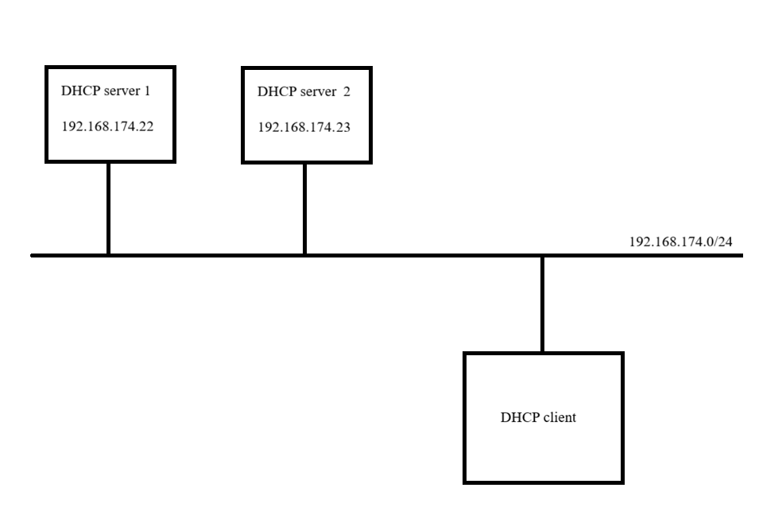
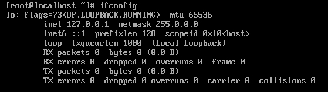
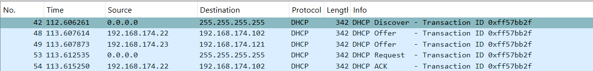

# Cấu hình nhiều DHCP server 
## Mô hình



## Thực hiện
Ta kiểm tra địa chỉ IP trên DHCP client:



Lúc này client chưa có địa chỉ IP 

Trên DHCP server 1 ta cấu hình như sau:

```bash
sudo vi /etc/dhcp/dhcpd.conf
```

```bash
default-lease-time 600;
max-lease-time 7200;
authoritative;

subnet 192.168.174.0 netmask 255.255.255.0 {
range 192.168.174.100 192.168.174.120;
option routers 192.168.174.2;
option subnet-mask 255.255.255.0;
option domain-name-servers 8.8.8.8, 8.8.4.4;
}
```

Trên DHCP server 2 ta cấu hình như sau:

```bash
sudo vi /etc/dhcp/dhcpd.conf
```

```bash
default-lease-time 600;
max-lease-time 7200;
authoritative;

subnet 192.168.174.0 netmask 255.255.255.0 {
range 192.168.174.121 192.168.174.140;
option routers 192.168.174.2;
option subnet-mask 255.255.255.0;
option domain-name-servers 8.8.8.8, 8.8.4.4;
}
```

Ý nghĩa:
- server 1 cấp địa chỉ IP trong khoảng: `192.168.174.100 -> 192.168.174.120`
- server 2 cấp địa chỉ IP trong khoảng: `192.168.174.121 -> 192.168.174.140`


Chỉ định interface để DHCP lắng nghe:

```bash
sudo vi /etc/default/isc-dhcp-server
INTERFACESv4="ens33"
```

Restart lại DHCP server:

```bash
sudo systemctl restart isc-dhcp-server
sudo systemctl status isc-dhcp-server
```

Trên client ta dùng lệnh sau để xin cấp địa chỉ IP:

```bash
dhclient -v ens160
```

Kiểm tra lại:


Lúc này DHCP client đã có ip là `192.168.174.102`

Ta sử dụng wireshark để quan sát các gói tin trong quá trình DHCP:




Ta thấy có 2 gói OFFER từ 2 server gửi về cho DHCP client và client chỉ nhận 1 địa chỉ IP ở đây là của server 1: `192.168.174.22` do đó mặc dù nó gửi gói `request` cho toàn bộ các server (Vì trong gói request có địa chỉ IP đích là broadcast) nhưng với server 2 do client không lấy ip do server này cung cấp nên nó sẽ bỏ qua gói ACK còn với server 1 thì nó sẽ gửi gói ACK xác nhận cho client 


