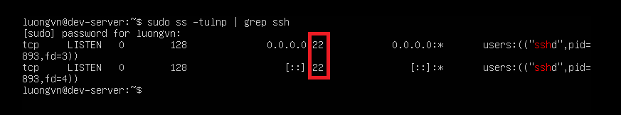
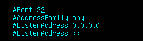
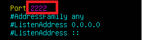
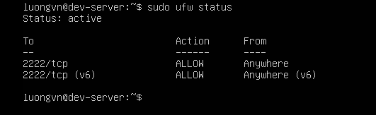
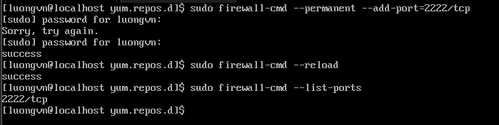
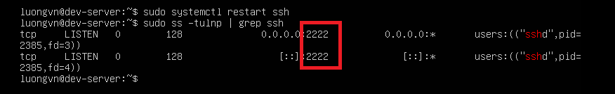
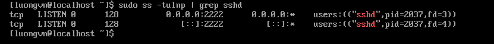
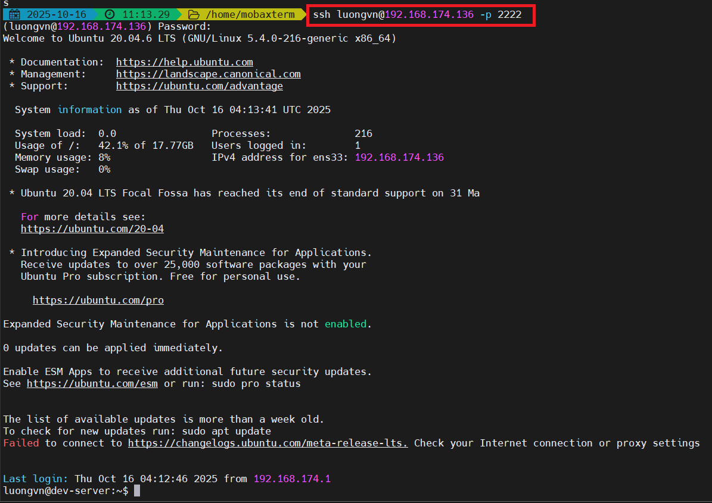
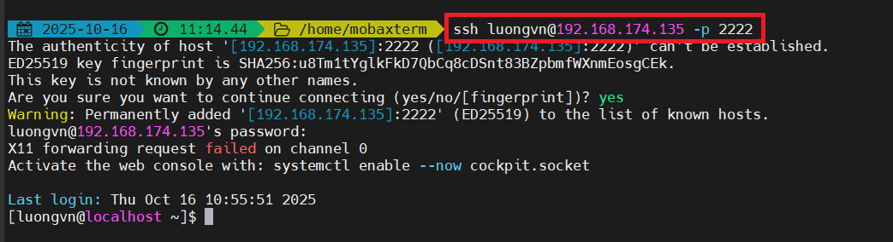

# Đổi port SSH. Sử dụng port khác để SSH vào máy chủ

Mặc định, SSH sử dụng cổng 22. Để tăng bảo mật, bạn có thể thay đổi cổng này thành một số khác, ví dụ 2222.

- Tăng bảo mật vì: 
SSH mặc định chạy trên cổng 22 nên hầu hết các bot tự động quét Internet đều tập trung tìm kiếm cổng 22 để:
  - Thử brute-force (đoán mật khẩu SSH).
  - Tìm các lỗ hổng SSH cũ để khai thác.

## Đổi port SSH
Trên máy ảo ubuntu và Rocky9

`Bước 1`: Kiểm tra SSH đang chạy trên cổng nào
```bash
sudo ss -tulnp | grep ssh
```
- Kết quả:



- SSH đang chạy trên cổng 22

`Bước 2`: Sửa file cấu hính SSH để đổi cổng:
- Mở file `/etc/ssh/sshd_config`
- Tìm dòng



- Bỏ dấu `#` và đổi số cổng, ví dụ 2222:



- Có thể chọn một cổng cao hơn, ví dụ 2222, 2223, 50022..., miễn là nó không bị xung đột với dịch vụ khác.
- Tránh các cổng phổ biến như 80, 443, 3306, 8080...

`Bước 3`: Mở cổng mới trên firewall
- Mở cổng 2222 với lệnh sau:

Trên ubuntu:
```bash
sudo ufw allow 2222/tcp
```

- Kiểm tra lại trạng thái firewall
```bash
sudo ufw status
```



Trên Rocky9
```bash
sudo firewall-cmd --permanent --add-port=2222/tcp
sudo firewall-cmd --reload
```

- Kiểm tra lại trạng thái firewall
```bash
sudo firewall-cmd --list-ports
```



`Bước 4`: Restart ssh và kiểm tra lại cổng port

Ubuntu:



Rocky9:



`Bước 5`: Thực hiện ssh
```bash
ssh user@ip_user -p 2222
```
Ubuntu:



Rocky9:



