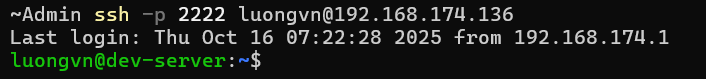

# Lab thực hiện SSH vào server chỉ cho SSH bằng key và đã biết cặp key
## Chuẩn bị:
- Server Ubuntu chỉ cho ssh vào khi có ssh key
- Biết trước thông tin của `private key` và `public key`

- `private key` nằm ở `~/.ssh/id_rsa` của Rocky9:


- `public key` nằm ở `~/.ssh/authorized_keys` của Ubuntu:


## TH1: Trên máy Windows lưu thông tin về key với tên mặc định là `id_rsa` và `id_rsa.pub` với folder là `.ssh`

`C:\Users\Admin\.ssh` - đường dẫn thư mục trên máy windows

- Chỉnh sửa nội dung 2 file `id_rsa` và `id_rsa.pub` để giống với private và public key 

- Download 2 file này từ Rocky9 về:
```bash
$scp -P 2222 luongvn@192.168.174.135:/home/luongvn/.ssh/id_rsa C:\Users\Admin\.ssh\

$scp -P 2222 luongvn@192.168.174.135:/home/luongvn/.ssh/id_rsa.pub C:\Users\Admin\.ssh\
```

- Kiểm tra lại:


- Thư ssh vào server ubuntu:



- Kết luận: Có thể SSH được với tên folder và tên của file key mặc định

## TH2: Trên máy Windows lưu thôgn tin về key với tên khác và lưu ở folder khác

- Ta tạo thư mục tên là `.ssh_test` và 2 file lần lượt là `id_rsa_test` và `id_rsa_test.pub` với nội dung giống với `id_rsa` và `id_rsa.pub` của Rocky9.


- Tiến hành ssh vào ubuntu server


-> Ta thấy nếu chỉ ssh với 1 option là cổng port thì không thể ssh được

- Để có thể ssh vào ta phải thêm option `-i` nghĩa là đường dẫn đến private key. Ở đây nó nằm ở `C:\Users\Admin\.ssh_test\id_rsa_test`

```bash
ssh -p 2222 -i C:\Users\Admin\.ssh_test\id_rsa_test luongvn@192.168.174.136
```


- Kết luận: Ta hoàn toàn có thể ssh vào được với tên của file chưa key và folder khác với mặc định