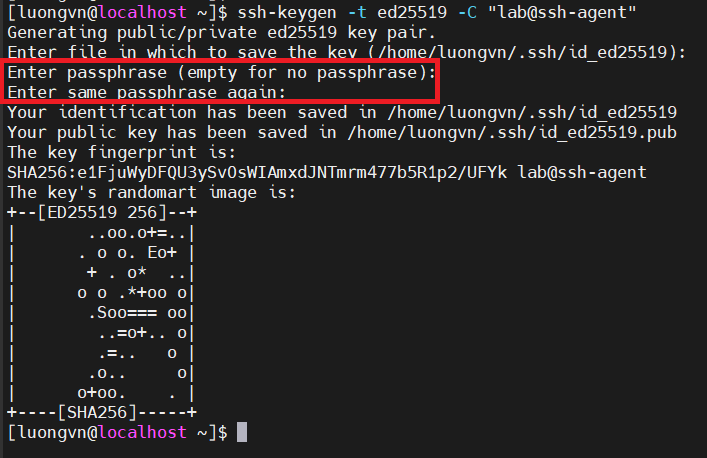
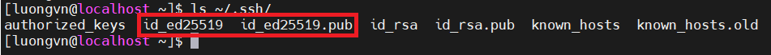
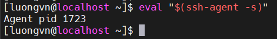
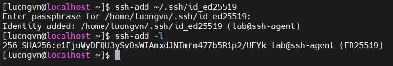
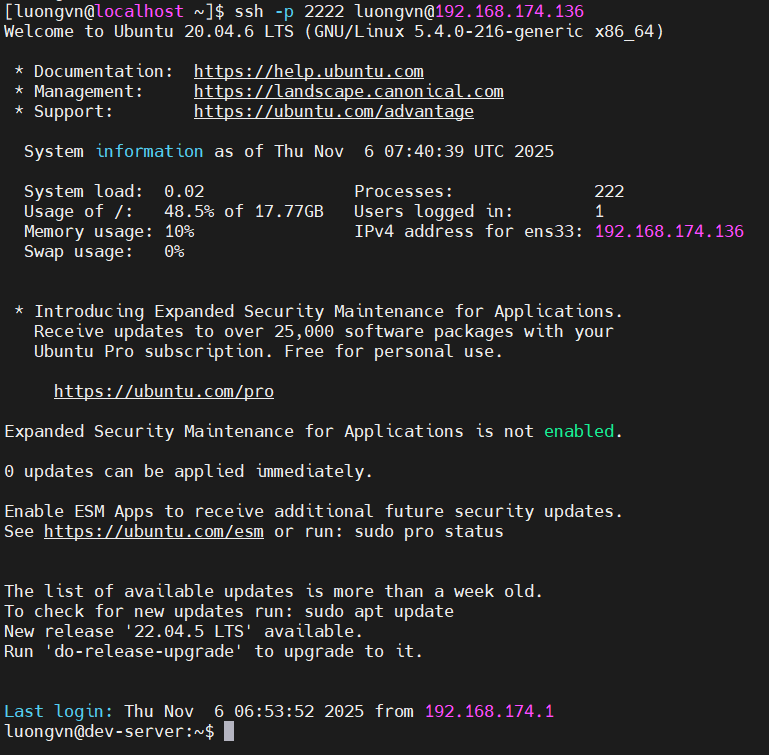
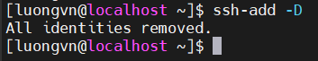
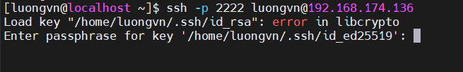

# Lab: làm việc với ssh-agent
## Mục tiêu: Kiểm tra và sử dụng lại key mà không cần nhập lại passphrase

## `Bước 1`: Tạo SSH key có passphrase 

  ```bash
  ssh-keygen -t ed25519 -C "lab@ssh-agent"
  ```

  

- Ta tạo passphrase ở đây!!

- Sau khi xong ta kiểm tra: 

  ```bash
  ls ~/.ssh/
  ```

  

- Ta thấy xuất hiện 2 file:
  - `id_ed25519`: lưu private key
  - `id_ed25519.pub`: lưu public key

## `Bước 2`: Khởi động `ssh-agent`

  ```bash
  eval "$(ssh-agent -s)"
  ```

  

  -> `ssh-agent` đang chạy nền và PID của nó là 1723

- Lúc này 2 biến môi trường đã được tạo ra là:

  - `$SSH_AUTH_SOCK`: Đường dẫn đến socket mà `ssh-agent` tạo ra

    -> Để các chương trình khác giao tiếp với `ssh-agent`
  - `$SSH_AGENT_PID`: lưu PID của `ssh-agent`

## `Bước 3`: Thêm private key vào agent

  ```bash
  ssh-add ~/.ssh/id_ed25519
  ```

  - Ta sẽ nhập passphrase lần đầu tại đây!!

  - Sau khi thêm: `ssh-add -l` để xem fingerprint của key


  


## `Bước 4`: Gửi publickey cho server sau đó ssh

  

  -> Ta ssh mà không cần nhập passphrase!!!

## `Bước 5`: xóa key khỏi agent sau đó thử ssh lại

- Dùng `ssh-add -D`; `-D: Delete all`
  
  

- SSH lại:

  

  -> Ta bắt buộc phải nhập passphrase để ssh vào server!!
