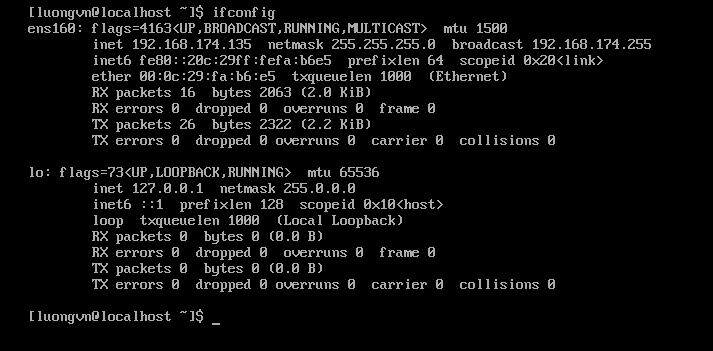

# Cài đặt SSH server trên máy ảo Rocky
## 1. Cài đặt ssh server trên máy ảo
- Cấu hình mạng và ghi lại địa chỉ IP, đảm bảo có thể truy cập Internet từ máy ảo



Ta thấy khi dùng lệnh: `ifconfig` IP của máy ảo là: `192.168.174.135`

Thực hiện ping để kiểm tra kết nối Internet


-> Kết nối Internet thành công

- Cài đặt OpenSSH:
```bash
$sudo yum install openssh-server -y
```


- Khởi động và cho phép SSH tự động thực thi khi khởi động hệ điều hành
```bash
$sudo systemctl start sshd
$sudo systemctl enable sshd
```

- Kiểm tra xem ssh server có đang thực thi hay chưa
```bash
$sudo systemctl status sshd
```


-> Thực thi thành công

## 2. Đăng nhập vào máy ảo Ubuntu và kiểm tra xem có thể kết nối tới ssh server Rocky không?

- Đăng nhập vào máy ảo Ubuntu


- Kết nối tới ssh server Rocky
```bash
ssh luongvn@192.168.174.135
```


- Kiểm tra kết nối của ssh server trên internet

