# Cài đặt SSH server trên máy ảo ubuntu
## 1. Cài đặt ssh server trên máy ảo
- Cấu hình mạng và ghi lại địa chỉ IP, đảm bảo có thể truy cập Internet từ máy ảo

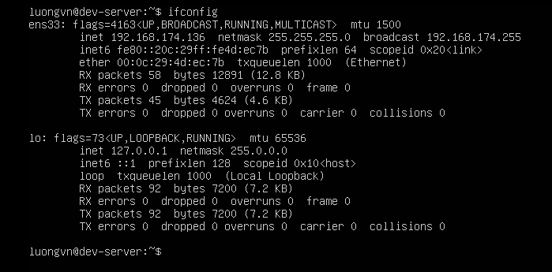

Ta thấy khi dùng lệnh: `ifconfig` IP của máy ảo là: `192.168.174.136`

Thực hiện ping để kiểm tra kết nối Internet

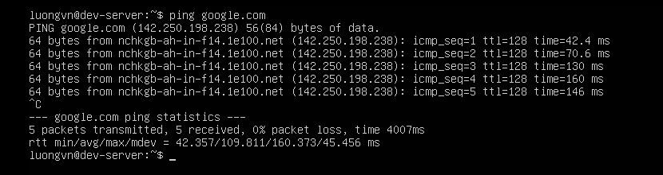

-> Kết nối Internet thành công

- Cài đặt OpenSSH:
```bash
$sudo apt install openssh-server -y
```

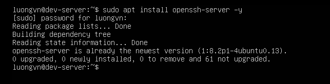

- Khởi động và cho phép SSH tự động thực thi khi khởi động hệ điều hành
```bash
$sudo systemctl start ssh
$sudo systemctl enable ssh
```

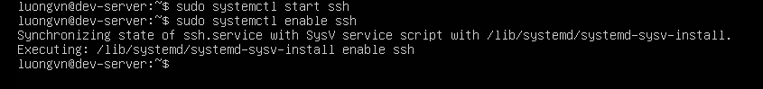

- Kiểm tra xem ssh server có đang thực thi hay chưa
```bash
$sudo systemctl status ssh
```

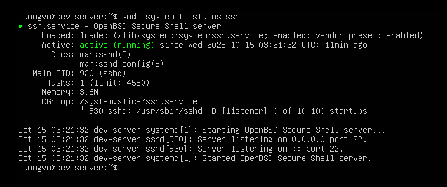

-> Thực thi thành công

## 2. Đăng nhập vào máy ảo Rocky và kiểm tra xem có thể kết nối tới ssh server Ubuntu không?

- Đăng nhập vào máy ảo Rocky 9

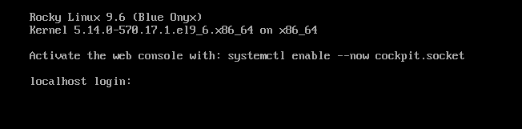

- Kết nối tới ssh server ubuntu
```bash
ssh luongvn@192.168.174.136
```

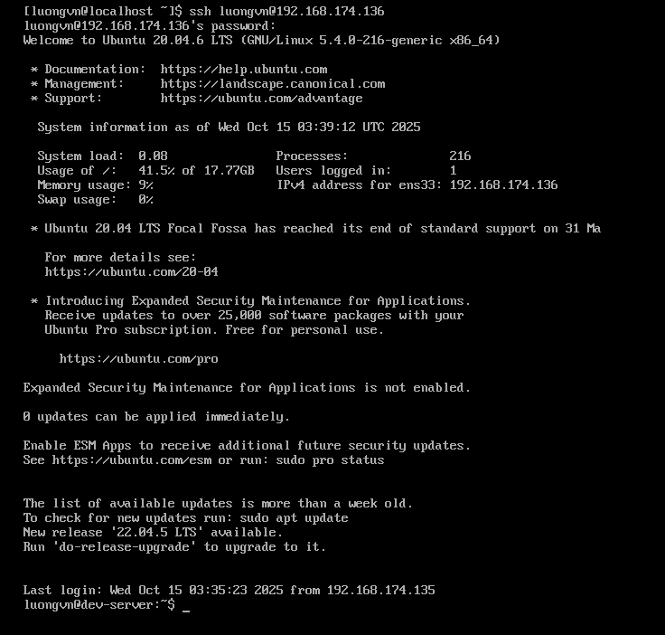

- Kiểm tra kết nối của ssh server trên internet

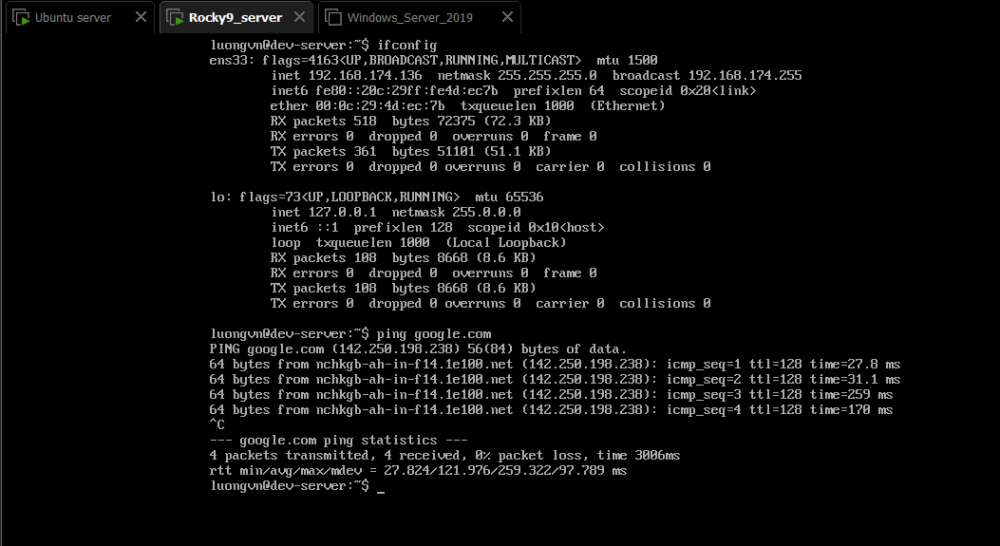

## 3. Download/upload file giữa ssh server máy ảo Ubuntu và máy ảo Rocky 

- Kiểm tra kết nối giữa 2 máy

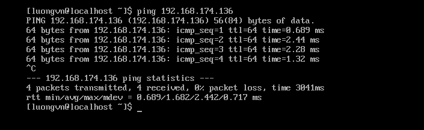

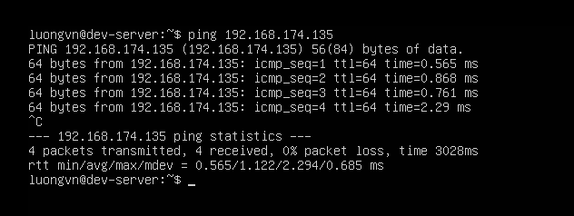

-> Kết nối thành công

- Dùng `scp`(Secure copy): 
  - `scp` là công cụ truyền file qua SSH, có sẵn mặc định trên cả Ubuntu và Rocky.
- Tải file từ ubuntu về rocky:
  - Cú pháp:
    ```bash
    scp <user>@<IP_ubuntu>:/đường/dẫn/tập_tin /đích/trên/rocky
    ```
  - Trên máy ubuntu có file nằm ở `/home/luongvn` có nội dung như sau:
    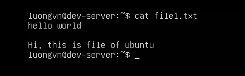
  - Tải file này về `/home/luongvn` ở rocky:
    - Trên rocky nhập lệnh:
      ```bash
      scp luongvn@192.168.174.136:/home/luongvn/file1.txt /home/luongvn
      ```

      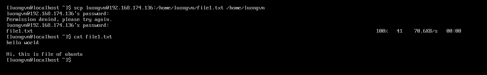

      -> Download file thành công
- Upload file từ rocky lên ubuntu:
  - Cú pháp:
    ```bash
    scp /đường/dẫn/tập_tin <user>@<IP_ubuntu>:/đường/dẫn/đích/trên/ubuntu
    ```
  - Trên máy rocky có file nằm ở `/home/luongvn` có nội dung như sau:
    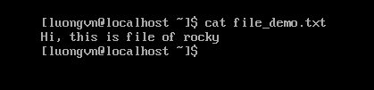
  - Upload file này lên `/home/luongvn` ở ubuntu:
    - Trên rocky nhập lênh:
      ```bash
      scp /home/luongvn/file_demo.txt luongvn@192.168.174.136:/home/luongvn
      ```

      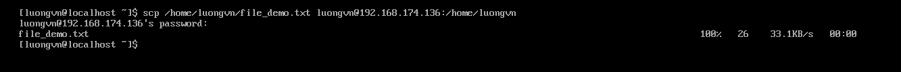

    - Vào ubuntu và kiểm tra xem đã có file `file_demo.txt` từ rocky upload lên chưa

      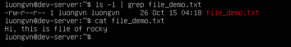

      -> Upload file thành công