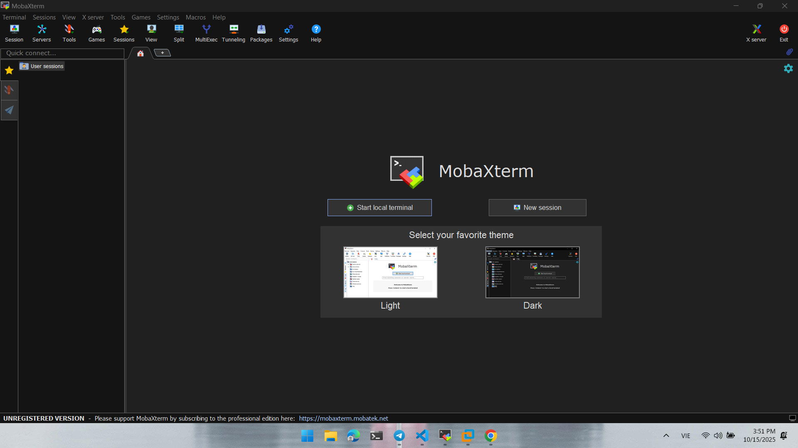
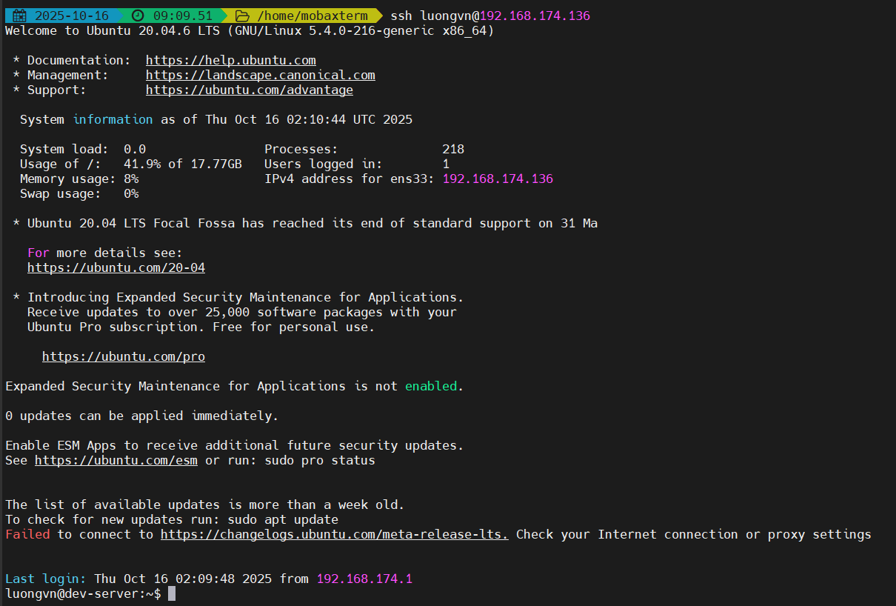

# Dùng mobaxterm để ssh vào 1 máy từ xa
MobaXterm là một phần mềm all-in-one để làm việc với các máy chủ từ xa — đặc biệt là các máy Linux/Unix từ hệ điều hành Windows.

- Tải mobaxterm tại: https://mobaxterm.mobatek.net/download.html

## Truy cập vào mobaxterm



Chọn `Start local termianl`

- Dùng `uname -a` để hiển thị thông tin hệ thống


## SSH vào server
### Server chỉ cho phép dùng password để SSH
- Ta chỉ cần gõ câu lệnh: 
```bash
ssh user@host
```

Sau đó nhập passwor để vào server


### Server chỉ cho phép dùng ssh key

1) Tạo key trên mobaxterm
```bash
ssh-keygen -t rsa -b 4096
```


Ta thấy trên mobaxterm đã xuất hiện 2 file `~/.ssh/id_rsa` và `~/.ssh/id_rsa.pub` để lưu private key và public key

2) Chuyển public key cho server
```bash
ssh-copy-id user@host
```

-> Nó sẽ tự thêm vào `~/.ssh/authorized_keys` của server


3) SSH vào server



-> SSH không cần password vì đã có ssh key thành công trên mobaxterm