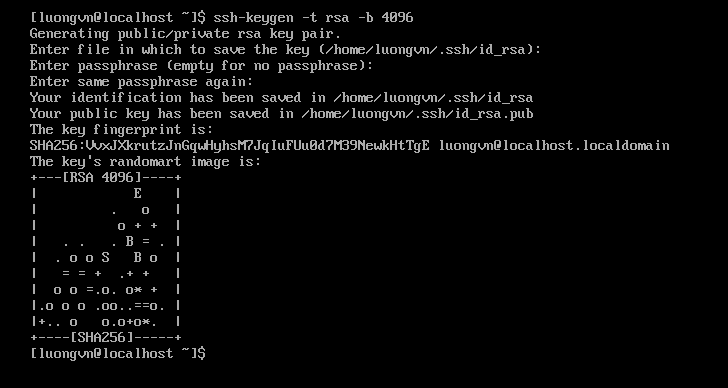
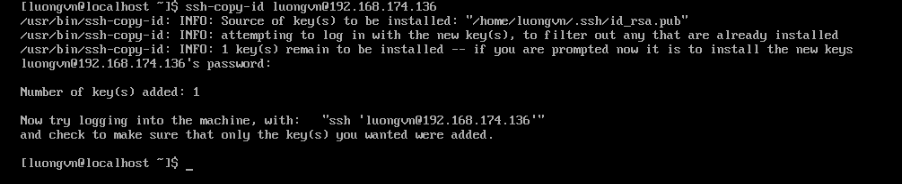
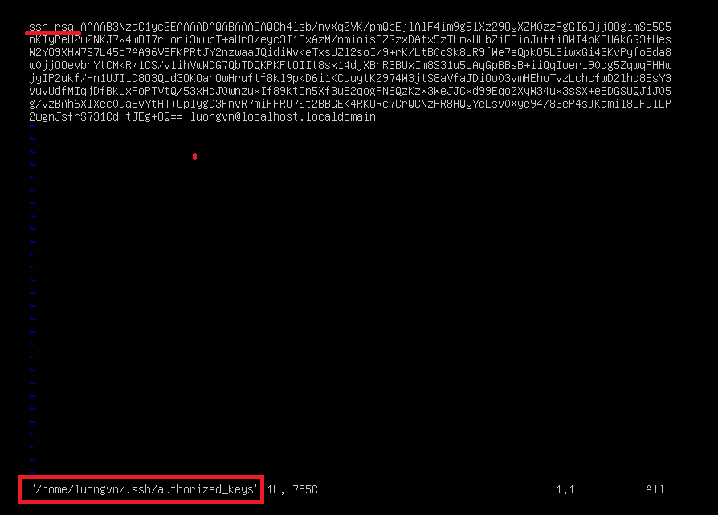
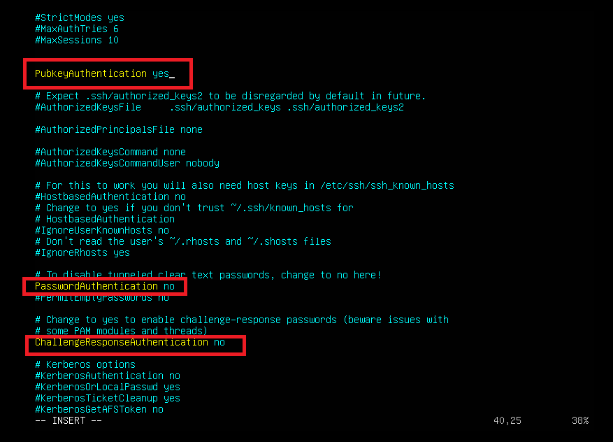
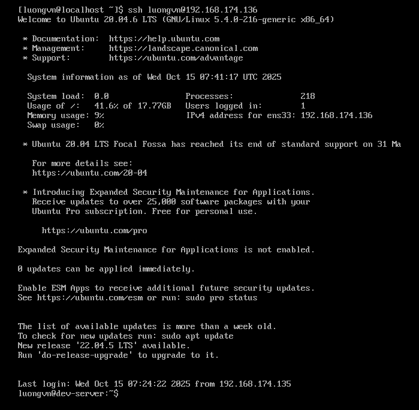
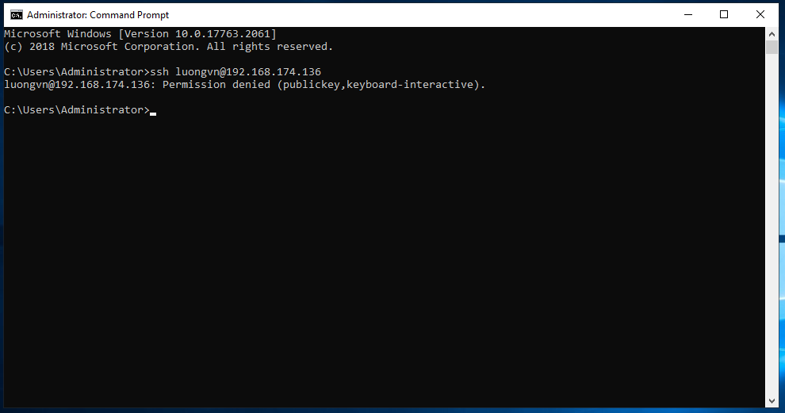

# Cấu hình SSH server chỉ cho phép đăng nhập bằng key, không dùng mật khẩu

## 1. Tạo SSH key trên máy client
Trên máy client chạy lệnh:
```bash
ssh-keygen -t rsa -b 4096
```

  - `ssh-keygen`:	Chương trình tạo ra cặp SSH key.
  - `-t rsa`:	Chỉ định thuật toán mã hóa là RSA (Rivest–Shamir–Adleman).
  - `-b 4096`:	Số bit độ dài khóa là 4096 bit, tức là rất mạnh (mặc định chỉ 2048 bit).



- Nó sẽ tạo cặp khóa: 
  - Private key: `~/.ssh/id_rsa`
  - Public key: `~/.ssh/id_rsa.pub`

## 2. Ghép public key sang máy server
Chạy lệnh sau từ máy client:
```bash
ssh-copy-id user@server_ip
```
-> Sao chép nội dung của `~/.ssh/id_rsa.pub` vào `~/.ssh/authorized_keys` của user trên server.



- Mở file `~/.ssh/authorized_keys` trên ubuntu để kiểm tra:



## 3. Cấu hình SSH server để chỉ dùng key
- Trên máy ubuntu server, mở file cấu hình
```bash
sudo vim /etc/ssh/sshd_config
```
- Tìm và chỉnh các dòng sau(bỏ dấu `#` nếu có):
```bash
PasswordAuthentication no
PubkeyAuthentication yes
```
  - `PasswordAuthentication no`: không cho phép đăng nhập bằng mật khẩu.
  - `PubkeyAuthentication yes`: chỉ cho phép dùng SSH key.
  


- **NOTE**: Nếu có file override trong thư mục con của `/etc/ssh/sshd_config.d` ta phải chỉnh `Passwordauthentication no` cho cả file đó.
## 4. Khởi động lại ssh
```bash
sudo systemctl restart ssh
```

## 5. Kiểm tra lại
- Vào Rocky và SSH thử vào server ubuntu:

  

  -> Không cần nhập mật khẩu vì đã có cặp `public key - private key`
- Vào Window_19 và SSH thử vào server ubuntu:

  

  -> không ssh được vì không có key, hiện lỗi `permission denied`