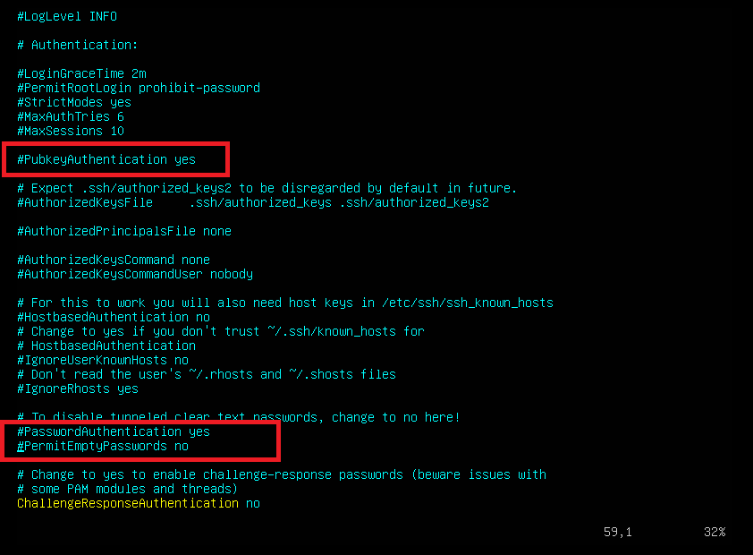
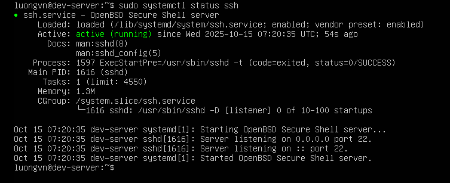
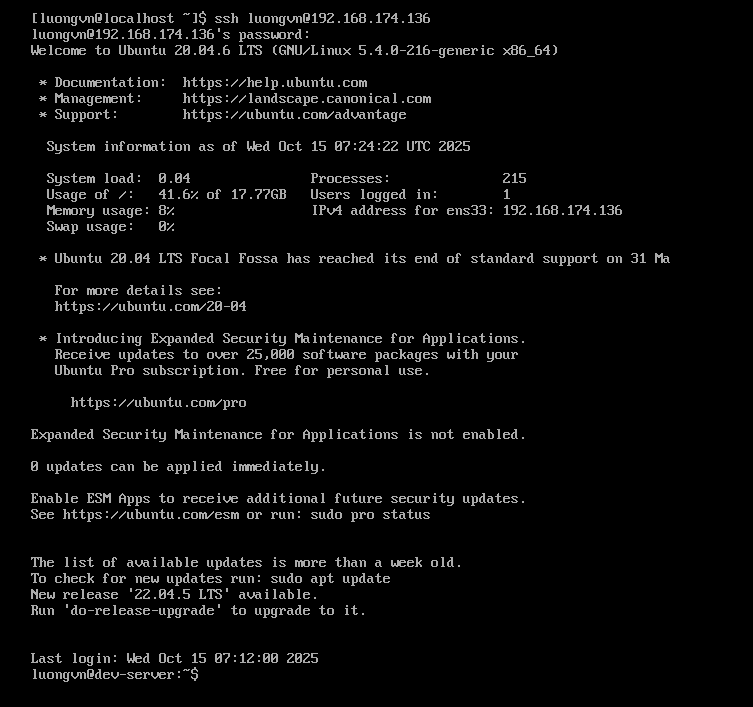

# Cấu hình SSH server chỉ cho phép đăng nhập bằng mật khẩu, không cho phép đăng nhập bằng SSH key.
File cấu hình SSH có 2 phần chính:
  1) Cấu hình SSH server: `/etc/ssh/sshd_config` (dành cho máy chủ SSH)
  2) Cấu hình SSH client: `~/.ssh/config` (dành cho máy khách SSH)

## 1. Mở file cấu hình SSH server
Trên server chạy: 
```bash
sudo vim /etc/ssh/sshd_config
```

## 2. Sửa hoặc thêm dòng sau:
```bash
PasswordAuthentication yes
PubkeyAuthentication no
```



Ở đây ta chỉnh sửa dòng `PubkeyAuthentication -> no`

Ý nghĩa:

- `PasswordAuthentication yes`:	Cho phép đăng nhập bằng mật khẩu
- `PubkeyAuthentication no`:	Tắt đăng nhập bằng SSH key

## 3. Khởi động lại dịch vụ SSH
```bash
sudo systemctl restart ssh
```

## 4. Kiểm tra lại trạng thái
```bash
sudo systemctl status ssh
```



## 5. Dùng máy Rocky SSH vào ubuntu server 

