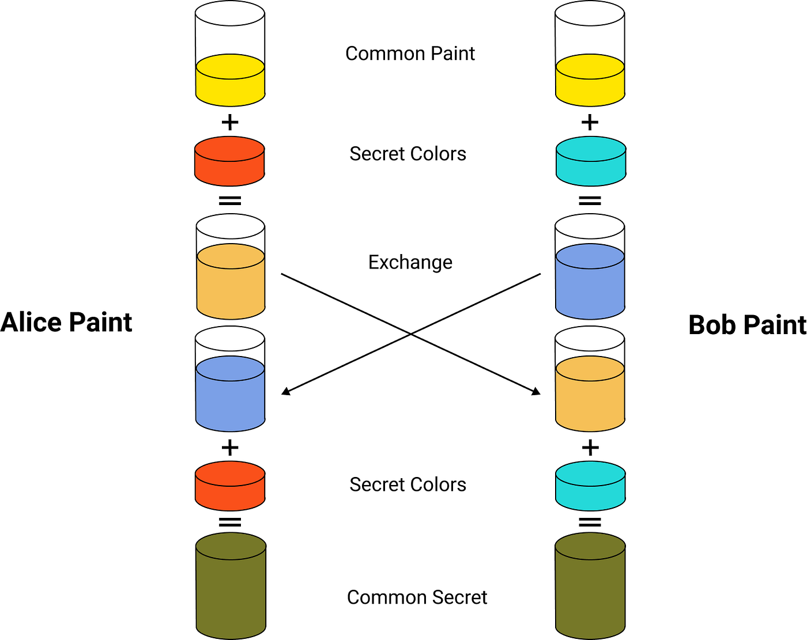

# Trao đổi khóa Diffie-Hellman
- Trao đổi khóa Diffie-Hellman cho phép 2 bên thiết lập một khóa bí mật chung để mã hóa dữ liệu mà không cần thỏa thuận trước về khóa bí mật giữa 2 bên
- Giao thức này được công bố bởi Whitfield Diffie và Martin Hellman năm 1976

## Ý tưởng cơ bản
- Ví dụ: Alice và Bob muốn trao đổi cho nhau về 1 màu sơn khóa nào đó mà chỉ có 2 người biết
- Điểm chủ chốt của ý tưởng này là Alice và Bob trao đổi màu sơn bí mật thông qua hỗn hợp sơn.
  - Đầu tiên Alice và Bob trộn màu đã biết chung (màu vàng) với màu bí mật riêng của mỗi người.
  - Sau đó, mỗi người chuyển hỗn hợp của mình tới người kia thông qua một kênh vận chuyển công cộng.
  - Khi nhận được hỗn hợp của người kia, mỗi người sẽ trộn thêm với màu bí mật của riêng mình và nhận được hỗn hợp cuối cùng.
- Hỗn hợp sơn cuối cùng hoàn toàn giống nhau cho cả 2 người và chỉ có 2 người biết.



## Dưới dạng toán học:
- Giao thức sử dụng nhân số nguyên modulo `p`, trong đó `p` là số nguyên tố, `g` là căn nguyên thủy mod p - là số mà khi lấy `g ^ i mod p` với `i: [1, p - 1]` sẽ tạo ra toàn bộ các số [1, p - 1]

- Ví dụ:
1) Alice và Bob thỏa thuận sử dụng chung một số nguyên tố `p = 23` và căn nguyên thủy `g = 5`.
2) Alice chọn một số nguyên bí mật `a = 6`, và gửi cho Bob giá trị `A = g ^ a mod p`
- A = 5 ^ 6 mod 23
- A = 8
3) Bob chọn một số nguyên bí mật `b = 15`, và gửi cho Alice giá trị `B = g ^ b mod p`
- B = 5 ^ 15 mod 23
- B = 19
4) Alice tính `s = B ^ a mod p`
- s = 19 ^ 6 mod 23
- s = 2
5) Bob tính `s = A ^ b mod p`
s = 8 ^ 15 mod 23
s = 2

-> Như vậy Alice và Bob cùng chia sẻ bí mật chung là số `2`


- Cả Alice và Bob đều có được giá trị cuối cùng vì `(g ^ a) ^ b = (g ^ b) ^ a mod p`
- **NOTE**: 
  - Chỉ có `a`, `b`, `(g ^ a) ^ b`, `(g ^ b) ^ a` được giữ bí mật
  - `p`, `g`, `g ^ a mod p`, `g ^ b mod p` được truyền công khai

## Mô tả giao thức
1) Alice và Bob thỏa thuận sử dụng số nguyên tố `p` và `g`
2) Alice chọn 1 số tự nhiên ngẫu nhiên `a` và gửi `g ^ a mod p` cho Bob
3) Bob chọn 1 số tự nhiên ngẫu nhiên `b` và gửi `g ^ b mod p` cho Alice
4) Alice tính `(g ^ b) ^ a mod p`
5) Bob tính `(g ^ a) ^ b mod p`

- Vì `g ^ ab = g ^ ba` nên cả Alice và Bob có thể sử dụng chung cho khóa bí mật

## Chương trình cơ bản
```python
import math
import random

def isPrime(n):
  for i in range(2, math.isqrt(n) + 1):
    if n % i == 0:
      return False
  return True if n > 1 else False

def powmod(a, exp, Mod):
  res = 1
  while exp > 0:
    if exp % 2 == 1: res = res * a % Mod 
    a = a * a % Mod 
    exp /= 2
  return res

while True:
  p = int(input("\nNhập p (số nguyên tố): "))
  g = int(input("Nhập g (generator): "))

  if not isPrime(p):
    print("p không phải là số nguyên tố. Nhập lại!")
    continue
  break

a = random.randint(1, 50)
b = random.randint(1, 50)
print(f"\nSố ngẫu nhiên tạo ra: a = {a}, b = {b}")

r1 = powmod(g, a, p)
r2 = powmod(g, b, p)
print(f"\nR1 = {r1}\nR2 = {r2}")

k1 = powmod(r2, a, p)
k2 = powmod(r1, b, p)
print(f"\nKhóa bí mật chung tính bởi Alice: {k1}")
print(f"Khóa bí mật chung tính bởi Bob: {k2}")

k3 = powmod(g, a * b, p)
print(f"\nKiểm tra khóa chung g^(a*b) mod p = {k3}")

if k1 == k2 == k3:
  print("\nCả hai bên đã tạo ra cùng một khóa bí mật chung!")
else:
  print("\nCó lỗi! Các khóa không trùng khớp.")
```