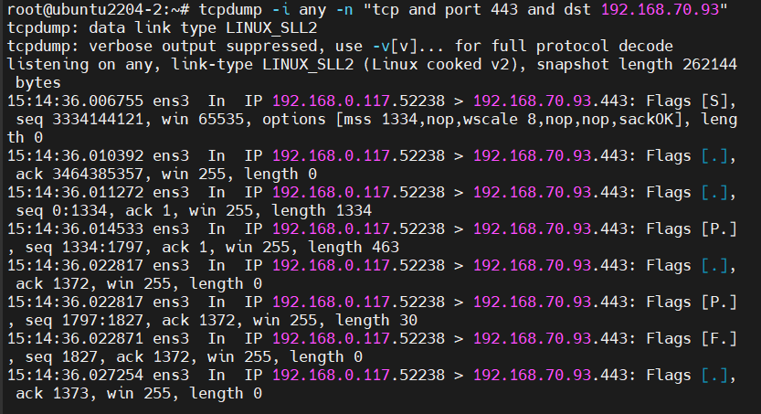
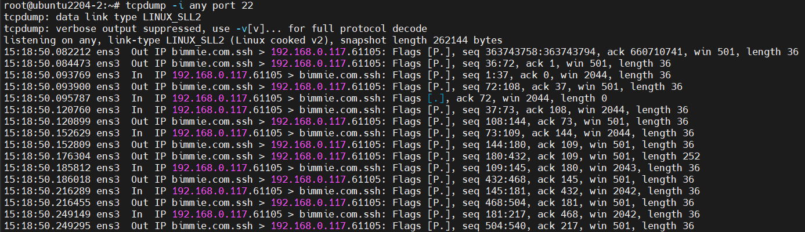
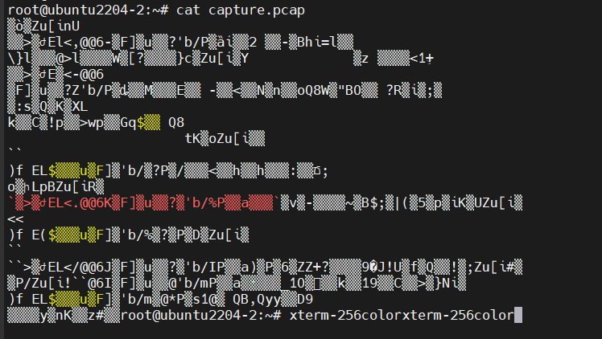
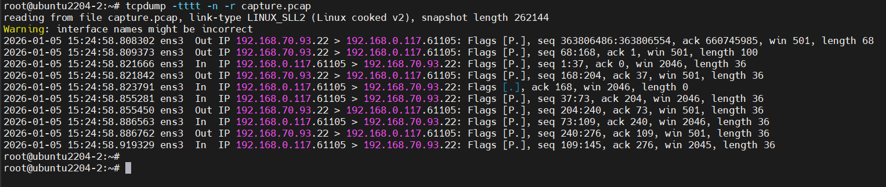

# Tìm hiểu về TCPdump
## Lệnh tcpdump là gì?
Lệnh `tcpdump` trong linux là một công cụ dòng lệnh dùng để bắt và phân tích lưu lượng mạng đi qua một giao diện mạng trên hệ thống.

## Cài đặt lệnh tcpdump
```bash
sudo apt update
sudo apt install tcpdump -y
```

Kiểm tra lại:

```bash
root@ubuntu2204-2:~# tcpdump --version
tcpdump version 4.99.4
libpcap version 1.10.4 (with TPACKET_V3)
OpenSSL 3.0.13 30 Jan 2024
root@ubuntu2204-2:~#
```

## Cú pháp của lệnh tcpdump
### Cú pháp cơ bản:

```bash
sudo tcpdump [option] [filter]
```

### Một số OPTION hay dùng:

| Option              | Describe                                                  |
| ------------------- | --------------------------------------------------------- |
| `-i <giao_dien>`    | Chỉ định giao diện mạng để bắt gói tin(vd: `eth0`, `any`) |
| `-c <số>`           | Dừng sau khi bắt đủ số lượng gói                          |
| `-n`                | Không phân giải tên miền (hiển thị IP thô)                |
| `-nn`               | Không phân giải IP và cổng (hiển thị số cổng thô)         |
| `-v`, `-vv`, `-vvv` | Mức độ chi tiết khi hiển thị gói tin                      |
| `-w <file>`         | Ghi gói tin vào file (dạng nhị phân `.pcap`)              |
| `-r <file>`         | Đóc gói tin từ file `.pcap`                               |
| `-t`                | Ẩn dấu thời gian hiển thị                                 |
| `-tttt`             | Hiển thị thời gian đầy đủ, có ngày giờ                    |


### Biển thức bộ lọc (`[Filter]`)

Các biểu thức giúp lọc gói tin theo điều kiện. Ví dụ:
- Giao thức: `tcp`, `udp`, `ip`, ...
- Địa chỉ IP: `host 192.168.70.93`, `src 10.0.0.1`, `dst 8.8.8.8`
- Cổng: `port 80`, `src port 443`, `dst port 53`
- Tổ hợp: `tcp and port 80 and src 192.168.70.93`

### Ví dụ
#### 1. tcpdump -D
Xem danh sách interface khả dụng

```bash
root@ubuntu2204-2:~# tcpdump -D
1.ens3 [Up, Running, Connected]
2.any (Pseudo-device that captures on all interfaces) [Up, Running]
3.lo [Up, Running, Loopback]
4.bluetooth-monitor (Bluetooth Linux Monitor) [Wireless]
5.nflog (Linux netfilter log (NFLOG) interface) [none]
6.nfqueue (Linux netfilter queue (NFQUEUE) interface) [none]
7.dbus-system (D-Bus system bus) [none]
8.dbus-session (D-Bus session bus) [none]
root@ubuntu2204-2:~#
```

#### 2. Bắt gói theo địa chỉ IP
- Theo địa chỉ nguồn:

    ```bash
    root@ubuntu2204-2:~# tcpdump -i any "tcp and port 443 and src 192.168.70.101"
    tcpdump: data link type LINUX_SLL2
    tcpdump: verbose output suppressed, use -v[v]... for full protocol decode
    listening on any, link-type LINUX_SLL2 (Linux cooked v2), snapshot length 262144 bytes
    15:05:26.760617 ens3  In  IP 192.168.70.101.40648 > bimmie.com.https: Flags [S], seq 3164520497, win 64240, options [mss 1460,sackOK,TS val 3144400273 ecr 0,nop,wscale 7], length 0
    15:05:26.761406 ens3  In  IP 192.168.70.101.40648 > bimmie.com.https: Flags [.], ack 4063005729, win 502, options [nop,nop,TS val 3144400275 ecr 2910796904], length 0
    15:05:26.762486 ens3  In  IP 192.168.70.101.40648 > bimmie.com.https: Flags [P.], seq 0:404, ack 1, win 502, options [nop,nop,TS val 3144400276 ecr 2910796904], length 404
    15:05:26.765897 ens3  In  IP 192.168.70.101.40648 > bimmie.com.https: Flags [.], ack 1367, win 501, options [nop,nop,TS val 3144400279 ecr 2910796909], length 0
    15:05:26.770739 ens3  In  IP 192.168.70.101.40648 > bimmie.com.https: Flags [P.], seq 404:484, ack 1367, win 501, options [nop,nop,TS val 3144400284 ecr 2910796909], length 80
    ```

- Theo địa chỉ đích:

    ```bash
    root@ubuntu2204-2:~# tcpdump -i any -n "tcp and port 443 and dst 192.168.70.93"
    ```

    

#### 3. Bắt gói tin theo port
```bash
tcpdump -i any port 22 
```




#### 4. Lưu kết quả bắt gói thành file `.pcap`
```bash
root@ubuntu2204-2:~# tcpdump -i any -c 10 -n -w capture.pcap
tcpdump: data link type LINUX_SLL2
tcpdump: listening on any, link-type LINUX_SLL2 (Linux cooked v2), snapshot length 262144 bytes
10 packets captured
68 packets received by filter
0 packets dropped by kernel
root@ubuntu2204-2:~#
```





#### 5. Đọc file `.pcap` đã lưu
```bash
tcpdump -tttt -n -r capture.pcap
```

