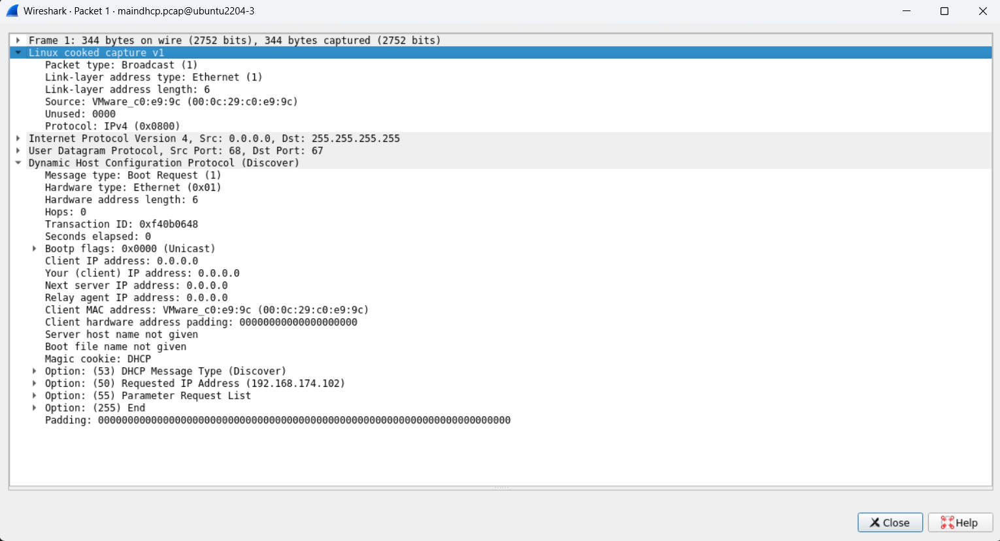
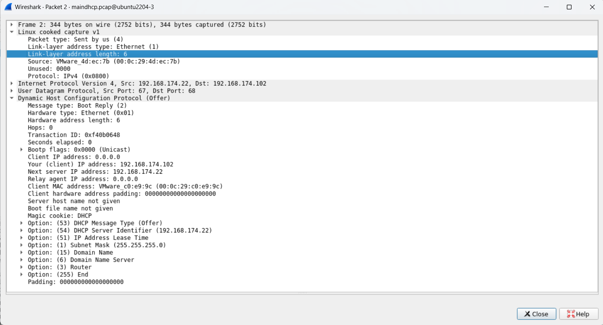
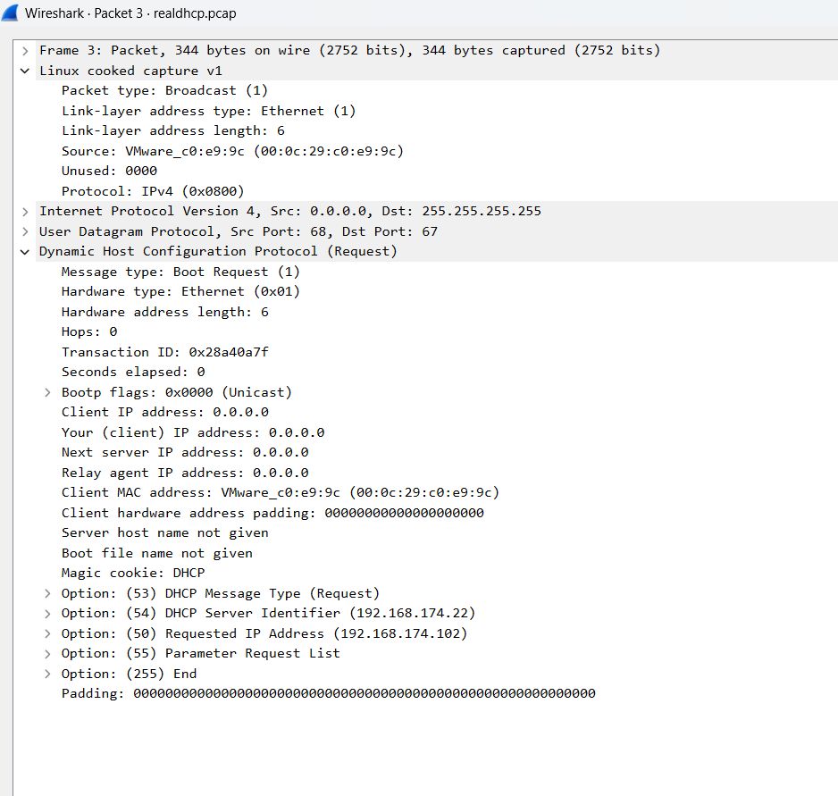
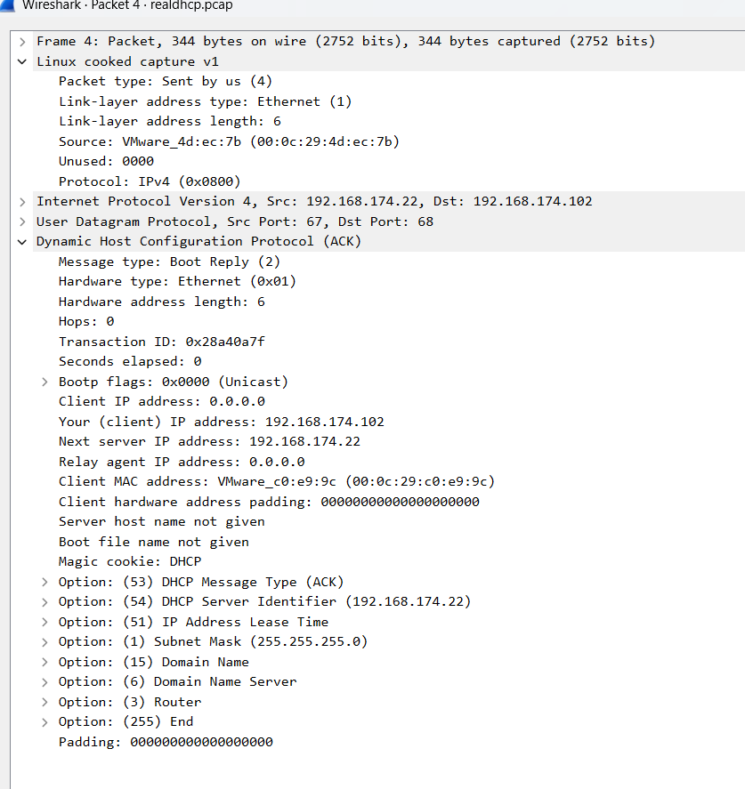

# Capture gói tin DHCP

Ta sử dụng DHCP server là ubuntu và DHCP client là rocky để tạo gói tin về nguyên lý hoạt động của DHCP:

[Tạo gói tin DHCP](https://github.com/Bimmie226/system-intership/blob/main/LuongVN/NETWORK/11.DHCP/docs/config_dhcp_server.md)

Sử dụng wireshark để theo dõi các gói tin dhcp đã được trao đổi

## Kiểm tra gói DHCP discover

Tầng 2: 

- source MAC: `VMware_c0:e9:9c` - Địa chỉ MAC cua máy client(máy xin cấp IP)
- dest MAC: `Broadcast`: gửi tất cả thiết bị trong LAN

Tầng 3: 

- suorce IP: `0.0.0.0` (do client chưa có ip nên ip nguồn sẽ là `0.0.0.0`)
- dest IP: `255.255.255.255` (broadcast toàn mạng -> để tìm DHCP server)

Tầng 4: UDP

- source port: `68` (DHCP client)
- dest port: `67` (DHCP server)

Tầng ứng dụng: DHCP(Discover)

- Đây là gói đầu tiên trong quá trình DORA, client đang tìm kiếm DHCP server
- Đây là broadcast không có IP, chỉ có MAC -> DHCP server sẽ phản hồi bằng gói `Offer`

## Kiểm tra gói DHCP offer

Tầng 2: 

- source MAC: `VMware_4d:ec:7b` (địa chỉ MAC của DHCP server)
- dest MAC: `VMware_c0:e9:9c` (địa chỉ MAC của client)

Tầng 3: 

- source IP: `192.168.174.22` (địa chỉ IP của server)
- dest IP: `192.168.174.102` - IP được đề xuất cho client

Tầng 4: 

- source port: `67` (DHCP server)
- dest port: `68` (DHCP client)

Tầng ứng dụng: DHCP(Offer)

- Message type: Boot reply(2) -> phản hồi từ server
- Your(client) IP address: `192.168.174.102` -> IP được cấp phát cho client
- IP address lease time: thời gian thuê IP
- subnet mask, router, dns, ...

## Kiểm tra gói tin DHCP request 

Tầng 2: 

- source MAC: `VMware_c0:e9:9c` - địa chỉ MAC của DHCP client
- dest MAC: broadcast 

Tầng 3: 

- source IP: `0.0.0.0` -> vì client chưa có IP 
- dest IP: `255.255.255.255` -> gửi broadcast để DHCP server nào gửi offer biết là được chọn 

Tầng 4: 

- source port: `68` -> DHCP client
- dest port: `67` -> DHCP server 

Tầng ứng dụng: DHCP (request)

- Message type: `request` -> DHCP client chọn một offer từ server (gói offer) và gửi lại yêu cầu xác nhận sử dụng IP đó
- Request IP address: IP mà client muốn nhận (do server đề xuất trước đó)
- Parameter Request List: Client yêu cầu các tùy chọn cấu hình từ server (DNS, gateway, lease time, ...)

## Kiểm tra gói tin DHCP ack

Tầng 2: 

- source MAC: `VMware_4d:ec:7b` - địa chỉ MAC của server
- dest MAC: `VMware_c0:e9:9c` - địa chỉ MAC của client

Tầng 3: 

- source IP: `192.168.174.22` - IP của server
- dest IP: `192.168.174.102` - IP được gán cho client

Tầng 4:

- source IP: `67` - DHCP server
- dest IP: `68` - DHCP client

Tầng ứng dụng: DHCP(ack)

- Message type: `ACK` -> DHCP server xác nhận và chính thức cấp phát IP được client chọn trong gói request
- Các DHCP option:
  - IP được cấp
  - IP lease time
  - default gateway
  - DNS server
  - subnet mask