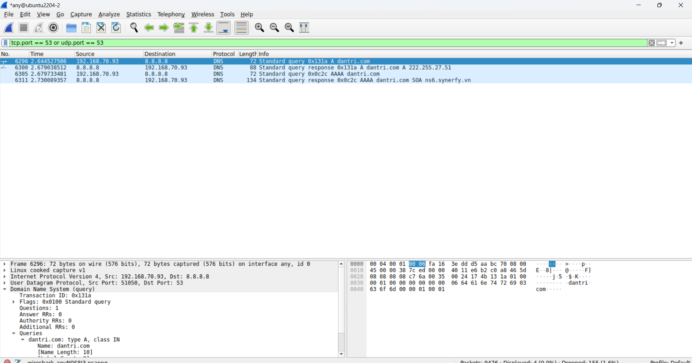
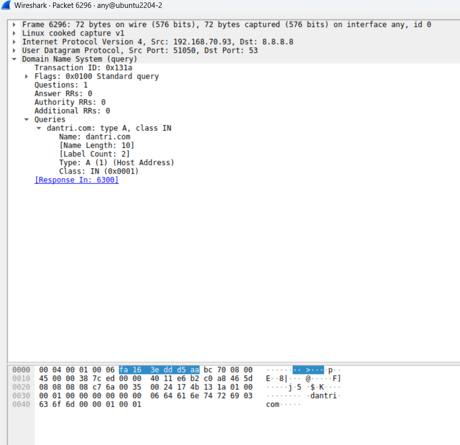
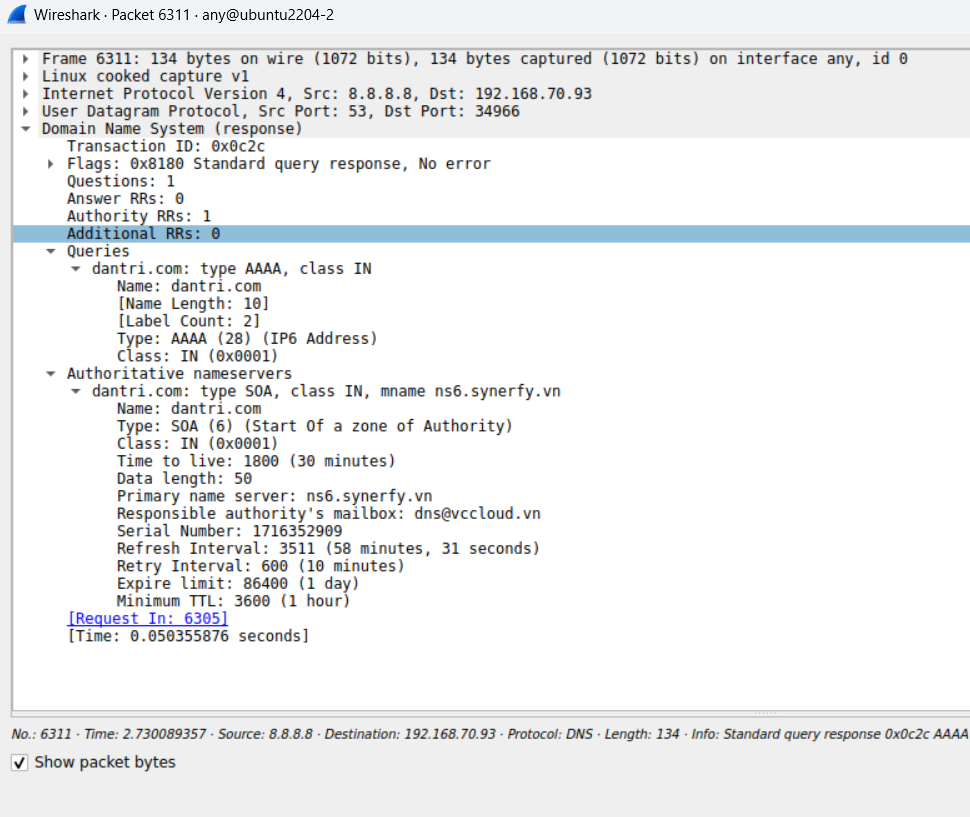

# Capture gói tin DNS
Trên server ta dùng lệnh `nslookup` để biết thông tin về `dantri.com` sau đó ta bắt gói tin DNS trên server này

```bash
nslookup dantri.com
```




Ta nhấp vào gói tin đầu tiên để xem chi tiết quá trình:



Ta thấy:

- source IP: `192.168.70.93` - địa chỉ IP máy client
- dest IP: `8.8.8.8` - địa chỉ IP của google public DNS

- source port: `51050` - port nguồn của client
- dest port: `53` - port DNS chuẩn

- question section: 

    ```yaml
    Name: dantri.com
    Type: A (1)
    Class: IN (0x0001)
    ```

    - Name: tên miền cần phân giải, ở đây là `dantri.com`
    - Type: yêu cầu địa chỉ trả về, ở đây là `IPv4`

Tiếp theo, ta xem gói tin response:


Ta thấy: 

- source IP: `8.8.8.8` - địa chỉ IP của google public DNS
- đest IP: `192.168.70.93` - địa chỉ IP máy client
- source Port: `53` - port chuẩn DNS
- dest Port: `51050` - port nguồn của client
- Answers: Đây là câu trả lời từ google DNS cho ta biết domain `dantri.com` ứng với ip là bao nhiêu. Ở đây IP của `dantri.com` là `222.255.27.51`

Gói tin tiếp theo cũng để hỏi địa chỉ IP của domain, nhưng lúc này client muốn hỏi về địa chỉ IPv6 của `dantri.com`


Các trường trong gói tin giống với IPv4 nhưng khác ở `Type: AAAA` biểu thị cho IPv6


Cuối cùng là gói tin trả về từ google DNS:



Ta thấy:
- Google DNS trả về mã trạng thái là `No error`, nhưng không có bản ghi AAAA nào trong phần Answer, do đó ta biết `dantri.com` không tồn tại địa chỉ `IPv6` nào 
