# Capture gói tin từ Client đến WebServer dùng HTTP/HTTPs
## HTTP
Dùng filter để lọc các gói tin sử dụng HTTP

Nhấp vào gói `28356` để xem chi tiết về gói HTTP request 

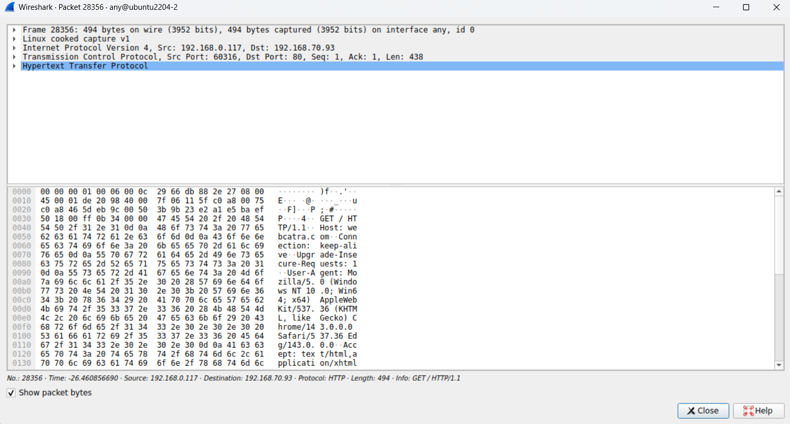

Ở đây, ta nhấp vào `Hypertext Transfer Protocol`:

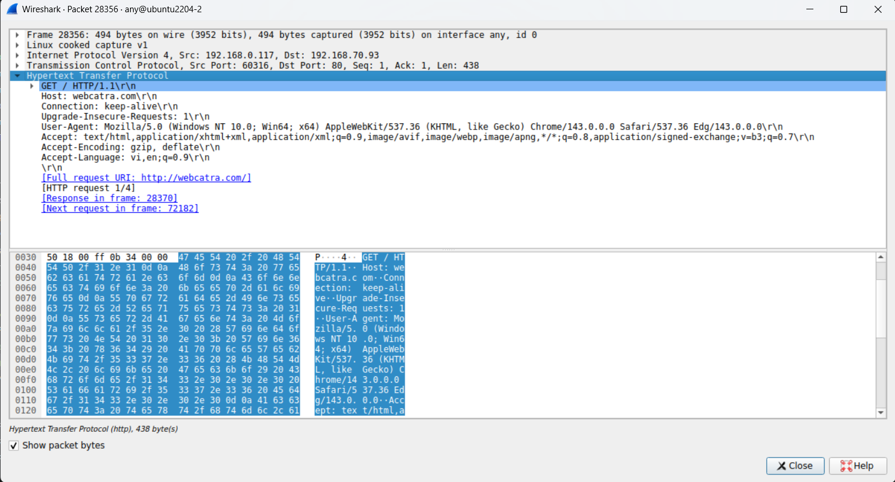

Ta thấy, đây là 1 gói request với method là `GET`, muốn lấy dữ liệu từ `webcatra.com`

Ta quay lại và xem thử gói response với số thứ tự là `28370`

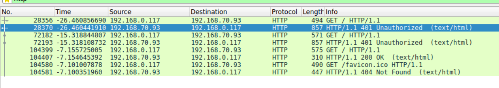

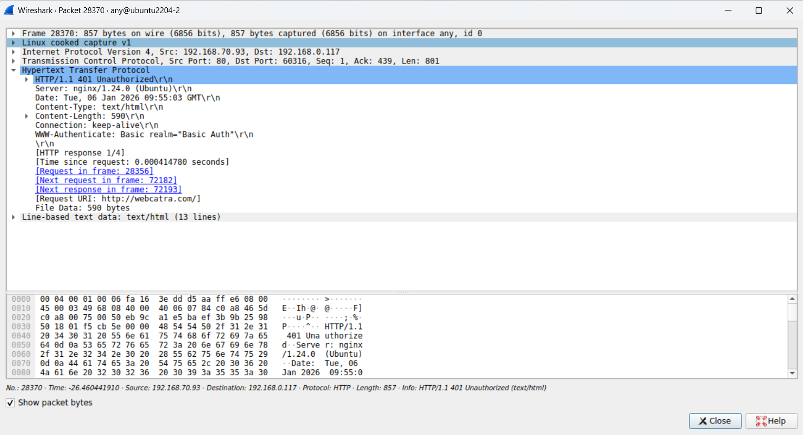

Ta thấy, gói response này có status là `401` cùng với header `www-Authentication` tức là `webcatra.com` yêu cầu nhập user và password theo đúng basic auth

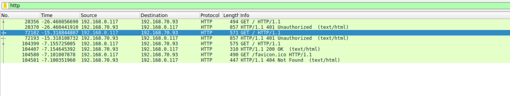

Quay trở lại gói tin http ta thấy với gói `72182` ta nhấp vào để xem chi tiết gói:

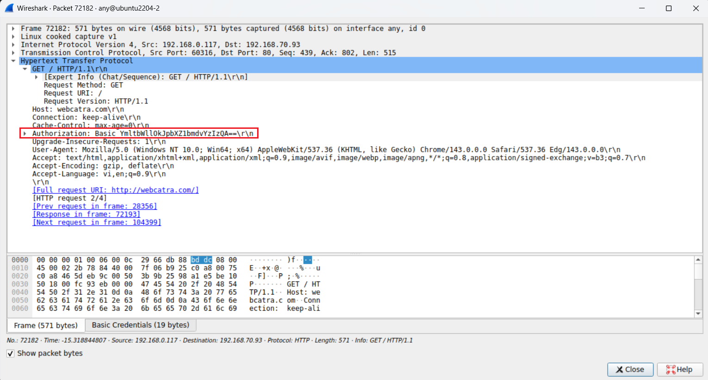

Ở đây ta thấy gói `request` có thêm trường `Authorization` ta nhấp vào để xem thử:

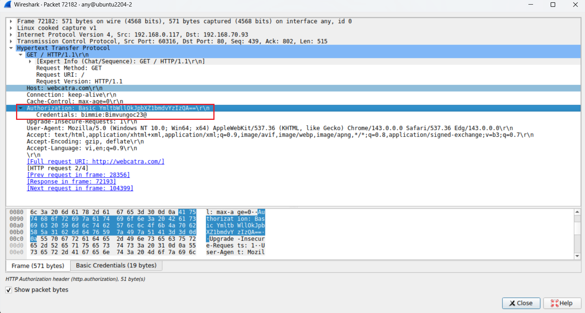

Ta thấy ở đây client đã nhập user: `bimmie` với password: `Bimvungoc23@`. Để biết user và pw này là đúng hay sai ta kiểm tra gói response tiếp theo là gói `72193`

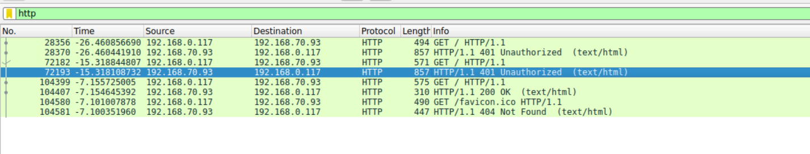

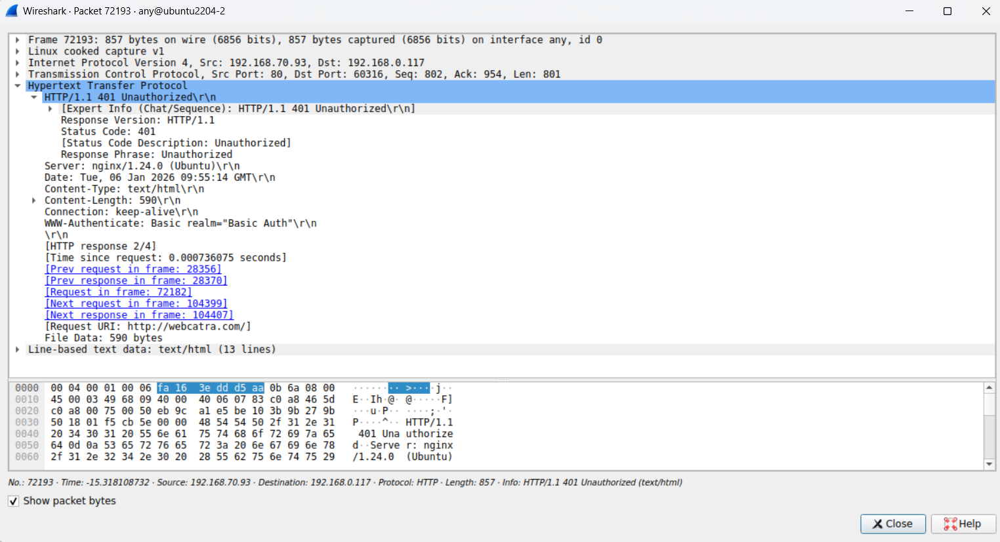

Ta thấy, server vẫn trả về status là `401`, vì vậy với user và pw là `bimmie` và `Bimvungoc23@` không hợp lệ

Ta kiểm tra gói tin tiếp theo `104399`:

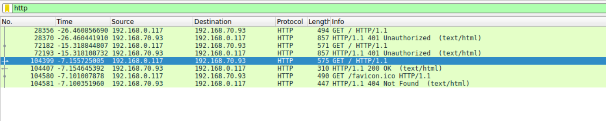

Ta thấy trong gói request lần này trong trường authorization đã có password mới: `Bimvungoc23@2005`

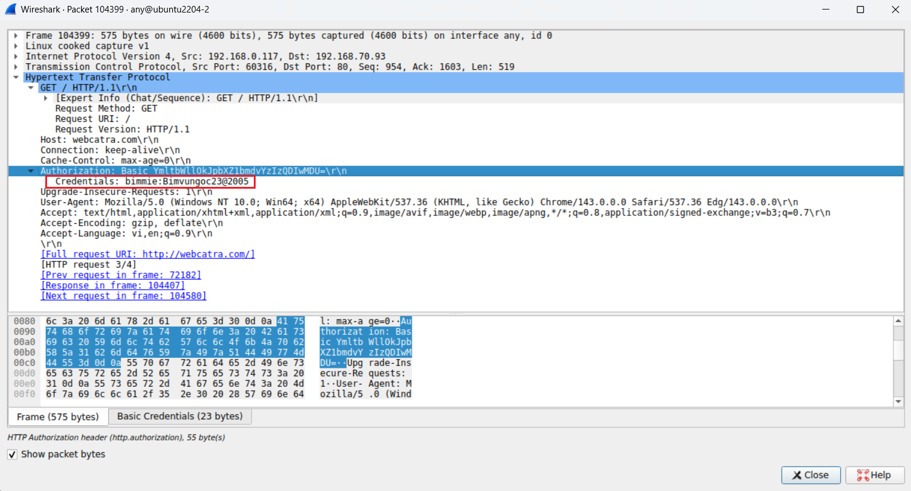

Ta kiểm tra gói request trả về xem với password mới này có đúng hay không?

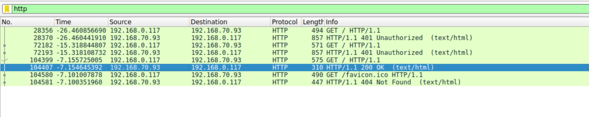

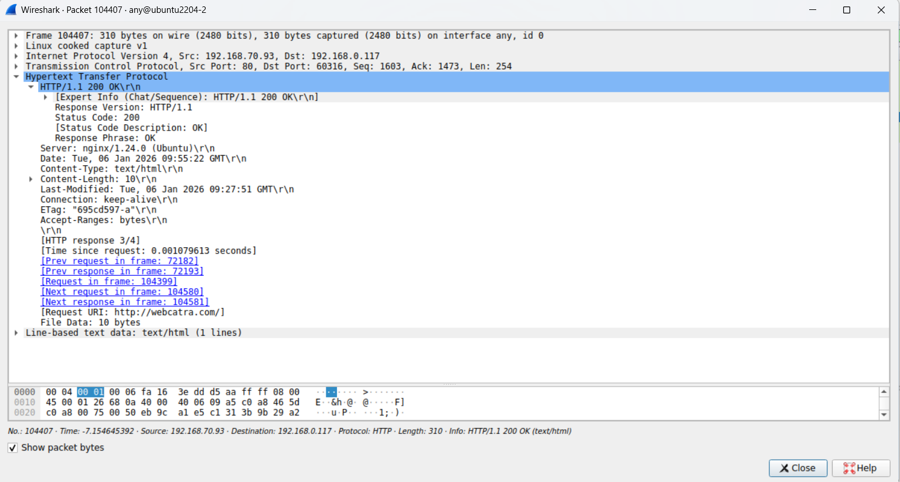

Lúc này mã status đã là `200` tức là password đã đúng

## HTTPs

Để lọc các gói tin sử dụng HTTPs ta filter bằng `tls`

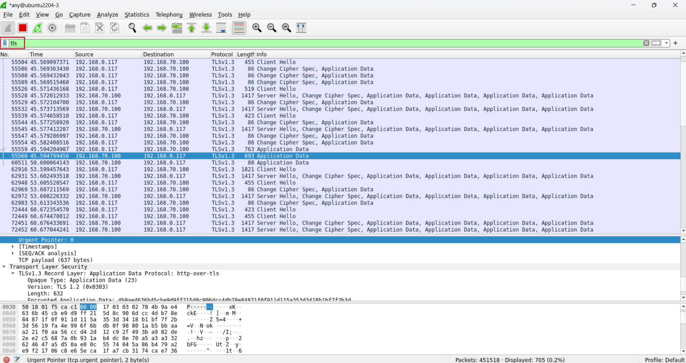

Lúc này ta thấy, các gói tin thể hiện quá trình `client hello` và `server hello`

Sau khi bắt tay xong lúc này client gửi gói tin tuy nhiên khác với HTTP, ở đây các gói tin đã được mã hóa và có thông tin là gói tin `Application Data` 

Khi nhấp vào các gói này, ta thấy thông tin đã được mã hóa hoàn toàn và ta không thể xem được client dùng method `GET`, `POST` hay `PUT`, cũng như không thể thấy server trả về gói có status là `200` hay `404`, user và password cũng được che dấu hoàn toàn

