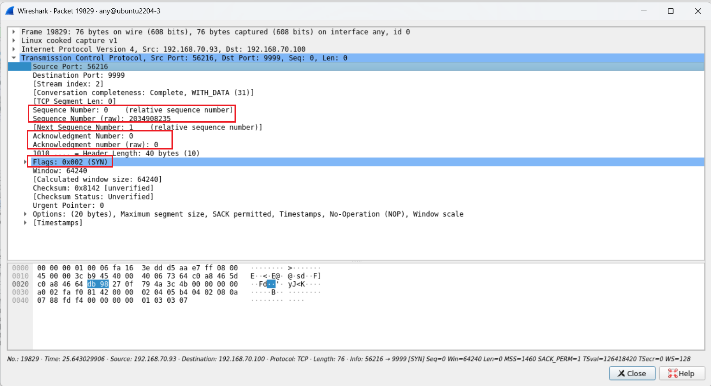
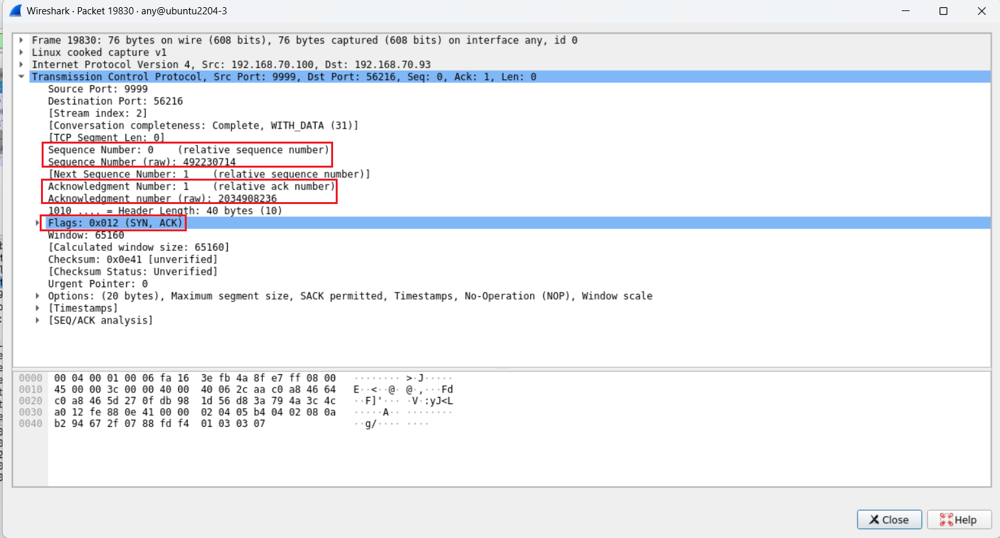
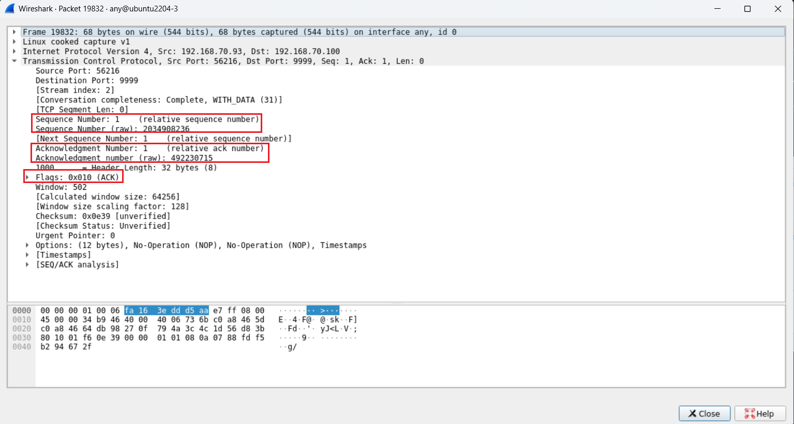
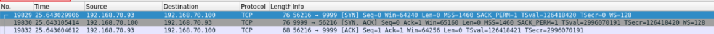
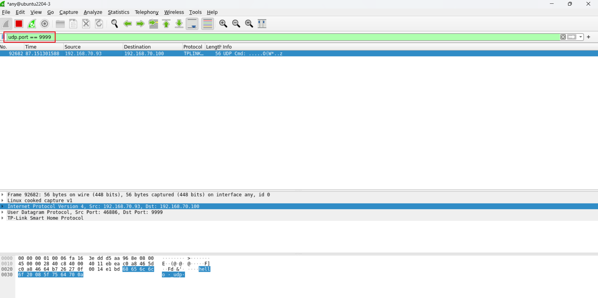
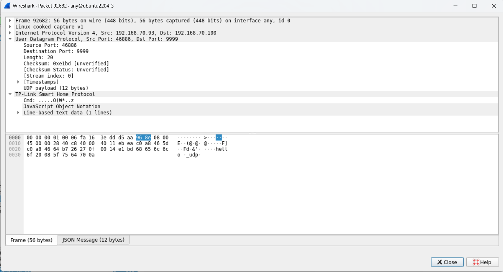

# Capture gói tin TCP và UDP
## TCP
Ở đây ta sẽ tạo 1 gói tin TCP với port là `9999` để lab


Ta để ý 3 gói tin đầu tiên có phần info lần lượt là 3 gói tin `SYN`, `SYN-ACK`, `ACK` 


Ta chọn gói tin số `19829` để xem kỹ gói tin `SYN`:



Ta thấy:
- số `sequence number (raw) = 2034908235` là số mà bên client chọn cho gói `SYN` gửi tới server. 

- Vì là gói SYN nên phần `Acknowledgment Number` sẽ bằng 0 do chưa Ack cái gì

- Trong trường `Flags` chỉ có cờ `SYN` thể hiện đây là gói SYN đầu tiên trong quá trình bắt tay 3 bước 


Tiếp theo ta sẽ xem chi tiết gói tin số `19830` ngay sau gói tin trên:



Ta thấy:

- Trường flags lúc này đã bao gồm 2 cờ `SYN, ACK` thể hiện đây là gói SYN, ACK trong quá trình bắt tay 3 bước
- số `Sequence number` server chọn sẽ là: `492230714`
- Số ACK xác nhận gói SYN từ client gửi về là: `2034908236` đúng bằng `2034908235 + 1` tức là bằng số Sequence của client trong gói SYN đã gửi trước đó cộng thêm 1 

Ta quan sát nốt gói tin tiếp theo số `19832`:



Ta thấy:

- Trường flags lúc này là cờ `ACK` thể hiện đây là gói ACK trong quá tình bắt tay 3 bước
- Số `Sequence number` lúc này thể hiện byte tiếp theo mà client gửi đi sẽ là `2034908236` đúng bằng `2034908235 + 1` tức là byte trước đó client gửi cho server cộng thêm 1 vì SYN đã chiếm 1 sequence number
- Số ACK xác nhận gói SYN-ACK từ server gửi về là: `492230715` đúng bằng với số sequence của gói SYN-ACK mà server đã gửi trước đó cộng thêm 1. Xác nhận đã nhận được gói SYN-ACK từ client

Từ đó, ta thấy quá trình bắt tay 3 bước đã diễn ra thành công 

## Các thông tin đằng sau gói TCP



### Gói 1 - TCP SYN (Client - Server)

```bash
56216 -> 9999 [SYN] Seq=0 Win=64240 Len=0 MSS=1460 SACK_PERM=1 TSval=126418420 TSecr=0 WS=128
```

- `Seq=0`: sequence number của client
- `Win=64240`: Receive window, client thông báo số lượng byte tối đa trước khi cần ACK
- `Len=0`: không có dữ liệu, SYN chỉ thiết lập kết nối
- `MSS=1460`: Maximum Segment Size, size tối đa cho từng segment TCP mà client muốn
- `SACK_PERM=1`: Cho phép Selective ACK, giúp TCP phục hồi mất gói nhanh hơn
- `TSval=126418420`: Timestamp Value 
- `Tsecr=0`: Chưa có timestamp từ server -> để 0
- `WS=128`: Window scale, Window thực = `64240 * 128 ~ 8MB`

### Gói 2 - TCP SYN,ACK (Server -> Client)
```bash
9999 → 56216 [SYN, ACK] Seq=0 Ack=1 Win=65160 Len=0 MSS=1460 SACK_PERM=1 TSval=299607191 TSecr=126418420 WS=128
```

- `Seq=0`: sequence number của server
- `Ack=1`: Xác nhận SYN của client 
- `Win=65160`: Server thông báo số lượng byte tối đa nhận là 65160 byte
- `MSS=1460`: Maximum segment size
- `SACK_PERM=1`: Cho phép Selective ACK, giúp TCP phục hồi mất gói nhanh hơn
- `TSval=299607191`: Timestamp của server
- `TSecr=126418420`: Timestamp của client vừa gửi
- `WS=128`: Server cũng bật window scale

### Gói 3 - TCP ACK (Client -> Server)
```bash
56216 → 9999 [ACK] Seq=1 Ack=1 Win=64128 Len=0 TSval=126418422 TSecr=299607191
```

- `Seq=1`: Client đã dùng Seq=0 cho SYN, nên giờ bắt đầu từ 1
- `Ack=1`: Xác nhận SYN của server
- `Win=64128`: số lượng byte tối đa mà client có thể nhận
- `Len=0`: Chưa gửi dữ liệu
- `TSval=126418422`: Timestamp mới của client
- `TSecr=299607191`: Timestamp của server vừa gửi
## UDP
Ta sẽ tạo 1 gói tin UDP với port `9999` để lab:






Ta thấy chỉ có 1 gói tin duy nhất trong quá trình giao tiếp giữa client và server. UDP không tạo handshake, không ACK, gửi là xong -> chỉ 1 gói

