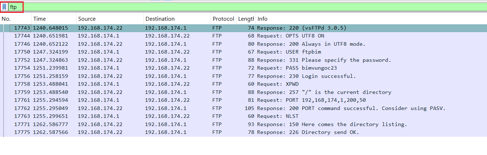
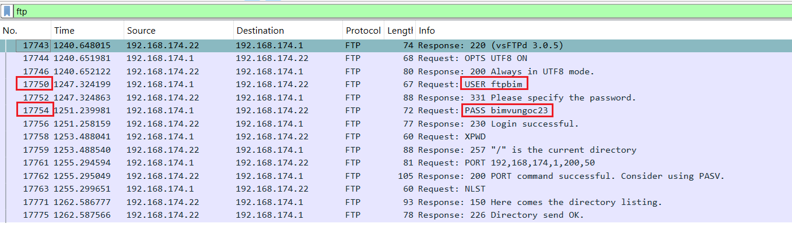
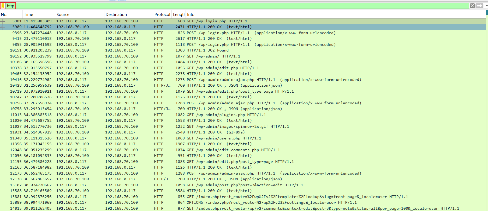
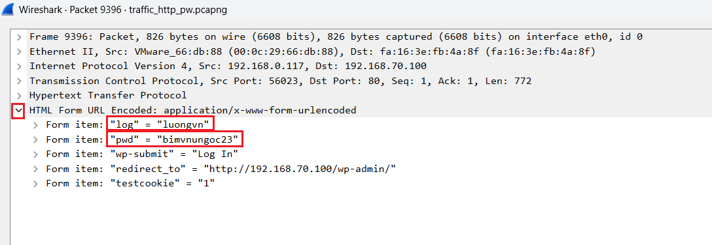
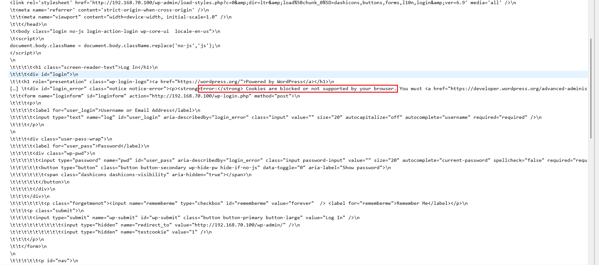
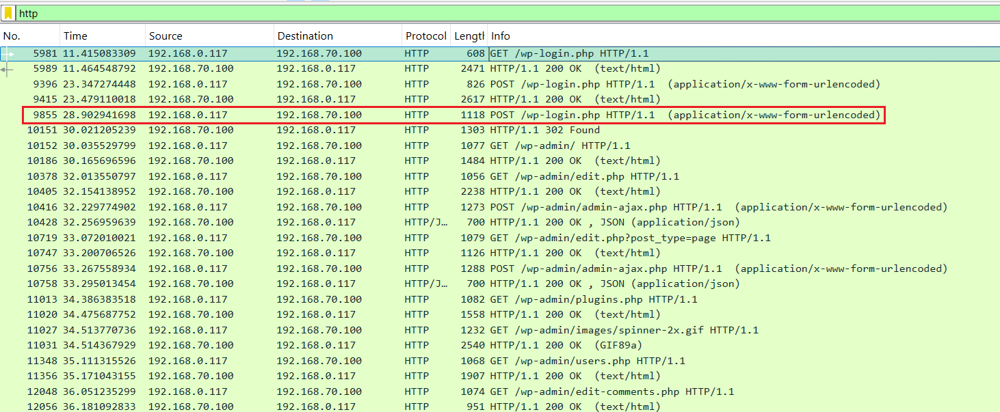
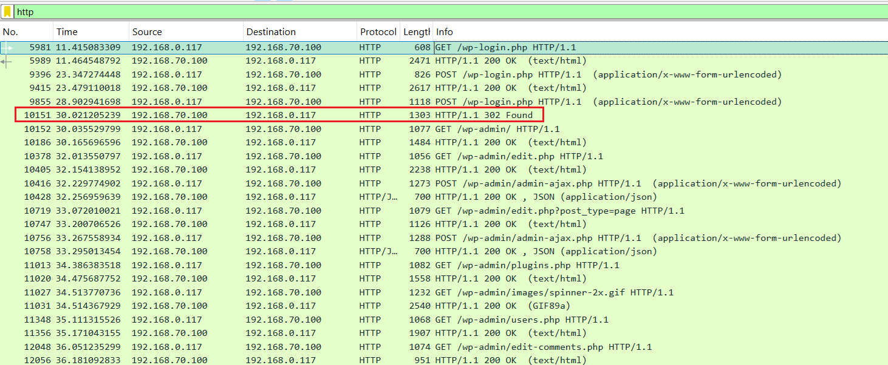
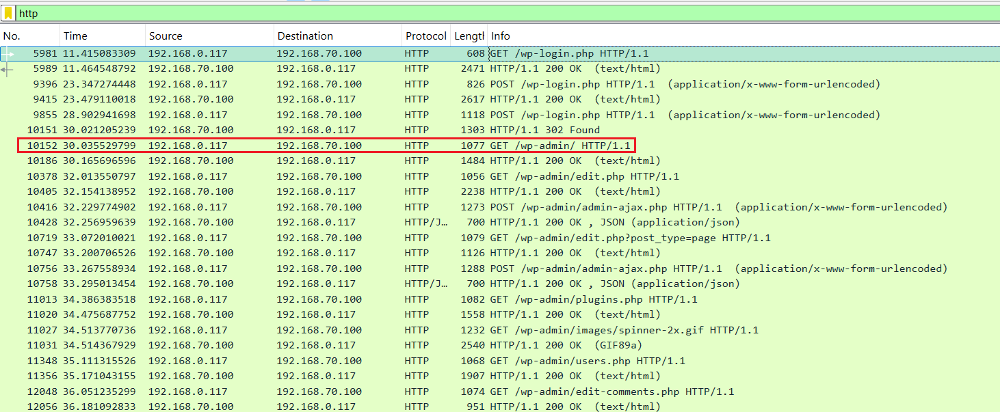
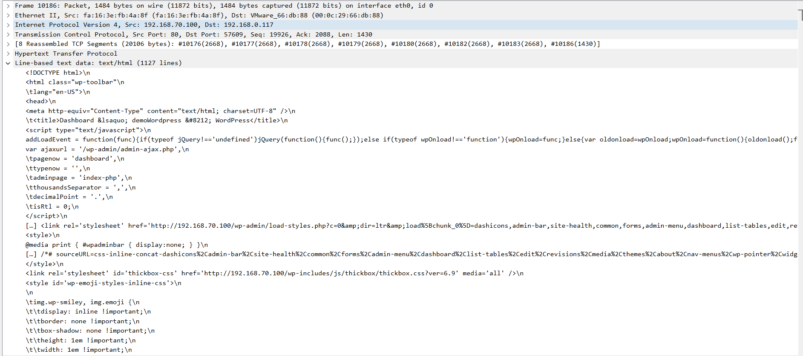

# Sử dụng Wireshark để xem thông tin tài khoản & mật khẩu
## Tìm mật khẩu FTP

Dùng wireshark để lọc ra các gói tin FTP

Ta có thể dễ dàng thấy được user và password trong mục info của 2 gói tin số `17750` và `17754`:

## Tìm mật khẩu HTTP

Dùng wireshark để lọc ra các gói tin HTTP

Vì ta muốn tìm xem password đúng của trang web nên ta sẽ lọc các gói tin có method là `POST` cũng như truy cập vào trang login của 1 website thường có dạng `login` trong tên thư mục

Ví dụ với gói tin sau:

Ta chọn xem phần packet detail và nhấp vào phần mở rộng của HTML Form

Ta có thể thấy rõ tài khoản và mật khẩu mà người dùng vừa nhập 

Ở đây, để kiểm tra xem tài khoản và mật khẩu này là đúng hay sai ta sẽ xem chi tiết gói tiếp theo từ server trả về:

Mặc dù mã trạng thái do server trả về là `200` nhưng để muốn biết mật khẩu có đúng hay không ta sẽ xem phần dữ liệu mà server trả về

Ở đây dữ liệu trả về có thẻ `Error` do đó ta có thể suy ra mật khẩu `bimvungoc23` là không đúng 

Ta tiếp tục quan sát gói tin tiếp theo từ client:

Lúc này trong phần HTML Form ta đã thấy mật khẩu mới do client nhập vào là: `Bimvungoc23@`

Ta kiểm tra gói tin tiếp theo do server trả về để xem mật khẩu mới này có đúng hay không?

Ta thấy mã trạng thái là `302` tức là server Redirect và với trường `location` ta thấy server redirect về: `http://192.168.70.100/wp-admin`

Do đó ta có thể suy luận là tài khoản vs mật khẩu người dùng vừa nhập là tài khoản `admin`

Ta kiểm tra gói tin tiếp theo để chứng minh điều này:

Lúc này ta thấy method đã là `GET` và file cần nhận là `wp-admin` do đó ta biết được tài khoản và mật khẩu trên là của `admin`

Kiểm tra thông tin trả về từ server:

Mã trạng thái lúc này đã là `200`, ta kiểm tra chi tiết thông tin gửi về:

Ta không thấy thẻ `Error` -> dữ liệu đã hoàn toàn chính xác