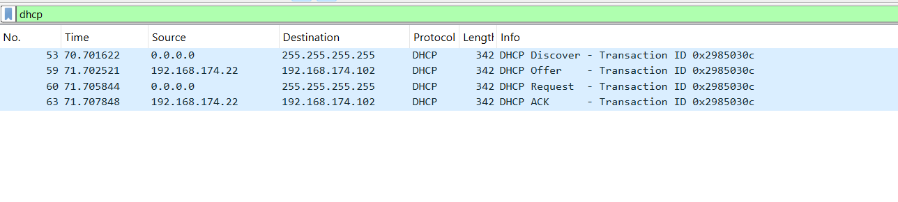
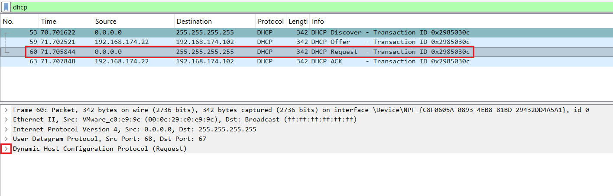
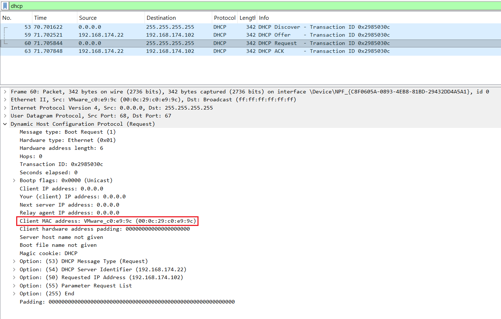
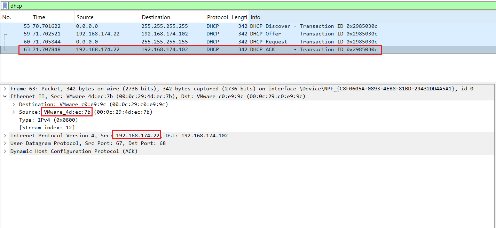
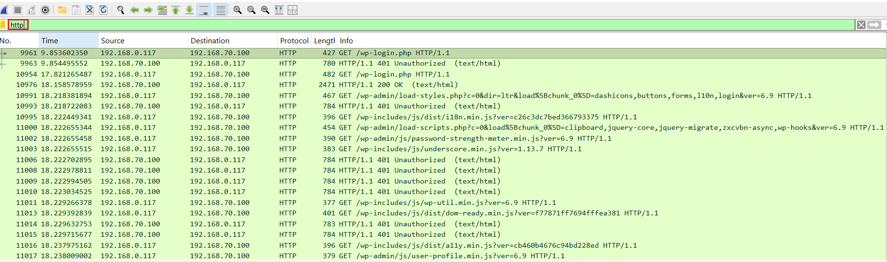
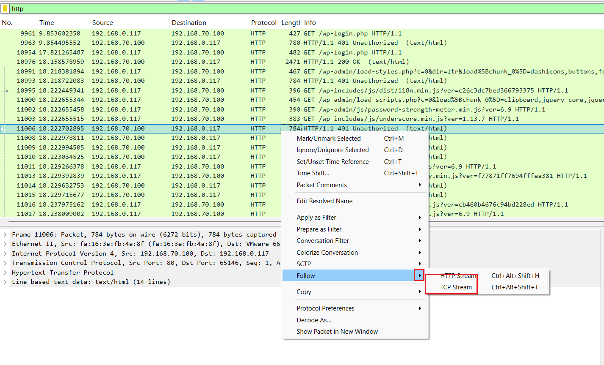
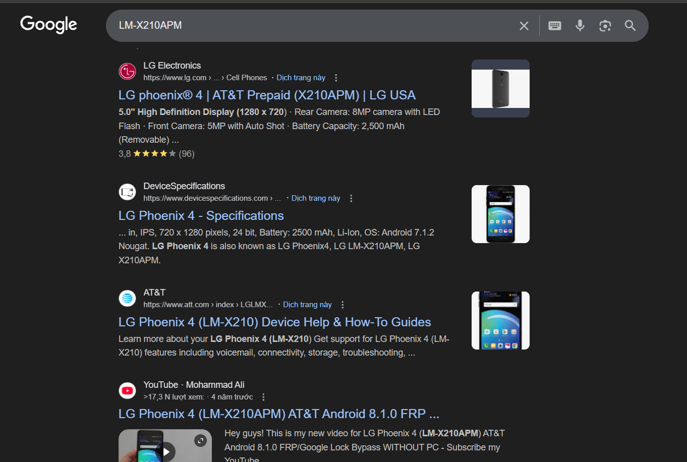

# Sử dụng Wireshark để xác định máy chủ và người dùng
## Thông tin máy chủ từ traffic DHCP
Bất kỳ máy chủ nào tạo traffic trong mạng đều có 3 số nhận dạng là: `địa chỉ MAC`, `địa chỉ IP`, `hostname`

Trong hầu hết các trường hợp, cảnh báo cho hoạt động đáng ngờ dựa trên địa chỉ IP

Ta sẽ quan sát thông tin từ các gói DHCP sau đây:

Chọn 1 gói tin DHCP request, xem phần packet details và nhấp vào phần mở rộng cho giao thức Dynamic Host Configuration Protocol

Ở đây ta có thể thấy được địa chỉ MAC của client, tuy nhiên ta sẽ không thấy option 12 về hostname của client, lý do là trong DHCP client ta chưa cấu hình client gửi hostname

Để xem thông tin về IP và địa chỉ MAC của server, ta sẽ xem chi tiết vào gói ACK 

Ta thấy được địa chỉ MAC nguồn(địa chỉ MAC DHCP server), và địa chỉ IP của DHCP server 

## Mô hình thiết bị và hệ điều hành từ lưu lượng truy cập HTTP
Chuỗi user-agent từ các header trong traffic HTTP có thể tiết lộ hệ điều hành. Nếu lưu lượng HTTP đến từ thiết bị Android, ta cũng có thể xác định nhà sản xuất và kiểu thiết bị

Sử dụng filter để lọc ra các gói tin `HTTP`

Nhấp chuột phải vào 1 trong các gói tin sau đó chọn `Follow` -> `TCP Stream`

Từ trường `User-Agent` ta thấy: client truy cập từ `firefox`, hệ điều hành: `Windows 10 hoặc 11`, hệ điều hành `64-bit`, CPU kiến trúc `x86-64`

**Một số phiên bản Window thường gặp:**

| Thông số        | Phiên bản          |
| --------------- | ------------------ |
| Windows NT 5.1  | Windows XP         |
| Windows NT 6.0  | Windows Vista      |
| Windows NT 6.1  | Windows 7          |
| Windows NT 6.2  | Windows 8          |
| Windows NT 6.3  | Windows 8.1        |
| Windows NT 10.0 | Windows 10 hoặc 11 |

Làm tương tự với 1 packet từ 1 máy Android:

Ta thấy: client truy cập web với phiên bản android 7.1.2 và mã thiết bị là: `LM-X210APM`

Ta có thể tra tên máy bằng mã trên bằng `google.com`:

Như vậy ta có thể biết thiết bị truy cập vào server là máy: `LG phoneix 4`

# Nguồn tham khảo

https://github.com/hungviet99/THUC-TAP/blob/master/Wireshark/docs/Su-dung-wireshark-de-phat-hien-thong-tin-host-tu-cac-traffic-trong-mang.md