# WIRESHARK
## Wireshark là gì?
Wireshark là một ứng dụng để bắt (capture), phân tích và xác định các vấn đề liên quan đến network như: gói tin, kết nối chậm, hoặc các truy cập bất thường. Phần mềm này cho phép quản trị viên hiểu sâu hơn các Network Packets đang chạy trên hệ thống để có thể xác định được cácc nguyên nhân chính xác gây ra lỗi.

## Cách sử dụng wireshark
Kích đúp vào 1 giao diện nào đó để xem chi tiết lưu lượng các gói tin trên giao diện đó. 

Ví dụ: ta xem lưu lượng trên giao diện `ens3`:

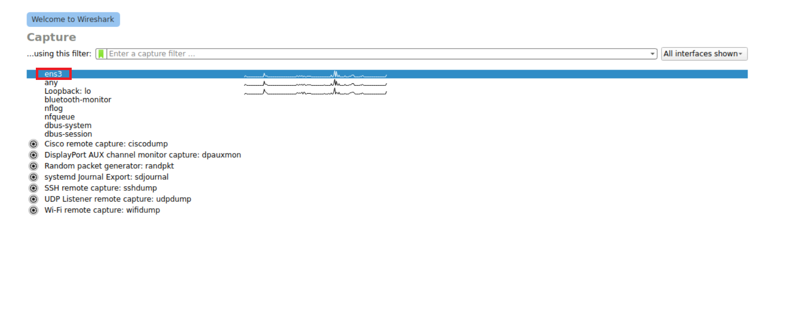

Sau đó lưu lượng các gói tin qua `ens3` sẽ hiển thị như sau:

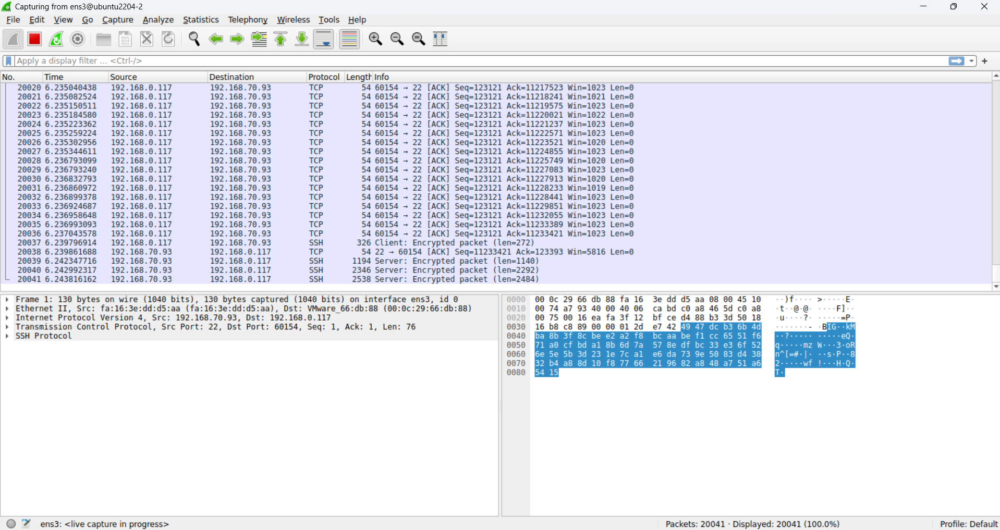

Ta thấy giao diện wireshark được hiển thị với 3 phần chính:

**1. Packet list:** Hiển thị các gói tin bắt được trên 1 card mạng, Ở phần này mỗi gói tin là 1 dòng. Các gói tin được đánh số theo thứ tự

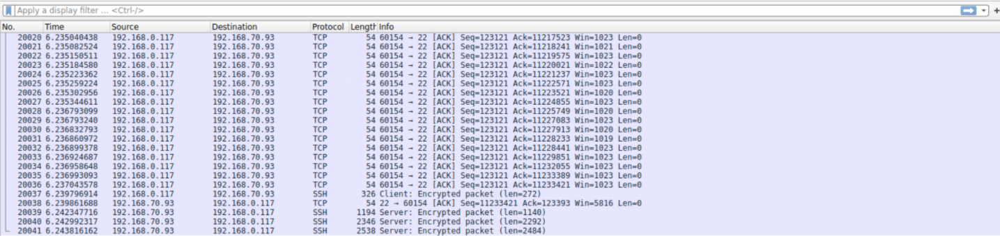

**2. Packet details:** Hiển thị thông tin chi tiết của 1 gói tin được chọn:

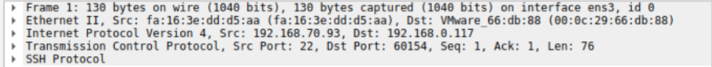

**3. Packet bytes:** Hiện thị dữ liệu thô của gói tin dưới dạng hex hoặc ASCII, giúp xem chi tiết nội dung thực tế, tìm kiếm thông tin nhạy cảm như (mật khẩu) trong các giao thức không mã hóa như (HTTP) 

- Ví dụ trong 1 gói tin HTTP response:

    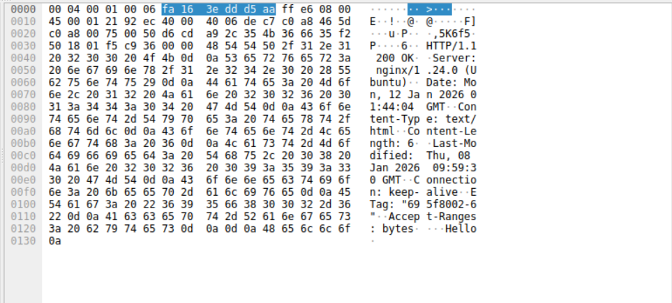

- Ta có thể thấy thông tin về status trả về: `200`, các header, và dữ liệu trả về `hello`

Ta có thể lưu lại lưu lượng hiện tại bằng cách nhấp vào nút đỏ trên thanh công cụ:

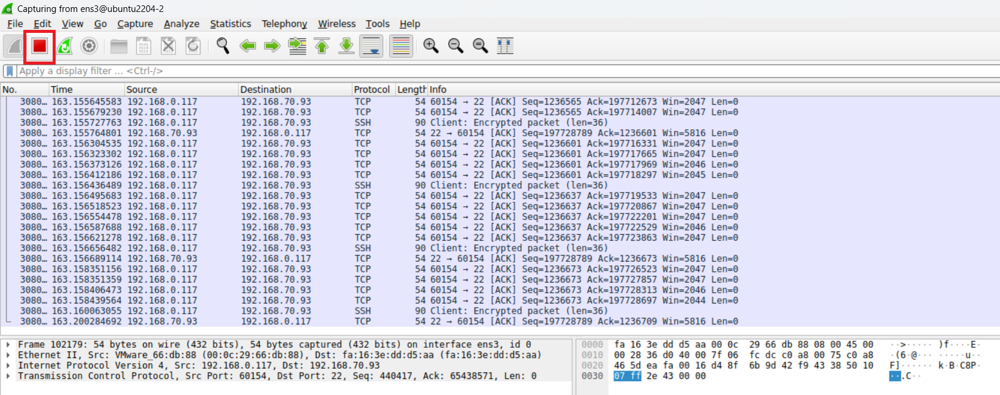

Sau đó để lưu, ta chọn vào `file -> save`. Lưu lượng những gói tin này sẽ lưu dưới dạng file `.pcap`

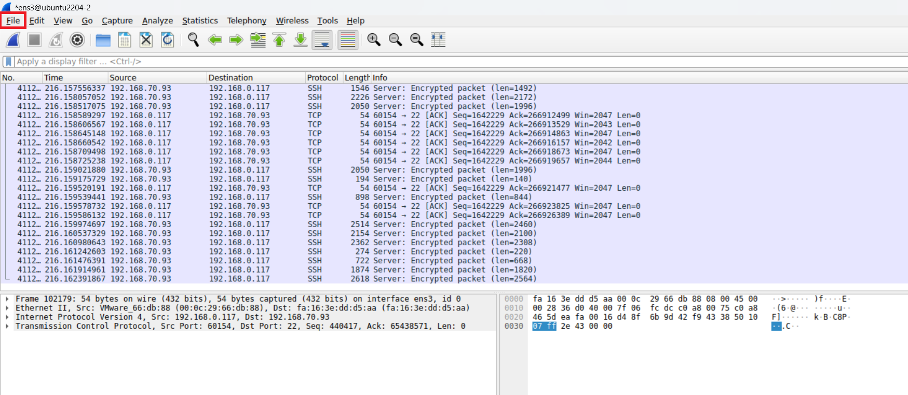

Để xem 1 file có sẵn ta chọn `file -> open` và chọn file `.pcap` 

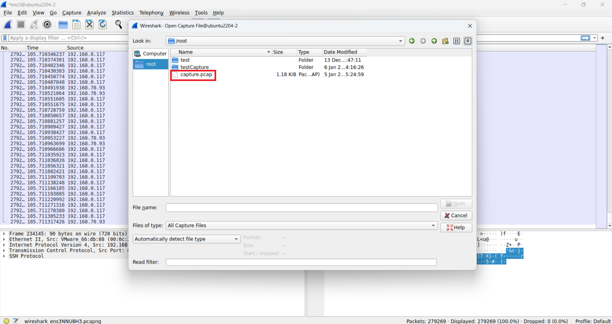

Ở đây, ta chọn xem file `capture.pcap` đã có sẵn trên máy

## Ý nghĩa về màu của các gói tin trong wireshark

Muốn xem ý nghĩa màu của các gói tin ta làm như sau: `chọn view -> Coloring Rules`

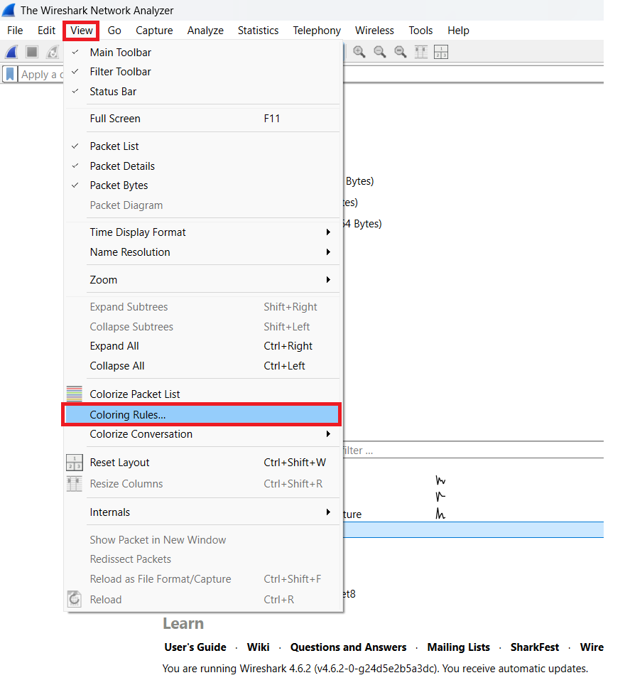

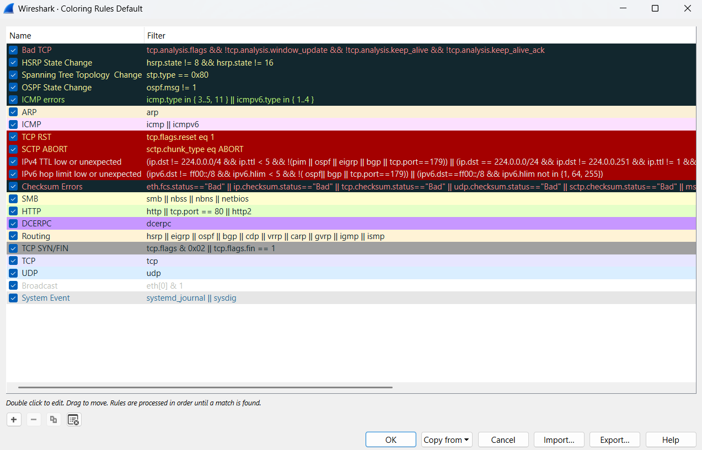

- **Nền đỏ, chữ vàng** - TCP RST / SCTP ABORT

    

    - Kết nối bị đóng cưỡng bức 
- **Nền đen, chữ đỏ cam** - Bad TCP

    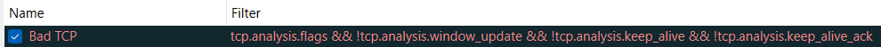

    - `tcp.analysis.flags`: cờ này được bật khi gói TCP thuộc nhóm bất thường

        | Tên nhóm bất thường | Ý nghĩa                                                   |
        | ------------------- | --------------------------------------------------------- |
        | Retransmission      | Gửi lại 1 segment TCP vì không nhận được ACK hoặc timeout |
        | Out of order        | Segmment đến không đúng thứ tự                            |
        | Zero Window         | Server hết buffer, yêu cầu không gửi nữa                  |

    - `!tcp.analysis.window_update`: không phải là window update
    - `!tcp.analysis.keep_alive`: Không phải là tcp keep alive
    - `!tcp.analysis.keep_alive_ack`: không phải là các gói trả lời cho tcp keep alive

    - **Tóm lại:** Chỉ tô màu những gói tin TCP mà wireshark đánh giá là có vấn đề nhưng KHÔNG tô: `window update`, `keep-alive`, `ACK của keep alive`
- **Nền đen, chữ xanh** - ICMP errors

    

    - Destination Unreachable, Time Exceeded
- **Nền đỏ, chữ trắng** - TTL/hop limit thấp

    
    
- **Nền màu da nhạt, chữ đen** - ARP

    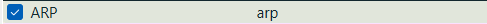

- **Nền màu da đậm, chữ đen** - Routing

    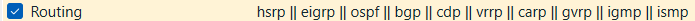

- **Nền hồng nhạt, chữ đen** - ICMP

    

- **Nền xanh lá nhạt, chữ đen** - HTTP

    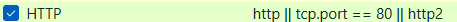

- **Nền tím nhạt, chữ đen** - TCP

    

- **Nền xanh dương nhạt, chữ đen** - UDP

    

- **Không màu** - broadcast

    

- **Nền xám, chữ đen** - TCP SYN/FIN

    

## Sử dụng filter để lọc các gói tin
### Chỉ bắt các gói có IP trùng khớp 
- Bắt các gói tin có source ip là `192.168.70.93`

    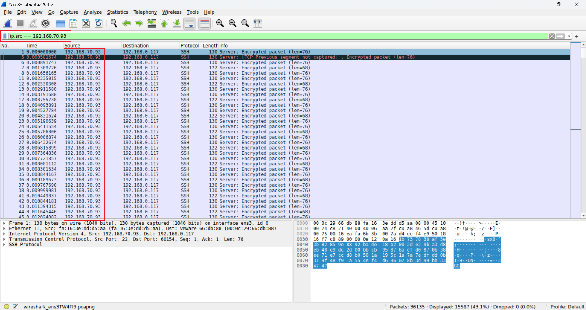

- Bắt các gói tin có dest ip là `192.168.70.93`

    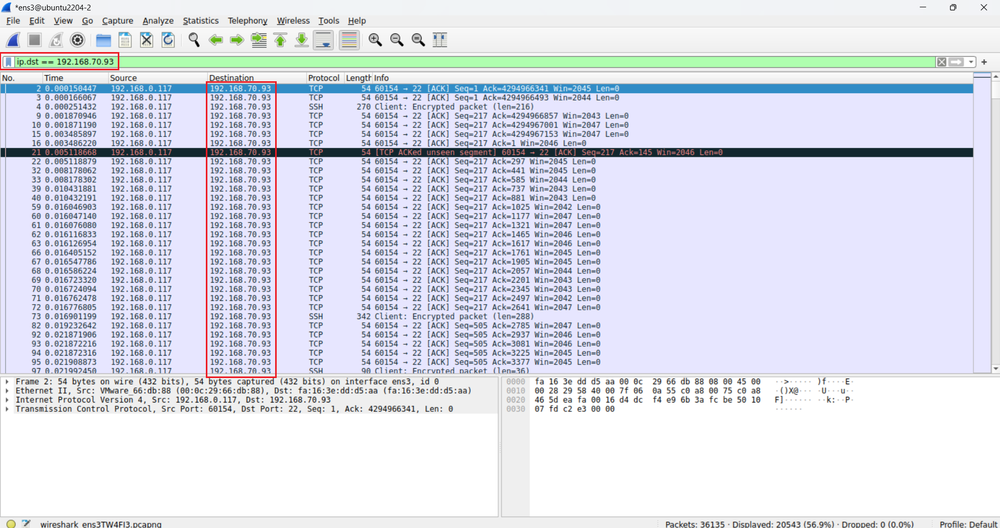

- Bắt các gói tin có cả source ip là `192.168.70.93` và dest ip là `192.168.0.117`

    

### Chỉ bắt các gói tin có IP khác với 1 IP nào đó
- Bắt các gói tin có source ip khác ip `192.168.70.93`

    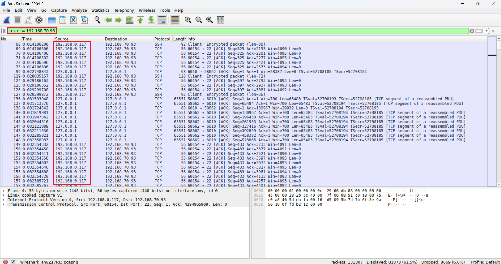

### Chỉ bắt các gói có port hoặc giao thức trùng khớp
- Bắt các gói tin có TCP port là `80` 

    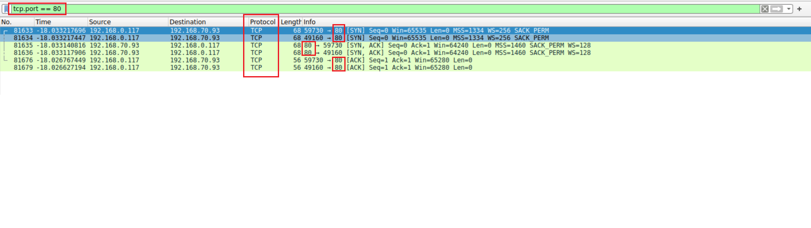

- Bắt các gói tin dùng `ssh` 

    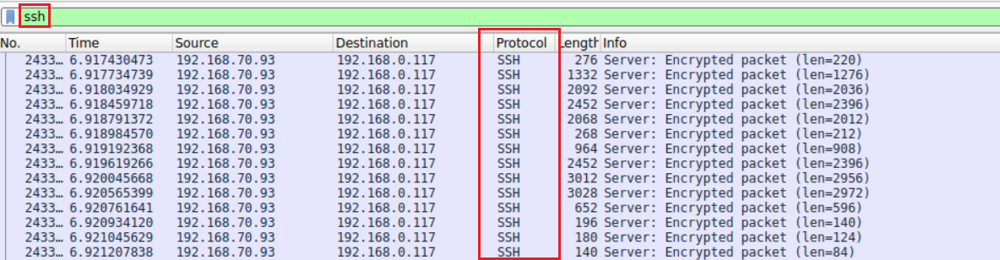

- Bắt các gói tin có source port là `80`

    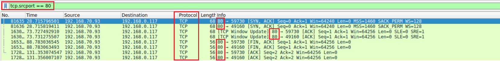

- Bắt các gói tin có dest port là `80`

    