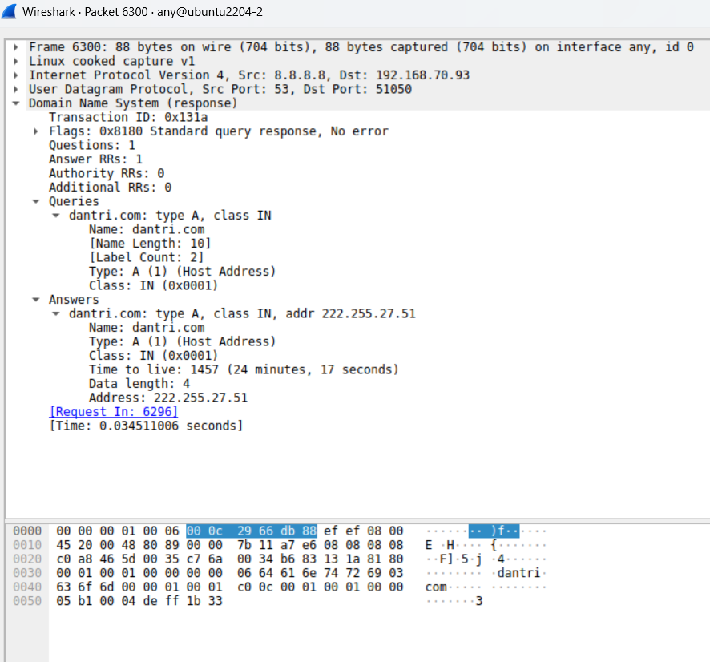
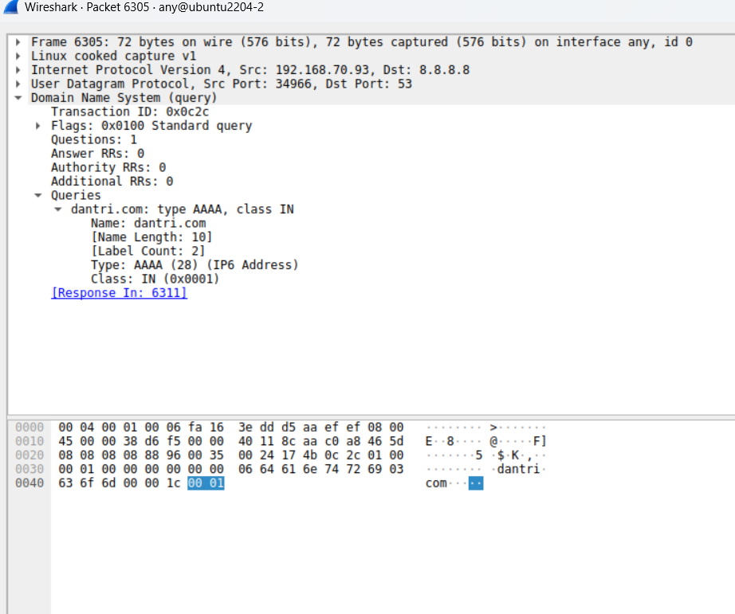
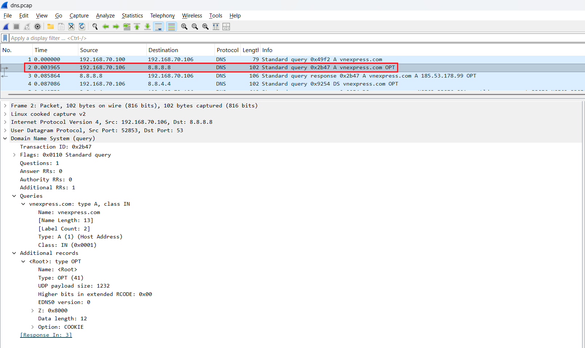
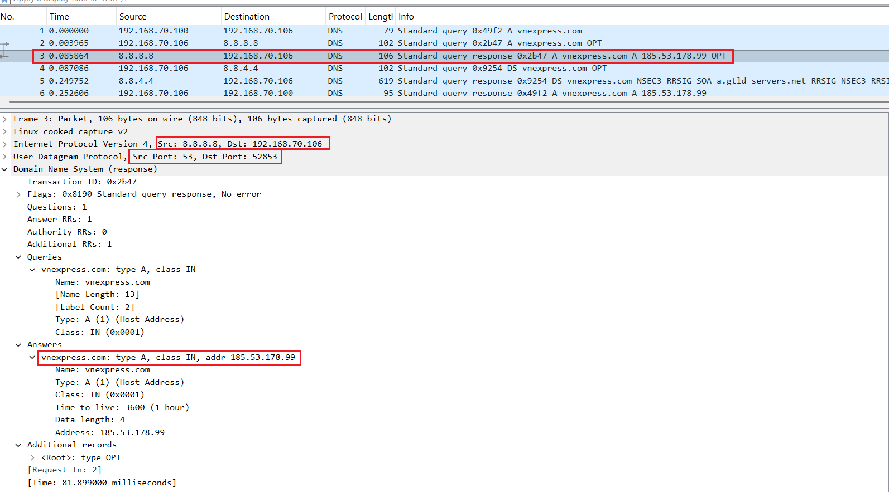

# Capture gói tin DNS
## Capture gói tin ở Client 
Trên server ta dùng lệnh `nslookup` để biết thông tin về `dantri.com` sau đó ta bắt gói tin DNS trên server này

```bash
nslookup dantri.com
```


Ta nhấp vào gói tin đầu tiên để xem chi tiết quá trình:


Ta thấy:

- source IP: `192.168.70.93` - địa chỉ IP máy client
- dest IP: `8.8.8.8` - địa chỉ IP của google public DNS

- source port: `51050` - port nguồn của client
- dest port: `53` - port DNS chuẩn

- question section: 

    ```yaml
    Name: dantri.com
    Type: A (1)
    Class: IN (0x0001)
    ```

    - Name: tên miền cần phân giải, ở đây là `dantri.com`
    - Type: yêu cầu địa chỉ trả về, ở đây là `IPv4`

Tiếp theo, ta xem gói tin response:




Ta thấy: 

- source IP: `8.8.8.8` - địa chỉ IP của google public DNS
- đest IP: `192.168.70.93` - địa chỉ IP máy client
- source Port: `53` - port chuẩn DNS
- dest Port: `51050` - port nguồn của client
- Answers: Đây là câu trả lời từ google DNS cho ta biết domain `dantri.com` ứng với ip là bao nhiêu. Ở đây IP của `dantri.com` là `222.255.27.51`

Gói tin tiếp theo cũng để hỏi địa chỉ IP của domain, nhưng lúc này client muốn hỏi về địa chỉ IPv6 của `dantri.com`



Các trường trong gói tin giống với IPv4 nhưng khác ở `Type: AAAA` biểu thị cho IPv6


Cuối cùng là gói tin trả về từ google DNS:


Ta thấy:
- Google DNS trả về mã trạng thái là `No error`, nhưng không có bản ghi AAAA nào trong phần Answer, do đó ta biết `dantri.com` không tồn tại địa chỉ `IPv6` nào 

## Capture gói tin ở DNS server
Ta có mô hình sau:

- DNS server: `192.168.70.106`
- client: `192.168.70.100` 

Ta sẽ xem gói tin di chuyển khi từ client muốn xin ip của domain `vnexpress.com` là như thế nào:


Ta xem chi tiết vào gói tin số 1:


Đây là gói đầu tiên trong quá trình hỏi đệ quy của client. Ta thấy:
- source IP: `192.168.70.100` - địa chỉ IP của máy client
- dest IP: `192.168.70.106` - địa chỉ IP của DNS server
- source Port: `48988` - địa chỉ port của client
- dest Port: `53` - địa chỉ port mặc định của dịch vụ DNS
- Queries: Đây là trường truy vấn domain: Ta thấy client yêu cầu địa chỉ IPv4 (Type: A) cho domain là `vnexpress.com`

Tiếp theo là gói tin số 2:



Do trong cache của DNS-server không lưu trữ thông tin về `vnexpress.com` nên lúc này DNS-server sẽ tiếp tục đệ quy để hỏi ở google DNS 

- source IP: `192.168.70.106` - địa chỉ IP của DNS-server
- dest IP: `8.8.8.8` - địa chỉ IP của google DNS
- source port: `52853` - địa chỉ port của DNS-server
- dest port: `53` - địa chỉ port mặc định của dịch vụ DNS
- Queries: DNS-server tiếp tục hỏi google DNS về địa chỉ IP của `vnexpress.com`

Tiếp theo là gói tin số 3:



Đây là gói tin mà google DNS trả lời địa chỉ ip của `vnexpress.com` cho DNS-server

- source IP: `8.8.8.8` - địa chỉ IP của google DNS
- dest IP: `192.168.70.106` - địa chỉ IP của DNS-server
- source Port: `53` - port DNS
- dest Port: `52853` - port của DNS-server
- Answers: Là câu trả lời của google DNS về ip của domain `vnexpress.com`, ở đây ta thấy là: `185.53.178.99` -> lúc này DNS-server đã biết về IP của domain `vnexpress.com`

Tiếp theo là gói tin số 4:


Mặc dù lúc này DNS-server đã biết được thông tin của `vnexpress.com` nhưng nó cần kiểm tra xem thông tin này có chính xác hay không? - Đây là bước xác thực chữ ký số để đảm bảo dữ liệu không bị giả mạo

- source IP: `192.168.70.106` - địa chỉ IP của DNS-server
- dest IP: `8.8.4.4` - địa chỉ IP của google DNS
- source Port: `34348` - port của DNS-server
- dest Port: `53` - port DNS
- Queries: Lúc này Type không phải là `A` để lấy địa chỉ IP nữa mà là `DS: Delegation Signer(RFC 4034)` - yêu cầu thông tin chữ ký ủy quyền từ zone cha (.com) cho zone con (vnexpress.com) -> DNS-server muốn lấy thông tin chữ ký ủy quyền của `vnexpress.com` trong zone `.com`

Tiếp theo là gói tin số 5: 


Đây là gói tin DNS response từ Google DNS về DNS-server trả lời cho yêu cầu của gói tin số 4

- source IP: `8.8.4.4` - địa chỉ IP củ google DNS
- dest IP: `192.168.70.106` - địa chỉ IP của DNS-server
- source Port: `53` - port DNS
- dest Port: `34348` - port của DNS-server
- authority section: Đây là phần cung cấp thông tin để chứng minh tính xác thực (hoặc thiếu DS một cách hợp lệ)
- mặc dù `vnexpress.com` không có DS record trong zone `.com` nhưng google DNS vẫn trả response an toàn và xác thực được nhờ `DNSSEC: Domain Name System Security Extensions`:
  - Client có thể tin tưởng rằng "không có DS" là sự thật, không phải bị attacker giả mạo.


Tiếp theo là gói tin số 6: 


Đây là gói tin cuối cùng do DNS-server gửi cho client về thông tin của `vnexpress.com`
- source IP: `192.168.70.106` - địa chỉ IP của DNS-server
- dest IP: `192.168.70.100` - địa chỉ IP của client
- source Port: `53` - port DNS
- dest Port: `48988` - port của client 
- Answers: Đây là câu trả lời của DNS-server cho client: địa chỉ IP của `vnexpress.com` là `185.53.178.99`

