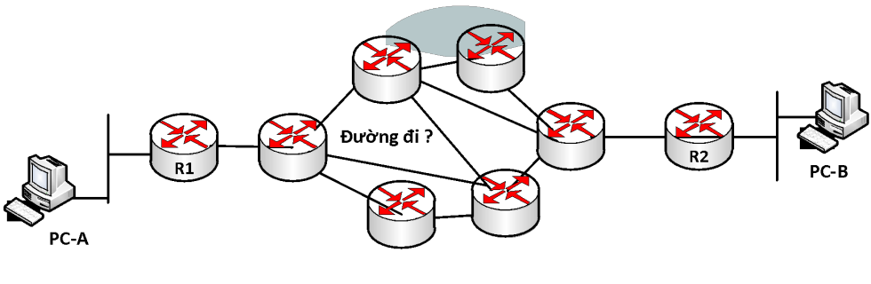
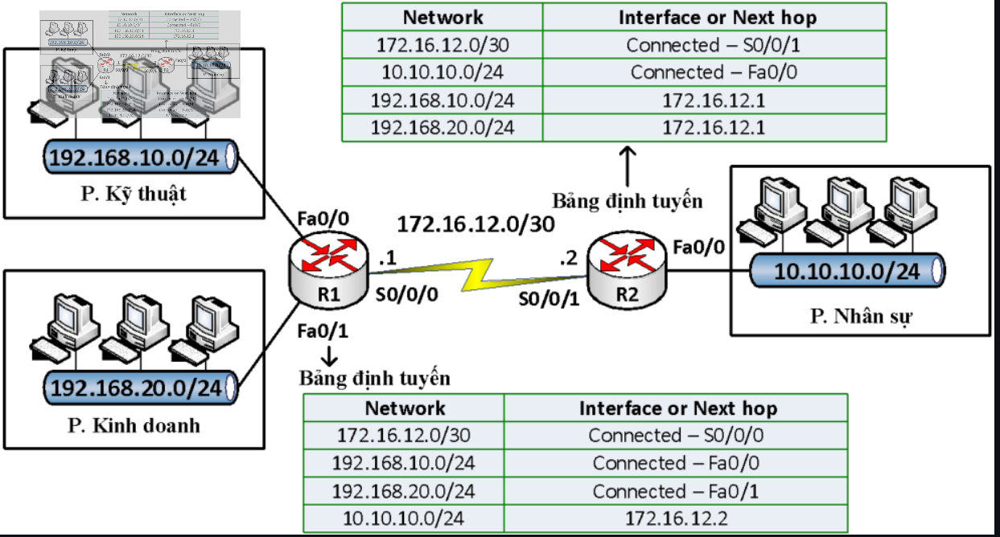
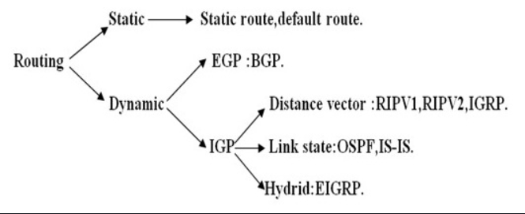
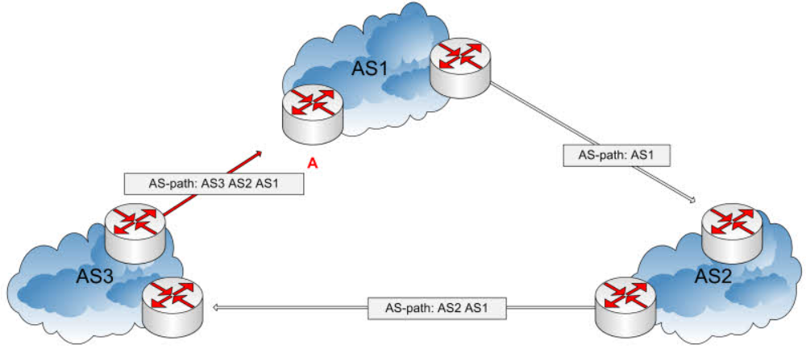

# Tìm hiểu về Routing
## 1. Routing
### 1.1 Thế nào là routing
Định tuyến là phương thức mà Router(bộ định tuyến) hay PC(thiết bị mạng) dùng để chuyển các gói tin đến địa chỉ đích một cách tối ưu nhất, nghĩa là chỉ ra hướng và đường đi tốt nhất cho gói tin

Router thu thập và duy trì các thông tin định tuyến để cho phép truyền và nhận các dữ liệu. Quá trình Routing dựa vào thông tin trên bảng định tuyến (Routing table), là bảng chứa các lộ trình nhanh và tốt nhất đến các mạng khác nhau trên mạng, để hướng các gói dữ liệu đi một cách hiệu quả nhất

Routing table là một dạng database cần thiết để tìm đường đi nhanh nhất, nó có thể được xây dựng thông qua nhiều cách, có thể là do cấu hình của người quản trị và cũng có thể được tích hợp trong các giao thức định tuyến

### 1.2 Các loại định tuyến 

Routing được chia làm 2 phương thức chính là định tuyến tĩnh và định tuyến động

#### 1.2.1 Định tuyến tĩnh
Định tuyến tĩnh là quá trình router thực hiện chuyển gói dữ liệu tới địa chỉ mạng đích dựa vào địa chỉ IP đích của gói dữ liệu. Để chuyển được gói dữ liệu đến đúng đích thì router phải học thông tin về đường đi tới các mạng khác. Thông tin về đường đi tới các mạng khác sẽ được người quản trị cấu hình cho router. Khi cấu trúc thay đổi, người quản trị mạng phải tự thay đổi bảng định tuyến của router

Kỹ thuật định tuyến tĩnh đơn giản, dễ thực hiện, ít tốn tài nguyên mạng và CPU xử lý trên router (do không phải trao đổi thông tin định tuyến và không phải tính toán định tuyến). Tuy nhiên kỹ thuật này không hội tụ với các thay đổi diễn ra trên mạng và không thích hợp với những mạng có quy mô lớn (khi đó số lượng route quá lớn, không thể khai báo bằng tay được)

**Ưu điểm:** 

- Sử dụng ít bandwidth hơn định tuyến động
- Không tiêu tốn tài nguyên để tính toán và phân tích gói tin định tuyến

**Nhược điểm:**

- Không có khả năng tự động cập nhật đường đi
- Phải cấu hình thủ công khi mạng có sự thay đổi
- Phù hợp với mạng nhỏ, rất khó triển khai trên mạng lớn

#### 1.2.2 Định tuyến động 
Các router sẽ trao đổi thông tin định tuyến với nhau. Từ thông tin nhận được, mỗi router sẽ thực hiện tính toán định tuyến từ đó xây dựng bảng định tuyến gồm các đường đi tối ưu nhất đến mọi điểm trong hệ thống mạng. Với định tuyến động, các router phải chạy các giao thức định tuyến (routing protocol)

Giao thức định tuyến động không chỉ thực hiện chức năng tự tìm đường và cập nhật bảng định tuyến, nó còn có thể xác định tuyến đường đi tốt nhất thay thế khi tuyến đường đi tốt nhất không thể sử dụng được. Khả năng thích ứng nhanh với sự thay đổi mạng là lợi thế rõ rệt nhất của giao thức định tuyến động so với giao thức định tuyến tĩnh

**Ưu điểm:**

- Đơn giản trong việc cấu hình
- Tự động tìm ra những tuyến đường thay thế khi mạng thay đổi

**Nhược điểm:**

- Yêu cầu xử lý của CPU của router cao hơn so với định tuyến tĩnh
- Tiêu tốn một phần băng thông trên mạng để xây dựng bảng định tuyến

## 2. Các giao thức định tuyến động
Giao thức định tuyến động được chia thành 2 nhóm chính:
- `IGP (Interior Gateway Protocol)` - Giao thức định tuyến trong mạng nộ bộ: Dùng trong cùng một hệ thống tự trị (Autonomous System), thường được sử dụng trong các mạng doanh nghiệp, trung tâm dữ liệu và ISP nội bộ
- `EGP (Exterior Gateway Protocol)` - Giao thức định tuyến liên mạng: Dùng để trao đổi thông tin giữa các hệ thống tự trị khác nhau (AS khác nhau), chủ yếu trên internet

### 2.1 RIP (Routing Information Protocol)

#### 2.1.1 RIP là gì?

RIP là một giao thức định tuyến miền trong được sử dụng cho các hệ thống tự trị. Giao thức thông tin định tuyến thuộc loại giao thức định tuyến khoảng cách vector, giao thức sử dụng giá trị để đo lường đó là số bước nhảy (hop count) trong đường đi từ nguồn đến đích. Mỗi bước đi trong đường đi từ nguồn đến đích được coi như có giá trị là 1 hop count. Khi một bộ định tuyến nhận được 1 bản tin cập nhật định tuyến cho các gói tin thì nó sẽ cộng 1 vào giá trị đo lường đồng thời cập nhật vào bảng định tuyến.

#### 2.1.2 Thuật toán

RIP sử dụng thuật toán định tuyến theo vector khoảng cách DVA(Distance Vector Algorithms) Thuật toán vector khoảng cách: Là một thuật toán định tuyến tương thích nhằm tính toán con đường ngắn nhất giữa các cặp nút trong mạng, dựa trên phương pháp tập trung được biết đến như là thuật toán Bellman-Ford. Các nút mạng thực hiện quá trình trao đổi thông tin trên cơ sở của địa chỉ đích, nút kế tiếp, và con đường ngắn nhất tới đích.

### 2.2 OSPF (Open Shortest Path First)
#### 2.2.1 Khái niệm OSPF
OSPF là một giao thức định tuyến nội bộ (IGP) thường được sử dụng trong mạng nội bộ của một tổ chức. OSPF tập trung vào việc định tuyến trong một Autonomous System và tích hợp các nguyên tắc của thuật toán Dijkstra để tìm đường đi ngắn nhất

#### 2.2.2 Cách thức hoạt động của OSPF
**Bước 1:** Chọn Router - ID

- Router tự tạo: Router sẽ xem xét interface nào có địa chỉ IP cao nhất và lấy địa chỉ đó làm Router-ID
- Người dùng tự cấu hình: Quá trình tự động chọn Router-ID có thể không phù hợp với một số trường hợp, vì vậy người quản trị có thể tự cấu hình Router-ID

**Bước 2:** Thiết lập quan hệ làng giềng: Giao thức OSPF sử dụng gói tin `HELLO` để tìm kiếm các router và thiết lập mỗi quan hệ láng giềng với chúng. Gói tin `HELLO` được gửi theo định kỳ, với tần suất mặc định là 10s/lần

- Gói tin `HELLO` chứa thông tin của router gửi gói tin, bao gồm: Router ID, Area ID, Priority, Link State Advertisement (LSA)
- Khi một router nhận được gói tin `HELLO` từ một router khác, nó sẽ kiểm tra các thông tin trong gói tin. Nếu các thông tin này khớp với thông tin của router nhận, thì hai router sẽ thiết lập mối quan hệ láng giềng

**Bước 3:** Trao đổi LSDB
- LSDB (Link State Database): là cơ sở dữ liệu trạng thái liên kết, chứa thông tin về tất cả các liên kết trong mạng OSPF. LSDB đóng vai trò như bản đồ mạng, giúp các router OSPF xác định đường đi ngắn nhất giữa các mạng
- LSDB của các router OSPF cùng vùng sẽ giống nhau. Các router OSPF cùng vùng sẽ trao đổi thông tin liên kết với nhau thông qua các gói tin Link State Advertisement (LSA)
- Các LSA chứa thông tin sau: Router ID của router gửi LSA, Area ID của router gửi LSA, Link ID của liên kết, Metric của liên kết, Type của liên kết, TOS của liên kết
- Khi một router OSPF nhận được gói tin LSA từ một router khác, nó sẽ cập nhật thông tin trong LSDB của mình

**Bước 4:** Giao thức OSPF sử dụng cost (Cost trên interface) thay thế cho Metric để đánh giá độ ưu tiên của một liên kết. Cost chỉ được tính khi một gói tin đi vào một cổng, và không được tính khi đi ra

- Cost của một liên kết thường được tính theo công thức sau: `Cost = 108 / Bandwidth (đơn vị bps)`

### 2.3 BGP (Border Gateway Protocol)

#### 2.3.1 BGP là gì?
BGP (Border Gateway Protocol) là một giao thức định hình hệ thống định tuyến của Internet. Nó là một trong những giao thức quan trọng nhất được sử dụng để trao đổi thông tin định tuyến giữa các hệ thống định tuyến (router) trên internet

Giao thức này chủ yếu được sử dụng giữa các nhà cung cấp dịch vụ Internet (ISP) và các tổ chức lớn có nhu cầu duy trì sự kết nối Internet độc lập. Nó cho phép các hệ thống định tuyến trao đổi thông tin về các mạng IP mà chúng có thể định tuyến, giúp xác định đường dẫn tối ưu để chuyển tiếp gói tin giữa các mạng này.

#### 2.3.2 Cách thức hoạt động BGP
BGP hoạt động dựa trên nguyên tắc đồng thuận giữa các router để xác định đường dẫn tốt nhất cho việc chuyển tiếp dữ liệu giữa các mạng

**Kết nối BGP peers (đồng thuận):**
- Hai router chạy BGP được gọi là BGP peers
- BGP peers kết nối với nhau thông qua các kết nối TCP
- Khi kết nối được thiết lập, BGP peers trao đổi thông điệp cấu hình và các bản tin định tuyến

**Exchange BGP routes:**
- BGP peers trao đổi thông tin về các mạng IP mà chúng có thể định tuyến.
- Mỗi peer thông báo về các mạng mà nó biết đến và đường dẫn để đến các mạng đó.
- Thông điệp này chứa các thuộc tính của đường dẫn như AS_PATH (đường dẫn qua các Autonomous System), NEXT_HOP (địa chỉ IP của next-hop router), và các thuộc tính khác.

**Decision process:**
- Giao thức này sử dụng thuật toán quyết định để lựa chọn đường dẫn tốt nhất 
- Các yếu tố quyết định bao gồm độ dài của AS_PATH, các thuộc tính được ưu tiên, độ ưu tiên của địa chỉ next_hop, và các tiêu chí khác
- Đường dẫn được chọn sẽ được lưu vào bảng định tuyến BGP.

**Cập nhật bảng routing:**
- Sau khi đường dẫn tốt nhất được xác định, nó sẽ được đưa vào bảng định tuyến của router.
- Router sử dụng thông tin trong bảng định tuyến để xác định cách chuyển tiếp gói tin giữa các mạng.

**Periodic updates và keepalive:**
- BGP peers thường xuyên trao đổi các thông điệp keepalive để duy trì kết nối.
- Thông điệp update được sử dụng để thông báo về sự thay đổi trong mạng, ví dụ như khi có một đường dẫn mới hoặc một đường dẫn cũ không còn khả dụng

