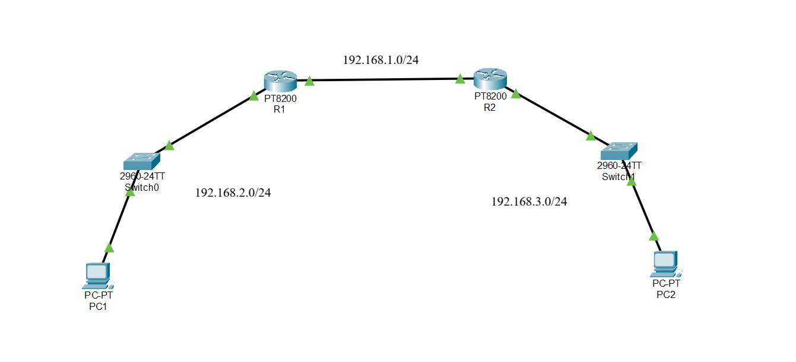
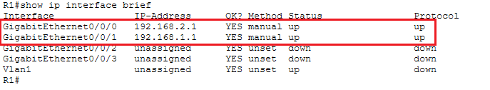
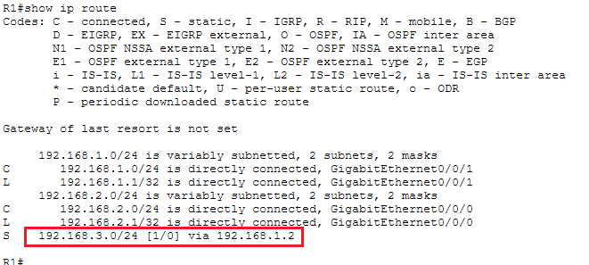
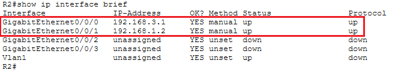
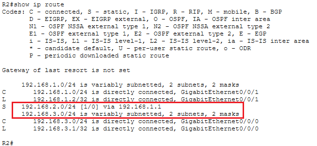
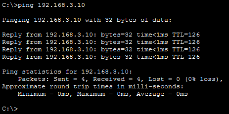
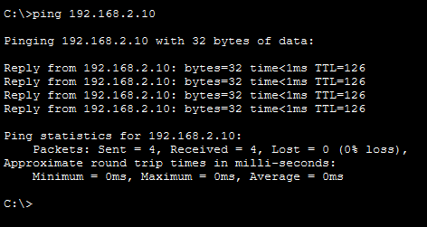

# Lab static routing

## Mô hình



## Mục tiêu
Định tuyến sao cho Data truyền được từ PC1 ở mạng `192.168.2.0/24` qua PC2 ở mạng `192.168.3.0/24` thông qua Router1 và Router2 ở mạng `192.168.1.0/24`

## Cấu hình thiết bị

### 1. Cấu hình PC1
Vào PC1 -> Config:

- IP Address: `192.168.2.10`
- Subnet mask: `255.255.255.0`
- Default gateway: `192.168.2.1`

### 2. Cấu hình PC2

Vào PC2 -> Config:

- IP Address: `192.168.3.10`
- Subnet mask: `255.255.255.0`
- Default gateway: `192.168.3.1`

### 3. Cấu hình Switch0(Kết nối PC1) và Switch1(Kết nối PC2)
Không cần cấu hình gì thêm vì switch hoạt động ở layer 2

### 4. Cấu hình Router1

Chọn Router1 -> CLI và nhập các lệnh sau:

- Đặt tên cho Router1 thành R1 để minh bạch hơn:

    ```bash
    Router>enable
    Router#configure terminal
    Router(config)#hostname R1
    R1(config)#
    ```

- Cấu hình cổng GigabyteEthernet 0/0/0 (LAN1 kết nối PC1):

    ```bash
    R1(config)#interface GigabitEthernet 0/0/0
    R1(config-if)#ip address 192.168.2.1 255.255.255.0
    R1(config-if)#no shutdown
    R1(config-if)#exit
    ```

- Cấu hình cổng GigabitEthernet 0/0/1 (WAN kết nối Router2):

    ```bash
    R1(config)#interface GigabitEthernet 0/0/1
    R1(config-if)#ip address 192.168.1.1 255.255.255.0
    R1(config-if)#no shutdown
    R1(config-if)#exit
    ```

- Cấu hình định tuyến tĩnh đến mạng `192.168.3.0/24` (đi qua Router2) và lưu cấu hình bằng câu lệnh `write`

    ```bash
    R1(config)#ip route 192.168.3.0 255.255.255.0 192.168.1.2
    R1(config)#exit
    R1#write
    ```

- Kiểm tra kết quả:

    

    


### 5. Cấu hình Router2

Chọn Router2 -> CLI và nhập các câu lệnh sau:

- Đặt tên cho Router2 thành R2 để minh bạch hơn:

    ```bash
    Router>enable
    Router#configure terminal
    Router(config)#hostname R2
    R2(config)#
    ```

- Cấu hình cổng GigabitEthernet 0/0/0 (LAN2 kết nối PC2):

    ```bash
    R2(config)#interface GigabitEthernet 0/0/1
    R2(config-if)#ip address 192.168.3.1 255.255.255.0
    R2(config-if)#no shutdown
    R2(config-if)#exit
    ```

- Cấu hình cổng GigabitEthernet 0/0/1 (WAN kết nối R1):

    ```bash
    R2(config)#interface GigabitEthernet 0/0/0
    R2(config-if)#ip address 192.168.1.2 255.255.255.0
    R2(config-if)#no shutdown
    R2(config-if)#exit
    ```

- Cấu hình định tuyến tĩnh đến mạng `192.168.2.0/24` (đi qua R1) và lưu cấu hình bằng câu lệnh `write`

    ```bash
    R2(config)#ip route 192.168.2.0 255.255.255.0 192.168.1.1
    R2(config)#exit
    R2#write
    ```

- Kiểm tra kết quả:

    

    

### 6. Kiểm tra kết nối

Trên PC1 ta thực hiên lệnh ping tới PC2 và ngược lại để kiểm tra kết nối đã thành công chưa:

- PC1 ping PC2:

    

- PC2 ping PC1:

    