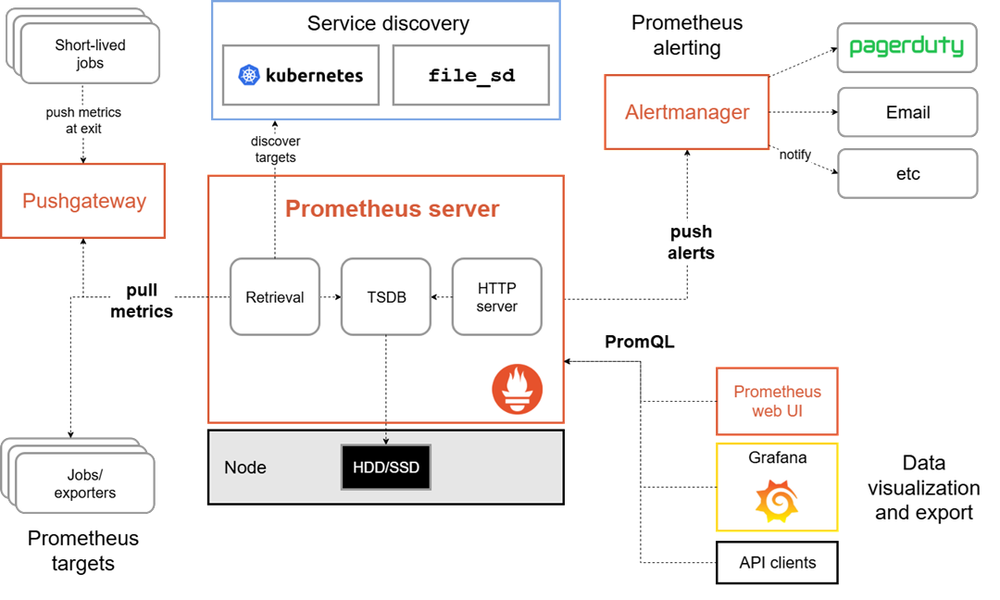

# Mục lục 

- [Mục lục](#mục-lục)
- [Tìm hiểu Prometheus](#tìm-hiểu-prometheus)
  - [I. Prometheus là gì ?](#i-prometheus-là-gì-)
    - [1.0 Tính năng của Prometheus](#10-tính-năng-của-prometheus)
    - [1.1 Metrics là gì ?](#11-metrics-là-gì-)
    - [1.2 Các thành phần (Components)](#12-các-thành-phần-components)
    - [1.3 Kiến trúc (Architecture)](#13-kiến-trúc-architecture)
- [Tài liệu tham khảo](#tài-liệu-tham-khảo)

# Tìm hiểu Prometheus 

## I. Prometheus là gì ?

Prometheus là một bộ công cụ giám sát hệ thống (system monitoring) và cảnh bảo (alerting) mã nguồn mở, ban đầu được phát triển tại SoundCloud

Hiện nay, Prometheus đã gia nhập CNCF vào năm 2016 với tư cách là một dự án được lưu trữ thứ hai sau Kubernetes 

Prometheus thu thập và lưu trữ metrics dưới dạng chuỗi thời gian (time series data). Điều này có nghĩa là mỗi giá trị metric được lưu cùng với: 

- `Timestamp`: dấu thời gian - ghi nhập thời điểm metric được thu thập 
- `Labels`: các cặp key-value dùng để mô tả và phân loại metric 

### 1.0 Tính năng của Prometheus 

Những tính năng nổi bật của Prometheus bao gồm: 

- Mô hình dữ liệu đa chiều, trong đó mỗi time series được xác định bởi: 
  - Tên metric 
  - Các cặp key-value (labels) 
- PromQL, một ngôn ngữ truy vấn mạnh mẽ và linh hoạt, cho phép khai thác hiệu quả mô hình dữ liệu đa chiều này 
- Không phụ thuộc vào hệ thống lưu trữ phân tán; mỗi máy chủ Prometheus hoạt động hoàn toàn độc lập
- Thu thập dữ liệu chuỗi thời gian theo mô hình Pull thông qua giao thức HTTP 
- Hỗ trợ Push metrics thông qua một thành phần trung gian là Pushgateway 
- Tự động phát hiện các mục tiêu cần giám sát thông qua Service Discovery hoặc cấu hình thủ công (Static Configuration).
- Hỗ trợ nhiều hình thức trực quan hóa dữ liệu và xây dựng dashboard.

### 1.1 Metrics là gì ? 

Hiểu một cách đơn giản, metrics là các giá trị đo lường bằng số 

Khái niệm time series đề cập đến việc ghi lại sự thay đổi của các giá trị này theo thời gian 

Tùy vào ứng dụng, các metrics cần theo dõi sẽ khác nhau, Ví dụ: 

- Đối với Web Server, metrics có thể là: 
  - Thời gian xử lý request 
  - Số lương request 
- Đối với Database, metrics có thể là: 
  - Số lượng kết nối đang hoạt động 
  - Số lượng truy vấn đang thực thi 

Metrics đóng vai trò vô cùng quan trọng trong việc giúp chúng ta hiểu được tại sao ứng dụng lại hoạt động theo một cách nhất định 

Ví dụ, giả sử ta đang vận hành một ứng dụng Web và nhận thấy nó phản hồi rất chậm. Để xác định nguyên nhân, bạn cần thu thập các thông tin liên quan 

Chẳng hạn, nếu số lượng request tăng quá cao thì ứng dụng có thể bị quá tải và trở nên chậm hơn. Khi theo dói được metric về `request count`, bạn có thể xác định đây là nguyên nhân gây ra vấn đề và quyết định mở rộng thêm số lượng máy chủ để xử lý lượng truy cập lớn hơn 

### 1.2 Các thành phần (Components) 

Các thành phần chính của hệ sinh thái Prometheus bao gồm: 

- **Prometheus Server:** 
  - Thu thập metrics
  - Lưu trữ dữ liệu chuỗi thời gian (time series) 
- **Client Libraries:** 
  - Các thư viện dành cho việc instrument ứng dụng, tức là thêm mã nguồn để ứng dụng có thể sinh ra metrics 
- **Pushgateway:** 
  - Hỗ trợ các short-lived jobs, không thể để Prometheus chủ động thu thập metrics 
- **Exporters:** 
  - Các exporter chuyên dụng để thu thập metrics từ các hệ thống như: 
    - HAProxy 
    - StatsD
    - cùng nhiều dịch vụ khác 
- **Alertmanager:**
  - Tiếp nhận và xử lý cảnh báo được Prometheus tạo ra
- **Các công cụ hỗ trợ khác:**
  - Phục vụ việc triển khai, quản trị và vận hành Prometheus.

Phần lớn các thành phần của Prometheus được viết bằng ngôn ngữ Go

### 1.3 Kiến trúc (Architecture) 

Sơ đồ dưới đây minh họa kiến trúc của Prometheus cùng với các thành phần trong hệ sinh thái của nó 

Prometheus sẽ thu thập metrics từ các ứng dụng hoặc dịch vụ đã được instrument. 

Việc thu thập có thể diễn ra theo 2 cách: 
- Trực tiếp từ ứng dụng
- Thông qua Pushgateway đối với các short-lived jobs

Sau khi thu thập, Prometheus sẽ lưu toàn bộ dữ liệu metrics dưới dạng time series trên local storage. 

Tiếp theo, Prometheus sẽ thực thi các rules trên dữ liệu đã thu thập nhằm:

- Tổng hợp dữ liệu hiện có.
- Tạo ra các time series mới 
- Sinh ra các cảnh báo.

Để trực quan hóa dữ liệu, người dùng có thể sử dụng:

- Grafana
- Hoặc bất kỳ ứng dụng nào có khả năng sử dụng Prometheus HTTP API.

# Tài liệu tham khảo 

https://prometheus.io/docs/introduction/overview/#architecture