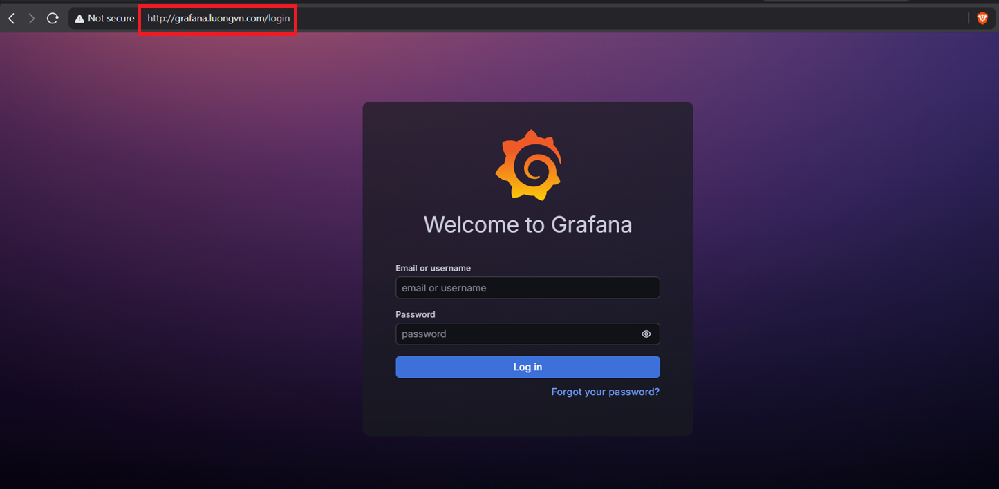
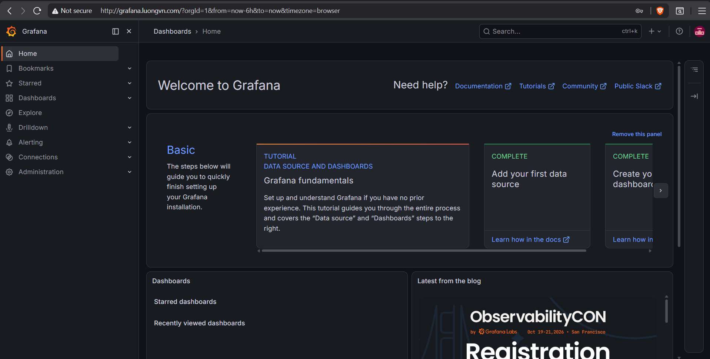

# Cài đặt Prometheus và Grafana trên K8s sử dụng Prometheus Operator 

Ta sẽ cài đặt Prometheus và Grafana trên cụm K8s bằng Helm, vì vậy nếu bạn chưa cài Helm bạn có thể tham khảo [tại đây](https://github.com/Bimmie226/ghichep-Kubernetes/blob/master/Deploy_Application_on_K8s/06.Ingress_Kubernetes.md#install-helm)

## Bước 1: Cài đặt StorageClass cho Prometheus và Grafana 

```bash
helm install nfs-monitor nfs-subdir-external-provisioner/nfs-subdir-external-provisioner \
  --namespace nfs-provisioner \
  --create-namespace \
  --set nfs.server=192.168.174.114 \
  --set nfs.path=/monitor \
  --set nfs.mountOptions[0]=nfsvers=4.1 \
  --set storageClass.name=nfs-monitor \
  --set storageClass.defaultClass=false \
  --set storageClass.accessModes=ReadWriteMany \
  --set storageClass.reclaimPolicy=Delete \
  --set storageClass.volumeBindingMode=WaitForFirstConsumer
```

Trong đó: 

- `nfs.server`: IP hoặc hostname của NFS server
- `nfs.path`: Folder được export từ NFS server
- `storageClass.name`: Tên storageClass được tạo
- `storageClass.defaultClass`: Tùy chọn có sử dụng storageClass được tạo ra có phải là storageClass mặc định không ?
- `storageClass.accessMode`: tùy chọn accessMode
- `storageClass.reclaimPolicy`: tùy chọn Policy sau khi xóa PVC
- `storageClass.volumeBindingMode`: Tùy chọn tạo PVC khi nào

## Bước 2: Thêm repo Helm của Prometheus và Grafana 

```bash
helm repo add prometheus-community https://prometheus-community.github.io/helm-charts
helm repo update
```

- Thực hiện cài đặt chart Prometheus và Grafana bằng câu lệnh sau: 

```bash
helm install kube-prometheus-stack prometheus-community/kube-prometheus-stack \
  --namespace monitoring \
  --create-namespace \
  --version 87.16.1 \
  \
  --set prometheus.prometheusSpec.retentionSize=5GB \
  --set prometheus.prometheusSpec.retention=1d \
  --set prometheus.prometheusSpec.storageSpec.volumeClaimTemplate.spec.storageClassName=nfs-monitor \
  --set prometheus.prometheusSpec.storageSpec.volumeClaimTemplate.spec.resources.requests.storage=10Gi \
  \
  --set prometheus.ingress.enabled=true \
  --set prometheus.ingress.ingressClassName=nginx \
  --set prometheus.ingress.hosts[0]=prometheus.luongvn.com \
  \
  --set alertmanager.alertmanagerSpec.storage.volumeClaimTemplate.spec.storageClassName=nfs-monitor \
  --set alertmanager.alertmanagerSpec.storage.volumeClaimTemplate.spec.resources.requests.storage=2Gi \
  \
  --set grafana.persistence.enabled=true \
  --set grafana.persistence.storageClassName=nfs-monitor \
  --set grafana.persistence.size=5Gi \
  \
  --set grafana.ingress.enabled=true \
  --set grafana.ingress.ingressClassName=nginx \
  --set grafana.ingress.hosts[0]=grafana.luongvn.com
```

Trong đó: 

- `prometheus.prometheusSpec.retentionSize`: Dung lượng lưu trữ metrics 
- `prometheus.prometheusSpec.retention`: thời gian lưu trữ metrics 
- `prometheus.prometheusSpec.storageSpec.volumeClaimTemplate.spec.storageClassName`: chỉ định storageclass cho Prometheus
- `prometheus.prometheusSpec.storageSpec.volumeClaimTemplate.spec.resources.requests.storage`: Dung lượng PVC cho Prometheus (Lưu trữ time series database - TSDB)
- `prometheus.ingress.enabled`: Bật ingress để có thể truy cập Prometheus 
- `prometheus.ingress.ingressClassName`: Chỉ định ingressClass cho Prometheus 
- `prometheus.ingress.hosts[0]`: Hostname của Prometheus 
- `alertmanager.alertmanagerSpec.storage.volumeClaimTemplate.spec.storageClassName`: Chỉ định storageClass cho alertmanager 
- `alertmanager.alertmanagerSpec.storage.volumeClaimTemplate.spec.resources.requests.storage`: Dung lượng PVC cho Alertmanager để lưu trạng thái alert 
- `grafana.persistence.enabled`: Bật tính năng persistent storage cho Grafana.
- `grafana.persistence.storageClassName`: Chỉ định storageClass của Grafana 
- `grafana.persistence.size`: Dung lượng PVC cho grafana
- `grafana.ingress.enabled`: Bật ingress để có thể truy cập grafana 
- `grafana.ingress.ingressClassName`: Chỉ định ingressClass cho grafana 
- `grafana.ingress.hosts[0]`: Hostname của grafana 

```bash
NAME: kube-prometheus-stack
LAST DEPLOYED: Tue Jul 21 02:30:40 2026
NAMESPACE: monitoring
STATUS: deployed
REVISION: 1
TEST SUITE: None
NOTES:
kube-prometheus-stack has been installed. Check its status by running:
  kubectl --namespace monitoring get pods -l "release=kube-prometheus-stack"

Get Grafana 'admin' user password by running:

  kubectl --namespace monitoring get secrets kube-prometheus-stack-grafana -o jsonpath="{.data.admin-password}" | base64 -d ; echo

Access Grafana local instance:

  export POD_NAME=$(kubectl --namespace monitoring get pod -l "app.kubernetes.io/name=grafana,app.kubernetes.io/instance=kube-prometheus-stack" -oname)
  kubectl --namespace monitoring port-forward $POD_NAME 3000

Get your grafana admin user password by running:

  kubectl get secret --namespace monitoring -l app.kubernetes.io/component=admin-secret -o jsonpath="{.items[0].data.admin-password}" | base64 --decode ; echo


Visit https://github.com/prometheus-operator/kube-prometheus for instructions on how to create & configure Alertmanager and Prometheus instances using the Operator.
```

## Bước 3: Kiểm tra trạng thái

- Thực hiện kiểm tra các resource của prometheus và grafana: 

```bash
devops@k8s-master-01:~$ kubectl get all -n monitoring
NAME                                                           READY   STATUS    RESTARTS   AGE
pod/alertmanager-kube-prometheus-stack-alertmanager-0          2/2     Running   0          2m6s
pod/kube-prometheus-stack-grafana-5dd7bf76b5-qqmkk             3/3     Running   0          2m8s
pod/kube-prometheus-stack-kube-state-metrics-dcd9c7c48-tmlnz   1/1     Running   0          2m8s
pod/kube-prometheus-stack-operator-6fffb6746d-kq2tw            1/1     Running   0          2m8s
pod/kube-prometheus-stack-prometheus-node-exporter-9klhx       1/1     Running   0          2m8s
pod/kube-prometheus-stack-prometheus-node-exporter-pmqmm       1/1     Running   0          2m8s
pod/kube-prometheus-stack-prometheus-node-exporter-rc2w7       1/1     Running   0          2m8s
pod/prometheus-kube-prometheus-stack-prometheus-0              2/2     Running   0          2m6s

NAME                                                     TYPE        CLUSTER-IP       EXTERNAL-IP   PORT(S)                      AGE
service/alertmanager-operated                            ClusterIP   None             <none>        9093/TCP,9094/TCP,9094/UDP   2m6s
service/kube-prometheus-stack-alertmanager               ClusterIP   10.101.44.126    <none>        9093/TCP,8080/TCP            2m8s
service/kube-prometheus-stack-grafana                    ClusterIP   10.98.191.100    <none>        80/TCP                       2m8s
service/kube-prometheus-stack-kube-state-metrics         ClusterIP   10.107.138.183   <none>        8080/TCP                     2m8s
service/kube-prometheus-stack-operator                   ClusterIP   10.111.7.20      <none>        443/TCP                      2m8s
service/kube-prometheus-stack-prometheus                 ClusterIP   10.105.191.192   <none>        9090/TCP,8080/TCP            2m8s
service/kube-prometheus-stack-prometheus-node-exporter   ClusterIP   10.98.114.123    <none>        9100/TCP                     2m8s
service/prometheus-operated                              ClusterIP   None             <none>        9090/TCP                     2m6s

NAME                                                            DESIRED   CURRENT   READY   UP-TO-DATE   AVAILABLE   NODE SELECTOR            AGE
daemonset.apps/kube-prometheus-stack-prometheus-node-exporter   3         3         3       3            3           kubernetes.io/os=linux   2m8s

NAME                                                       READY   UP-TO-DATE   AVAILABLE   AGE
deployment.apps/kube-prometheus-stack-grafana              1/1     1            1           2m8s
deployment.apps/kube-prometheus-stack-kube-state-metrics   1/1     1            1           2m8s
deployment.apps/kube-prometheus-stack-operator             1/1     1            1           2m8s

NAME                                                                 DESIRED   CURRENT   READY   AGE
replicaset.apps/kube-prometheus-stack-grafana-5dd7bf76b5             1         1         1       2m8s
replicaset.apps/kube-prometheus-stack-kube-state-metrics-dcd9c7c48   1         1         1       2m8s
replicaset.apps/kube-prometheus-stack-operator-6fffb6746d            1         1         1       2m8s

NAME                                                               READY   AGE
statefulset.apps/alertmanager-kube-prometheus-stack-alertmanager   1/1     2m6s
statefulset.apps/prometheus-kube-prometheus-stack-prometheus       1/1     2m6s
```

- Add host và sau đó truy cập vào grafana trên browser: 



- Thực hiện câu lệnh sau để lấy password của user admin grafana sau đó login bằng user `admin`: 

```bash
kubectl --namespace monitoring get secrets kube-prometheus-stack-grafana -o jsonpath="{.data.admin-password}" | base64 -d ; echo
```




# Tài liệu tham khảo 

https://cloud.vnpt.vn/tai-lieu/article/huong-dan-cai-dat-grafana-va-prometheus-541