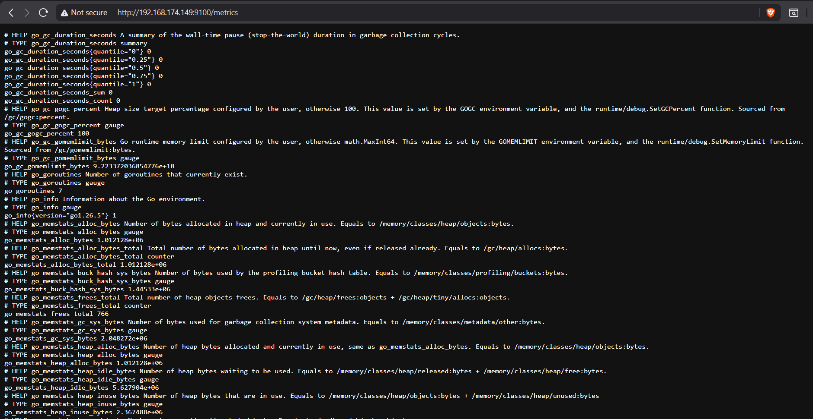
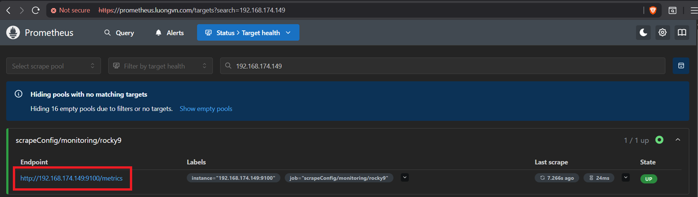

# Mục lục 

- [Mục lục](#mục-lục)
- [Cài đặt Node Exporter trên Rocky 9](#cài-đặt-node-exporter-trên-rocky-9)
  - [I. Thiết lập môi trường](#i-thiết-lập-môi-trường)
  - [II. Cài đặt Node Exporter bằng Docker](#ii-cài-đặt-node-exporter-bằng-docker)
    - [2.0 Cài đặt Docker](#20-cài-đặt-docker)
    - [2.1 Cài đặt Node Exporter](#21-cài-đặt-node-exporter)
    - [2.2 Cấu hình Prometheus để scrape metrics từ Node Exporter](#22-cấu-hình-prometheus-để-scrape-metrics-từ-node-exporter)


# Cài đặt Node Exporter trên Rocky 9 

## I. Thiết lập môi trường 

- Update hệ thống: 

```bash
yum update -y 
```

- Tắt firewall và selinux: 

```bash
systemctl  disable firewalld --now
```

```bash
sed -i 's/SELINUX=enforcing/SELINUX=disabled/g' /etc/sysconfig/selinux
sed -i 's/SELINUX=enforcing/SELINUX=disabled/g' /etc/selinux/config
setenforce 0
```

- Đồng bộ thời gian với NTP server 

Kiểm tra thời gian hệ thống, nếu thời gian sai hãy đặt lại thời gian hoặc đồng bộ thời gian với NTP server.

Cú pháp đặt lại thời gian trên linux:

```bash
date -s "21 JULY 2026 11:10:00"
```

## II. Cài đặt Node Exporter bằng Docker 

### 2.0 Cài đặt Docker 

- Add Docker repo: 

```bash
sudo dnf config-manager --add-repo https://download.docker.com/linux/rhel/docker-ce.repo
```

- Install Docker Engine, containerd & Docker Compose: 

```bash
sudo dnf -y install docker-ce docker-ce-cli containerd.io docker-buildx-plugin docker-compose-plugin
```

- Start & enable Docker

```bash
sudo systemctl --now enable docker
```

### 2.1 Cài đặt Node Exporter 

- Chạy lệnh sau để run node exporter bằng Docker: 

```bash
docker run -d \
--name exporter_system \
--net="host" \
--pid="host" \
--restart always \
-v "/:/host:ro,rslave" \
quay.io/prometheus/node-exporter:latest \
--path.rootfs=/host
```

- Kiểm tra container: 

```bash
[root@Rocky-server ~]# docker container ls
CONTAINER ID   IMAGE                                     COMMAND                  CREATED          STATUS          PORTS     NAMES
597edf671205   quay.io/prometheus/node-exporter:latest   "/bin/node_exporter …"   13 seconds ago   Up 12 seconds             exporter_system
```

- Kiểm tra trên browser với url: `http://192.168.174.149:9100/metrics` để kiểm tra:



### 2.2 Cấu hình Prometheus để scrape metrics từ Node Exporter 

Ta sẽ sử dụng Custom Resource là ScrapeConfig, bạn có thể kiểm tra xem phiên bản operator của bạn có CR này không bằng lệnh sau: 

```bash
kubectl get crd | grep scrapeconfig
```

Nếu kết quả như sau thì tức là phiên bản Operator bạn đang dùng có hỗ trợ scrapeconfig: 

```bash
devops@k8s-master-01:~$ kubectl get crd | grep scrapeconfigs
scrapeconfigs.monitoring.coreos.com                     2026-07-21T02:28:10Z
```

Kiểm tra thêm xem scrapeconfig có yêu cầu gì thêm không: 

- Sử dụng các câu lệnh sau: 

```bash
devops@k8s-master-01:~/monitoring$ k get prometheus -n monitoring
NAME                               VERSION              DESIRED   READY   RECONCILED   AVAILABLE   AGE
kube-prometheus-stack-prometheus   v3.13.1-distroless   1         1       True         True        15m
devops@k8s-master-01:~/monitoring$ kubectl get prometheus kube-prometheus-stack-prometheus \
  -n monitoring -o yaml | grep -A10 scrapeConfig
  scrapeConfigNamespaceSelector: {}
  scrapeConfigSelector:
    matchLabels:
      release: kube-prometheus-stack
  scrapeInterval: 30s
  securityContext:
    fsGroup: 2000
    runAsGroup: 2000
    runAsNonRoot: true
    runAsUser: 1000
    seccompProfile:
      type: RuntimeDefault
```

- Ta thấy: Ở đây Prometheus chỉ chọn các ScrapeConfig có label: `scrapeConfigSelector.matchLabels.release: kube-prometheus-stack`
- Do đó, khi tạo scrapeconfig bắt buộc phải thêm label này vào 

```yaml
apiVersion: monitoring.coreos.com/v1alpha1
kind: ScrapeConfig
metadata:
  name: rocky9
  namespace: monitoring
  labels: 
    release: kube-prometheus-stack 
spec:
  staticConfigs:
    - targets:
      - 192.168.174.149:9100
```

Apply sau đó kiểm tra: 

```bash
devops@k8s-master-01:~/monitoring$ kubectl get scrapeconfig -n monitoring
NAME     AGE
rocky9   82s
```

Kiểm tra target của prometheus: 

