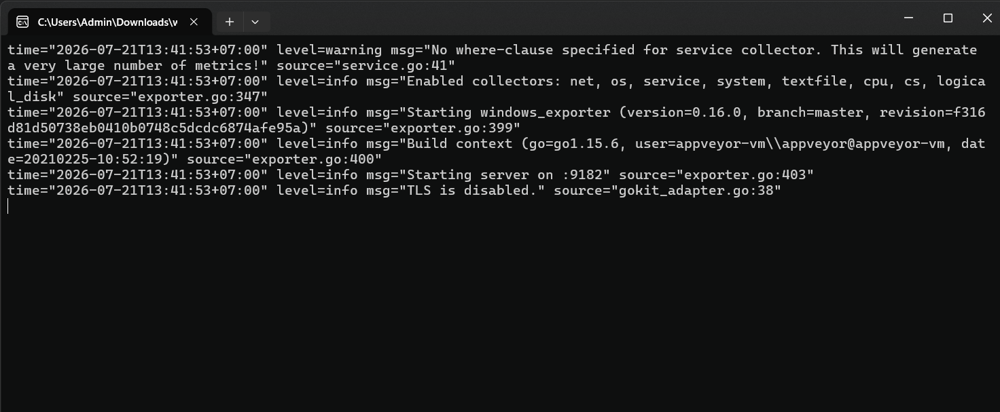
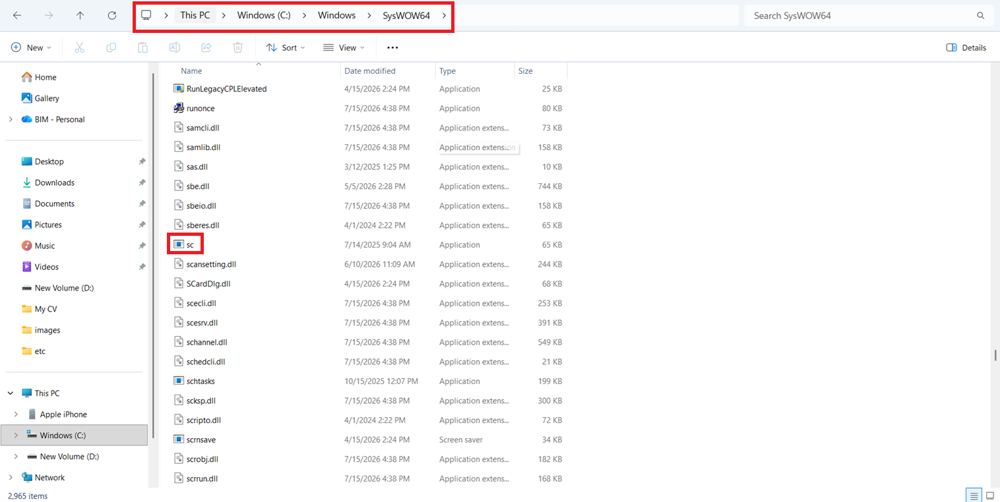
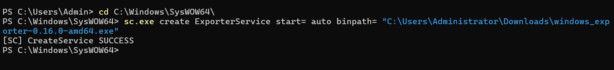
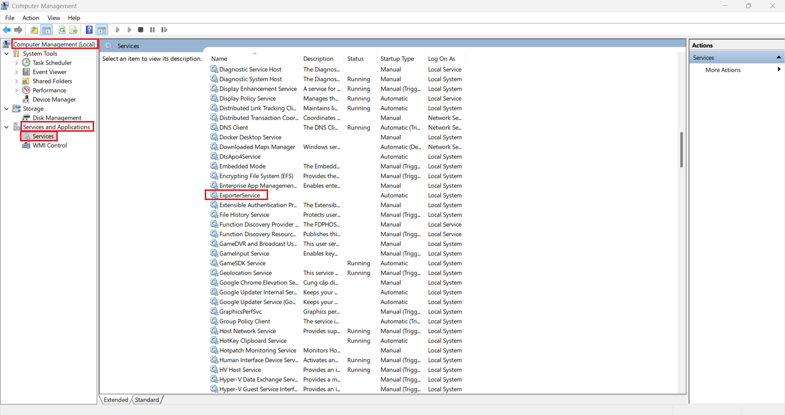
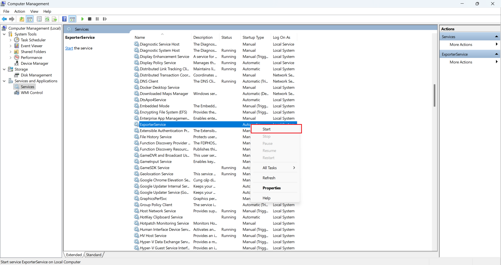
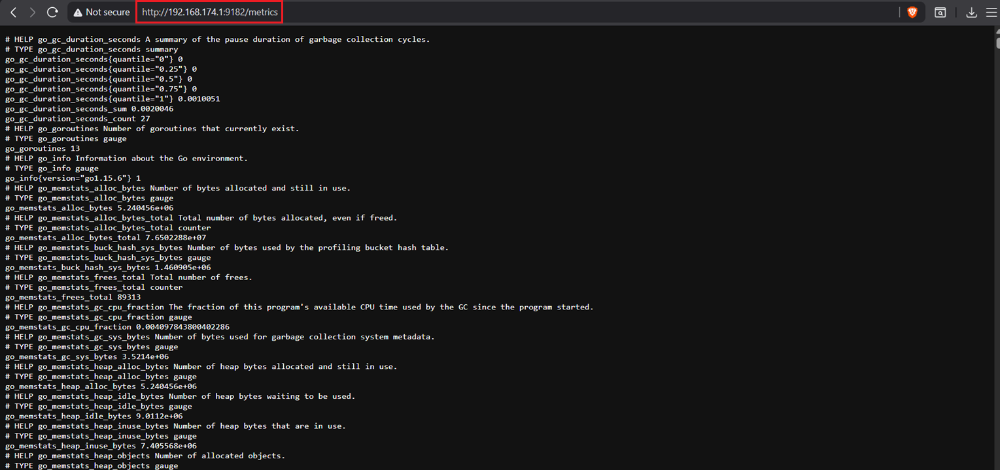
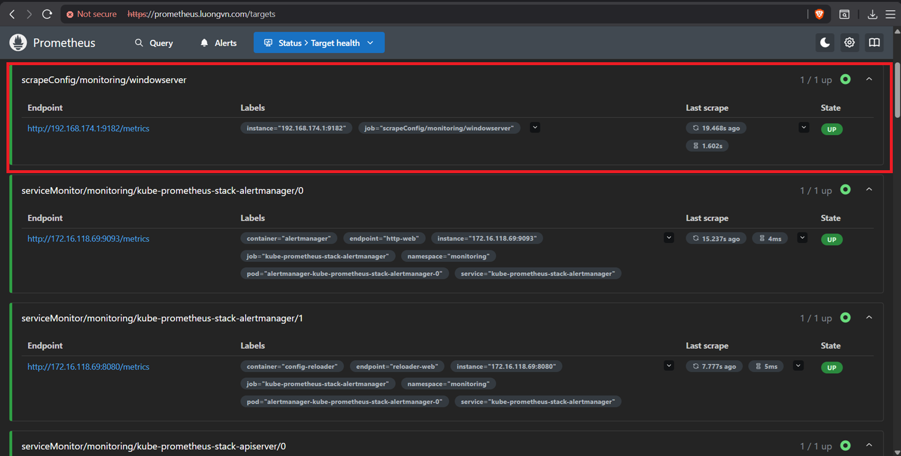

# Mục lục 

- [Mục lục](#mục-lục)
- [Cài đặt Node Exporter trên Windows](#cài-đặt-node-exporter-trên-windows)
  - [I. Cài đặt node exporter cho windows](#i-cài-đặt-node-exporter-cho-windows)
  - [II. Cấu hình Prometheus để scrape metrics từ Node Exporter](#ii-cấu-hình-prometheus-để-scrape-metrics-từ-node-exporter)


# Cài đặt Node Exporter trên Windows 

## I. Cài đặt node exporter cho windows 

Truy cập vào [đường dẫn này](https://github.com/prometheus-community/windows_exporter/releases/download/v0.16.0/windows_exporter-0.16.0-amd64.exe) để tải về window node exporter 

Sau khi file đã được tải xuống hoàng tất, tiến hành chạy file và hãy lưu dữ lại đường dẫn tới file đó (Ở đây là: `C:\Users\Admin\Downloads`)



Exporter đã được chạy thành công, tuy nhiên nếu thoát cửa sổ CMD, exporter sẽ ngừng hoạt động do đó ta sẽ tạo service tên là `ExporterService` và chạy file exe mới tải xuống tên là `windows_exporter-0.16.0-amd64.exe` nằm trong đường dẫn `C:\Users\Admin\Downloads`


Để tạo Service, ta sử dụng `sc.exe` được lưu tại `C:\Windows\SysWOW64`



- Mở CMD với quyền Admin và tiến hành tạo service: 

```bash
cd C:\Windows\SysWOW64\

sc.exe create ExporterService start= auto binpath= "C:\Users\Admin\Downloads\windows_exporter-0.16.0-amd64.exe"
```

- Sau khi tạo thành công sẽ có trạng thái `SUCCESS` như sau: 



- Tiếp theo, truy cập `Computer Management` -> `Service and Aplications` -> `Services` để khởi động dịch vụ 



- Tìm đến Service mới tạo là `ExporterService`, click chuột phải và chọn `Start`



- Sử dụng trình duyệt truy cập vào url `http://192.168.174.1:9182/metrics` để kiểm tra.




## II. Cấu hình Prometheus để scrape metrics từ Node Exporter

Tiếp tục sử dụng CRD: `ScrapeConfig` để Prometheus có thể thấy được target mới

```yaml
apiVersion: monitoring.coreos.com/v1alpha1
kind: ScrapeConfig
metadata:
  name: windowserver
  namespace: monitoring
  labels: 
    release: kube-prometheus-stack 
spec:
  staticConfigs:
    - targets:
      - 192.168.174.1:9182
```

Apply sau đó kiểm tra: 

```bash
devops@k8s-master-01:~/monitoring$ kubectl get scrapeconfig -n monitoring
NAME           AGE
rocky9         78m
windowserver   10s
```

Kiểm tra target của Prometheus: 

