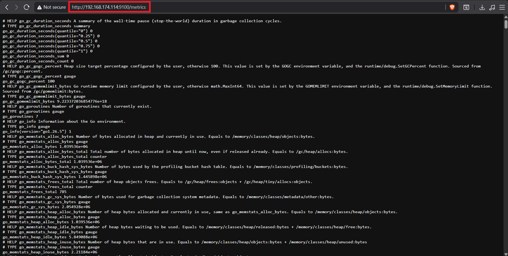
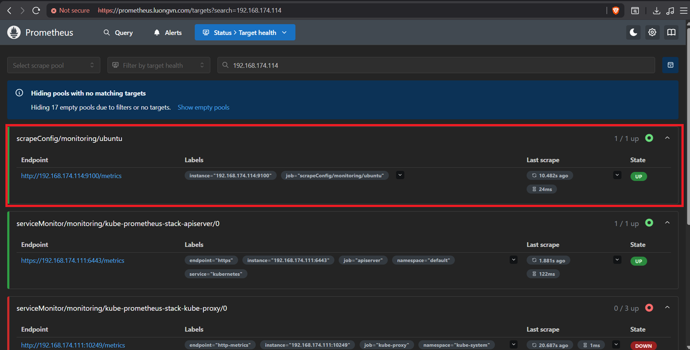

# Mục lục 

- [Mục lục](#mục-lục)
- [Cài đặt Node Exporter trên Ubuntu](#cài-đặt-node-exporter-trên-ubuntu)
  - [I. Thiết lập môi trường](#i-thiết-lập-môi-trường)
  - [II. Cài đặt Node Exporter bằng Docker](#ii-cài-đặt-node-exporter-bằng-docker)
    - [2.0 Cài đặt Docker](#20-cài-đặt-docker)
    - [2.1 Cài đặt Node Exporter](#21-cài-đặt-node-exporter)
  - [III. Cấu hình Prometheus để scrape metrics từ Node Exporter](#iii-cấu-hình-prometheus-để-scrape-metrics-từ-node-exporter)


# Cài đặt Node Exporter trên Ubuntu 

## I. Thiết lập môi trường 

- Update hệ thống 

```bash
apt update -y 
```

- Tắt firewall (Nếu bật firewall hãy đảm bảo cho port 9100 được mở) 

```bash
systemctl  disable ufw --now
```

- Đồng bộ thời gian với NTP server 

Kiểm tra thời gian hệ thống, nếu thời gian sai hãy đặt lại thời gian hoặc đồng bộ thời gian với NTP server. 

Cú pháp đặt lại thời gian trên linux:

```bash
date -s "21 JULY 2026 14:16:00"
```

## II. Cài đặt Node Exporter bằng Docker 

### 2.0 Cài đặt Docker 

Thực hiện câu lệnh sau để install Docker: 

```bash
apt install docker.io -y
apt install docker-compose -y
```

### 2.1 Cài đặt Node Exporter 

- Chạy lệnh sau để run container Node Exporter: 

```bash
docker run -d \
--name exporter_system \
--net="host" \
--pid="host" \
--restart always \
-v "/:/host:ro,rslave" \
quay.io/prometheus/node-exporter:latest \
--path.rootfs=/host
```

- Kiểm tra container mới tạo: 

```bash
root@nfs-server-01:~# docker container ls
CONTAINER ID   IMAGE                                     COMMAND                  CREATED          STATUS          PORTS     NAMES
5d3b618f0453   quay.io/prometheus/node-exporter:latest   "/bin/node_exporter …"   18 seconds ago   Up 17 seconds             exporter_system
```

- Truy cập trình duyệt với url `http://192.168.174.114:9100/metrics` để kiểm tra:



## III. Cấu hình Prometheus để scrape metrics từ Node Exporter

Tiếp tục sử dụng CRD: `ScrapeConfig` để Prometheus có thể thấy được target mới

```yaml
apiVersion: monitoring.coreos.com/v1alpha1
kind: ScrapeConfig
metadata:
  name: ubuntu
  namespace: monitoring
  labels: 
    release: kube-prometheus-stack 
spec:
  staticConfigs:
    - targets:
      - 192.168.174.114:9100
```

Apply sau đó kiểm tra: 

```bash
devops@k8s-master-01:~/monitoring$ kubectl get scrapeconfig -n monitoring
NAME           AGE
rocky9         104m
ubuntu         13s
windowserver   26m
```

Kiểm tra target của Prometheus: 

