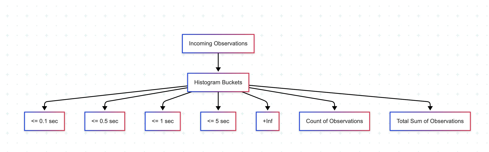

# Mục lục 

- [Mục lục](#mục-lục)
- [Các loại Metric trong Prometheus](#các-loại-metric-trong-prometheus)
  - [I. Counter Metrics](#i-counter-metrics)
    - [1.0 Khi nào nên sử dụng Counter ?](#10-khi-nào-nên-sử-dụng-counter-)
    - [1.1 Cách truy vấn Counter trong thực tế](#11-cách-truy-vấn-counter-trong-thực-tế)
    - [1.2 Best practises khi sử dụng Counter](#12-best-practises-khi-sử-dụng-counter)
  - [II. Gauge Metrics](#ii-gauge-metrics)
    - [2.0 Khi nào nên sử dụng Gauge ?](#20-khi-nào-nên-sử-dụng-gauge-)
    - [2.1 Cách truy vấn Gauge](#21-cách-truy-vấn-gauge)
    - [2.2 Best practises khi sử dụng Gauge](#22-best-practises-khi-sử-dụng-gauge)
  - [III. Histogram Metrics](#iii-histogram-metrics)
    - [3.0 Histogram hoạt động như thế nào ?](#30-histogram-hoạt-động-như-thế-nào-)
    - [3.1 Truy vấn Histogram bằng PromQL](#31-truy-vấn-histogram-bằng-promql)
  - [IV. Summary Metrics](#iv-summary-metrics)
    - [4.0 Cấu trúc của Summary](#40-cấu-trúc-của-summary)
    - [4.1 Khi nào nên chọn Summary và khi nào nên chọn Histogram](#41-khi-nào-nên-chọn-summary-và-khi-nào-nên-chọn-histogram)
- [Tài liệu tham khảo](#tài-liệu-tham-khảo)


# Các loại Metric trong Prometheus 

Mỗi loại metric trong Prometheus đều có những đánh đổi riêng về: cách lưu trữ dữ liệu, cách tổng hợp dữ liệu và cách chúng hoạt động trong thực tế 

## I. Counter Metrics 

Counter là loại metric dùng để theo dõi những giá trị chỉ tăng mà không bao giờ giảm. Chúng được sử dụng để ghi nhận các giá trị tổng hoặc các sự kiện, chẳng hạn như số lượng HTTP request đã được xử lý, số lượng tác vụ nền đã hoàn thành hoặc số lỗi xảy ra. Sau khi được tăng lên, giá trị của Counter sẽ không bao giờ giảm. Nếu ứng dụng khởi động lại, Counter sẽ được đặt lại về 0. Đây là hành vi hoàn toàn bình thường và là cách Prometheus được thiết kế để xử lý Counter.

Counter rất đơn giản, nhưng cũng là loại metric thường bị sử dụng sai nhất. Nhiều người trực tiếp vẽ biểu đồ giá trị thô của Counter thay vì quan tâm đến mức độ thay đổi của nó theo thời gian 

### 1.0 Khi nào nên sử dụng Counter ? 

Hãy sử dụng Counter khi bạn cần theo dõi các sự kiện hoặc giá trị tổng chỉ có xu hướng tăng: 

- `http_requests_total`: Tổng số HTTP request mà dịch vụ đã xử lý
- `jobs_processed_total`: Tổng số job hoặc tác vụ đã hoàn thành 
- `errors_total`: Tổng số lỗi của ứng dụng hoặc hệ thống 
- `network_bytes_total`: Tổng lượng dữ liệu đã gửi hoặc nhận qua mạng 

Các metric này giúp trả lời những câu hỏi cơ bản nhưng rất quan trọng như: 

- Đã xử lý bao nhiêu ? 
- Các sự kiện xảy ra thường xuyên đến mức nào ? 
- Tốc độ tăng hiện tại có nhanh hơn trước hay không ? 

### 1.1 Cách truy vấn Counter trong thực tế 

Trong hầu hết các trường hợp, ta không quan tâm đến giá trị thô của Counter. Thay vào đó, điều ta cần là tốc độ thay đổi của Counter theo thời gian. Đây chính là mục đích của các hàm PromQL như `rate()` hay `increase()` 

**Ví dụ:** 

```promql
# Số request mỗi giây trong 5p gần nhất 
rate(http_request_total[5m])
```

```promql
# Tỷ lệ lỗi (%) 
rate(error_total[5m]) / rate(http_request_total[5m]) * 100
```

```promql
# Tổng số job đã được xử lý trong 1h gần nhất 
increase(jobs_processed_total[1h])
```

```promql
# So sánh tốc độ request hiện tại với 1h trước 
rate(http_request_total[5m]) / rate(http_request_total[5m] offset 1h) 
```

Đây là những truy vấn thường dùng để: 

- Thiết lập cảnh bảo (Alerting) 
- Theo dõi mức tiêu hao 
- Lập kế hoạch hệ thống 

Các truy vấn này cũng hoạt động tốt ngay cả khi ứng dụng khởi động lại, vì Prometheus hiểu cách xử lý việc Counter bị reset về 0.

### 1.2 Best practises khi sử dụng Counter 

Một số nguyên tắc sau sẽ giúp Counter dễ sử dụng và đáng tin cậy hơn trong thời gian dài: 

- Luôn sử dụng `rate()` hoặc `increase()` khi truy vấn Counter 
- Luôn tính đến khả năng Counter bị reset khi xây dựng logic cảnh báo 
- Đặt tên metric với hậu tố `_total` để tuân thủy quy ước đặt tên của Prometheus 
- Tránh sử dụng các label có giá trị thay đổi liên tục như User ID, Session Token hoặc Request Hash, vì chúng sẽ làm tăng cardinality rất nhanh.

## II. Gauge Metrics 

Gauge là loại metric dùng đê biểu diễn những giá trị có thể tăng hoặc giảm theo thời gian. Khác với Counter, vốn chỉ theo dõi các giá trị tổng lũy kế luôn tăng, Gauge phản ánh trạng thái hiện tại của hệ thống tại thời điểm Prometheus thực hiện mỗi lần scrape. Đây là lựa chọn lý tưởng để đo các đại lượng luôn biến động, chẳng hạn như mức sử dụng bộ nhớ, độ dài hàng đợi (queue) hoặc số lượng kết nối đang hoạt động 


### 2.0 Khi nào nên sử dụng Gauge ? 

Hãy sử dụng Gauge khi bạn cần theo dõi những giá trị có thể tăng hoặc giảm theo thời gian: 

- `memory_usage_bytes`: Lượng bộ nhớ mà tiến trình đang sử dụng tại thời điểm hiện tại 
- `active_connections`: Số lượng kêt nối đang mở 
- `queue_size`: Số lượng phần tử đang chờ trong hàng đợi 
- `cpu_temparature_celsius`: Nhiệt độ CPU tại thời điểm đo 

Các metric này giúp trả lời những câu hỏi như: 

- Hệ thống hiện đang chịu tải ở mức nào ? 
- Bộ đệm (buffer) hoặc hàng đợi đã đầy đến đâu ? 

### 2.1 Cách truy vấn Gauge 

Vì Gauge phản ánh giá trị tại thời điểm hiện tại, nên nó rất nhạy cảm với các đột biến (spike). Để phân tích xu hướng, ta thường cần tổng hợp dữ liệu theo khoảng thời gian 

**Ví dụ:** 

```promql
# Mức sử dụng bộ nhớ trung bình trong 10p gần nhất 
avg_over_time(memory_usage_bytes[10m])
```

```promql
# Tỷ lệ sử dụng connection pool 
database_connections / database_max_connections * 100
```

```promql 
# Mức thay đổi của hàng đợi trong 1 giờ qua 
delta(queue_size[1h])
```

```promql
# Mức sử dụng CPU cao nhất trong 1h gần nhất 
max_over_time(memory_usage_percent[1h])
```

### 2.2 Best practises khi sử dụng Gauge 

Để đảm bảo Gauge luôn phản ánh đúng trạng thái của hệ thống, hãy kiểm tra các điểm sau: 

- Xác minh metric vẫn đang được cập nhật bằng `timestamp()` hoặc thông qua log của quá trình scrape 
- Sử dụng các hàm kết thúc bằng `_over_time()` để quan sát xu hướng theo thời gian, thay vì chỉ nhìn vào giá trị tại một thời điểm 
- Thiết lập cảnh báo để phát hiện các metric bị ngừng cập nhật, ví dụ:

  ```promql
  # Truy vấn sẽ cảnh báo nếu Gauge không được cập nhật trong hơn 300s
  time() - timestamp(gauge) > 300
  ```

- Sau mỗi lần triển khai (deployment), hãy kiểm tra xem các metric đã tiếp tục được cập nhật hay chưa, vì trong một số trường hợp việc cập nhật metric có thể không tự động hoạt động trở lại.

## III. Histogram Metrics 

Histogram là loại metric được sử dụng để phân tích phân bố của các giá trị theo thời gian. Thay vì chỉ ghi nhận một giá trị đơn lẻ như Gauge hoặc Counter, Histogram sẽ đếm số lượng các lần quan sát rơi vào các khoảng giá trị được định nghĩa trước, gọi là bucket. 

### 3.0 Histogram hoạt động như thế nào ? 

Ta cần định nghĩa các ranh giới của bucket. Ví dụ, đo độ trễ theo đơn vị giây, ta có thể định nghĩa các bucket như: `[0.1, 0.3, 1, 5]`. Sau đó, Prometheus sẽ ghi nhận xem mỗi request thuộc bucket nào bằng cách đếm số lượng request có giá trị nhở hơn hoặc bằng từng ngưỡng bucket 



Ví dụ, các bucket sẽ là: 

```
<= 0.1
<= 0.3
<= 1.0
<= 5.0
+Inf
```

Trong đó: 

- `<= 0.1`: Đếm tất cả các request có thời gian xử lý nhỏ hơn hoặc bằng 0,1 giây.
- `<= 0.3`: Đếm tất cả các request có thời gian xử lý nhỏ hơn hoặc bằng 0,3 giây.
- `<= 1.0`: Đếm tất cả các request có thời gian xử lý nhỏ hơn hoặc bằng 1 giây.
- `<= 5.0`: Đếm tất cả các request có thời gian xử lý nhỏ hơn hoặc bằng 5 giây.
- `+Inf`: Một bucket đặc biệt chứa mọi giá trị lớn hơn bucket cuối cùng.

Các bucket của Histogram có hai đặc điểm quan trọng: 

- `Inclusive`: Bucket <= 0.3 sẽ bao gồm cả các giá trị bằng 0.3 
- `Cumulative`: Bucket <= 1.0 sẽ bao gồm toàn bộ dữ liệu của các bucket nhỏ hơn (<= 0.1, <= 0.3) cùng với các giá trị nằm trong khoảng (0.3, 1.0]

Mỗi bucket sẽ tạo ra một time series riêng với hậu tố `_bucket`. Prometheus sử dụng các time series này để tính toán xu hướng 

### 3.1 Truy vấn Histogram bằng PromQL

Để khai thác dữ liệu từ Histogram, thông thường ta sẽ sử dụng `rate()` trên các bucket, sau đó tổng hợp bằng `sum()`

```promql
# Tốc độ request của từng bucket trong 5p gần nhất 
sum(rate(http_request_duration_seconds_bucket[5m])) by (le)
```

Trong đó: 

- `rate()`: tính tốc độ tăng của Counter trong từng bucket 
- `sum()`: cộng dữ liệu từ nhiều instance lại với nhau.
- `by (le)`: nhóm dữ liệu theo giới hạn của bucket 

Để ước lượng các percentile, chẳng hạn P95, sử dụng: 

```promql
histogram_quantile(
  0.95,
  sum(rate(http_request_duration_seconds_bucket[5m])) by (le)
)
```

## IV. Summary Metrics

Summary là loại metric được sử dụng để tính toán các quantile (P90, P95, P99) ngay bên trong ứng dụng, trước khi dữ liệu được gửi đến Prometheus. Khác với Histogram, vốn ước lượng các quantile tại thời điểm truy vấn, Summary thực hiện toàn bộ quá trình tính toán này ngay trong giai đoạn instrument 

### 4.0 Cấu trúc của Summary 

Một Summary sẽ tự động tạo thêm 2 time series đi kèm: 

- `_count`: Tổng số lần quan sát 
- `_sum`: Tổng của tất cả các giá trị đã được ghi nhận 

Ngoài ra, mỗi quantile được cấu hình sẽ tạo thành một time series riêng. Ví dụ: `http_request_duration_seconds{quantile="0.95"}` - Time series biểu diễn độ trễ P95 ước lượng của request, được tính dựa trên N lần quan sát gần nhất 

### 4.1 Khi nào nên chọn Summary và khi nào nên chọn Histogram 

Nếu cần tính toán các percentile trên nhiều instance, hãy ưu tiên Histogram 

Histogram có thể: 

- Tổng hợp dữ liệu giữa nhiều instance 
- Tổng hợp theo nhiều label hoặc nhiều service 
- Hoạt động cùng hàm `histogram_quantile()` trong PromQL để tính toán percentile trên toàn hệ thống 

Ngược lại, Summary phù hợp hơn khi độ chính xác của từng instance quan trọng hơn việc tổng hợp dữ liệu toàn cục, đặc biệt đối với các phép đo hiệu năng chi tiết của từng service riêng lẻ.

Sử dụng Summary khi: 

- Quan tâm đến độ chính xác trên một service cụ thể 
- Theo dõi một endpoint riêng lẻ 
- Đo thời gian thực thi của 1 job cụ thể 

# Tài liệu tham khảo 

https://last9.io/blog/prometheus-metrics-types-a-deep-dive/