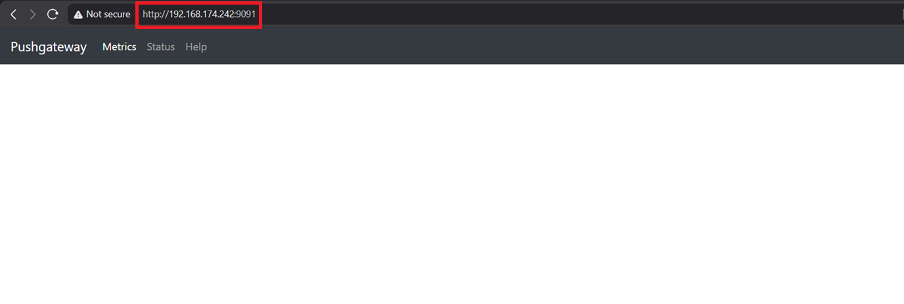
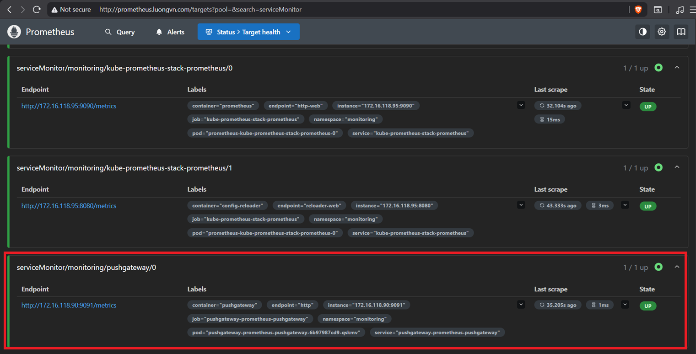
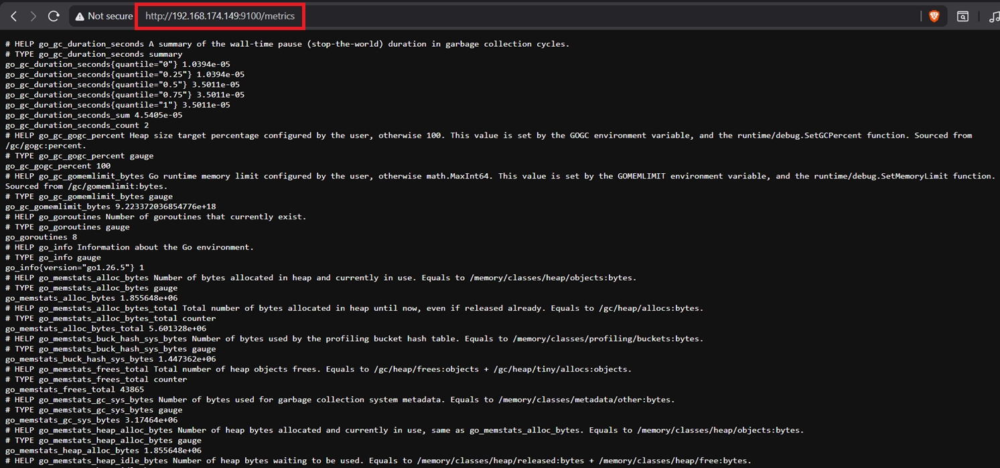
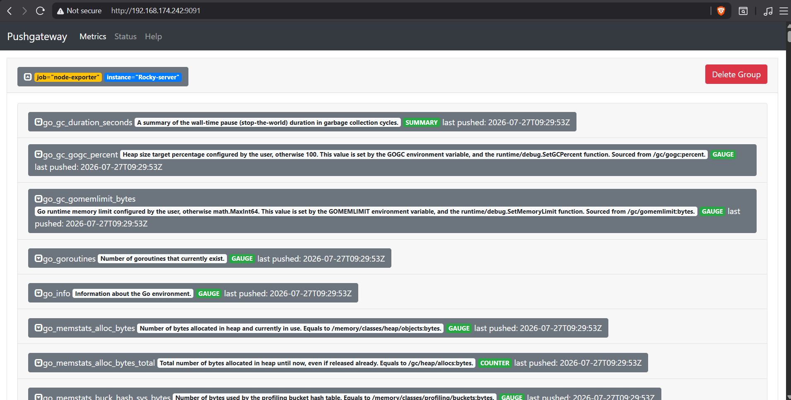
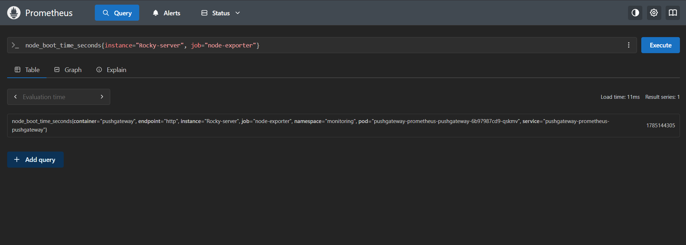
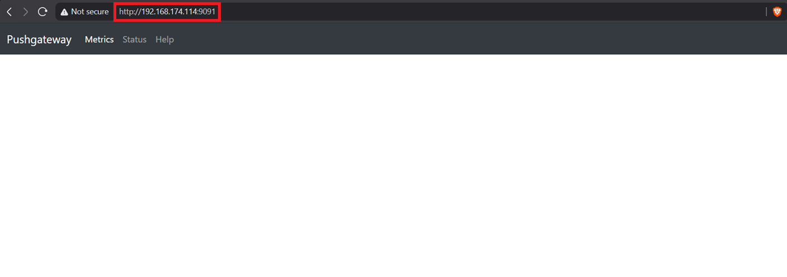
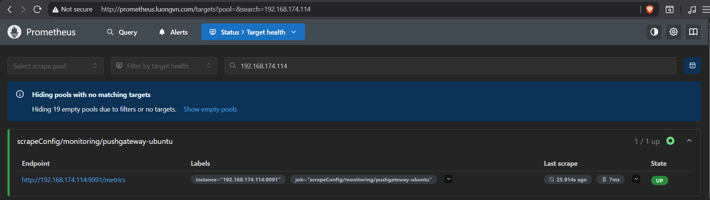
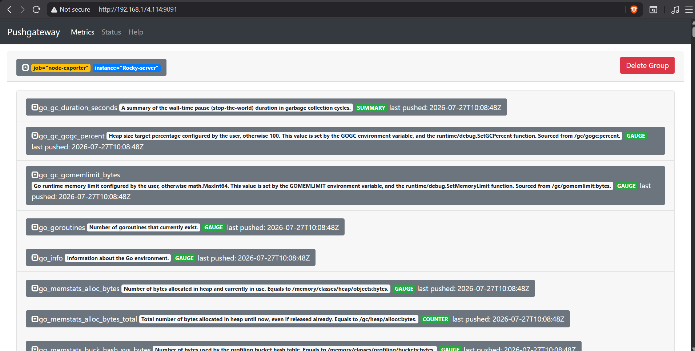
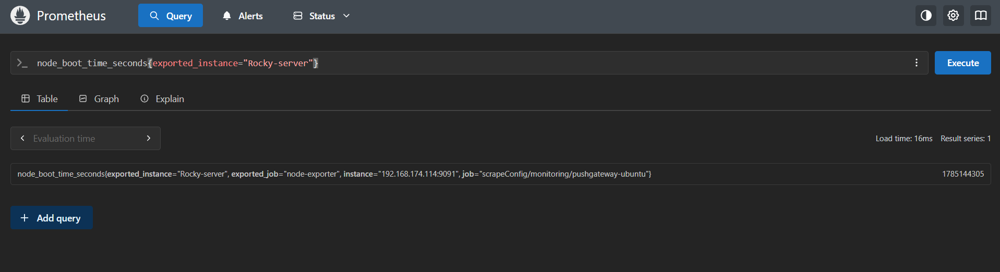

# Mục lục

- [Mục lục](#mục-lục)
- [Pushgateway](#pushgateway)
  - [I. Tổng quan về Pushgateway](#i-tổng-quan-về-pushgateway)
  - [II. Cài đặt Pushgateway](#ii-cài-đặt-pushgateway)
    - [2.0 Cài pushgateway trên cụm K8s sử dụng helm](#20-cài-pushgateway-trên-cụm-k8s-sử-dụng-helm)
      - [2.0.0 Cài đặt Pushgateway](#200-cài-đặt-pushgateway)
      - [2.0.1 Cấu hình Prometheus](#201-cấu-hình-prometheus)
      - [2.0.2 Cấu hình push metric lên pushgateway](#202-cấu-hình-push-metric-lên-pushgateway)
    - [2.1 Cài pushgateway ngoài cụm K8s sử dụng Docker](#21-cài-pushgateway-ngoài-cụm-k8s-sử-dụng-docker)
      - [2.1.0 Cài đặt pushgateway trên ubuntu](#210-cài-đặt-pushgateway-trên-ubuntu)
      - [2.1.1 Cấu hình Prometheus](#211-cấu-hình-prometheus)
      - [2.1.2 Cấu hình push metric lên pushgateway](#212-cấu-hình-push-metric-lên-pushgateway)


# Pushgateway 

## I. Tổng quan về Pushgateway 

Trong prometheus, khi ta sử dụng pull tức là trên các node cần giám sát ta sẽ cài exporter để thu thập các metric. Prometheus sẽ truy cập vào web của metric để pull các metric về. Nhưng nếu ta có các công việc ngắn hạn, tạm thời thì có thể đẩy metric tới pushgateway. Pushgateway không bao giờ xóa các chuỗi được đẩy đến nó và sẽ hiển thị chúng mãi mãi trừ khi ta xóa nó theo cách thủ công. 

Khi giám sát nhiều instance thông qua một pushgateway duy nhất, nó sẽ trở thành 1 điểm fail duy nhất và có thể nghẽn dữ liệu nếu quá nhiều metric đều đổ về đây 

Các label trong pushgateway mặc định sẽ là `job="pushgateway` và `instance` sẽ là `ip:port` của pushgateway

Khi push metric lên pushgateway, ta nên đặt các lable cho metric. Để đặt label hãy áp dụng cấu trúc sau: 

```bash
/metrics/job/<job_value>/<instance>/<instance_value>/<label_name>/<label_value>
```

## II. Cài đặt Pushgateway

### 2.0 Cài pushgateway trên cụm K8s sử dụng helm 

#### 2.0.0 Cài đặt Pushgateway 

- Thêm repo của prometheus

```bash
helm repo add prometheus-community https://prometheus-community.github.io/helm-charts
helm repo update
```

- Cài đặt chart pushgateway, ở đây tôi muốn expose pushgateway ra ngoài nên tôi sẽ sử dụng serivce là LoadBalancer. Việc expose ra ngoài cho phép các Exporter nằm ngoài cụm K8s có thể push metric lên 

```bash
helm -n monitoring install pushgateway prometheus-community/prometheus-pushgateway \ 
  --set service.type=LoadBalancer 
```

- Kiểm tra: 

```bash
devops@k8s-master-01:~$ k get all -n monitoring | grep pushgateway
pod/pushgateway-prometheus-pushgateway-6b97987cd9-qskmv        1/1     Running                  0              11m
service/pushgateway-prometheus-pushgateway               LoadBalancer   10.102.193.162   192.168.174.242   9091:30856/TCP               11m
deployment.apps/pushgateway-prometheus-pushgateway         1/1     1            1           11m
replicaset.apps/pushgateway-prometheus-pushgateway-6b97987cd9        1         1         1       11m
```

- Truy cập trên browser: 



#### 2.0.1 Cấu hình Prometheus 

- Ta sẽ thêm ServiceMonitor để Prometheus có thể pull metric từ pushgateway 

```yaml
apiVersion: monitoring.coreos.com/v1
kind: ServiceMonitor
metadata:
  name: pushgateway
  namespace: monitoring
  labels:
    release: kube-prometheus-stack    

spec:
  selector:
    matchLabels:
      app.kubernetes.io/name: prometheus-pushgateway

  namespaceSelector:
    matchNames:
      - monitoring

  endpoints:
    - port: http
      honorLabels: true
      path: /metrics
      interval: 15s
```

- Áp dụng: 

```bash
kubectl apply -f pushgateway-servicemonitor.yaml
```

- Kiểm tra trên web interface của Prometheus: 



#### 2.0.2 Cấu hình push metric lên pushgateway 

Ta sử dụng 1 server Linux chạy Node Exporter. Ta sẽ thử đẩy tất cả các metric của node exporter lên pushgateway và prometheus sẽ thu thập các metrics của node Linux này từ pushgateway 

- Server Linux tôi sử dụng sẽ là: Rocky9: `192.168.174.149`



- Sử dụng lệnh sau để push metric: 

```bash
curl -s 192.168.174.149:9100/metrics | curl --data-binary @- http://192.168.174.242:9091/metrics/job/node-exporter/instance/Rocky-server
```

- Kiểm tra trên web interface của Pushgateway: 



- Metric đã được lưu trên pushgateway 

- Trên Prometheus, ta sẽ thử query 1 metric với 2 label là `instance="rocky-server"` và `job="node-exporter"`: 



Như vậy prometheus đã thu thập được metric của node exporter thông qua pushgateway. Tuy nhiên nếu máy chạy node_exporter chết nó sẽ không thể gửi được các metric lên pushgateway và pushgateway vẫn sẽ lưu metric được push mới nhất và không đảm bảo realtime trạng thái máy chủ. Nên pushgateway chỉ nên sử dụng cho những job ngắn hạn.

### 2.1 Cài pushgateway ngoài cụm K8s sử dụng Docker

#### 2.1.0 Cài đặt pushgateway trên ubuntu 

Ta sẽ sử dụng 1 server ubuntu: `192.168.174.114` để cài đặt pushgateway bằng Docker 

- Cài đặt Docker: 

```bash
apt update -y
apt install docker.io -y
```

- Chạy container pushgateway: 

```bash
docker run -d \
--name pushgateway \
-p9091:9091 \
--restart always \
prom/pushgateway:latest
```

- Kiểm tra Container: 

```bash
root@nfs-server-01:~# docker container ls -a
CONTAINER ID   IMAGE                     COMMAND              CREATED          STATUS          PORTS                                         NAMES
1b999da7c21b   prom/pushgateway:latest   "/bin/pushgateway"   16 seconds ago   Up 16 seconds   0.0.0.0:9091->9091/tcp, [::]:9091->9091/tcp   pushgateway
```

- Truy cập thử trên browser: 



#### 2.1.1 Cấu hình Prometheus

- Ta sẽ sử dụng CRD `scrapeconfig` để có thể pull metric từ pushgateway: `192.168.174.114:9091`

```yaml
apiVersion: monitoring.coreos.com/v1alpha1
kind: ScrapeConfig
metadata:
  name: pushgateway-ubuntu
  namespace: monitoring
  labels: 
    release: kube-prometheus-stack 
spec:
  staticConfigs:
    - targets:
      - 192.168.174.114:9091
```

- Kiểm tra target trên web interface prometheus: 




#### 2.1.2 Cấu hình push metric lên pushgateway 

- Làm tương tự như bước [2.0.2](#202-cấu-hình-push-metric-lên-pushgateway) ta sử dụng câu lệnh sau trên Rocky-server (Hãy nhớ đổi IP của Pushgateway): 

```bash
curl -s 192.168.174.149:9100/metrics | curl --data-binary @- http://192.168.174.114:9091/metrics/job/node-exporter/instance/Rocky-server
```

- Kiểm tra trên web interface của pushgateway: 



- Truy vấn trên Prometheus: 

