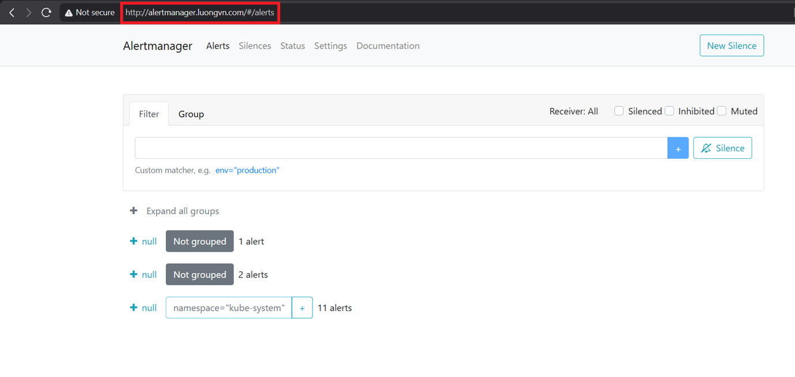

# Mục lục 

- [Mục lục](#mục-lục)
- [Alertmanager](#alertmanager)
  - [I. Tổng quan về Alerting](#i-tổng-quan-về-alerting)
  - [II. Alertmanager](#ii-alertmanager)
    - [2.0 Grouping](#20-grouping)
    - [2.1 Inhibition](#21-inhibition)
    - [2.2 Silences](#22-silences)
    - [2.3 Option Alert limits](#23-option-alert-limits)
  - [III. Cài đặt Alertmanager](#iii-cài-đặt-alertmanager)
    - [3.0 Cài đặt Alertmanager trên cụm K8s](#30-cài-đặt-alertmanager-trên-cụm-k8s)


# Alertmanager 

## I. Tổng quan về Alerting 

Việc cảnh báo với Prometheus được chia thành 2 phần: 

- Các quy tắc cảnh báo (Alerting rules) trên máy chủ Prometheus sẽ gửi cảnh báo đến Alertmanager. 
- Alertmanager sẽ quản lý các cảnh báo này, bao gồm silencing, inhibition, aggregation và gửi thông báo qua các phương thức như email, chat platforms

Các bước chính để thiết lập cảnh báo và thông báo bao gồm: 

1. Cài đặt và cấu hình Alertmanager 
2. Cấu hình để Prometheus kết nối với Alertmanager
3. Tạo các alerting rules trong Prometheus 

## II. Alertmanager 

Alertmanager đảm nhận việc xử lý các cảnh báo được gửi từ các ứng dụng client (như Prometheus server). 

Alertmanager có thể: 

- lọc trùng lặp (deduplicating) 
- Grouping
- định tuyến (routing) cảnh báo đến đúng kênh nhận thông báo như email
- silencing
- inhibition

### 2.0 Grouping

Gom nhóm giúp phân loại các cảnh báo có bản chất tương tự nhau vào một thông báo duy nhất. Điều này đặc biệt hữu ích trong các sự cố lớn, khi nhiều hệ thống cùng hỏng một lúc và hàng trăm đến hàng nghìn cảnh báo có thể kích hoạt đồng thời. 

**Ví dụ:** 

- Hàng chục hoặc hàng trăm instance của một dịch vụ đang chạy trong cluster thì xảy ra sự cố về Network. Một nửa số instance không thể kết nối tới database. Các alerting rule trong Prometheus được cấu hình để gửi cảnh báo cho từng instance nếu nó không thể kết nối được tới db. Kết quả là hàng trăm cảnh báo được gửi đến Alertmanager 
- Là người dùng, ta chỉ muốn nhận 1 tin báo sự cố duy nhất nhưng vẫn có thể thấy chính xác những instance nào đang bị ảnh hưởng. Do đó, ta có thể cấu hình Alertmanager gom nhóm các cảnh báo theo `cluster` và `alertname` để nó gửi 1 thông báo duy nhất - gọn gàng 

### 2.1 Inhibition 

Inhibition là khái niệm ẩn hoặc đình chỉ thông báo của một số cảnh báo nhất định nếu một cảnh báo khác liên quan đã và đang kích hoạt 

**Ví dụ:** 

- 1 cảnh báo đang kích hoạt thông báo rằng toàn bộ cluster không thể truy cập được. Alertmanager có thể được cấu hình để tắt tiếng tất cả các cảnh báo khác liên quan đến cluster này khi cảnh báo tổng đó đang bật.

### 2.2 Silences

Silence là cách đơn giản để tạm thời ngắt thông báo của các cảnh báo trong một khoảng thời gian nhất định. 

Các cảnh báo gửi đến sẽ được kiểm tra xem có khớp với tất cả các matcher của 1 Silence đang hoạt động hay không. Nếu khớp, sẽ không có thông báo nào được gửi đi.

### 2.3 Option Alert limits 

Alertmanager hỗ trợ cấu hình giới hạn số lượng cảnh báo đang hoạt động cho mỗi `alertname` bằng cờ `[--alerts.per-alertname-limit]`

Metric `alertmanager_alerts_limited_total` hiển thị tổng số cảnh báo đã bị bỏ qua do vượt quá limit. Bật flag `alert-names-in-metrics` sẽ thêm label `alertname` vào metric này 

## III. Cài đặt Alertmanager 

### 3.0 Cài đặt Alertmanager trên cụm K8s 

- Tôi đã cài Prometheus bằng Prometheus Operator thông qua Helm, vì vậy mặc định tôi đã có Alertmanager trên cụm K8s và các resource của Prometheus cũng đã được trỏ đến Alertmanager 

```bash
devops@k8s-master-01:~$ kubectl get all -n monitoring | grep alert
pod/alertmanager-kube-prometheus-stack-alertmanager-0          2/2     Running                  8 (3h2m ago)    2d3h
service/alertmanager-operated                            ClusterIP      None             <none>            9093/TCP,9094/TCP,9094/UDP   5d7h
service/kube-prometheus-stack-alertmanager               ClusterIP      10.107.201.190   <none>            9093/TCP,8080/TCP            5d7h
statefulset.apps/alertmanager-kube-prometheus-stack-alertmanager   1/1     5d7h
```

- Ở đây, tôi sẽ expose Alertmanager ra ngoài bằng cách thêm ingress cho Alertmanager

```bash
helm upgrade kube-prometheus-stack prometheus-community/kube-prometheus-stack \
  -n monitoring \
  --reuse-values \
  --set alertmanager.ingress.enabled=true \ 
  --set alertmanager.ingress.ingressClassName=nginx \
  --set alertmanager.ingress.hosts[0]=alertmanager.luongvn.com
```

- Kiểm tra ingress trên hệ thống: 

```bash
devops@k8s-master-01:~$ k get ingress -A
NAMESPACE    NAME                                 CLASS   HOSTS                      ADDRESS           PORTS   AGE
monitoring   kube-prometheus-stack-alertmanager   nginx   alertmanager.luongvn.com                     80      26s
monitoring   kube-prometheus-stack-grafana        nginx   grafana.luongvn.com        192.168.174.241   80      3h45m
monitoring   kube-prometheus-stack-prometheus     nginx   prometheus.luongvn.com     192.168.174.241   80      3h45m
nextcloud    nextcloud-ingress                    nginx   nextcloud.vnpt.com         192.168.174.241   80      15d
```

- Add host và Truy cập trên browser: 


