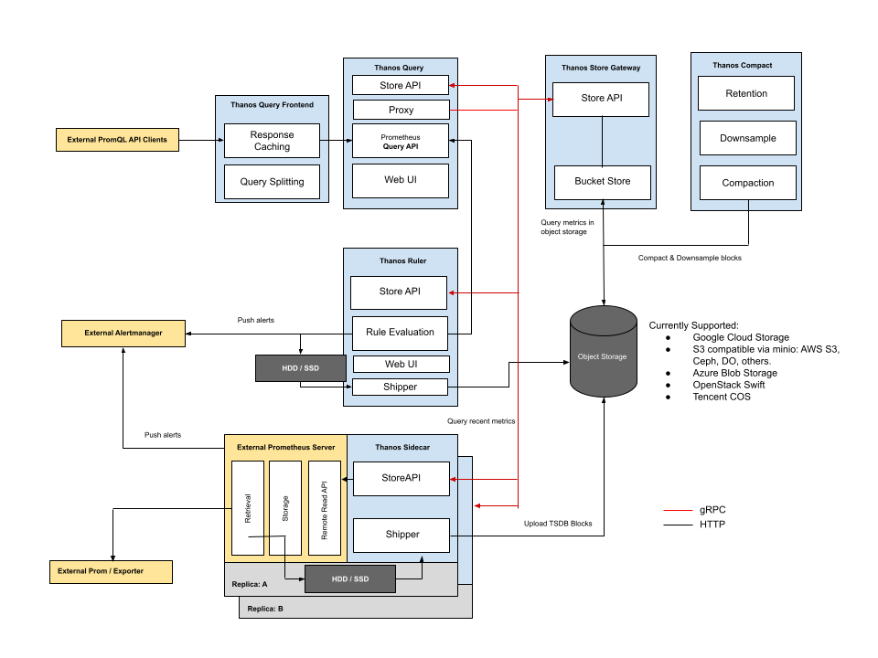

# Mục lục 

- [Mục lục](#mục-lục)
- [Kiến trúc Thanos](#kiến-trúc-thanos)
  - [I. Thanos là gì trong hệ sinh thái Prometheus ?](#i-thanos-là-gì-trong-hệ-sinh-thái-prometheus-)
  - [II. Tại sao cần dùng Thanos thay vì chỉ dùng Prometheus](#ii-tại-sao-cần-dùng-thanos-thay-vì-chỉ-dùng-prometheus)
  - [III. Kiến trúc và các thành phần Thanos](#iii-kiến-trúc-và-các-thành-phần-thanos)
    - [3.0 Sidecar](#30-sidecar)
    - [3.1 Store API](#31-store-api)
    - [3.2 Querier/Query](#32-querierquery)
    - [3.3 Store Gateway](#33-store-gateway)
    - [3.4 Compactor](#34-compactor)
    - [3.5 Ruler / Rule](#35-ruler--rule)
- [Tài liệu tham khảo](#tài-liệu-tham-khảo)


# Kiến trúc Thanos 

## I. Thanos là gì trong hệ sinh thái Prometheus ? 

Trong Prometheus, Thanos là một bộ công cụ mở rộng giúp: 

- Kết nối nhiều Prometheus lại với nhau 
- Lưu trữ dữ liệu giám sát dài hạn 
- Đảm bảo hệ thống vẫn hoạt động khi một Prometheus bị lỗi (HA) 
- Cho phép truy vấn dữ liệu tập trung (global query) trên nhiều Prometheus 

## II. Tại sao cần dùng Thanos thay vì chỉ dùng Prometheus 

Prometheus rất tốt cho giám sát hệ thống đơn cụm, nhưng nó có các giới hạn: 

- Không lưu trữ dữ liệu lâu dài 
- Không hỗ trợ HA 
- Không dễ dàng truy vấn từ nhiều cụm Prometheus khác nhau 

Thanos ra đời để giải quyết tất cả những vấn đề này: 

- Hỗ trợ HA 
- Lưu trữ dài hạn trên S3/Object Storage 
- Truy vấn dữ liệu toàn cục từ nhiều cụm 
- Hiển thị một góc nhìn toàn hệ thống từ nhiều Prometheus 

## III. Kiến trúc và các thành phần Thanos 

Tuân theo triết lý KISS (Keep It Simple, Stupid) và triết lý Unix, Thanos được cấu thành từ một tập hợp các thành phần, trong đó mỗi thành phần đảm nhiệm một vai trò cụ thể: 

- `Sidecar`: Kết nối với Prometheus, đọc dữ liệu của Prometheus để phục vụ truy vấn và tải dữ liệu đó lên Object Storage 
- `Store Gateway`: Cung cấp dữ liệu metric được lưu trữ trong Object Storage Bucket 
- `Compactor`: Thực hiện compact, downsample và áp dụng retention policy đối với dữ liệu được lưu trong Object Storage Bucket.
- `Receiver`: Nhận dữ liệu từ WAL của Prometheus, cung cấp dữ liệu đó để truy vấn và tải dữ liệu lên object storage 
- `Ruler (Rule)`: Thực thi các Recording Rule và Alerting Rule trên dữ liệu trong Thanos để expose và tải kết quả lên Object Storage
- `Querier (Query)`: Triển khai Prometheus HTTP v1 API nhằm tổng hợp dữ liệu từ các thành phần bên dưới và cung cấp một giao diện truy vấn thống nhất.
- `Query Frontend`: Cũng triển khai Prometheus HTTP v1 API, nhưng hoạt động như một lớp proxy đứng trước Querier. Thành phần này hỗ trợ cache kết quả truy vấn và tùy chọn chia nhỏ các truy vấn theo từng ngày nhằm cải thiện hiệu năng.




### 3.0 Sidecar 

Thanos tích hợp với các máy chủ Prometheus hiện có thông qua một tiến trình sidecar. Tiến trình này chạy trên cùng một máy hoặc trong cùng một Pod với Prometheus server 

Sidecar có 2 nhiệm vụ chính: 

- Cung cấp StoreAPI (gRPC): Sidecar triển khai StoreAPI của Thanos trên dữ liệu Prometheus. Nhờ đó, các thành phần như Thanos Query có thể truy vấn Prometheus thông qua giao thức gRPC thay vì gọi trực tiếp Prometheus API 
- Upload block lên object storage: Sau mỗi khoảng 2 giờ, Prometheus tạo ra một TSDB block mới. Sidecar sẽ upload lên Object storage để có thể lưu trữ dữ liệu lâu dài 

### 3.1 Store API

Thành phần Thanos Sidecar triển khai và cung cấp một gRPC Store API. Việc triển khai này cho phép truy vấn dữ liệu metric đang được lưu trữ trong Prometheus.

Cấu hình thiết lập Thanos Sidecar: 

```bash
thanos sidecar \
    --tsdb.path            /var/prometheus \
    --objstore.config-file bucket_config.yaml \      
    --prometheus.url       http://localhost:9090 \  
    --http-address         0.0.0.0:19191 \            
    --grpc-address         0.0.0.0:19090              
```

- `--tsdb.path`: Chỉ định thư mục chứa cơ sở dữ liệu TSDB của Prometheus 
- `objstore.config-file`: Chỉ định tệp cấu hình Object Storage (MinIO, S3, GCS,...) để Sidecar có thể upload các TSDB Block.
- `--prometheus.url`: Địa chỉ HTTP của Prometheus mà Sidecar sẽ kết nối tới để đọc dữ liệu và lấy metadata.
- `--http-address`: Địa chỉ HTTP mà Sidecar sẽ lắng nghe
- `--grpc-address`: Địa chỉ gRPC mà Sidecar sẽ mở để cung cấp Store API. Đây là endpoint mà các thành phần khác của Thanos (đặc biệt là Thanos Query) sẽ kết nối tới để truy vấn dữ liệu Prometheus.

### 3.2 Querier/Query 

Thành phần Thanos Querier là stateless và có thể mở rộng theo chiều ngang. Ta có thể triển khai bao nhiêu replica của Querier tùy ý. 

Sau khi được kết nối với các Thanos Sidecar, Querier sẽ tự động xác định Prometheus nào cần được truy vấn cho từng câu lệnh PromQL 

Ngoài ra, Thanos Querier còn triển khai HTTP API chính thức của Prometheus, vì vậy nó có thể được sử dụng với các công cụ bên ngoài như Grafana. Querier cũng cung cấp một giao diện Web (UI) được phát triển dựa trên giao diện của Prometheus

### 3.3 Store Gateway 

Khi Thanos Sidecar sao lưu dữ liệu lên Object Storage Bucket, ta có thể giảm thời gian lưu trữ (retention) của Prometheus để chỉ giữ một lượng dữ liệu nhỏ trên máy cục bộ.

Tuy nhiên, chúng ta vẫn cần một cách để truy vấn lại toàn bộ dữ liệu lịch sử đó

Store Gateway chính là thành phần đảm nhiệm việc này. Nó triển khai cùng một gRPC Store API như Sidecar, nhưng thay vì đọc dữ liệu từ Prometheus, nó đọc dữ liệu được lưu trong Object Storage Bucket.

Tương tự như Sidecar và Querier, Store Gateway cũng cung cấp Store API và cần được Thanos Querier phát hiện để có thể truy vấn.

### 3.4 Compactor 

Một Prometheus cục bộ sẽ định kỳ compact dữ liệu cũ để tăng hiệu quả truy vấn. Vì Thanos Sidacar sao lưu dữ liệu lên object storage bucket ngay khi có thể, chúng ta cũng cần một cơ chế thực hiện quá trình compaction tương tự đối với dữ liệu đã được lưu trong bucket

Thanos Compactor sẽ quét Object Storage Bucket và thực hiện compaction khi cần thiết.

Đồng thời, Compactor cũng chịu trách nhiệm tạo các bản dữ liệu downsample nhằm tăng tốc độ truy vấn.

### 3.5 Ruler / Rule 

Trong trường hợp Prometheus chạy cùng Thanos Sidecar có thời gian lưu trữ (retention) không đủ dài, hoặc nếu bạn muốn xây dựng các alert hoặc recording rule cần có góc nhìn toàn cục (global view) trên toàn hệ thống, Thanos cung cấp một thành phần chuyên biệt cho việc đó: Ruler.

Thanos Ruler thực hiện việc đánh giá (evaluate) các recording rule và alerting rule dựa trên dữ liệu được truy vấn thông qua Thanos Querier.

# Tài liệu tham khảo 

https://thanos.io/tip/thanos/quick-tutorial.md/

https://ttnguyen.net/trien-khai-thanos-prometheus-grafana/#heading-5-2-2-c-c-th-nh-ph-n