# Dashboard cho giám sát trên Grafana sử dụng metric Node Exporter

Thực hành vẽ Dashboard trên Grafana cho metric Node Exporter 

## I. Sử dụng Dashboard có sẵn cho Node Exporter 

### 1.0 Tổng quan về Dashboard Node Exporter Full (ID: 1860) 

Dashboard Node Exporter Full (ID: 1860) là dashboard do cộng đồng đóng góp trên [grafana.com](https://grafana.com/). Đây là dashboard phổ biến nhất để giám sát Linux Server bằng Node Exporter. Dashboard này không tạo metric mới mà chỉ trực quan hóa các metric mà Node Exporter đã thu thập và Prometheus đã lưu 

Dashboard 1860 chủ yếu sử dụng các metric do Node Exporter cung cấp: 

- CPU: `node_cpu_seconds_total` - Hiện thị trạng thái CPU
- RAM: `node_memory_*` - Hiển thị trạng thái MEM
- DISK: `node_disk_*` - Hiển thị trạng thái DISK 
- Filesystem: `node_filesystem_*` - Hiển thị theo từng mount point - mỗi filesystem có: Used %, Free %, Total
- Network: `node_network_*` - Theo từng interface - Hiển thị: Receive Bytes/s, Transmit Bytes/s, Receive Packets, Errors, Drops
- Load: `node_load1`, `node_load5`, `node_load15` - Hiển thị trung bình có bao nhiêu tiến trình cần được CPU phục vụ trong 1p, 5p, 15p gần nhất 
- Process: `node_procs_*` - Giúp theo dõi các process trên Linux 
- Uptime: `node_boot_time_seconds` 
- Context Switch:	`node_context_switches_total` - Giúp phát hiện CPU bị chuyển đổi ngữ cảnh quá nhiều.
- Interrupt: `node_intr_total` - Đánh giá hoạt động của phần cứng và driver.

Dashboard 1860 được xem như dashboard tổng quan sức khỏe của 1 server Linux. Chỉ với 1 màn hình, ta có thể biết: 

- CPU có đang quá tải không ? 
- RAM còn bao nhiêu ? 
- Ổ đĩa có sắp đầy không ? 
- Có thiết bị nào đọc / ghi bất thường ? 
- Lưu lượng mạng có tăng đột biến không ? 
- Hệ thống đã chạy liên tục bao lâu ? 
- Có tiến trình hoặc tài nguyên nào đang gây quá tải không ? 

### 1.1 Thực hành import Dashboard 1860 

- Tại giao diện Grafana, chọn vào mục `Dashboard`: 

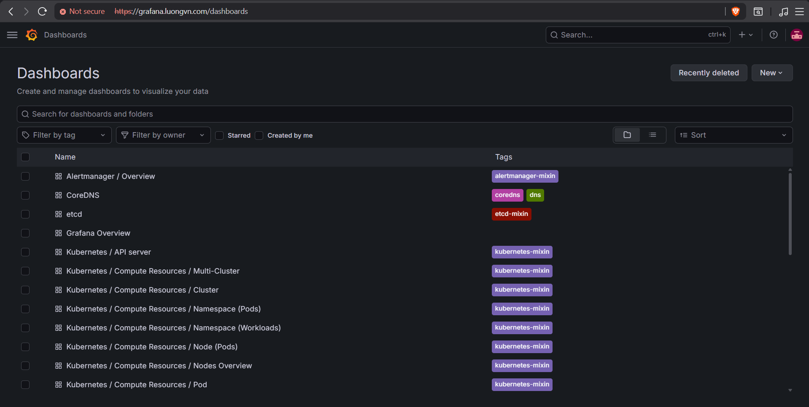

- Chọn `New` -> `Import Dashboard`:

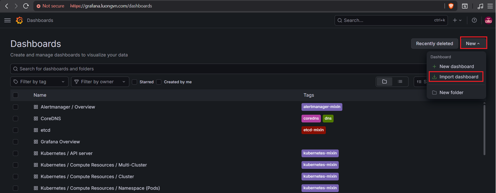

- Nhập dashboardID = 1860 và chọn `Load`: 

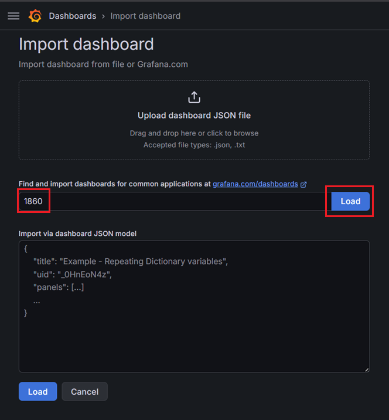

- Sau đó chọn `Import` và hệ thống hiển thị Dashboard: 

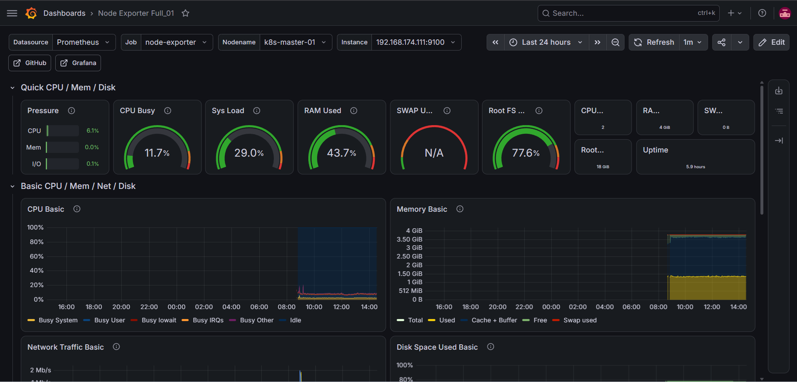

## II. Vẽ Dashboard cho metric Node Exporter 

### 2.0 Mục tiêu 

Tạo Dashboard có các nhóm sau: 

```bash
Node Overview
|--- CPU
|--- Memory
|--- Disk
|--- Network
|--- Filesystem
```

### 2.1 Thực hiện  

#### Bước 1: Tạo Dashboard 

- Trên giao diện Grafana: Chọn `Dashboard` -> `New` -> `New dashboard`

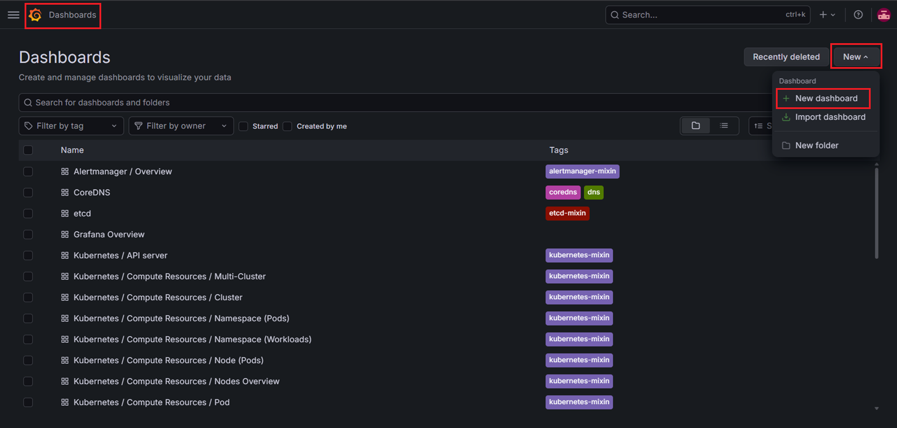

- Chọn thêm panel: 

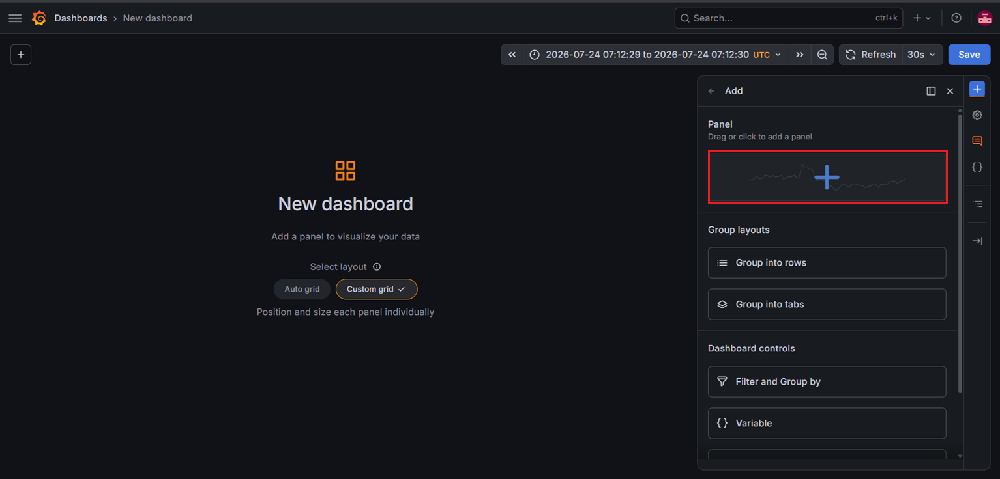

- Đặt tên cho Panel sau đó chọn `Configure visualization`: 

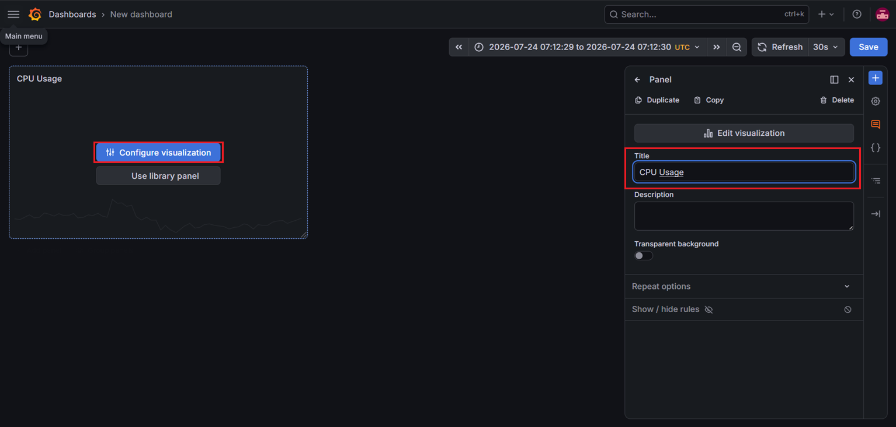

#### Bước 2: Thêm Variable 

Trước khi query cho từng panel, ta sẽ thêm variable cho dashboard mục đích là biến dashboard từ chỉ giám sát một server thành giám sát nhiều server và cho phép chuyển đổi giữa chúng bằng một menu dropdown.

- Chọn setting: 

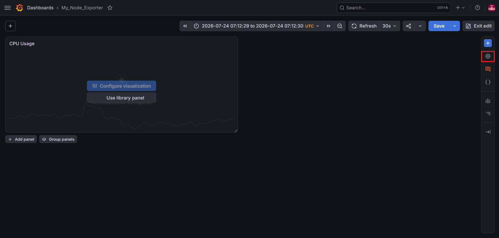

- Chọn Add variable: 

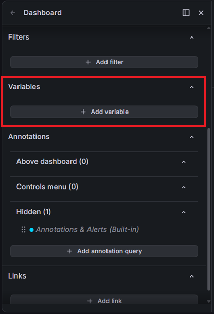

- Chọn Query: 

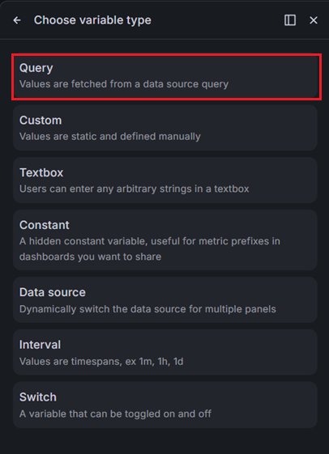

- Đặt tên cho Variable (Ở đây là `instance`) sau đó Chọn `Open variable editor`: 

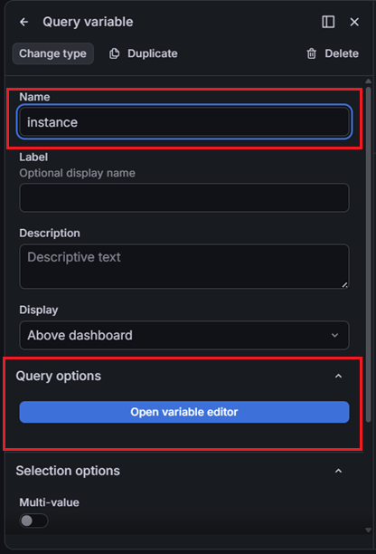

- Chọn Query type: `Label values` -> Metric: `node_uname_info` -> Label: `instance` -> Chọn Preview

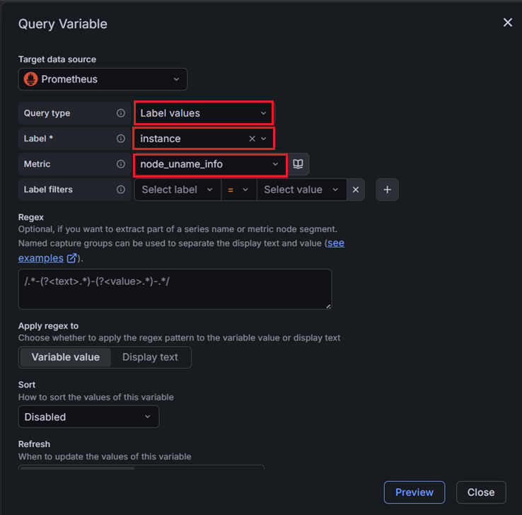

- Nếu thấy hiện ra thông tin của các Node thì đã thành công: 

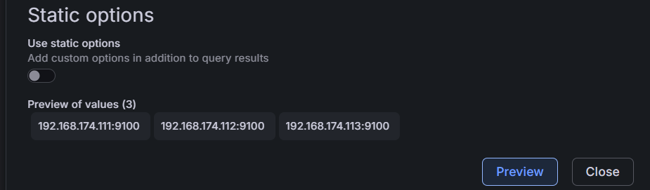

#### Bước 3: Query cho Panel 1 - CPU Usage 

- Đây là giao diện để ta thêm Query cho Panel: 

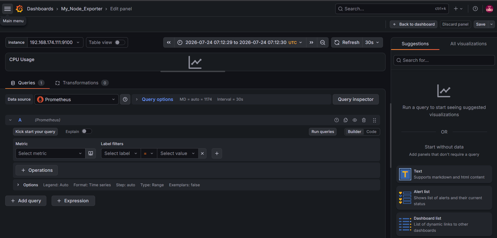

- Vì ta muốn xem thông tin về CPU đã dùng trong panel này, nên ta sẽ chọn metric là `node_cpu_seconds_total` với label là `idel` và `instance` và ta sẽ dùng biểu đồ gauge để xem được % CPU đã sử dụng tại thời điểm hiện tại 


  ```promql
  100 - (avg by(instance)(rate(node_cpu_seconds_total{mode="idle",instance="$instance"}[5m])) * 100) 
  ```

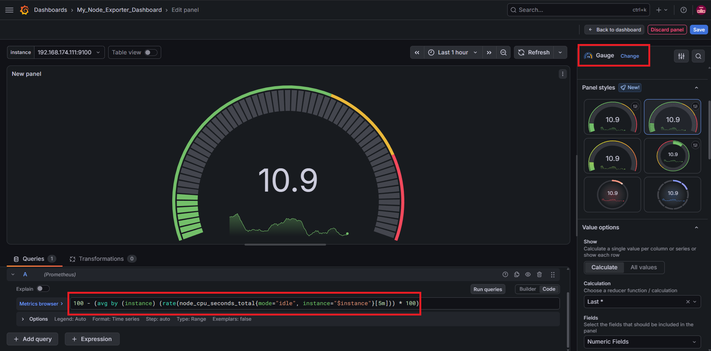

#### Bước 4: Query cho Panel 2 - Load Average 

- Ta muốn xem thông tin trong 1 phút vừa qua trung bình có bao nhiêu tiến trình được CPU phục vụ, nên ta sẽ chọn metric là `node_load1` và biểu đồ stat 

  ```promql
  node_load1{instance="$instance"}
  ```

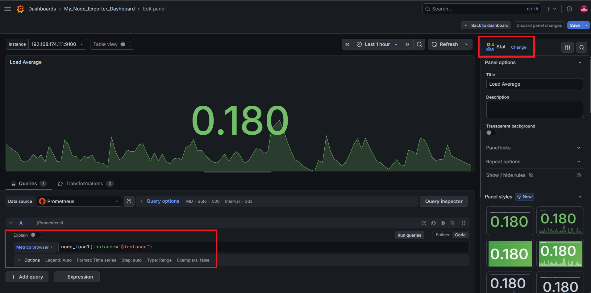

#### Bước 5: Query cho Panel 3 - CPU Core Count 

- Ta muốn xem số lượng core CPU của từng instance, nên ta vẫn sẽ sử dụng metric `node_cpu_seconds_total` với label là `mode` và `instance` để lọc ra số lượng metrics của từng node chính là số lượng core cpu của node đó và sử dụng biểu đồ `stat`

  ```promql
  count by(instance) (node_cpu_seconds_total{mode="idle", instance="$instance"})
  ```

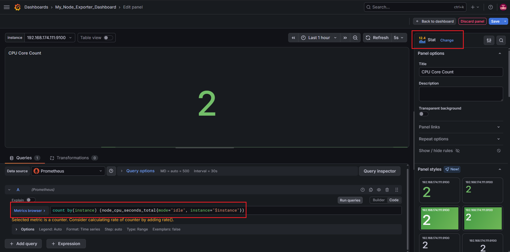

#### Bước 6: Query cho Panel 4 - Memory Usage 

- Ta muốn xem % lượng MEM đã sử dụng của từng instance, nên ta sẽ sử dụng metric `node_memory_MemAvailable_bytes`: số lượng MEM (tính bằng byte) còn trống và `node_memory_MemTotal_bytes`:tổng số lượng MEM (tính bằng byte) và sử dụng biểu đồ `gauge`:

  ```promql
  (1 - (node_memory_MemAvailable_bytes{instance="$instance"} / node_memory_MemTotal_bytes{instance="$instance"})) * 100
  ```

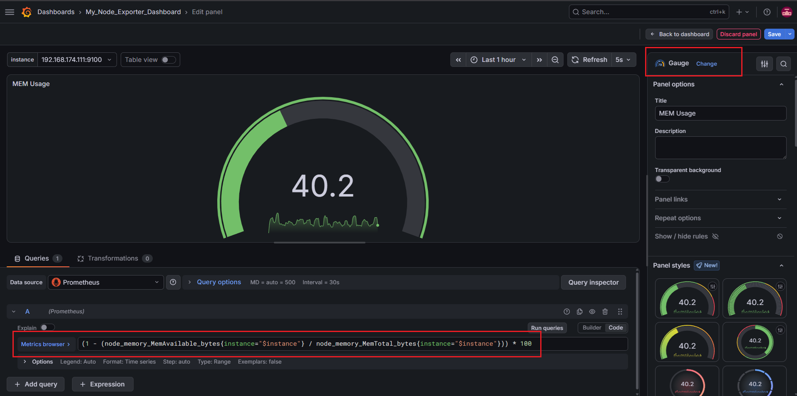

#### Bước 7: Query cho Panel 5 - Filesystem Space Available

- Ta muốn xem dung lượng còn có thể sử dụng của các filesystem trên 1 instance, nên ta sẽ sử dụng metric `node_filesystem_avail_bytes` với label là `instance` và sử dụng biểu đồ `timeseries`

  ```promql
  node_filesystem_avail_bytes{instance="$instance"}
  ```

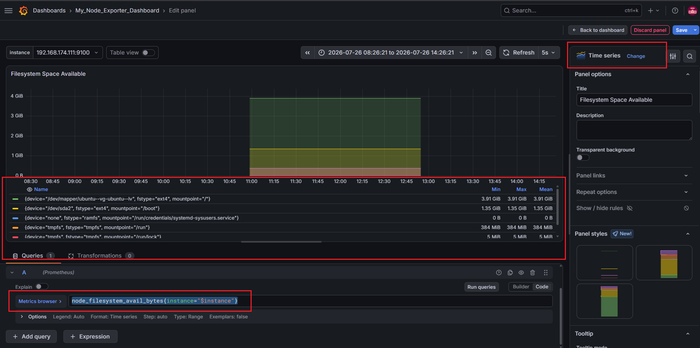

- Ở đây, tôi muốn hiển thị giá trị Max, Min, Mean của từng filesystem. Do đó, ở cột setting bên phải phần click vào `values` sau đó chọn `Max, Min, Mean`: 

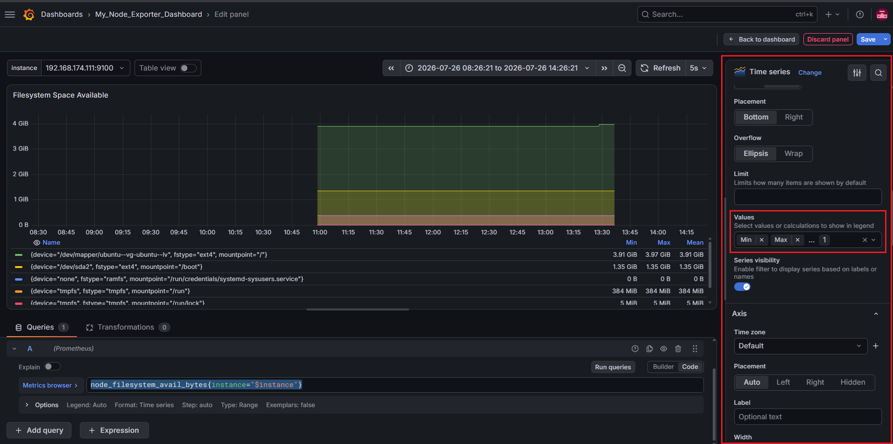

#### Bước 8: Query cho Panel 6 - Filesystem Used 

- Tương tự như Panel 5, lần này tôi muốn xem dung lượng đã sử dụng của từng filesystem 

  ```promql
  node_filesystem_size_bytes{instance="$instance"} - node_filesystem_avail_bytes{instance="$instance"}
  ```

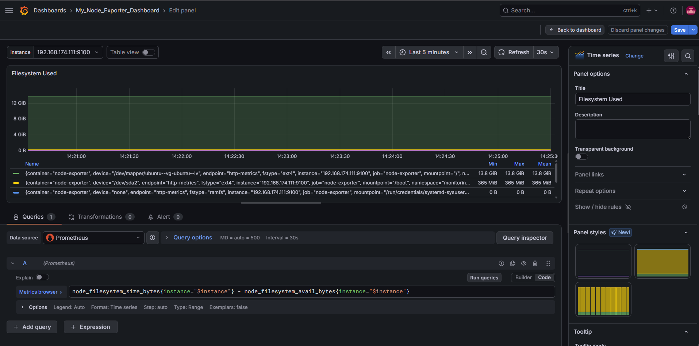

#### Bước 9: Query cho Panel 7 - Network Traffic 

- Tôi muốn xem bằng thông mạng của từng node: Tốc độ nhận dữ liệu và tốc độ gửi dữ liệu
- Ta sẽ sử dụng 2 metric là: `node_network_receive_bytes_total` và `node_network_transmit_bytes_total`

  ```promql
  rate(node_network_receive_bytes_total{instance="$instance"}[5m])
  ```

  ```promql
  rate(node_network_transmit_bytes_total{instance="$instance"}[5m])
  ```

- Tôi vẫn muốn hiển thị giá trị Min, Max, Mean do đó phần values trong setting tôi vẫn chọn 3 giá trị này 
- Phần option cho Unit, bạn hãy để là BYTES/SEC(SI): 

  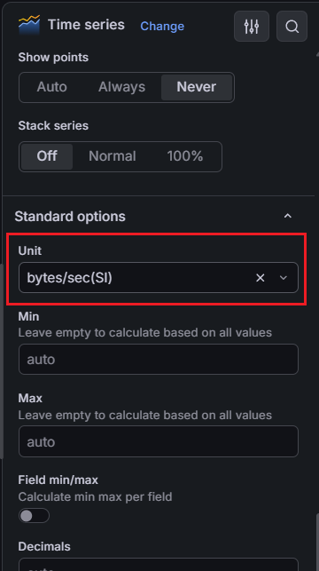

- Để có thể hiển thị rõ ràng tên card(ens33/lo,...) cũng như loại traffic(receive/transmit) ta sẽ thêm Legend cho từng query: 

  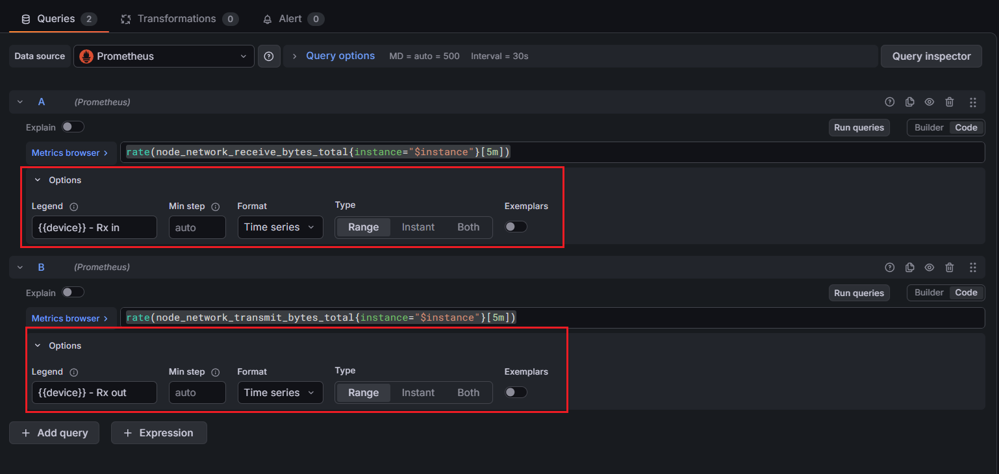

- Kết quả sẽ được như sau: 

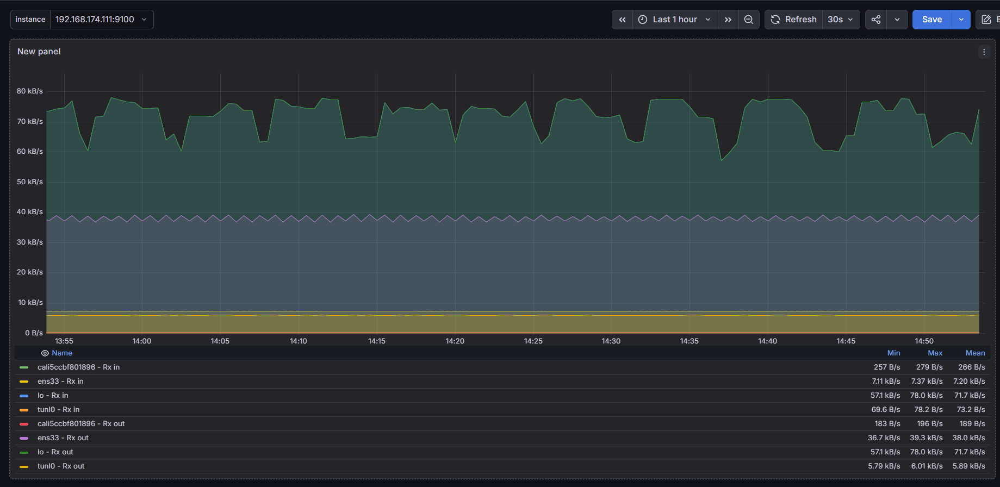

