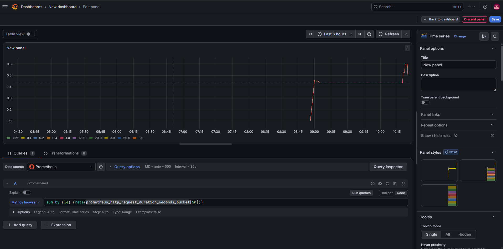
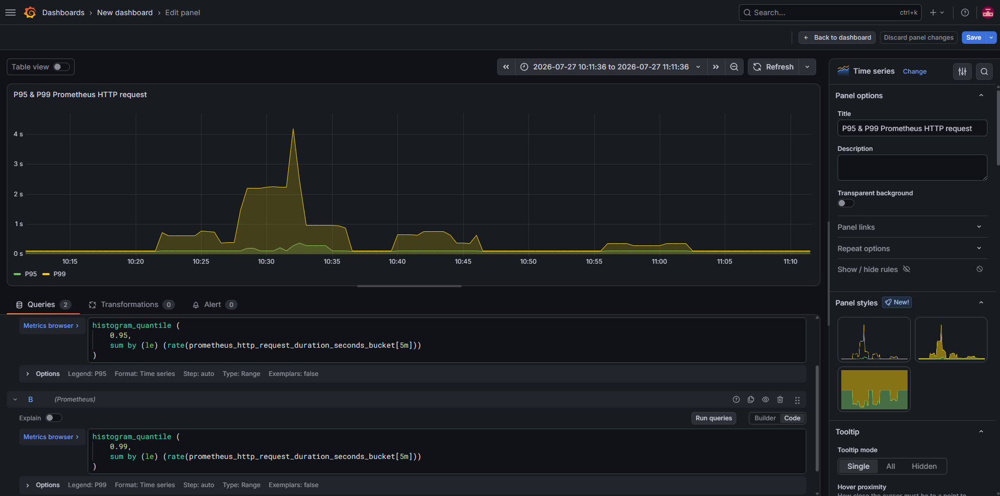
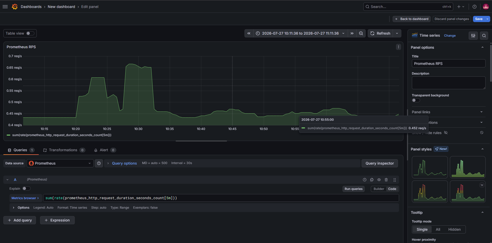
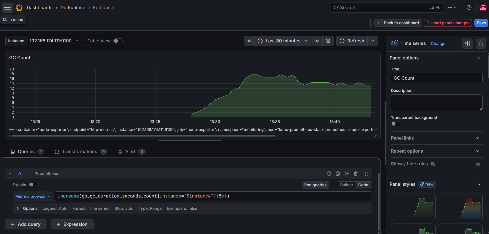
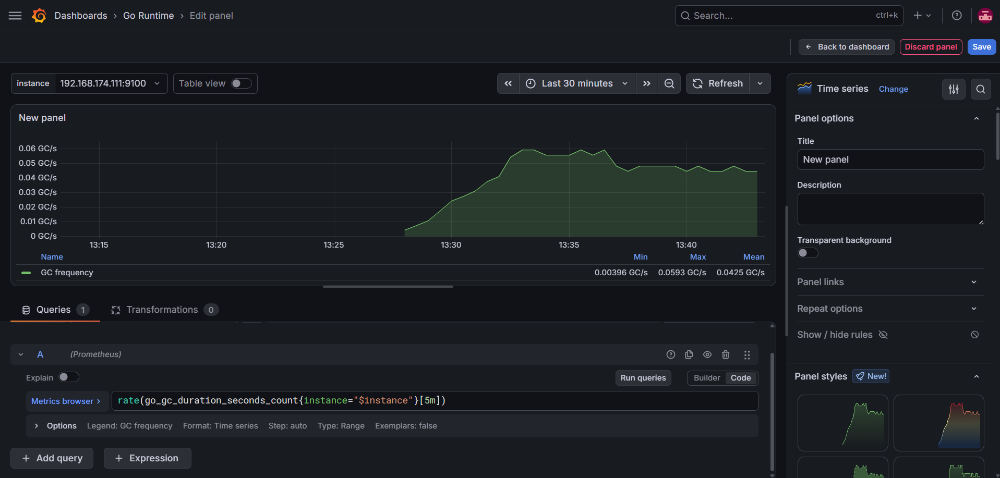
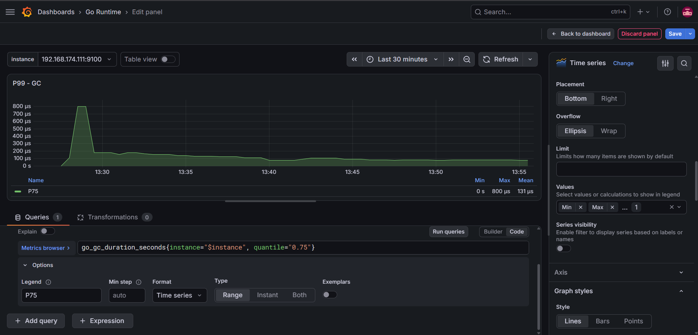
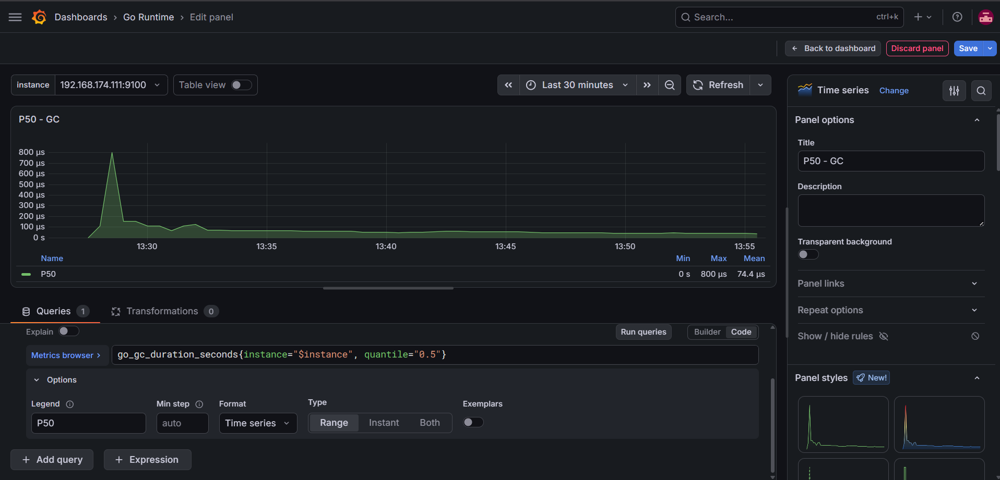

# Mục lục 

- [Mục lục](#mục-lục)
- [Dashboard Grafana với từng loại metrics](#dashboard-grafana-với-từng-loại-metrics)
  - [I. Metric Histogram](#i-metric-histogram)
    - [1.0 Xem tốc độ request của từng bucket trong 5p gần nhất](#10-xem-tốc-độ-request-của-từng-bucket-trong-5p-gần-nhất)
    - [1.1 Tính P95, P99](#11-tính-p95-p99)
    - [1.2 Tính RPS trên toàn hệ thống](#12-tính-rps-trên-toàn-hệ-thống)
  - [II. Metric Summary](#ii-metric-summary)
    - [2.0 Garbage Collection (GC) là gì ?](#20-garbage-collection-gc-là-gì-)
    - [2.1 Các metric của `go_gc_duration_seconds`](#21-các-metric-của-go_gc_duration_seconds)
    - [2.2 Cách sử dụng metric này trên Grafana](#22-cách-sử-dụng-metric-này-trên-grafana)
      - [2.2.0 Query số lần GC trong 5p vừa qua](#220-query-số-lần-gc-trong-5p-vừa-qua)
      - [2.2.1 Tần suất GC](#221-tần-suất-gc)
      - [2.2.2 Quantile](#222-quantile)


# Dashboard Grafana với từng loại metrics 

Cách dùng các loại metrics để cấu hình trên Grafana

## I. Metric Histogram 

### 1.0 Xem tốc độ request của từng bucket trong 5p gần nhất 

- Ở đây tôi sử dụng metric: `prometheus_http_request_duration_seconds_bucket`, vì với mỗi bucket sẽ là 1 counter nên ta sẽ dùng kèm hàm `rate` và sử dụng `sum by (le)` để chia dữ liệu của từng bucket khác nhau: 

  ```promql
  sum by (le) (rate(prometheus_http_request_duration_seconds_bucket[5m]))
  ```



- Ta có thể thấy đồ thị của từng bucket khá gần nhau, lý do là vì tốc độ request đang là khá nhỏ 

### 1.1 Tính P95, P99 

- Query: 

  ```promql
  histogram_quantile (
    0.95,
    sum by (le) (rate(prometheus_http_request_duration_seconds_bucket[5m]))
  )
  ```

  ```promql
  histogram_quantile (
    0.99,
    sum by (le) (rate(prometheus_http_request_duration_seconds_bucket[5m]))
  )
  ```



### 1.2 Tính RPS trên toàn hệ thống 

- Tôi muốn hiển thị RPS của toàn bộ instance Promethues, do đó ta sẽ sử dụng metric: `prometheus_http_request_duration_seconds_count`: tổng số query của toàn bộ bucket 

  ```promql
  sum(rate(prometheus_http_request_duration_seconds_count[5m]))
  ```



## II. Metric Summary 

- Trong tài liệu này ta sẽ dùng metric: `go_gc_duration_seconds` là metric summary do Node Exporter sinh ra 

### 2.0 Garbage Collection (GC) là gì ? 

Go sử dụng Garbage Collector để tự động giải phóng bộ nhớ không còn sử dụng. Trong quá trình này, có 1 khoảng thời gian rất ngắn mà chương trình phải dừng để collector hoạt động. Metric `go_gc_duration_seconds` đo chính khoảng thời gian đó 

### 2.1 Các metric của `go_gc_duration_seconds`

Summary sẽ sinh ra các metric như: 

- go_gc_duration_seconds_count: tổng số lần GC đã chạy
- go_gc_duration_seconds_sum: tổng thời gian pause
- go_gc_duration_seconds{quantile=""}

### 2.2 Cách sử dụng metric này trên Grafana 

#### 2.2.0 Query số lần GC trong 5p vừa qua

```promql
increase(go_gc_duration_seconds_count{instance="$instance"}[5m])
```

- Sử dụng kiểu time series 



#### 2.2.1 Tần suất GC 

```promql
rate(go_gc_duration_seconds_count{instance="$instance"}[5m])
```

- Sử dụng kiểu time series 



#### 2.2.2 Quantile 

- P75: 

  ```promql
  go_gc_duration_seconds{instance="$instance", quantile="0.75"}
  ```



- P50: 

  ```promql
  go_gc_duration_seconds{instance="$instance", quantile="0.5"}
  ```

