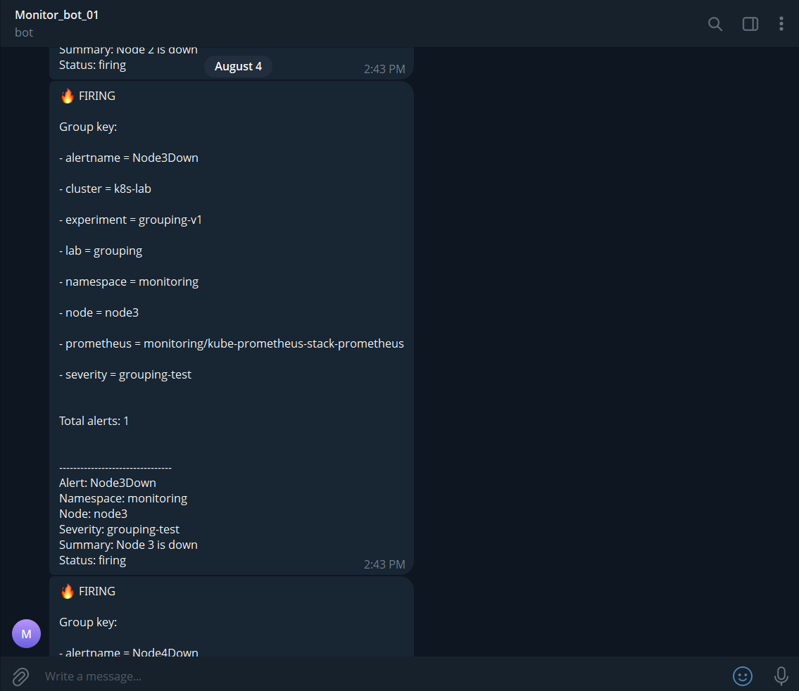
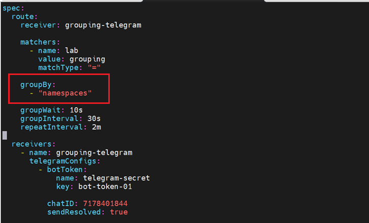
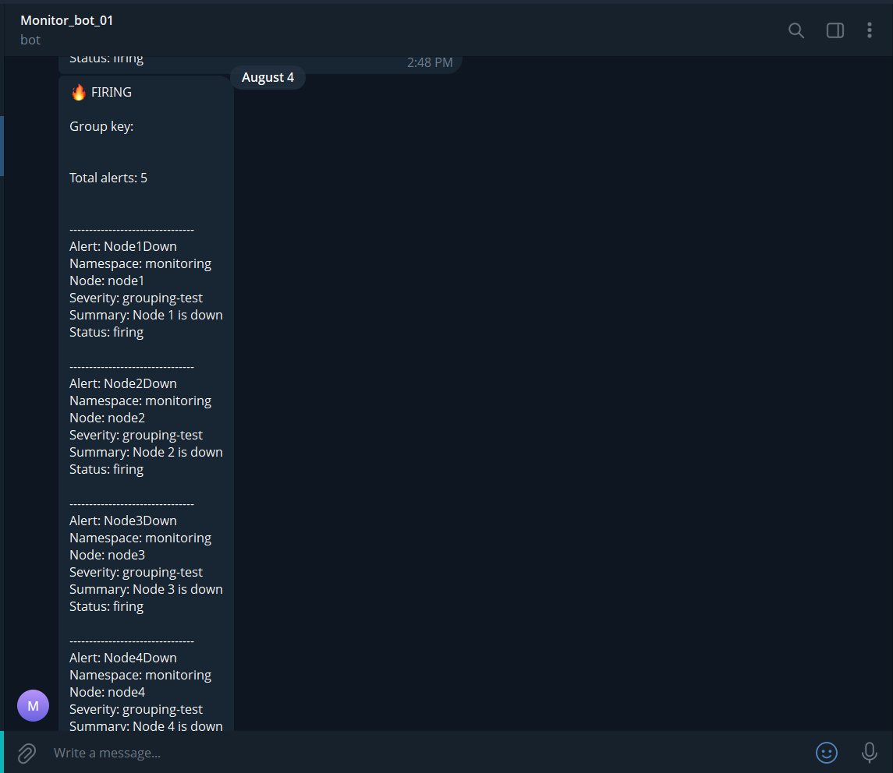
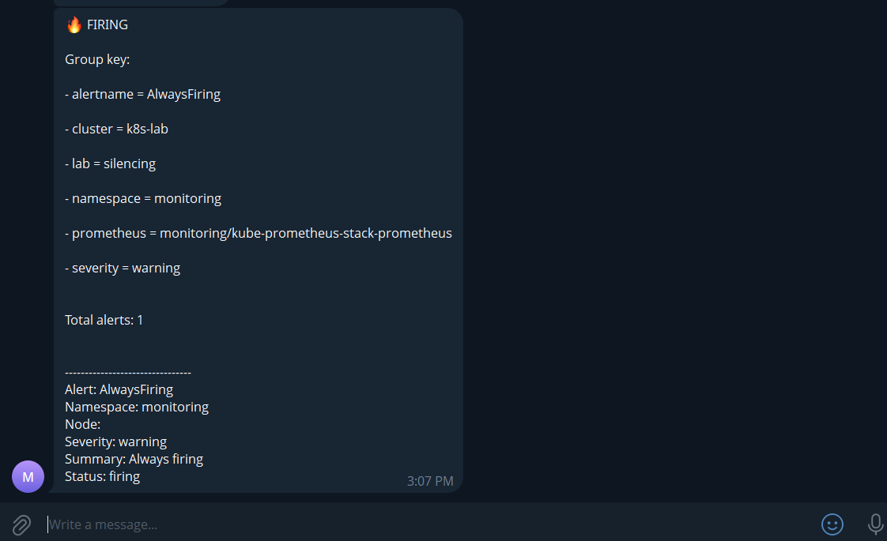
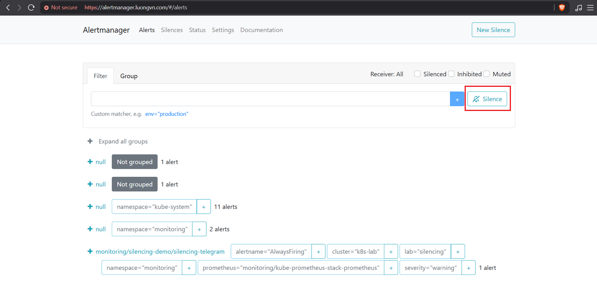
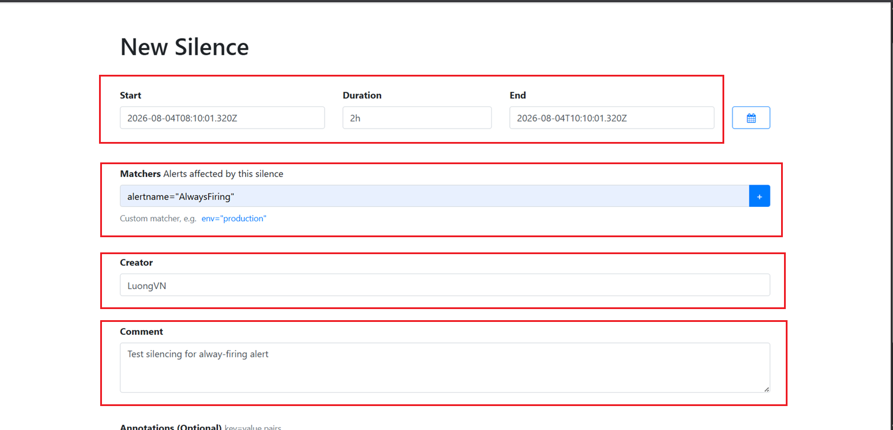
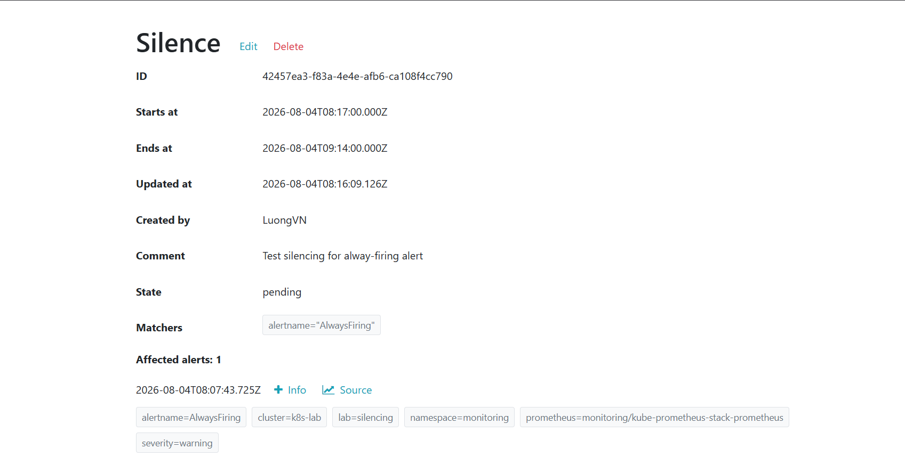

# Mục lục 

- [Mục lục](#mục-lục)
- [Cấu hình Alertmanager](#cấu-hình-alertmanager)
  - [I. Tạo Receiver và cấu hình gửi alert tới receiver qua Telegram](#i-tạo-receiver-và-cấu-hình-gửi-alert-tới-receiver-qua-telegram)
    - [1.0 Tạo secret của bot-token](#10-tạo-secret-của-bot-token)
    - [1.1 Tạo AlertmanagerConfig](#11-tạo-alertmanagerconfig)
    - [1.2 Kiểm tra Alertmanager trên web interface](#12-kiểm-tra-alertmanager-trên-web-interface)
    - [1.3 Tạo Alert Rule](#13-tạo-alert-rule)
    - [1.4 Kiểm tra trên Prometheus](#14-kiểm-tra-trên-prometheus)
    - [1.5 Kiểm tra trên Alertmanager](#15-kiểm-tra-trên-alertmanager)
    - [1.6 Bot telegram](#16-bot-telegram)
    - [1.7 Test sendResolved](#17-test-sendresolved)
  - [II. Cấu hình Routing Tree](#ii-cấu-hình-routing-tree)
    - [2.0 Tạo Secret bot-token cho 2 bot telegram](#20-tạo-secret-bot-token-cho-2-bot-telegram)
    - [2.0 Tạo Alert Rule](#20-tạo-alert-rule)
    - [2.1 Tạo AlertmanagerConfig](#21-tạo-alertmanagerconfig)
    - [2.2 Quan sát thông báo của bot telegram](#22-quan-sát-thông-báo-của-bot-telegram)
  - [III. Cấu hình grouping](#iii-cấu-hình-grouping)
    - [3.0 Tạo Telegram receiver dành riêng cho Grouping](#30-tạo-telegram-receiver-dành-riêng-cho-grouping)
    - [3.1 Tạo 5 alert giả lập](#31-tạo-5-alert-giả-lập)
    - [3.2 Quan sát khi chưa grouping](#32-quan-sát-khi-chưa-grouping)
    - [3.3 Group theo namespace: 1 Telegram chứa 5 alerts](#33-group-theo-namespace-1-telegram-chứa-5-alerts)
  - [IV. Cấu hình silencing](#iv-cấu-hình-silencing)
    - [4.0 Tạo Telegram receiver dành riêng cho Silencing](#40-tạo-telegram-receiver-dành-riêng-cho-silencing)
    - [4.1 Tạo alert always-firing để lab](#41-tạo-alert-always-firing-để-lab)
    - [4.2 Quan sát bot-tele thông báo](#42-quan-sát-bot-tele-thông-báo)
    - [4.3 Bật silencing trên giao diện của Alertmanager](#43-bật-silencing-trên-giao-diện-của-alertmanager)


# Cấu hình Alertmanager 

## I. Tạo Receiver và cấu hình gửi alert tới receiver qua Telegram 

### 1.0 Tạo secret của bot-token 

Ta không nên hard-code trực tiếp vào file manifest, thay vào đó ta sẽ tạo secret: 

```bash
kubectl create secret generic telegram-secret -n monitoring --from-literal=bot-token='8904958519:AAEuBFR-VNMH5uzHmLo4yqNBQjCgtssnbpA'
```

- Hãy thay bot-token của bạn 

### 1.1 Tạo AlertmanagerConfig 

- Tạo file manifest:

```bash
vim telegram-config.yaml
```

- Nội dung: 

```yaml
apiVersion: monitoring.coreos.com/v1alpha1
kind: AlertmanagerConfig
metadata:
  name: telegram-config
  namespace: monitoring
spec:
  route:
    receiver: telegram
    groupWait: 10s 
    groupInterval: 30s
    repeatInterval: 1m
  receivers:
  - name: telegram
    telegramConfigs:
    - botToken:
        name: telegram-secret
        key: bot-token 
      chatID: 7178401844 # thay bằng chatID của bạn
      sendResolved: true
      message: |
        🔥 {{ .CommonLabels.alertname }}

        Status: {{ .Status }}

        Instance: {{ .CommonLabels.instance }}
```

- Apply: 

```bash
k apply -f telegram-config.yaml
```

### 1.2 Kiểm tra Alertmanager trên web interface 

- Chọn mục Status:


- Kéo xuống và đọc nội dung phần Config, nếu kết quả có các cấu hình như sau thì bạn đã tạo Receiver thành công: 


### 1.3 Tạo Alert Rule 

- Ta sẽ tạo 1 Rule đơn giản để test Alertmanager, ta sẽ tạo ra 1 alert luôn luôn kích hoạt 

- Tạo file manifest: 

```bash
vim always-firing.yaml
```

- Nội dung: 

```yaml
apiVersion: monitoring.coreos.com/v1
kind: PrometheusRule
metadata:
  name: always-firing
  namespace: monitoring
  labels:
    release: kube-prometheus-stack
spec:
  groups:
  - name: demo
    rules:
    - alert: AlwaysFiring
      expr: vector(1)
      for: 10s
      labels:
        severity: warning
        namespace: monitoring
      annotations:
        summary: Always firing
```

- Apply: 

```bash
kubectl apply -f always-firing.yaml
```

### 1.4 Kiểm tra trên Prometheus 


### 1.5 Kiểm tra trên Alertmanager 


### 1.6 Bot telegram


### 1.7 Test sendResolved 

- Xóa rule: 

```bash
kubectl delete -f always-firing.yaml
```

- Kiểm tra thông báo của Bot tele: 


## II. Cấu hình Routing Tree 

Ở đây, ta sẽ tạo 2 receiver: 

- Bot telegram 1: Monitor_bot_01
- Bot telegram 2: Monitor_bot_02

Kết hợp với các rule khác nhau thì mỗi receiver sẽ nhận được alert khác nhau

### 2.0 Tạo Secret bot-token cho 2 bot telegram

```bash
kubectl create secret generic telegram-secret -n monitoring --from-literal=bot-token-01='7767883440:AAGwlJF_TAyTWuKfCF8C2qWxSnhvf8j_mXA' --from-literal=bot-token-02='8898459958:AAHVttm9L-ScD77SWdzvgtc_XHQzdoJEmeQ'
```

### 2.0 Tạo Alert Rule 

- Alert 1: CPUhigh

```yaml
apiVersion: monitoring.coreos.com/v1
kind: PrometheusRule
metadata: 
  name: cpu-high
  namespace: monitoring
  labels:
    release: kube-prometheus-stack
spec: 
  groups:
    - name: routing-demo
      rules:
        - alert: CPUhigh
          expr: vector(1)
          for: 30s
          labels: 
            severity: critical
            namespace: monitoring
          annotations: 
            summary: CPU High 
```

- Alert 2: DiskAlmostFull

```yaml
apiVersion: monitoring.coreos.com/v1
kind: PrometheusRule
metadata:
  name: disk-full
  namespace: monitoring
  labels:
    release: kube-prometheus-stack
spec:
  groups:
    - name: routing-demo
      rules:
      - alert: DiskAlmostFull
        expr: vector(1)
        for: 30s
        labels:
          severity: warning
          namespace: monitoring
        annotations:
          summary: Disk Almost Full
```

### 2.1 Tạo AlertmanagerConfig 

- Config thông tin của 2 receiver cũng như matcher của từng receiver: 

```yaml
apiVersion: monitoring.coreos.com/v1alpha1
kind: AlertmanagerConfig
metadata:
  name: routing-demo
  namespace: monitoring
  labels:
    release: kube-prometheus-stack
spec:
  receivers:
  - name: telegram-01
    telegramConfigs:
    - botToken:
        key: bot-token-01
        name: telegram-secret
      chatID: 7178401844
  - name: telegram-02
    telegramConfigs:
    - botToken:
        key: bot-token-02
        name: telegram-secret
      chatID: 7178401844
  route:
    receiver: telegram-01
    routes:
    - receiver: telegram-01
      matchers:
      - name: severity
        value: critical
    - receiver: telegram-02
      matchers:
      - name: severity
        value: warning
```

### 2.2 Quan sát thông báo của bot telegram 

- Monitor_bot_01: 


- Monitor_bot_02: 


- Ta thấy: 
  - Alert có label `severity=warning` sẽ được gửi tới bot 2 
  - Alert có label `severity=critical` sẽ được gửi tới bot 1

## III. Cấu hình grouping 

### 3.0 Tạo Telegram receiver dành riêng cho Grouping 

```yaml
apiVersion: monitoring.coreos.com/v1alpha1
kind: AlertmanagerConfig
metadata:
  name: grouping-demo
  namespace: monitoring
  labels:
    release: kube-prometheus-stack

spec:
  route:
    receiver: grouping-telegram

    matchers:
      - name: lab
        value: grouping
        matchType: "="

    groupBy:
      - "..."

    groupWait: 10s
    groupInterval: 30s
    repeatInterval: 2m

  receivers:
    - name: grouping-telegram
      telegramConfigs:
        - botToken:
            name: telegram-secret
            key: bot-token-01

          chatID: 7178401844
          sendResolved: true

          message: |-
            {{ if eq .Status "firing" }}🔥 FIRING{{ else }}✅ RESOLVED{{ end }}

            Group key:
            {{ range .GroupLabels.SortedPairs }}
            - {{ .Name }} = {{ .Value }}
            {{ end }}

            Total alerts: {{ len .Alerts }}

            {{ range .Alerts }}
            --------------------------------
            Alert: {{ .Labels.alertname }}
            Namespace: {{ .Labels.namespace }}
            Node: {{ .Labels.node }}
            Severity: {{ .Labels.severity }}
            Summary: {{ .Annotations.summary }}
            Status: {{ .Status }}
            {{ end }}
```

- Apply: 

```bash
kubectl apply -f grouping-AMconfig.yaml
```

### 3.1 Tạo 5 alert giả lập 

- Ta sẽ dùng `vector(1)` để cả 5 alert đều firing 

```bash
vim five-node-alerts.yaml
```

- Nội dung: 

```yaml
apiVersion: monitoring.coreos.com/v1
kind: PrometheusRule
metadata:
  name: grouping-five-nodes
  namespace: monitoring
  labels:
    release: kube-prometheus-stack

spec:
  groups:
    - name: grouping-lab.rules
      interval: 10s

      rules:
        - alert: Node1Down
          expr: vector(1)
          for: 10s
          labels:
            lab: grouping
            namespace: monitoring
            severity: grouping-test
            node: node1
            experiment: grouping-v1
          annotations:
            summary: "Node 1 is down"
            description: "Alert giả lập cho Grouping Lab"

        - alert: Node2Down
          expr: vector(1)
          for: 10s
          labels:
            lab: grouping
            namespace: monitoring
            severity: grouping-test
            node: node2
            experiment: grouping-v1
          annotations:
            summary: "Node 2 is down"
            description: "Alert giả lập cho Grouping Lab"

        - alert: Node3Down
          expr: vector(1)
          for: 10s
          labels:
            lab: grouping
            namespace: monitoring
            severity: grouping-test
            node: node3
            experiment: grouping-v1
          annotations:
            summary: "Node 3 is down"
            description: "Alert giả lập cho Grouping Lab"

        - alert: Node4Down
          expr: vector(1)
          for: 10s
          labels:
            lab: grouping
            namespace: monitoring
            severity: grouping-test
            node: node4
            experiment: grouping-v1
          annotations:
            summary: "Node 4 is down"
            description: "Alert giả lập cho Grouping Lab"

        - alert: Node5Down
          expr: vector(1)
          for: 10s
          labels:
            lab: grouping
            namespace: monitoring
            severity: grouping-test
            node: node5
            experiment: grouping-v1
          annotations:
            summary: "Node 5 is down"
            description: "Alert giả lập cho Grouping Lab"
```

- Apply: 

```bash
kubectl apply -f five-node-alerts.yaml
```

### 3.2 Quan sát khi chưa grouping

- Trong file cấu hình Alertmanagerconfig ở bước [3.0](#30-tạo-telegram-receiver-dành-riêng-cho-grouping) ta đang để `groupBy: ['...']` tức là không grouping bất kỳ alert nào 

- Kiểm tra bot-tele thì thấy bot gửi 5 thông báo trong 1 lần 



### 3.3 Group theo namespace: 1 Telegram chứa 5 alerts 

- Chuyển sang `groupBy: ['namespaces']` tại file cấu hình alertmanagerconfig ở bước [3.0](#30-tạo-telegram-receiver-dành-riêng-cho-grouping) 



- Apply lại: 

```bash
kubectl apply -f grouping-AMconfig.yaml
```

- Lúc này bot sẽ chỉ gửi 1 thông báo duy nhất: 



## IV. Cấu hình silencing 

### 4.0 Tạo Telegram receiver dành riêng cho Silencing 

```yaml 
apiVersion: monitoring.coreos.com/v1alpha1
kind: AlertmanagerConfig
metadata:
  name: silencing-demo
  namespace: monitoring
  labels:
    release: kube-prometheus-stack

spec:
  route:
    receiver: silencing-telegram

    matchers:
      - name: lab
        value: silencing 
        matchType: "="

    groupBy:
      - "..."

    groupWait: 10s
    groupInterval: 30s
    repeatInterval: 2m

  receivers:
    - name: silencing-telegram
      telegramConfigs:
        - botToken:
            name: telegram-secret
            key: bot-token-01

          chatID: 7178401844
          sendResolved: true

          message: |-
            {{ if eq .Status "firing" }}🔥 FIRING{{ else }}✅ RESOLVED{{ end }}

            Group key:
            {{ range .GroupLabels.SortedPairs }}
            - {{ .Name }} = {{ .Value }}
            {{ end }}

            Total alerts: {{ len .Alerts }}

            {{ range .Alerts }}
            --------------------------------
            Alert: {{ .Labels.alertname }}
            Namespace: {{ .Labels.namespace }}
            Node: {{ .Labels.node }}
            Severity: {{ .Labels.severity }}
            Summary: {{ .Annotations.summary }}
            Status: {{ .Status }}
            {{ end }}
```

### 4.1 Tạo alert always-firing để lab 

```yaml 
apiVersion: monitoring.coreos.com/v1
kind: PrometheusRule
metadata:
  name: always-firing
  namespace: monitoring
  labels:
    release: kube-prometheus-stack
spec:
  groups:
  - name: demo
    rules:
    - alert: AlwaysFiring
      expr: vector(1)
      for: 10s
      labels:
        lab: silencing
        severity: warning
        namespace: monitoring
      annotations:
        summary: Always firing
```

### 4.2 Quan sát bot-tele thông báo 



### 4.3 Bật silencing trên giao diện của Alertmanager 

- Chọn `Silence`: 



- Chọn thời gian mà silence này có hiệu lực, chọn Matchers của alert bị silencing, điền tên người tạo và comment:



- Chọn `Create`: 



