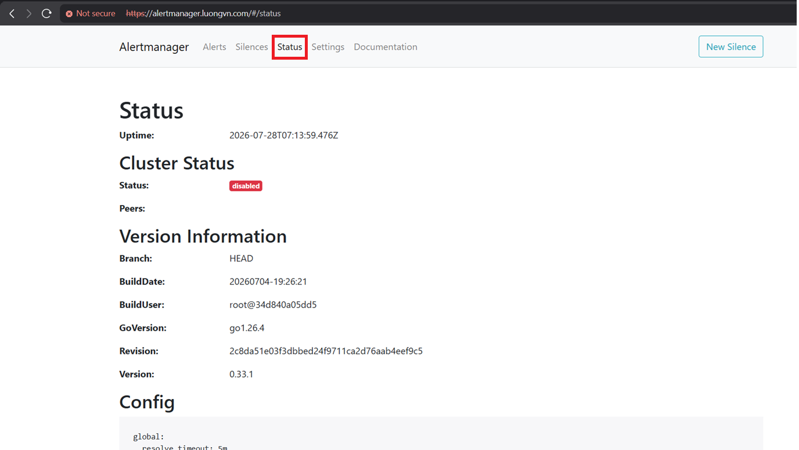
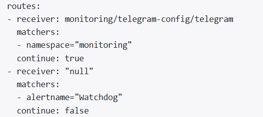
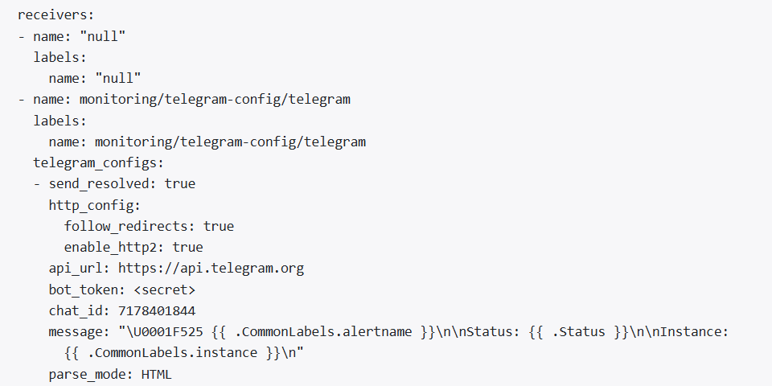
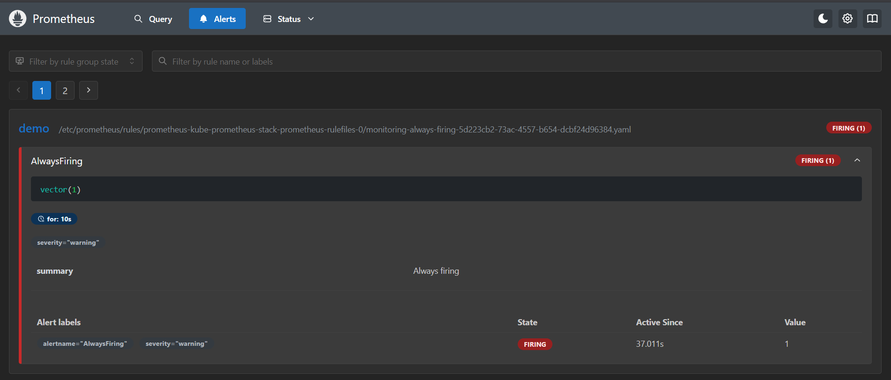
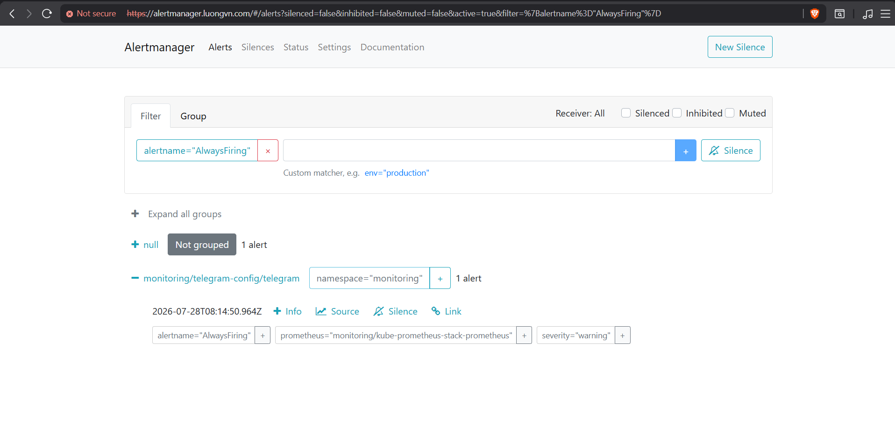
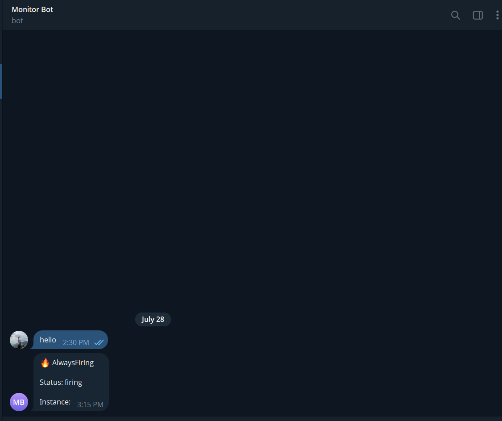
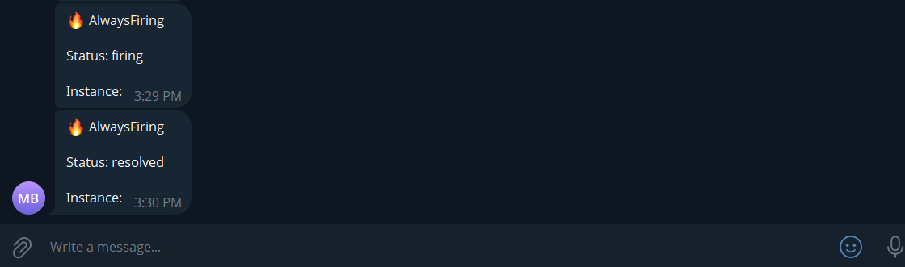
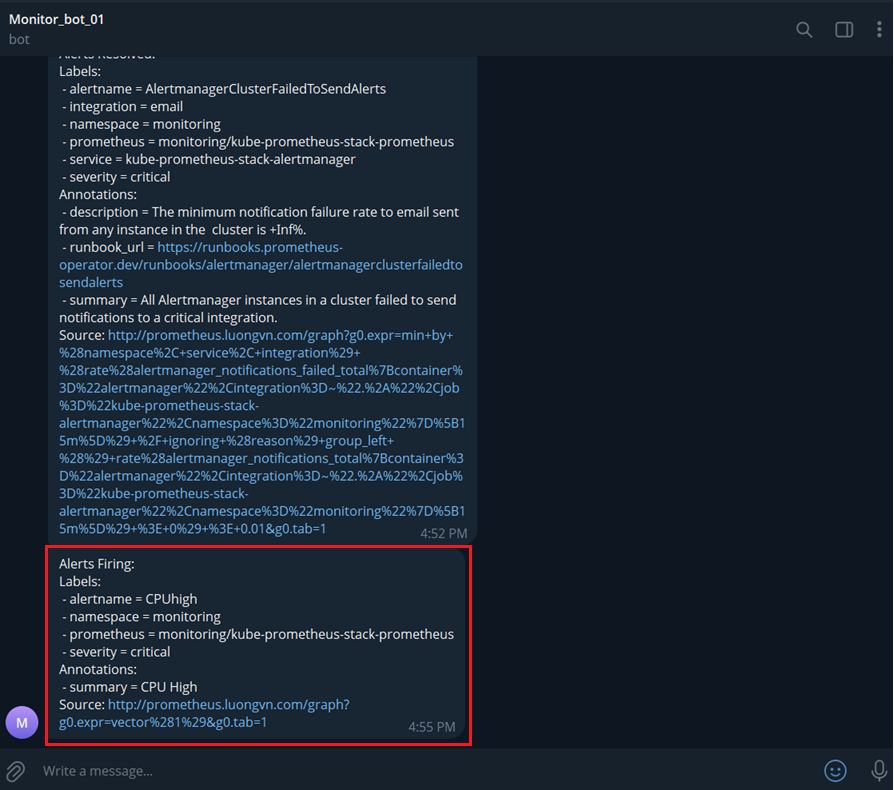
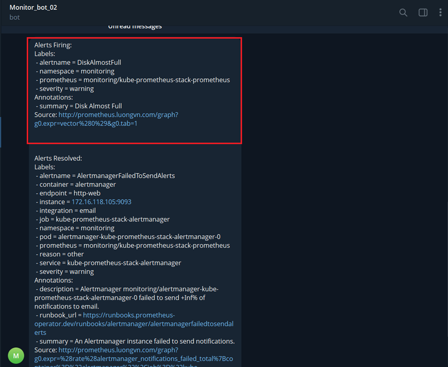

# Cấu hình Alertmanager 

## I. Tạo Receiver và cấu hình gửi alert tới receiver qua Telegram 

### 1.0 Tạo secret của bot-token 

Ta không nên hard-code trực tiếp vào file manifest, thay vào đó ta sẽ tạo secret: 

```bash
kubectl create secret generic telegram-secret -n monitoring --from-literal=bot-token='8904958519:AAEuBFR-VNMH5uzHmLo4yqNBQjCgtssnbpA'
```

- Hãy thay bot-token của bạn 

### 1.1 Tạo AlertmanagerConfig 

- Tạo file manifest:

```bash
vim telegram-config.yaml
```

- Nội dung: 

```yaml
apiVersion: monitoring.coreos.com/v1alpha1
kind: AlertmanagerConfig
metadata:
  name: telegram-config
  namespace: monitoring
spec:
  route:
    receiver: telegram
    groupWait: 10s 
    groupInterval: 30s
    repeatInterval: 1m
  receivers:
  - name: telegram
    telegramConfigs:
    - botToken:
        name: telegram-secret
        key: bot-token 
      chatID: 7178401844 # thay bằng chatID của bạn
      sendResolved: true
      message: |
        🔥 {{ .CommonLabels.alertname }}

        Status: {{ .Status }}

        Instance: {{ .CommonLabels.instance }}
```

- Apply: 

```bash
k apply -f telegram-config.yaml
```

### 1.2 Kiểm tra Alertmanager trên web interface 

- Chọn mục Status:



- Kéo xuống và đọc nội dung phần Config, nếu kết quả có các cấu hình như sau thì bạn đã tạo Receiver thành công: 





### 1.3 Tạo Alert Rule 

- Ta sẽ tạo 1 Rule đơn giản để test Alertmanager, ta sẽ tạo ra 1 alert luôn luôn kích hoạt 

- Tạo file manifest: 

```bash
vim always-firing.yaml
```

- Nội dung: 

```yaml
apiVersion: monitoring.coreos.com/v1
kind: PrometheusRule
metadata:
  name: always-firing
  namespace: monitoring
  labels:
    release: kube-prometheus-stack
spec:
  groups:
  - name: demo
    rules:
    - alert: AlwaysFiring
      expr: vector(1)
      for: 10s
      labels:
        severity: warning
        namespace: monitoring
      annotations:
        summary: Always firing
```

- Apply: 

```bash
kubectl apply -f always-firing.yaml
```

### 1.4 Kiểm tra trên Prometheus 



### 1.5 Kiểm tra trên Alertmanager 



### 1.6 Bot telegram




### 1.7 Test sendResolved 

- Xóa rule: 

```bash
kubectl delete -f always-firing.yaml
```

- Kiểm tra thông báo của Bot tele: 



## II. Cấu hình Routing Tree 

Ở đây, ta sẽ tạo 2 receiver: 

- Bot telegram 1: Monitor_bot_01
- Bot telegram 2: Monitor_bot_02

Kết hợp với các rule khác nhau thì mỗi receiver sẽ nhận được alert khác nhau

### 2.0 Tạo Secret bot-token cho 2 bot telegram

```bash
kubectl create secret generic telegram-secret -n monitoring --from-literal=bot-token-01='7767883440:AAGwlJF_TAyTWuKfCF8C2qWxSnhvf8j_mXA' --from-literal=bot-token-02='8898459958:AAHVttm9L-ScD77SWdzvgtc_XHQzdoJEmeQ'
```

### 2.0 Tạo Alert Rule 

- Alert 1: CPUhigh

```yaml
apiVersion: monitoring.coreos.com/v1
kind: PrometheusRule
metadata: 
  name: cpu-high
  namespace: monitoring
  labels:
    release: kube-prometheus-stack
spec: 
  groups:
    - name: routing-demo
      rules:
        - alert: CPUhigh
          expr: vector(1)
          for: 30s
          labels: 
            severity: critical
            namespace: monitoring
          annotations: 
            summary: CPU High 
```

- Alert 2: DiskAlmostFull

```yaml
apiVersion: monitoring.coreos.com/v1
kind: PrometheusRule
metadata:
  name: disk-full
  namespace: monitoring
  labels:
    release: kube-prometheus-stack
spec:
  groups:
    - name: routing-demo
      rules:
      - alert: DiskAlmostFull
        expr: vector(1)
        for: 30s
        labels:
          severity: warning
          namespace: monitoring
        annotations:
          summary: Disk Almost Full
```

### 2.1 Tạo AlertmanagerConfig 

- Config thông tin của 2 receiver cũng như matcher của từng receiver: 

```yaml
apiVersion: monitoring.coreos.com/v1alpha1
kind: AlertmanagerConfig
metadata:
  name: routing-demo
  namespace: monitoring
  labels:
    release: kube-prometheus-stack
spec:
  receivers:
  - name: telegram-01
    telegramConfigs:
    - botToken:
        key: bot-token-01
        name: telegram-secret
      chatID: 7178401844
  - name: telegram-02
    telegramConfigs:
    - botToken:
        key: bot-token-02
        name: telegram-secret
      chatID: 7178401844
  route:
    receiver: telegram-01
    routes:
    - receiver: telegram-01
      matchers:
      - name: severity
        value: critical
    - receiver: telegram-02
      matchers:
      - name: severity
        value: warning
```

### 2.2 Quan sát thông báo của bot telegram 

- Monitor_bot_01: 



- Monitor_bot_02: 



- Ta thấy: 
  - Alert có label `severity=warning` sẽ được gửi tới bot 2 
  - Alert có label `severity=critical` sẽ được gửi tới bot 1

