# Mục lục

- [Mục lục](#mục-lục)
- [Triển khai Prometheus HA sử dụng Thanos](#triển-khai-prometheus-ha-sử-dụng-thanos)
  - [I. Cài đặt Object Storage](#i-cài-đặt-object-storage)
    - [1.0 Bước 1: Tạo namespace](#10-bước-1-tạo-namespace)
    - [1.1 Bước 2: Tạo secret chho MinIO](#11-bước-2-tạo-secret-chho-minio)
    - [1.2 Bước 3: Tạo file values cho MinIO](#12-bước-3-tạo-file-values-cho-minio)
    - [1.3 Bước 4: Cài MinIO](#13-bước-4-cài-minio)
    - [1.4 Bước 5: Kiểm tra](#14-bước-5-kiểm-tra)
  - [II. Tạo cấu hình object storage cho Thanos](#ii-tạo-cấu-hình-object-storage-cho-thanos)
    - [2.0 Bước 1: Tạo file `objstore.yaml`:](#20-bước-1-tạo-file-objstoreyaml)
    - [2.1 Bước 2: Tạo secret trong namespace monitoring](#21-bước-2-tạo-secret-trong-namespace-monitoring)
  - [III. Bật Thanos Sidecar cho Prometheus hiện tại](#iii-bật-thanos-sidecar-cho-prometheus-hiện-tại)
    - [3.0 Bước 1: Tạo file values bổ sung](#30-bước-1-tạo-file-values-bổ-sung)
    - [3.1 Bước 2: Upgrade kube-prometheus-stack](#31-bước-2-upgrade-kube-prometheus-stack)
    - [3.2 Bước 3: Xác định service Sidecar](#32-bước-3-xác-định-service-sidecar)
  - [IV. Cài Thanos Query, Store Gateway và Compactor](#iv-cài-thanos-query-store-gateway-và-compactor)
    - [4.0 Bước 1: Tạo file values cho Thanos chart](#40-bước-1-tạo-file-values-cho-thanos-chart)
    - [4.1 Bước 2: Cài đặt Chart Thanos](#41-bước-2-cài-đặt-chart-thanos)
    - [4.2 Bước 3: Kiểm tra](#42-bước-3-kiểm-tra)
  - [V. Kiểm tra block được upload lên MinIO](#v-kiểm-tra-block-được-upload-lên-minio)
  - [VI. Chuyển Grafana sang Thanos](#vi-chuyển-grafana-sang-thanos)
    - [6.0 Bước 1: Xác định Service Query Frontend](#60-bước-1-xác-định-service-query-frontend)
    - [6.1 Bước 2: Tạo datasource trên Grafana](#61-bước-2-tạo-datasource-trên-grafana)
    - [6.2 Bước 3: Kiểm tra Dashboard](#62-bước-3-kiểm-tra-dashboard)


# Triển khai Prometheus HA sử dụng Thanos 

Tôi đã triển khai các resource Prometheus trên cụm K8s sử dụng Prometheus Operator, trong bài thực hành này tôi muốn cấu hình Thanos cho các resoure đã cài trước đó trên K8s 

## I. Cài đặt Object Storage 

Trong bài thực hành này tôi sẽ sử dụng object storage là MinIO. 

### 1.0 Bước 1: Tạo namespace 

```bash
kubectl create namespace minio
```

### 1.1 Bước 2: Tạo secret chho MinIO 

```bash
kubectl create secret generic minio-root-credentials \
  -n minio \
  --from-literal=rootUser='minioadmin' \
  --from-literal=rootPassword='Bimvungoc23@2005'
```

- Kiểm tra: 

```bash
devops@k8s-master-01:~$ kubectl get secret -n minio
NAME                     TYPE     DATA   AGE
minio-root-credentials   Opaque   2      34s
```

### 1.2 Bước 3: Tạo file values cho MinIO 

- Tạo file manifest:

```bash
mkdir -p ~/thanos
cd ~/thanos 
vim minio-values.yaml
```

- Nội dung: 

```bash
mode: standalone

existingSecret: minio-root-credentials

buckets:
  - name: thanos
    policy: none
    purge: false

persistence:
  enabled: true
  storageClass: nfs-monitor
  accessMode: ReadWriteOnce
  size: 20Gi

service:
  type: ClusterIP
  port: 9000

consoleService:
  type: ClusterIP
  port: 9001

metrics:
  serviceMonitor:
    enabled: true
    namespace: monitoring
    additionalLabels:
      release: kube-prometheus-stack

resources:
  requests:
    cpu: 100m
    memory: 256Mi
  limits:
    cpu: 500m
    memory: 1Gi
```

### 1.3 Bước 4: Cài MinIO 

- Add Repo của minio: 

```bash
helm repo add minio https://charts.min.io/
```

- Install Minio: 

```bash
helm -n minio install minio minio/minio -f ~/thanos/minio-values.yaml
```

- Kiểm tra resource của MinIO: 

```bash
kubectl get all -n minio
```

```bash
devops@k8s-master-01:~/thanos$ kubectl get all -n minio
NAME                         READY   STATUS    RESTARTS   AGE
pod/minio-66db8758d4-kmzc8   1/1     Running   0          113s

NAME                    TYPE        CLUSTER-IP       EXTERNAL-IP   PORT(S)    AGE
service/minio           ClusterIP   10.101.226.7     <none>        9000/TCP   113s
service/minio-console   ClusterIP   10.110.106.151   <none>        9001/TCP   113s

NAME                    READY   UP-TO-DATE   AVAILABLE   AGE
deployment.apps/minio   1/1     1            1           113s

NAME                               DESIRED   CURRENT   READY   AGE
replicaset.apps/minio-66db8758d4   1         1         1       113s
```

### 1.4 Bước 5: Kiểm tra 

- Ta sử dụng port-forward để truy cập thử vào web-interface của Minio: 

```bash
kubectl -n minio port-forward svc/minio-console 9001:9001 --address=0.0.0.0
```

- Truy cập trên browser: 

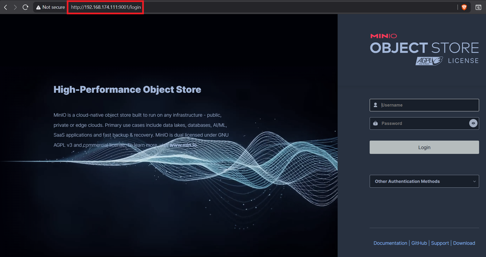

- Login bằng username và password mà bạn đã tạo secret ở [1.1](#11-bước-2-tạo-secret-chho-minio)

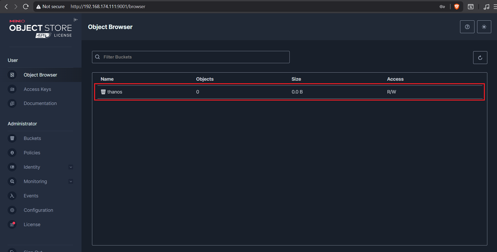

- Như vậy đã có bucket `thanos` như ta đã cấu hình trong file values của minio 

## II. Tạo cấu hình object storage cho Thanos 

### 2.0 Bước 1: Tạo file `objstore.yaml`:

```bash
vim ~/thanos/objstore.yaml
```

- Nội dung: 

```yaml
type: S3
config:
  bucket: thanos
  endpoint: minio.minio.svc.cluster.local:9000
  access_key: minioadmin
  secret_key: Bimvungoc23@2005
  insecure: true
```

### 2.1 Bước 2: Tạo secret trong namespace monitoring 

Sidecar và các component Thanos sẽ chạy trong namespace `monitoring`, nên Secret phải tồn tại trong namespace này (`monitoring` chính là namespace mà tôi đã cài Prometheus Operator)

```bash
kubectl create secret generic thanos-objstore \
  -n monitoring \
  --from-file=objstore.yml=./objstore.yaml
```

- Kiểm tra:

```bash
devops@k8s-master-01:~/thanos$ k get secret thanos-objstore -n monitoring
NAME              TYPE     DATA   AGE
thanos-objstore   Opaque   1      65s
```

- Prometheus Operator hỗ trợ truyền Secret object-storage vào Thanos Sidecar qua objectStorageConfig.

## III. Bật Thanos Sidecar cho Prometheus hiện tại 

### 3.0 Bước 1: Tạo file values bổ sung

```bash
vim ~/thanos/kube-prometheus-thanos-values.yaml
```

- Nội dung: 

```bash
prometheus:
  thanosService:
    enabled: true

  thanosServiceMonitor:
    enabled: true

  prometheusSpec:
    externalLabels:
      cluster: k8s-lab
      prometheus: monitoring-main

    thanos:
      objectStorageConfig:
        existingSecret:
          name: thanos-objstore
          key: objstore.yml
```

- `externalLabels` rất quan trọng. Compactor sử dụng external labels để phân biệt các luồng block; chúng cần duy nhất và ổn định giữa các Prometheus instance 
- Hiện tại tôi chỉ có 1 Prometheus replica 

### 3.1 Bước 2: Upgrade kube-prometheus-stack 

```bash
helm upgrade kube-prometheus-stack \
  prometheus-community/kube-prometheus-stack \
  -n monitoring \
  --version 87.16.1 \
  --reuse-values \
  -f kube-prometheus-thanos-values.yaml
```

- Bắt buộc Pod bây giờ sẽ phải chạy 3 container vì có thêm thanos-sidecar

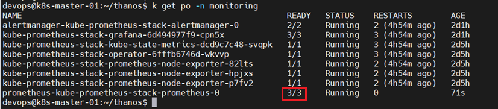

- Kiểm tra container trong Pod: 

```bash
devops@k8s-master-01:~/thanos$ kubectl get pod \
  prometheus-kube-prometheus-stack-prometheus-0 \
  -n monitoring \
  -o jsonpath='{.spec.containers[*].name}{"\n"}'
prometheus config-reloader thanos-sidecar
```

### 3.2 Bước 3: Xác định service Sidecar 

```bash
kubectl get svc -n monitoring | grep thanos 
```

```bash
devops@k8s-master-01:~/thanos$ kubectl get svc -n monitoring | grep thanos
kube-prometheus-stack-thanos-discovery           ClusterIP   None             <none>        10901/TCP,10902/TCP          9m36s
```

- Kiểm tra các port: 

```bash
devops@k8s-master-01:~/thanos$ kubectl get svc kube-prometheus-stack-thanos-discovery -n monitoring -o yaml | grep -A9 ports
  ports:
  - name: grpc
    port: 10901
    protocol: TCP
    targetPort: grpc
  - name: http
    port: 10902
    protocol: TCP
    targetPort: http
```

- Bắt buộc sẽ phải có 2 port: 
  - grpc: Cho store API 
  - http: để upload lên Object Storage (MinIO)


## IV. Cài Thanos Query, Store Gateway và Compactor 

### 4.0 Bước 1: Tạo file values cho Thanos chart 

```bash
vim ~/thanos/thanos-values.yaml
```

- Nội dung: 

```yaml
global:
  objstore:
    createSecret: false
    secretName: thanos-objstore
    secretKey: objstore.yml

  serviceMonitor:
    enabled: true
    namespace: monitoring
    labels:
      release: kube-prometheus-stack

query:
  enabled: true
  replicaCount: 1

  replicaLabels:
    - prometheus_replica

  endpoints:
    autogen:
      enabled: true

    static:
      - dnssrv+_grpc._tcp.kube-prometheus-stack-thanos-discovery.monitoring.svc.cluster.local

  service:
    type: ClusterIP

queryFrontend:
  enabled: true
  replicaCount: 1

  service:
    type: ClusterIP

storegateway:
  enabled: true
  replicaCount: 1

  persistence:
    enabled: true
    storageClass: nfs-monitor
    accessModes:
      - ReadWriteOnce
    size: 5Gi

compactor:
  enabled: true
  replicaCount: 1

  retention:
    resolutionRaw: 30d
    resolution5m: 90d
    resolution1h: 365d

  persistence:
    enabled: true
    storageClass: nfs-monitor
    accessModes:
      - ReadWriteOnce
    size: 10Gi

ruler:
  enabled: false

receive:
  enabled: false

bucket:
  enabled: true

  bucketweb:
    enabled: false
```

- Trong đó: 
  - `query.endpoint`: đây là cấu hình để truyền các Store API Endpoint. Nó có thể tự sinh endpoint cho những thành phần được cài trong chart như Store gateway, Ruler. Còn Thanos Sidecar được cài từ `kube-prometheus-stack` là thành phần bên ngoài chart nên ta phải thêm endpoint của nó vào.


### 4.1 Bước 2: Cài đặt Chart Thanos 

- Add repo Thanos: 

```bash
helm repo add thanos-community https://thanos-community.github.io/helm-charts
helm repo update
```

- Cài đặt Thanos: 

```bash
helm -n monitoring install thanos thanos-community/thanos -f ~/thanos/thanos-values.yaml
```

- Kiểm tra các resource của Thanos: 

```bash
devops@k8s-master-01:~/thanos$ k get all -n monitoring | grep thanos
pod/thanos-compactor-0                                         1/1     Running   0               2m13s
pod/thanos-query-544bcf48fb-ttsgh                              1/1     Running   0               2m13s
pod/thanos-query-frontend-774cd4fdc8-wqlpb                     1/1     Running   0               2m13s
pod/thanos-storegateway-0                                      1/1     Running   0               2m13s
service/kube-prometheus-stack-thanos-discovery           ClusterIP   None             <none>        10901/TCP,10902/TCP          52m
service/thanos-compactor                                 ClusterIP   10.104.206.244   <none>        10902/TCP                    2m13s
service/thanos-query                                     ClusterIP   10.110.96.141    <none>        9090/TCP,10901/TCP           2m13s
service/thanos-query-frontend                            ClusterIP   10.99.141.4      <none>        9090/TCP                     2m13s
service/thanos-storegateway                              ClusterIP   10.96.141.72     <none>        10902/TCP,10901/TCP          2m13s
deployment.apps/thanos-query                               1/1     1            1           2m13s
deployment.apps/thanos-query-frontend                      1/1     1            1           2m13s
replicaset.apps/thanos-query-544bcf48fb                              1         1         1       2m13s
replicaset.apps/thanos-query-frontend-774cd4fdc8                     1         1         1       2m13s
statefulset.apps/thanos-compactor                                  1/1     2m13s
statefulset.apps/thanos-storegateway                               1/1     2m13s
```

### 4.2 Bước 3: Kiểm tra

- Ta sử dụng port-forward để truy cập vào web-interface của Thanos Query: 

```bash
kubectl port-forward -n monitoring svc/thanos-query 9090:9090 --address=0.0.0.0
```

- Truy cập trên browser: 

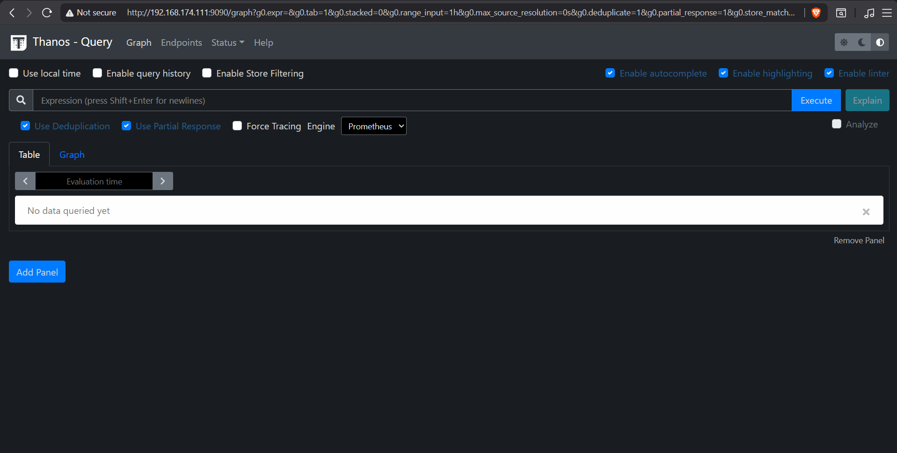

- Chọn vào tab `Endpoint` nếu bạn thấy Thanos Query kết nối được với Sidecar và Store Gateway tức là ta đã cấu hình thành công:

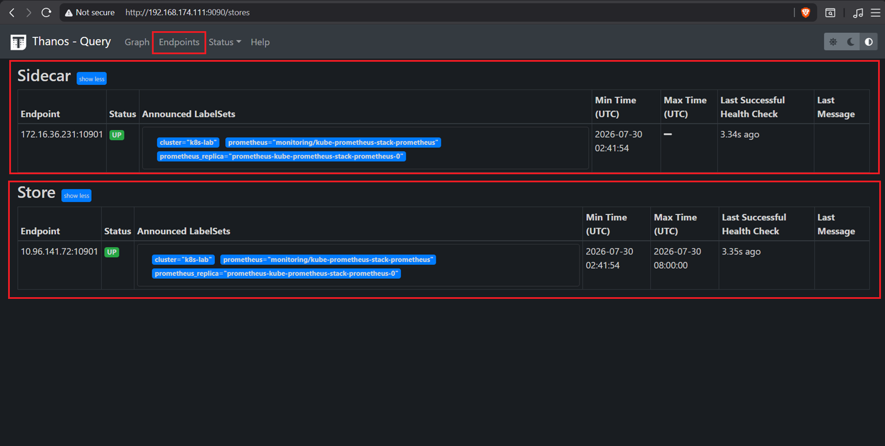

## V. Kiểm tra block được upload lên MinIO 

Prometheus tạo block theo chu kỳ; Sidecar upload block mới lên object storage. Ta sẽ kiểm tra trên Object Storage xem có tồn tại các block do Sidecar upload lên hay không.

- Kiểm tra trên web-interface: 

```bash
kubectl -n minio port-forward svc/minio-console 9001:9001 --address=0.0.0.0
```

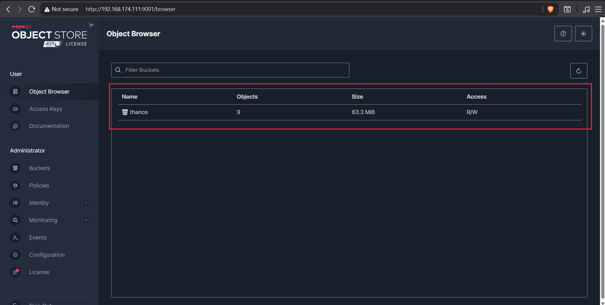

- Ta thấy hiện tại bucket `thanos` đã có dữ liệu, chọn vào bucket này để kiểm tra: 

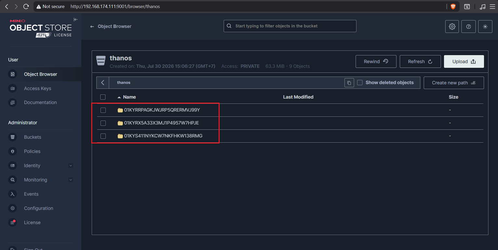

- Như vậy đã có 3 block được upload lên Object Storage 

## VI. Chuyển Grafana sang Thanos 

### 6.0 Bước 1: Xác định Service Query Frontend 

```bash
kubectl get svc -n monitoring | grep query
```

```bash
devops@k8s-master-01:~/thanos$ kubectl get svc -n monitoring | grep query
thanos-query                                     ClusterIP   10.110.96.141    <none>        9090/TCP,10901/TCP           41m
thanos-query-frontend                            ClusterIP   10.99.141.4      <none>        9090/TCP                     41m
```

- Như vậy ta có thể xác định được URL nội bộ là: `http://thanos-query-frontend.monitoring.svc.cluster.local:9090`

### 6.1 Bước 2: Tạo datasource trên Grafana 

- Truy cập vào Web-interface của Grafana: 

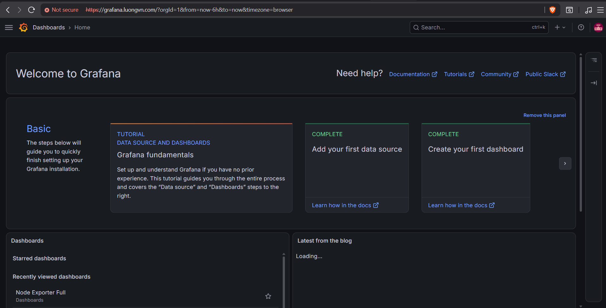

- Chọn `Main Menu` -> `Connections`: 

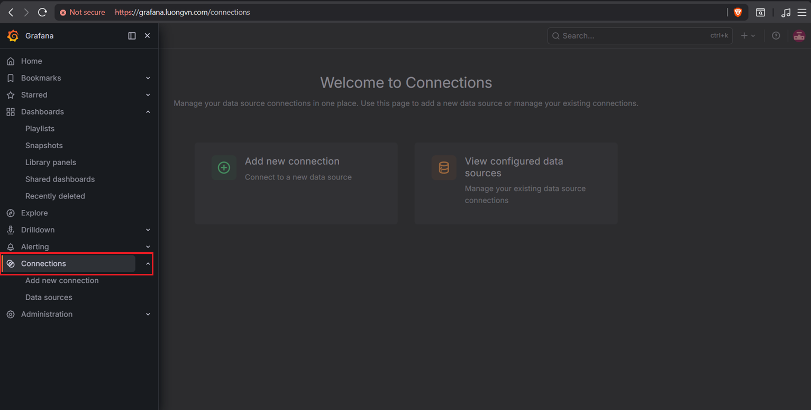

- Chọn `Add new connection`: 

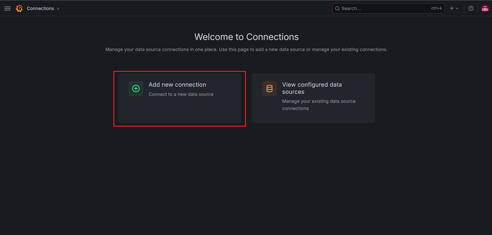

- Chọn `Prometheus`: 

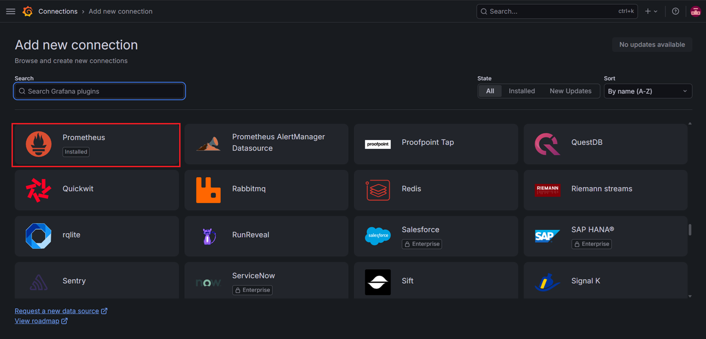

- Chọn `Add new data source`:

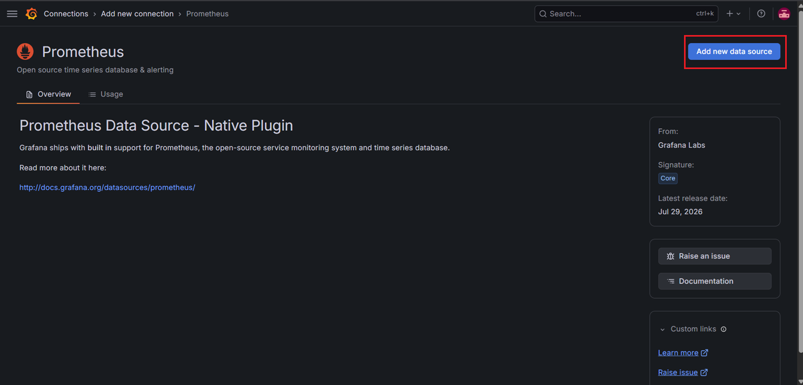

- Đặt tên cho `Data source` và paste URL của Thanos Query Frontend, sau đó kéo xuống và chọn `Save & Test`:

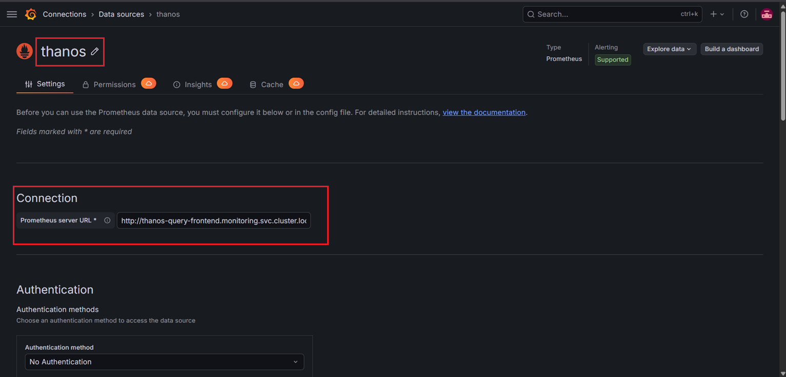

### 6.2 Bước 3: Kiểm tra Dashboard 

Bạn hãy chọn vào bất kỳ panel nào của 1 dashboard bầt kỳ, sau đó chuyển datasource hiện tại sang Thanos để xem xét dữ liệu:


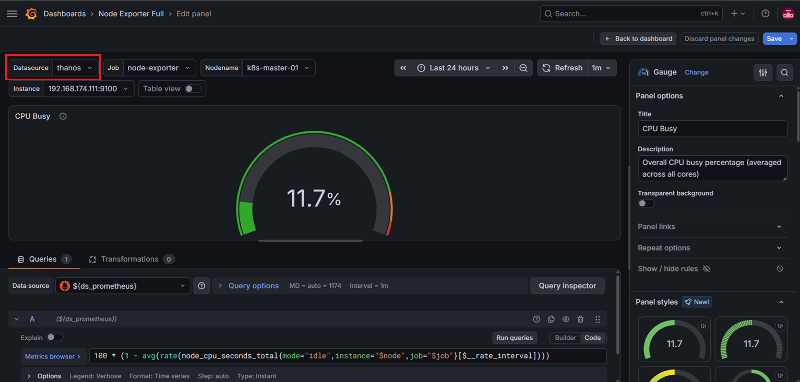

- Ta thấy: Dữ liệu khi datasource là Thanos và Prometheus gần như tương tự nhau 