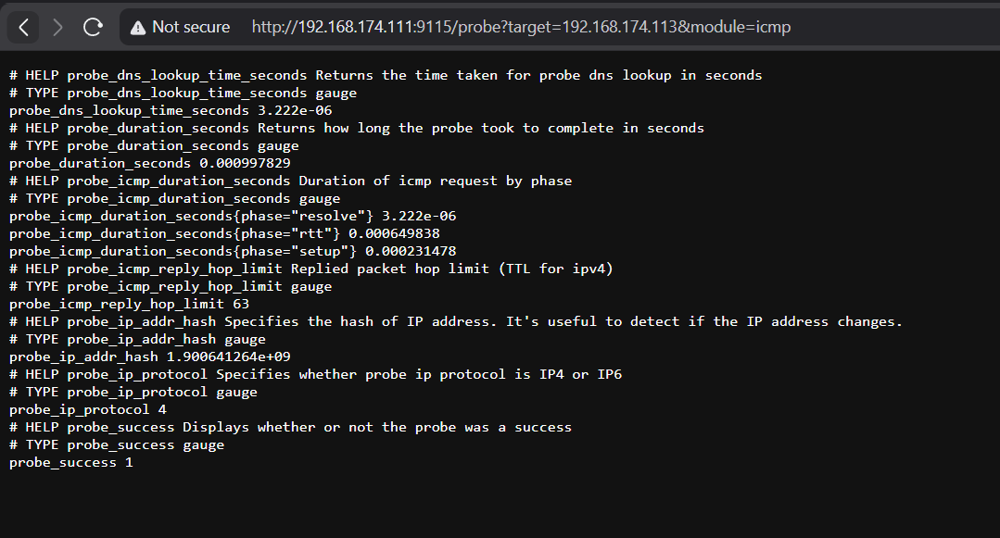
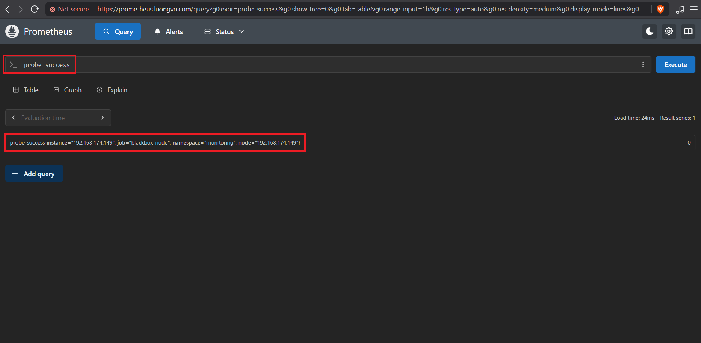
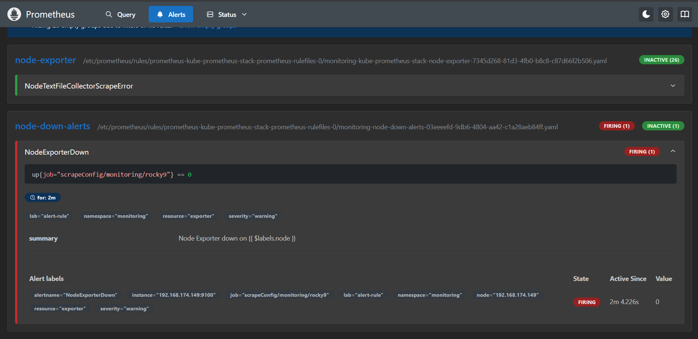
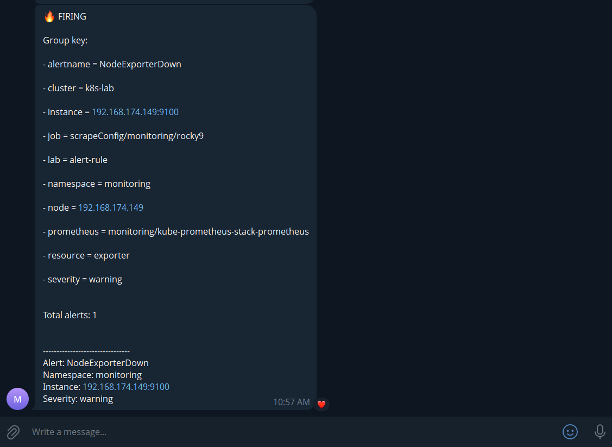
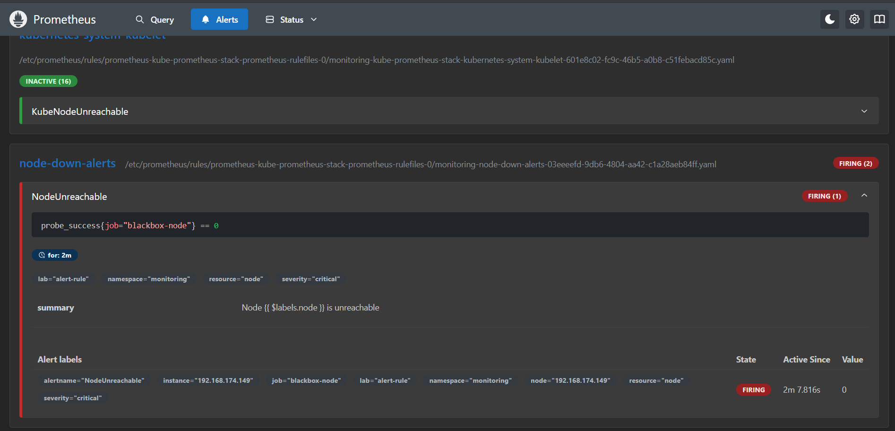
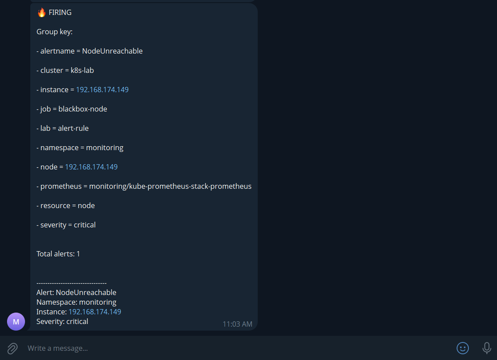

# Mục lục 

- [Mục lục](#mục-lục)
- [Cảnh báo NodeDown](#cảnh-báo-nodedown)
  - [I. Blackbox Exporter](#i-blackbox-exporter)
  - [II. Cấu hình](#ii-cấu-hình)
    - [2.0 Add Helm repository](#20-add-helm-repository)
    - [2.1 Tạo file `values.yaml`](#21-tạo-file-valuesyaml)
    - [2.2 Cài Blackbox Exporter](#22-cài-blackbox-exporter)
    - [2.3 Test Blackbox trước khi kết nối Prometheus](#23-test-blackbox-trước-khi-kết-nối-prometheus)
    - [2.4 Tạo `probe` CRD](#24-tạo-probe-crd)
    - [2.5 Kiểm tra trên Prometheus](#25-kiểm-tra-trên-prometheus)
    - [2.6 Tạo 2 alert riêng](#26-tạo-2-alert-riêng)
    - [2.7 Kiểm tra](#27-kiểm-tra)


# Cảnh báo NodeDown 

Ta không nên dùng đơn giản `up == 0` cho tất cả target, vì `up == 0` thực chất có nghĩa là Prometheus không scrape được target, chưa chắc node đã chết. Có thể node vẫn sống nhưng `node-exporter` chết, firewall chặn 9100, mạng lỗi hoặc scrapeconfig có vấn đề. Vì vậy, ta sẽ tìm hiểu xem cách thực hiện alert nodedown chính xác nhất 

## I. Blackbox Exporter 

Blackbox exporter là một exporter trong hệ sinh thái Prometheus dùng để kiểm tra một hệ thống từ bên ngoài, thay vì cài agent lên chính hệ thống đó. 

> Node Exporter hỏi: "Bên trong server đang thế nào?"
> Blackbox Exporter hỏi: "Từ bên ngoài, tôi có truy cập được server/service đó không?"

Cách hoạt động của Blackbox Exporter: 

```bash
                     ┌── ICMP ping ──→ 192.168.174.149
                     │
Prometheus ──→ Blackbox Exporter
                     │
                     ├── HTTP ───────→ https://example.com
                     │
                     └── TCP ────────→ 192.168.174.149:22
```

Blackbox Exporter thực hiện probe và trả metric cho Prometheus.

Ví dụ ICMP thành công: 

```promql 
probe_success{node="192.168.174.149"} 1
```

không thành công: 

```promql
probe_success{node="192.168.174.149"} 0
```

Blackbox Exporter hỗ trợ những probe rất hữu ích như: 

| **Probe**  | **Ý nghĩa**                                         |
| ---------- | --------------------------------------------------- |
| ICMP       | Máy/network có reachable không                      |
| TCP        | Port như `22`, `3306`, `5432` có kết nối được không |
| HTTP/HTTPs | Web/API có phản hồi không                           |
| DNS        | DNS có resolve đúng không                           |

Tất nhiên ta sẽ không dùng Blackbox Exporter để thay thế Node Exporter hoàn toàn, đơn giản vì chúng giải quyết 2 bài toán khác nhau: 

```bash
                   Monitoring
                       │
          ┌────────────┴────────────┐
          │                         │
    Node Exporter              Blackbox Exporter
          │                         │
      bên trong                   bên ngoài
          │                         │
    CPU / RAM / Disk          ICMP / HTTP / TCP
```

Ví dụ: 

```bash
Node exporter   Blackbox     Ý nghĩa
────────────────────────────────────────────
up=1            probe=1      Bình thường
up=0            probe=1      Exporter có vấn đề
up=0            probe=0      Node/network unreachable
```

Một thiết kế alert tốt là: 

```bash
NodeExporterDown
    │
    └── up{job="rocky9"} == 0
             ↓
          WARNING


NodeUnreachable
    │
    └── probe_success{probe="icmp"} == 0
             ↓
          CRITICAL
```

## II. Cấu hình 

### 2.0 Add Helm repository 

```bash
helm repo add prometheus-community https://prometheus-community.github.io/helm-charts
helm repo update
```

### 2.1 Tạo file `values.yaml`

- Tạo thư mục:

```bash
mkdir ~/blackbox
cd ~/blackbox
vim values.yaml
```

- Nội dung; 

```
config:
  modules:
    icmp:
      prober: icmp
      timeout: 5s
      icmp:
        preferred_ip_protocol: ip4

serviceMonitor:
  enabled: true
  defaults:
    labels:
      release: kube-prometheus-stack
```

### 2.2 Cài Blackbox Exporter 

```bash
helm -n monitoring install blackbox-exporter prometheus-community/prometheus-blackbox-exporter -f values.yaml
```

- Kiểm tra các resource: 

```bash
devops@k8s-master-01:~/blackbox$ k get all -n monitoring | grep blackbox
pod/blackbox-exporter-prometheus-blackbox-exporter-84f4d55d8-s9jth   1/1     Running                  0               28s
service/blackbox-exporter-prometheus-blackbox-exporter   ClusterIP      10.105.190.7     <none>            9115/TCP                     28s
deployment.apps/blackbox-exporter-prometheus-blackbox-exporter   1/1     1            1           28s
replicaset.apps/blackbox-exporter-prometheus-blackbox-exporter-84f4d55d8   1         1         1       28s
```

### 2.3 Test Blackbox trước khi kết nối Prometheus 

Port-forward: 

```bash
kubectl port-forward -n monitoring \
  svc/blackbox-exporter-prometheus-blackbox-exporter \
  9115:9115 \
  --address=0.0.0.0
```

- Truy cập browser và check: 



### 2.4 Tạo `probe` CRD 

```bash
vim rocky9-probe.yaml
```

- Nội dung: 

```yaml
apiVersion: monitoring.coreos.com/v1
kind: Probe
metadata:
  name: rocky9-icmp
  namespace: monitoring
  labels:
    release: kube-prometheus-stack

spec:
  jobName: blackbox-node

  prober:
    url: blackbox-exporter-prometheus-blackbox-exporter.monitoring.svc.cluster.local:9115

  module: icmp

  targets:
    staticConfig:
      static:
        - 192.168.174.149
      labels:
        node: "192.168.174.149"
```

- Apply: 

```bash
kubectl apply -f rocky9-probe.yaml
```

### 2.5 Kiểm tra trên Prometheus 



Hiện tại, blackbox vs node exporter sẽ có dạng như sau: 

```bash
                    node="192.168.174.149"
                              │
             ┌────────────────┴────────────────┐
             │                                 │
      Node Exporter                         Blackbox
             │                                 │
 instance=.149:9100                    instance=.149
             │                                 │
           up=1                         probe_success=1
```

### 2.6 Tạo 2 alert riêng 

- Node exporter chết: 

```yaml
- alert: NodeExporterDown
  expr: up{job="scrapeConfig/monitoring/rocky9"} == 0
  for: 2m
  labels:
    severity: warning
    resource: exporter
    lab: alert-rule
  annotations:
    summary: "Node Exporter down on {{ $labels.node }}"
```

- Node/Network thật sự unreachable: 

```yaml
- alert: NodeUnreachable
  expr: probe_success{job="blackbox-node"} == 0
  for: 2m
  labels:
    severity: critical
    resource: node
    lab: alert-rule
  annotations:
    summary: "Node {{ $labels.node }} is unreachable"
```

### 2.7 Kiểm tra

- Khi tắt service node exporter: 





- Khi shutdown node "rocky9":





- Ta có thể cấu hình thêm inhibition_rules:

```yaml
# alertmangerconfig of rocky9
spec:
  inhibitRules:
    - sourceMatch:
        - name: alertname
          value: NodeUnreachable
          matchType: "="

      targetMatch:
        - name: alertname
          value: NodeExporterDown
          matchType: "="

      equal:
        - node
```