# Kubernetes Monitoring Tool

Công cụ quản lý và giám sát Kubernetes gồm giao diện web, FastAPI backend và agent chạy trên Linux. Dự án có thể kiểm tra trạng thái cluster theo namespace, lưu snapshot để xem lại, apply manifest và gửi cảnh báo Telegram khi tài nguyên node hoặc trạng thái Pod vượt điều kiện cảnh báo.

## Tính năng

### Kiểm tra cluster và resource

- Kiểm tra condition của toàn bộ Node trong cluster, gồm `Ready`, `MemoryPressure`, `DiskPressure`, `PIDPressure` và các condition khác Kubernetes trả về.
- Liệt kê Pod, Deployment, Service, ReplicaSet, StatefulSet và DaemonSet trong một namespace.
- Hiển thị phase, container readiness, restart count, replica readiness, Service IP/port và DaemonSet node selector.
- Lấy dữ liệu mới từ Kubernetes API hoặc trả snapshot ngắn hạn từ Redis.
- Lưu mỗi lần kiểm tra và các resource snapshot vào MariaDB.
- Cung cấp API xem danh sách và chi tiết lịch sử kiểm tra.

Node là resource cấp cluster nên kết quả Node không bị giới hạn bởi namespace. Các resource còn lại được lọc theo namespace đã chọn.

- Người dùng nhập namespace muốn check các resource: 

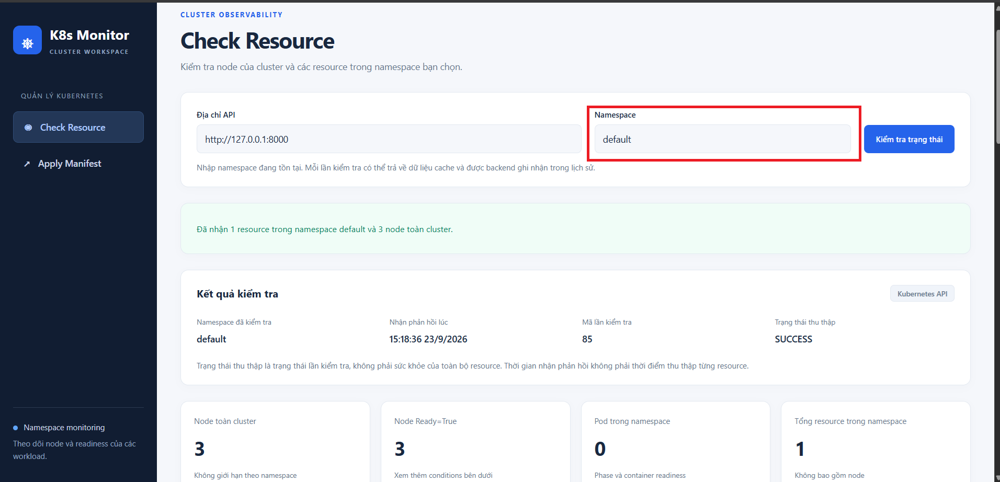

- Thông tin về các resource trả về để người dùng có thể theo dõi: 

    - Thông tin của node: 

    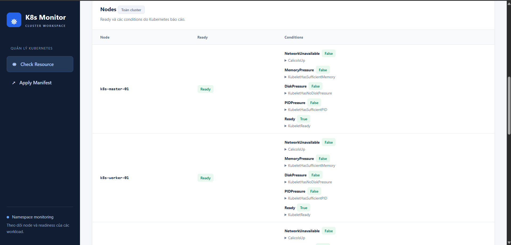

    - Thông tin của các resource: 

    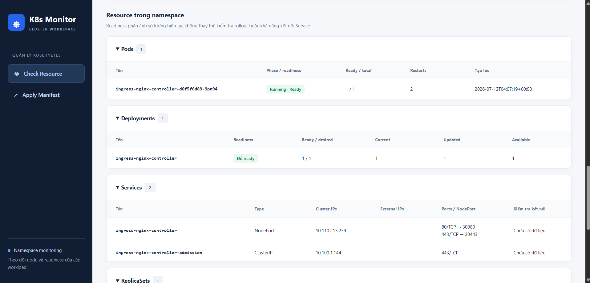

- Mỗi lần check sẽ tạo ra 1 `check_id` lưu trong cơ sở dữ liệu: 

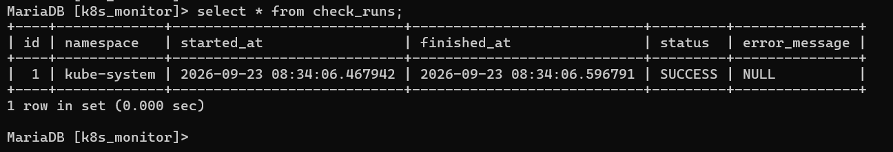

- Ta có thể xem được `namespace`, thời gian bắt đầu và kết thúc, `status` và `error_message` trong lần check đó, để từ đây ta có thể trace được các thông tin resource liên quan đến lần check này thông qua `check_id`. Ví dụ về `node` và `service`: 

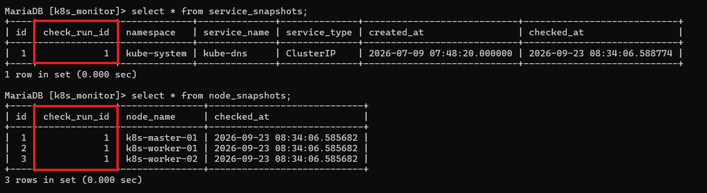

### Apply Kubernetes manifest

- Nhập YAML trực tiếp hoặc tải file `.yaml`/`.yml` từ giao diện.
- Hỗ trợ manifest nhiều document, phân cách bằng `---`.
- Dùng Kubernetes server-side apply với field manager `k8s-tool`.
- Tự nhận diện resource có namespace và resource cấp cluster.
- Trả kết quả apply cho từng resource.

- Kiểm tra thông tin về namespace trong k8s: 
    - Trên k8s chưa hề có namespace `demo`

    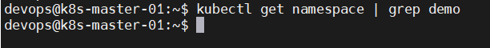

    - Apply Manifest trên giao diện: 

    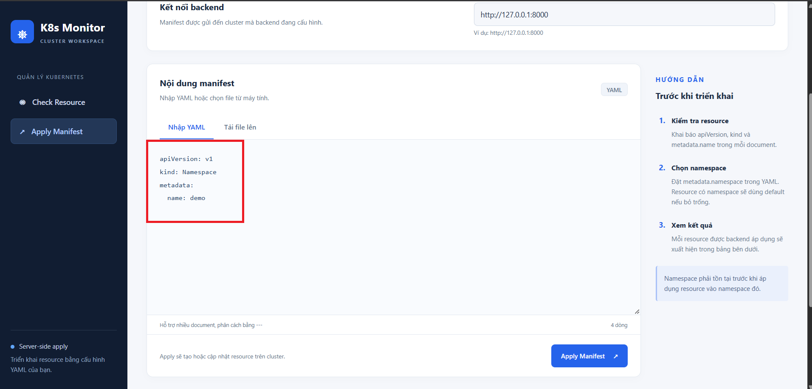

    - Kiểm tra lại trên k8s: Đã tạo được namespace `demo`: 

    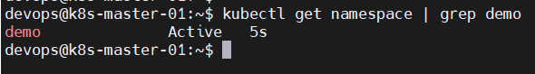

- Apply file `.yaml` trên giao diện: Thực hiện apply file manifest tại `https://github.com/Bimmie226/manage-kubernetes-tools/blob/develop/manifest/demo.yaml`

    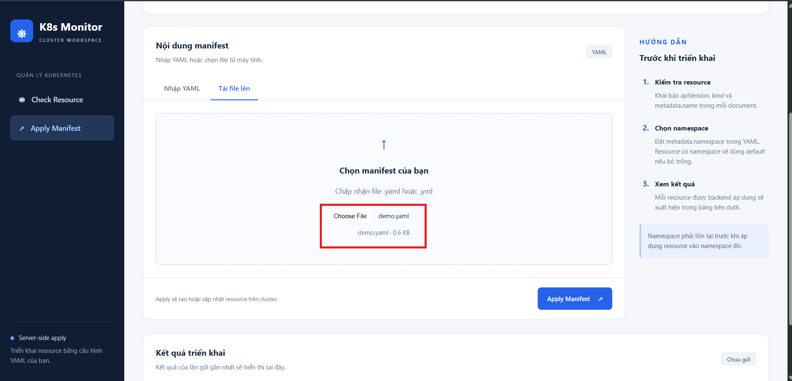

- Kiểm tra thông tin resource của namespace `demo` trên k8s: 

    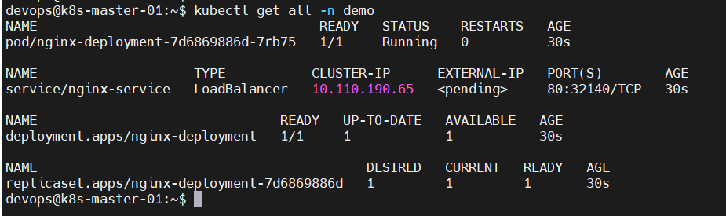

    - Các resource được định nghĩa trong file manifest đã được apply thành công 
### Metrics và cảnh báo

- Agent thu thập CPU, RAM và dung lượng filesystem `/` của máy chủ.
- Agent đọc trạng thái `Ready` của Pod khi máy có kubeconfig hợp lệ.
- Backend phát cảnh báo khi CPU, RAM hoặc disk đạt từ 90%.
- Backend phát cảnh báo khi Pod chuyển sang không ready và thông báo resolved khi Pod ready trở lại.
- Redis lưu trạng thái `NORMAL`/`FIRING` để hạn chế cảnh báo Telegram lặp lại.
- Script cài đặt Linux tạo systemd timer chạy agent mỗi 30 giây.

- Cảnh báo bot tele về Alert CPU, RAM, DISK sau khi set threshold = 5%

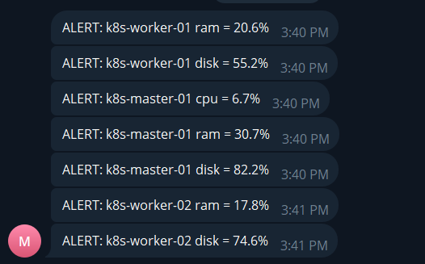

- Thông báo resolve từ bot tele về các alert CPU, RAM, DISK sau khi set threshold = 90%

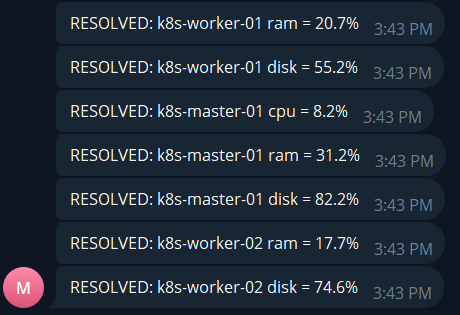

- Cảnh báo từ bot tele về Alert Pod down: 


- Thông báo resolve từ bot tele về alert Pod down: 


## Kiến trúc

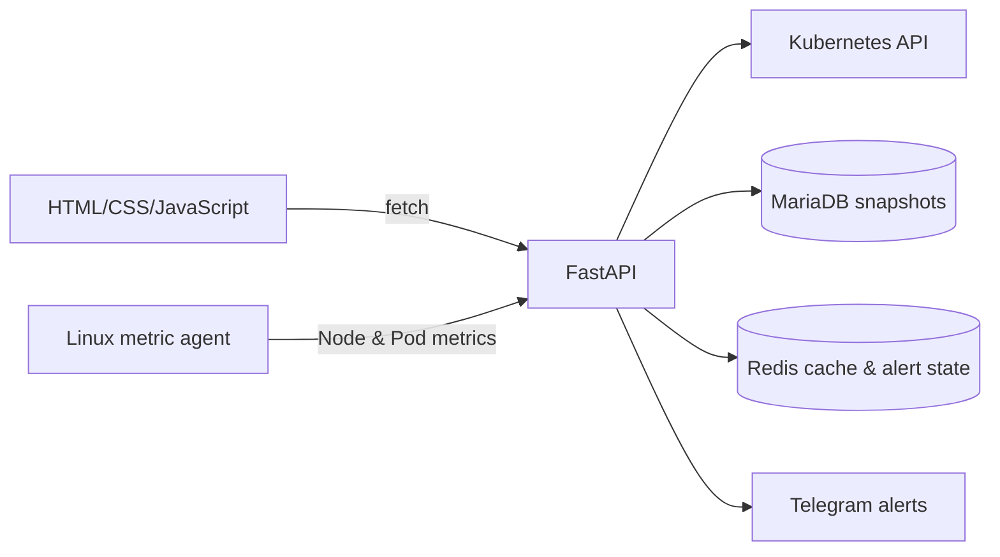

- `frontend/`: giao diện HTML5, CSS3 và JavaScript thuần.
- `backend/app/api/`: FastAPI routers.
- `backend/app/services/`: điều phối monitoring, manifest, history và alert.
- `backend/app/collectors/`: đọc resource từ Kubernetes API.
- `backend/app/repositories/` và `models/`: truy cập MariaDB bằng SQLAlchemy.
- `backend/app/cache/`: Redis client và cache snapshot.
- `agent/`: chương trình thu thập metrics và bộ cài systemd.
- `manifest/`: manifest mẫu.
- `tools/`: script Kubernetes độc lập.

## Giao diện

| Trang | Đường dẫn | Chức năng |
|---|---|---|
| Check Resource | `/monitoring.html` | Kiểm tra Node toàn cluster và resource theo namespace |
| Apply Manifest | `/index.html` | Nhập YAML hoặc tải file để apply lên cluster |

Giao diện có trạng thái loading, empty, error và success; hỗ trợ màn hình mobile, tablet và desktop.

## API

| Method | Endpoint | Mô tả |
|---|---|---|
| `GET` | `/health` | Kiểm tra tiến trình API đang hoạt động |
| `POST` | `/api/monitoring/{namespace}/check` | Thu thập hoặc lấy cache resource theo namespace |
| `GET` | `/api/monitoring/history/runs` | Lấy danh sách monitoring runs; hỗ trợ `namespace` và `limit` |
| `GET` | `/api/monitoring/history/{check_run_id}` | Lấy snapshot chi tiết của một run |
| `POST` | `/api/manifest/apply` | Apply chuỗi YAML trong JSON field `manifest` |
| `POST` | `/api/manifest/apply-file` | Apply file multipart field `file` |
| `POST` | `/api/metrics/node` | Nhận CPU, RAM và disk metrics từ agent |
| `POST` | `/api/metrics/pods` | Nhận danh sách trạng thái ready của Pod |

Swagger UI có tại `http://127.0.0.1:8000/docs` khi backend đang chạy.

## Yêu cầu

- Python 3.10 trở lên
- MariaDB
- Redis
- Kubeconfig có quyền list Node và các workload; quyền patch resource nếu dùng Apply Manifest
- Telegram bot token và chat ID nếu cần nhận cảnh báo
- Trình duyệt hiện đại
- Linux với systemd nếu cài metric agent bằng `install.sh`

## Cấu hình backend

Backend đọc `backend/app/.env`. Tạo file này ở môi trường local và không commit credentials:

```dotenv
K8S_CONFIG_MODE=kubeconfig
KUBERNETES_PATH=C:/path/to/.kube/config

DB_HOST=
DB_PORT=
DB_NAME=
DB_USER=
DB_PASSWORD=

REDIS_HOST=
REDIS_PORT=
REDIS_DB=
REDIS_TTL=

TELEGRAM_BOT_TOKEN=
TELEGRAM_CHAT_ID=
```

Redis hiện là dependency bắt buộc cho monitoring cache và alert state. Nếu Redis không kết nối được, các endpoint monitoring/metrics liên quan sẽ trả lỗi.

## Khởi tạo và chạy local

### 1. MariaDB

Chạy schema:

```sh
mysql -u root -p < backend/app/database/k8s_monitor_mariadb.sql
```

Dự án đang dùng file SQL trực tiếp và chưa có migration framework.

### 2. Backend

```sh
cd backend
python -m venv .venv
```

Kích hoạt virtual environment, sau đó:

```sh
python -m pip install -r app/requirements.txt
python -m uvicorn app.main:app --reload --host 127.0.0.1 --port 8000
```

Backend khởi tạo Kubernetes clients khi import ứng dụng, vì vậy kubeconfig phải hợp lệ trước khi chạy.

### 3. Frontend

Từ thư mục gốc repository:

```sh
python -m http.server 5500 --bind 127.0.0.1 --directory frontend
```

Mở `http://127.0.0.1:5500/monitoring.html`. Backend hiện cho phép CORS từ `http://127.0.0.1:5500` và `http://localhost:5500`.

### 4. Metric agent

Sửa `NODE_API_URL` và `POD_API_URL` trong `agent/metric_agent.py` cho đúng địa chỉ backend, sau đó chạy một lần:

```sh
cd agent
python -m pip install -r requirements.txt
python metric_agent.py
```

Trên Linux có systemd:

```sh
cd agent
sudo ./install.sh
```

Script hiện tạo service chạy với user `devops` và kubeconfig `/home/devops/.kube/config`; điều chỉnh script trước khi cài nếu máy dùng user hoặc đường dẫn khác.

## Luồng dữ liệu monitoring

1. Frontend gửi `POST /api/monitoring/{namespace}/check`.
2. Backend tạo một `check_runs` record và tìm cache `k8s:monitoring:{namespace}` trong Redis.
3. Khi cache miss, collectors đọc Node toàn cluster và resource trong namespace từ Kubernetes.
4. Repositories lưu snapshot vào MariaDB trong một transaction.
5. Backend ghi snapshot vào Redis với `REDIS_TTL` và trả dữ liệu cho frontend.
6. History API đọc snapshot đã lưu từ MariaDB.