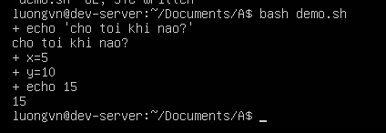

# SHELL
## I. Shell là gì?

- Shell còn được gọi là môi trường dòng lênh. Đây là chương trình tương tác giữa người dùng và hệ điều hành trong một môi trường dòng lệnh.

- Hệ thống cung cấp giao diện để người dùng nhập lệnh và thực thi các tác vụ trên hệ điều hành.

## II. Các loại Shell
### 1. Bash Shell


Bash (Bourne-Again Shell) là một chương trình dòng lệnh trong hệ điều hành Linux, cho phép người dùng giao tiếp với hệ thống Unix/Linux thông qua các lệnh đơn giản. Khi sử dụng Bash, người dùng có thể nhập các lệnh để tương tác với máy tính như xem chỉnh sửa file, quản lý thư mục, hoặc cài đặt phần mềm. Bash không chỉ là một công cụ để chạy lệnh, mà còn là một ngôn ngữ lập trình hữu ích.

Ví dụ:

```bash
$ echo "Hello world!"

Hello word!
```

#### Sử dụng Bash Shell

1) Chế độ shell

Chế độ shell tương tác(Interactive Shell): là dạng sử dụng câu lệnh trực tiếp trên môi trường Unix.

Ví dụ: Sử dụng Bash để in ra Hello World!


Chế độ Shell không tương tác(Non-Interactive Shell): Thay vì thực hiện từng câu lệnh Bash, tổ hợp chúng vào một file script và có thể sử dụng lại nhiều lần.


2) Sử dụng biến trong Linux

file demo.sh với nội dung: 

```bash
name="Bim"
echo "Hi $name"
```

hoặc 

```bash
name="Bim"
printf "Hi %s\n" "name"
```

Output:

```bash
Hi Bim
```

3) Truyền tham số vào biến

Các biến có thể được truyền trực tiếp từ người dùng như sau:

```bash
echo "What's your name?"
read name
echo "Hi, $name."
```

Output:


4) Tầm quan trọng của các dấu nháy
  
Có 2 dạng dấu nháy:

- Weak quoting: nháy kép
- Strong quoting: Nháy đơn

Weak quoting: Sử dụng nháy kép khi muốn bash thực thi các biến được truyền vào.

```bash
animal="cat"
echo "black $animal"
```

Output:
```bash
black cat
```

Strong quoting: Sử dụng nháy đơn khi muốn giữ nguyên nội dung trong nháy.

```bash
animal="cat"
echo 'black $animal'
```
Output:
```bash
black $animal
```

5. Chế dộ Debug trong shell

Để thực hiện việc debug, sử dụng tùy chọn -x đằng sau các mệnh lệnh run.



Khi chạy script, shell sẽ hiển thị tất cả các lệnh thực thi và giá trị các biến trong quá trình thực thi.

### 2. C Shell


C shell (csh) là một Unix shell được viết ra nhằm thay thế Bourne shell (sh) với nhiều cải tiến, đồng thời mang cú pháp gần giống ngôn ngữ lập trình C, nên được đặt tên là C shell.

#### Đặc điểm:
- Ngôn ngữ script giống C.
- Có cấu trúc điều kiện (if, switch) và vòng lặp (foreach, while) gần giống C.
- Giúp người quen lập trình C dễ viết script hơn.
- Quản lý biến:
  - Biến shell: dùng `set`.
  
  ```csh
    set name = "Bim"
  ```

  - Biến môi trường: dùng `setenv`.

  ```csh
    setenv PATH /usr/bin
  ```

### 3. Sh Shell


- Đây là shell mặc định trên UNIX cổ điển, và là nền tảng cho rất nhiều shell sau này(bash, C, ...).
- Tên “sh” thường dùng để chỉ Bourne shell gốc.

#### Đặc điểm
- Ngôn ngữ script mạnh mẽ
- Hỗ trợ biến, vòng lặp, điều kiện(`if`, `case`, `for`, `while`, `until`).
