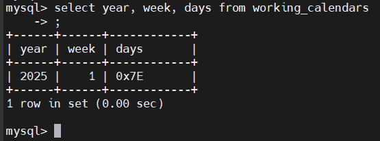
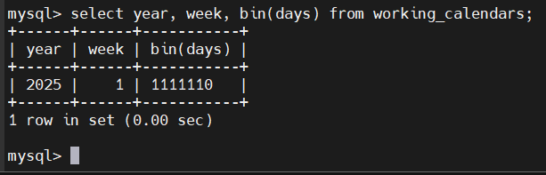

# MySQL BIT Data Type
## Introduction
- BIT là kiểu dữ liệu dùng để lưu trữ giá trị bit(0 và 1)
- Cú pháp:

  ```sql
  column_name BIT(n)
  ```
  - `1 <= n <= 64`, mặc định là 1

- BIT Literals:
  - Cú pháp:
    - `b'val'` hoặc `B'val'`
    - `0bval`
  - Ví dụ: `b'01'`, `B'11'`, `0b1010`

## Examples
- Tạo bảng:

  ```sql
  CREATE TABLE working_calendars(
      year INT,
      week INT,
      days BIT(7),
      PRIMARY KEY(year,week)
  );
  ```

- Chèn dữ liệu:

  ```sql
  INSERT INTO working_calendars(year, week, days) 
  VALUES(2025, 1, b'1111110');
  ```

- Khi SELECT:

  

  - MySQL hiển thị dạng hex
- Hiển thị dạng nhị phân:

  

- MySQL sẽ không tự thêm 0 khi trả về, dùng `LPAD`:

  ```sql
  SELECT year, week, LPAD(BIN(days), 7, '0')
  FROM working_calendars;
  ```