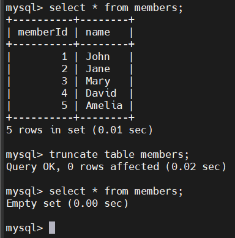

# MySQL TRUNCATE TABLE
## Introduction
- `TRUNCATE TABLE` là lệnh trong MySQL dùng để xóa tất cả các hàng trong một bảng một cách nhanh chóng.
- Cú pháp:

  ```sql
  TRUNCATE [TABLE] table_name;
  ```

  