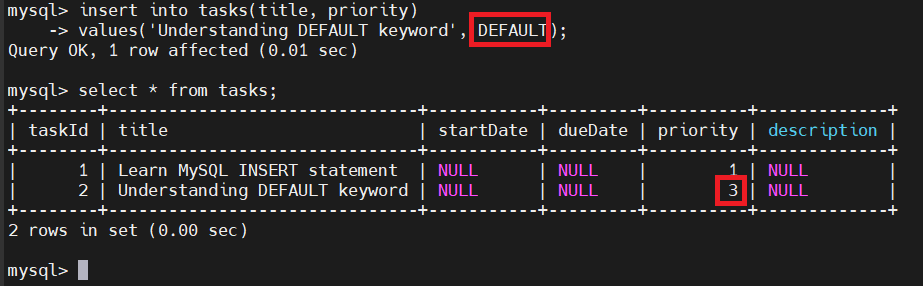

# MySQL INSERT
## Introduction
- INSERT dùng để chèn 1 hoặc nhiều dòng dữ liệu vào bảng
- Cú pháp:

  ```sql
  INSERT INTO table_name(column1, column2, ...)
  VALUES (value1, value2, ...)
  ```

- Số lượng cột phải khớp số lượng giá trị, và thứ tự cột phải tương ứng với giá trị.
- Chèn nhiều dòng cùng lúc:

  ```sql
  INSERT INTO table_name(column1, column2, ...)
  VALUES
    (value1, value2, ...),
    (value1, value2, ...), 
    ...;
  ```

## Examples
- Tạo bảng:

  ```sql
  DROP TABLE IF EXISTS tasks;

  CREATE TABLE tasks (
    taskId INT AUTO_INCREMENT PRIMARY KEY,
    title VARCHAR(255) NOT NULL,
    startDate DATE,
    dueDate DATE, 
    priority TINYINT NOT NULL DEFAULT 3,
    description TEXT
  );  
  ```

### Ví dụ cơ bản

```sql
INSERT INTO tasks(title, priority)
VALUES('Learn MySQL INSERT statement', 1);
```


- tạo `taskId` tự tăng,

- các cột khác nhận giá trị mặc định (NULL hoặc DEFAULT).

### Chèn giá trị mặc định
- Có 2 cách:
  - Bỏ qua cột đó trong câu lệnh INSERT
  - Ghi rõ `DEFAULT`

  ```sql
  INSERT INTO tasks(title, priority) 
  VALUES('Understanding DEFAULT keyword', DEFAULT);
  ```

  

### Chèn dữ liệu kiểu DATE
- Định dạng:

  ```bash
  'YYYY-MM-DD'
  ```

- Ví dụ:

  ```sql
  INSERT INTO tasks(title, startDate, dueDate)
  VALUES ('Insert date into table', '2025-11-26', '2025-12-10');
  ```

- Có thể dùng biểu thức:

  ```sql
  INSERT INTO tasks(title, startDate, dueDate)
  VALUES ('Use current date for the task', CURRENT_DATE(), CURRENT_DATE());
  ```