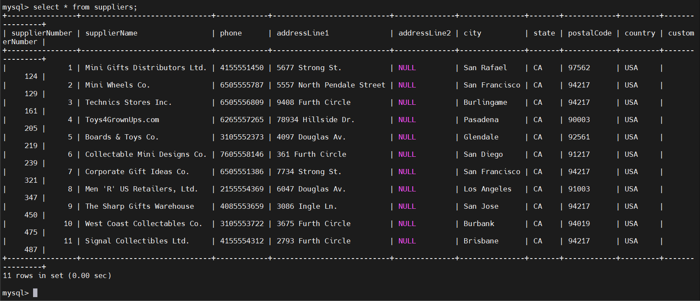

# MySQL INSERT INTO SELECT
## Introduction
- Trong MySQL, không chỉ có thể INSERT bằng cách liệt kê giá trị trực tiếp trong VALUES, mà còn có thể dùng kết quả truy vấn SELECT để chèn dữ liệu vào bảng khác (hoặc chính bảng đó).
- Cú pháp:
  
  ```sql
  INSERT INTO table_name (column_list)
  SELECT select_list
  FROM another_table
  WHERE condition;
  ```

- Số cột trong `column_list` phải bằng số cột trong `select_list`

## Examples
- Tạo bảng suppliers:

  ```sql
  CREATE TABLE suppliers (
      supplierNumber INT AUTO_INCREMENT,
      supplierName VARCHAR(50) NOT NULL,
      phone VARCHAR(50),
      addressLine1 VARCHAR(50),
      addressLine2 VARCHAR(50),
      city VARCHAR(50),
      state VARCHAR(50),
      postalCode VARCHAR(50),
      country VARCHAR(50),
      customerNumber INT,
      PRIMARY KEY (supplierNumber)
  );
  ```

- Lấy tất cả Khách hàng ở California - USA

  ```sql
  INSERT INTO suppliers(
    supplierName, 
    phone, 
    addressLine1,
    addressLine2,
    city,
    state,
    postalCode,
    country,
    customerNumber
  )
  SELECT 
    customerName, 
    phone,
    addressLine1,
    addressLine2, 
    city,
    state, 
    postalCode,
    country,
    customerNumber
  FROM 
    customers
  WHERE country = 'USA' AND state = 'CA';
  ```

  