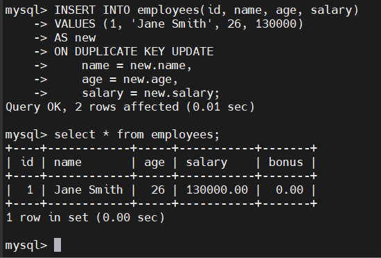
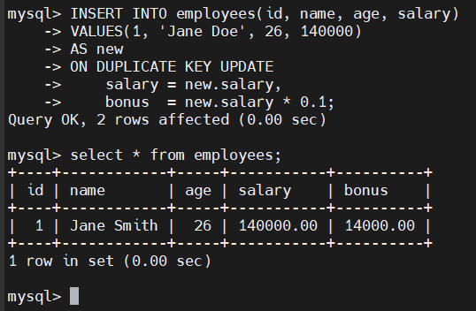

# MySQL INSERT ON DUPLICATE KEY UPDATE
## Introduction
- Câu lệnh INSERT ON DUPLICATE KEY UPDATE giúp:
  - INSERT khi không có trùng khóa(PRIMARY KEY hoặc UNIQUE)
  - UPDATE khi có trùng khóa -> tránh lỗi "Duplicate entry ... for key ..."
- Cú pháp:

  ```sql
  INSERT INTO table_name (column1, column2, ...)
  VALUES (value1, value2, ...)
  ON DUPLICATE KEY UPDATE
      column1 = new_value1,
      column2 = new_value2;
  ```

- Nếu insert thành công → MySQL trả về 1 row affected

- Nếu update (vì trùng khóa) → 2 rows affected

- Nếu dữ liệu mới giống hệt dữ liệu cũ → 0 rows affected

### Row alias

```sql
INSERT INTO table_name (col1, col2)
VALUES (v1, v2)
AS new
ON DUPLICATE KEY UPDATE
    col1 = new.col1,
    col2 = new.col2;
```

### Column alias

```sql
INSERT INTO table_name (column1, column2, column3)
VALUES (v1, v2, v3)
AS new(a1, a2, a3)
ON DUPLICATE KEY UPDATE
    column1 = a2 + a3;
```

## Examples
- Tạo bảng employees:

  ```sql
  CREATE TABLE employees(
    id INT PRIMARY KEY,
    name VARCHAR(255) NOT NULL,
    age INT NOT NULL,
    salary DECIMAL(10,2) NOT NULL,
    bonus DECIMAL(10,2) DEFAULT 0
  );
  ```

- Insert dòng đầu tiên:

  ```sql
  INSERT INTO employees(id, name, age, salary)
  VALUES (1, 'Jane Doe', 25, 120000);
  ```

### Dùng row alias để cập nhật khi trùng khóa
```sql
INSERT INTO employees(id, name, age, salary)
VALUES (1, 'Jane Smith', 26, 130000)
AS new
ON DUPLICATE KEY UPDATE
    name = new.name,
    age = new.age,
    salary = new.salary;
```




### Update cột khác
```sql
INSERT INTO employees(id, name, age, salary)
VALUES(1, 'Jane Doe', 26, 140000)
AS new
ON DUPLICATE KEY UPDATE
    salary = new.salary,
    bonus  = new.salary * 0.1;
```

