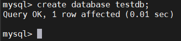
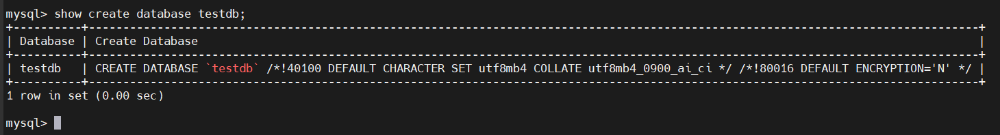
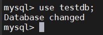

# MySQL CREATE DATABASE
## Introduction
- Cú pháp:

  ```sql
  CREATE DATABASE [IF NOT EXISTS] database_name
  [CHARACTER SET charset_name]
  [COLLATE collation_name];
  ```

- Thứ nhất, chỉ định tên của cơ sở dữ liệu sau các từ khóa CREATE DATABASE.
Tên cơ sở dữ liệu phải là duy nhất trong một phiên bản máy chủ MySQL.
Nếu bạn cố tạo một cơ sở dữ liệu với tên đã tồn tại, MySQL sẽ báo lỗi.

- Thứ hai, sử dụng tùy chọn IF NOT EXISTS để tạo cơ sở dữ liệu một cách có điều kiện — tức là chỉ tạo nếu nó chưa tồn tại.

- Thứ ba, chỉ định bộ ký tự (character set) và đối chiếu (collation) cho cơ sở dữ liệu mới.
Nếu bạn bỏ qua các mệnh đề CHARACTER SET và COLLATE, MySQL sẽ sử dụng bộ ký tự và đối chiếu mặc định cho cơ sở dữ liệu mới.

## CREATING A NEW DATABASE
- Tạo cơ sở dữ liệu mới: `testdb`:

  ```sql
  CREATE DATABASE testdb;
  ```

  

- Xem chi tiết csdl vừa tạo:

  ```sql
  SHOW CREATE DATABASE testdb;
  ```

  

- Chọn cơ sở dữ liệu:
  ```sql
  USE testdb;
  ```

  

- Thoát khỏi csdl:

  ```sql
  exit;
  ```