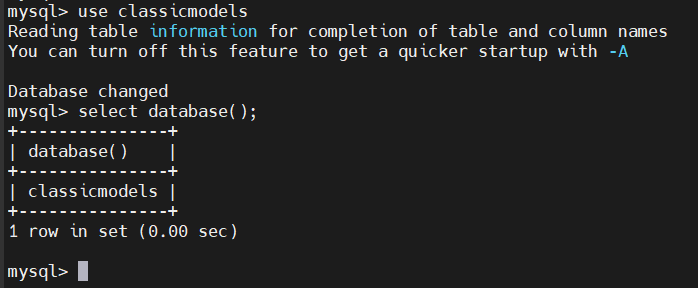
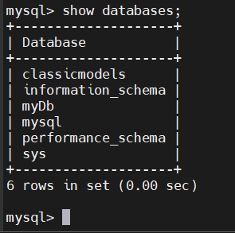
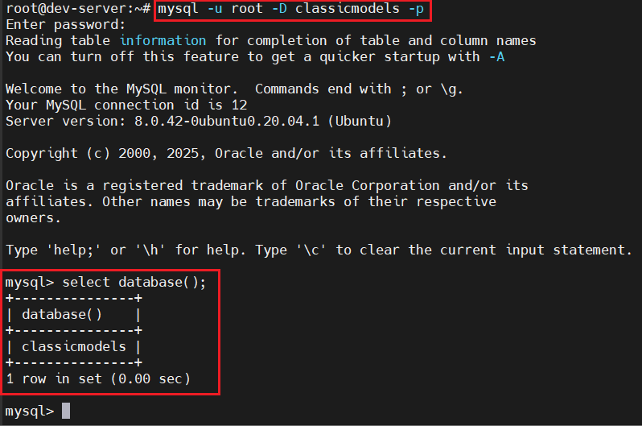

# Selecting a MySQL Database
- Đăng nhập bằng tk root:

  ```bash
  mysql -u root -p
  ```

- Để hiển thị csdl hiện tại:

  ```sql
  SELECT database();
  ```

  

- Để chọn 1 CSDL dùng USE:

  ```sql
  USE database_name;
  ```

  

- Nếu CSDL không tồn tại, bạn có thể check lại các CSDL trên máy chủ:

  ```sql
  SHOW DATABASES;
  ```

  

- Chọn csdl ngay khi đăng nhập:

  ```bash
  mysql -u root -D classicmodels -p
  ```

  