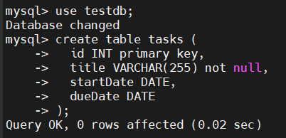
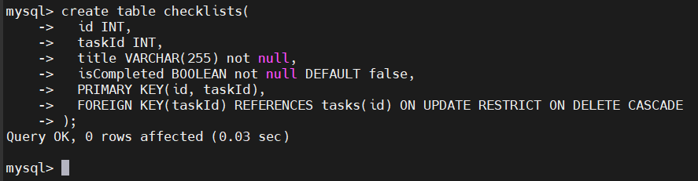

# MySQL CREATE TABLE
## Introduction
- Cú pháp:

  ```sql
  CREATE TABLE [IF NOT EXISTS] table_name(
    column1 datatype constraints,
    column2 datatype constraints,
    ...
  ) ENGINE=storage_engine;
  ```

- `table_name`: Tên của bảng mà bạn muốn tạo.

- `column1`, `column2`, …: Tên các cột trong bảng.

- `datatype`: Kiểu dữ liệu của từng cột, ví dụ INT, VARCHAR, DATE, v.v.

- `constraints`: Các ràng buộc tùy chọn như NOT NULL, UNIQUE, PRIMARY KEY, và FOREIGN KEY.

## Examples
- Tạo bảng mới tên là tasks:

  

- Tạo bảng với khóa ngoại:

  - Giả sử mỗi task có một checklist. Để lưu các checklist của task, bạn tạo một bảng mới tên là checklists:

  ```sql
  CREATE TABLE checklists(
    id INT, 
    task_id INT, 
    title VARCHAR(255) NOT NULL, 
    is_completed BOOLEAN NOT NULL DEFAULT FALSE, 
    PRIMARY KEY (id, task_id), 
    FOREIGN KEY (task_id) 
        REFERENCES tasks (id) 
        ON UPDATE RESTRICT 
        ON DELETE CASCADE
  );
  ```

  - Khi id của bảng tasks thay đổi, hành động bị RESTRICT (cấm thay đổi nếu liên kết tồn tại).

  - Khi một task bị xóa, tất cả checklist liên quan cũng bị CASCADE xóa tự động.

  